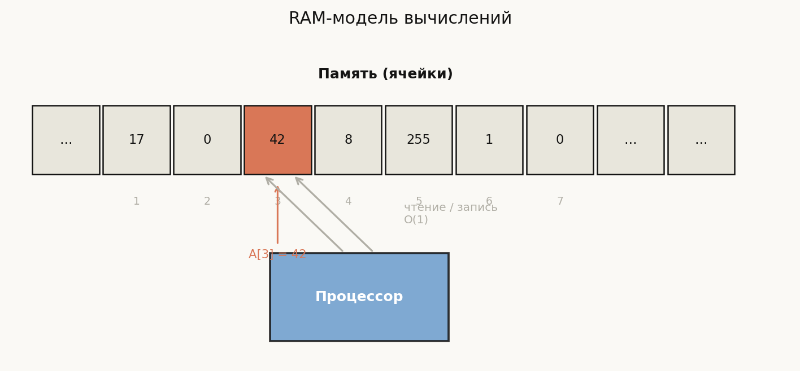
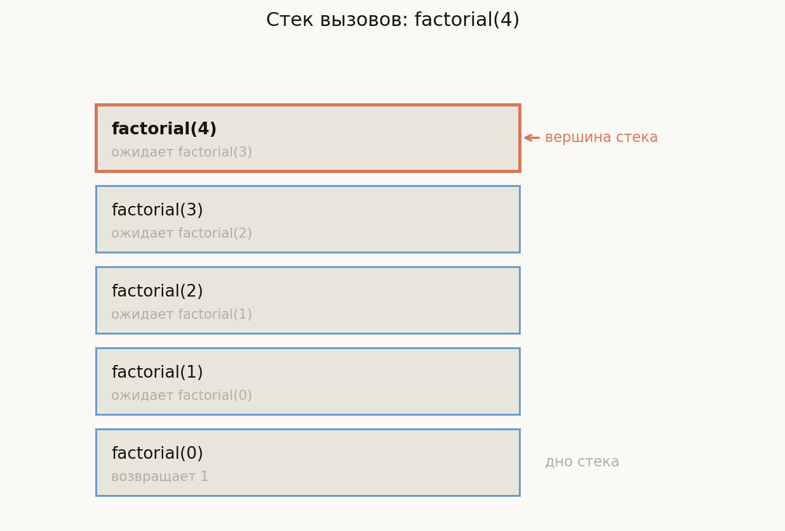
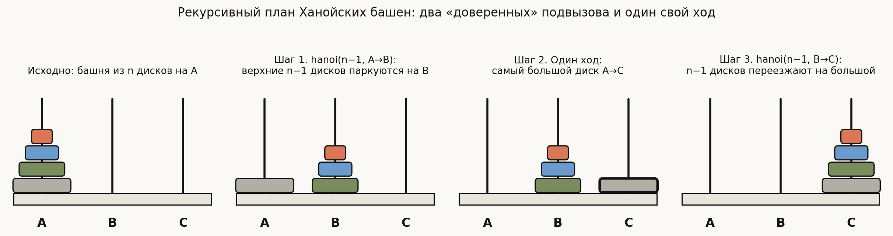
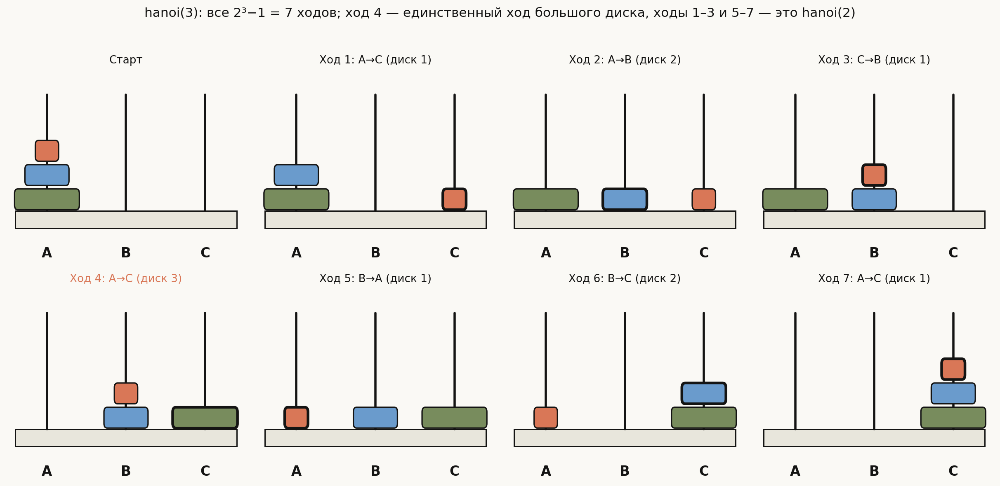
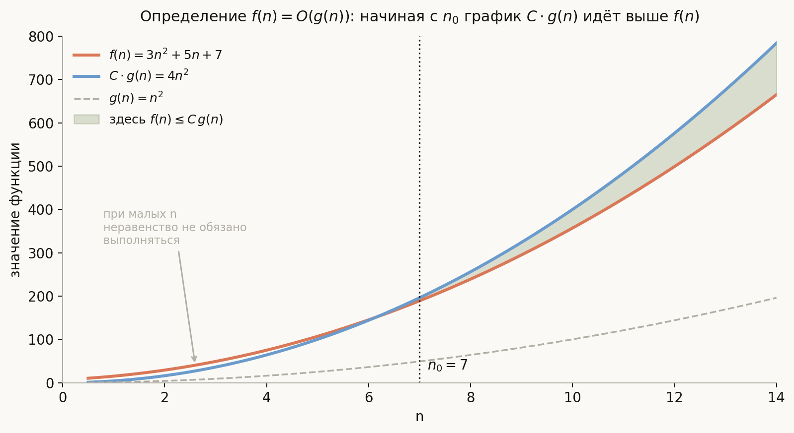
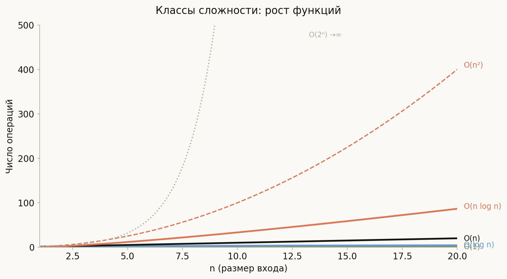

# Лекция: основы языка программирования и анализ алгоритмов


Программа — это точная инструкция для компьютера. Но написать инструкцию мало: нужно ещё понять, сколько времени она займёт и почему она вообще даёт правильный ответ. Эта лекция строит фундамент в трёх слоях: сначала выясняем, что такое «компьютер» в смысле модели вычислений; затем изучаем конструкции языка, из которых складываются программы; наконец, учимся измерять и доказывать — асимптотикой и инвариантами.

Главная линия лекции:

$$
\text{RAM-модель}
\;\to\;
\text{язык (переменные, циклы, рекурсия, указатели)}
\;\to\;
O\text{-нотация}
\;\to\;
\text{инварианты и корректность}
$$

Как читать эту лекцию: разделы 1–6 — практическая база языка C++; разделы 7–10 — теория анализа алгоритмов. Если вы уже программируете, можно начать с раздела 7 и возвращаться к предыдущим по мере необходимости.

---

## План

1. RAM-модель вычислений
2. Переменные и типы данных
3. Управляющие конструкции: условия и циклы
4. Функции и стек вызовов
5. Рекурсия
6. Указатели и динамическая память
7. Анализ алгоритмов: O-нотация
8. Основные классы сложности
9. Инварианты, пред- и постусловия
10. Доказательство корректности алгоритма
11. Типичные ошибки
12. Что важно для поступления в ШАД
13. Итог
14. Вопросы для самопроверки

---

## 1. RAM-модель вычислений

### Что такое компьютер с точки зрения алгоритмиста

Реальный процессор — сложная система с конвейером, кешами нескольких уровней, предсказателем ветвлений и суперскалярным исполнением. Для анализа алгоритмов всё это лишнее. Используют упрощённую модель — **RAM** (Random Access Machine).

Модель RAM состоит из двух частей:

- **Память** — бесконечный массив ячеек. Каждая ячейка хранит одно целое число произвольной величины. Ячейки адресуются натуральными числами: 0, 1, 2, …
- **Процессор** — выполняет операции одну за другой по программе.

### Единичные операции

В RAM-модели каждая из следующих операций занимает ровно **одну единицу времени** (т.е. $O(1)$ шагов):

- арифметика: $+$, $-$, $\times$, целочисленное деление;
- сравнение: $<$, $\leq$, $=$, $\neq$;
- чтение значения из ячейки с заданным адресом;
- запись значения в ячейку с заданным адресом.

Время работы алгоритма — суммарное количество выполненных операций.

### Почему упрощение оправдано

В реальности чтение из оперативной памяти занимает в сотни раз больше тактов, чем чтение из кеша. Тем не менее RAM-модель полезна, потому что:

1. Разница между $O(n)$ и $O(n^2)$ при $n = 10^6$ несопоставимо важнее любых константных факторов кеша.
2. Алгоритм, плохой в RAM-модели, обычно плохой и на реальном железе.
3. Кешозависимые эффекты важны для практической оптимизации, но не для сравнения алгоритмов на уровне класса сложности.

### Модель памяти

В RAM-модели принято считать, что одна ячейка хранит число размером $O(\log n)$ бит, где $n$ — размер входа. Это позволяет хранить адрес любой ячейки в одном слове. Доступ к ячейке по адресу — $O(1)$.



На схеме — вся RAM-модель целиком: лента пронумерованных ячеек памяти сверху и процессор снизу. Оранжевым выделена ячейка с адресом 3: процессор обращается к ней напрямую по адресу — стрелки «чтение/запись» показывают, что любое такое обращение стоит $O(1)$ независимо от того, где ячейка находится. Именно это свойство делает доступ к элементу массива по индексу константным.

---

## 2. Переменные и типы данных

### Переменная как ячейка памяти

Переменная — это именованная область памяти фиксированного размера. Имя — удобная абстракция над адресом.

```cpp
int x = 42;      // 4 байта, хранит целое число
double pi = 3.14159; // 8 байт, число с плавающей точкой
bool flag = true; // обычно 1 байт, только true/false
char c = 'A';    // 1 байт, символ в ASCII
```

### Основные типы C++

| Тип | Размер | Диапазон (типичный) |
|---|---|---|
| `int` | 4 байта | от $-2^{31}$ до $2^{31}-1$ |
| `long long` | 8 байт | от $-2^{63}$ до $2^{63}-1$ |
| `double` | 8 байт | $\approx \pm 10^{308}$, $\approx 15$ значащих цифр |
| `bool` | 1 байт | `true` или `false` |
| `char` | 1 байт | символ ASCII |
| `T*` | 8 байт (64-бит) | адрес ячейки типа `T` |

Тип определяет, как интерпретировать биты в ячейке и сколько байт она занимает. Операции между разными типами требуют явного или неявного преобразования.

### Пример: целочисленное переполнение

```cpp
int a = 2000000000;
int b = 2000000000;
int c = a + b; // неопределённое поведение! результат > 2^31 - 1

long long d = (long long)a + b; // корректно: 4000000000
```

Типичная ошибка на олимпиадах — забыть, что промежуточный результат вылезает за границы `int`.

---

## 3. Управляющие конструкции: условия и циклы

### Условный оператор if / else

```cpp
if (условие) {
    // выполняется, если условие истинно
} else {
    // выполняется, если условие ложно
}
```

Пример: модуль числа.

```cpp
int abs_val(int x) {
    if (x >= 0) {
        return x;
    } else {
        return -x;
    }
}
```

Конструкция `else if` позволяет цепочку проверок:

```cpp
if (x > 0) {
    // положительное
} else if (x < 0) {
    // отрицательное
} else {
    // ноль
}
```

### Цикл for

Используют, когда число итераций известно заранее.

```cpp
// сумма чисел от 1 до n
long long sum = 0;
for (int i = 1; i <= n; i++) {
    sum += i;
}
```

Структура: `for (инициализация; условие; шаг)`. Тело выполняется, пока условие истинно.

### Цикл while

Используют, когда условие выхода динамическое.

```cpp
// алгоритм Евклида: НОД(a, b)
while (b != 0) {
    int t = b;
    b = a % b;
    a = t;
}
// теперь a содержит НОД
```

### Цикл do-while

Тело выполняется хотя бы один раз, а условие проверяется после:

```cpp
int x;
do {
    std::cin >> x;
} while (x < 0); // повторяем ввод, пока не введут неотрицательное
```

### Операторы break и continue

- `break` — немедленно выйти из цикла;
- `continue` — перейти к следующей итерации, пропустив оставшееся тело.

```cpp
for (int i = 0; i < n; i++) {
    if (a[i] == 0) continue;   // пропустить нули
    if (a[i] < 0) break;       // при отрицательном — стоп
    process(a[i]);
}
```

---

## 4. Функции и стек вызовов

### Зачем нужны функции

Функция — именованный блок кода, который можно вызвать из разных мест. Это инструмент декомпозиции: сложная задача разбивается на подзадачи, каждая реализуется своей функцией.

```cpp
// объявление: имя, параметры, тип возвращаемого значения
int max2(int a, int b) {
    if (a > b) return a;
    return b;
}

int main() {
    int x = max2(3, 7); // x == 7
    int y = max2(x, 10); // y == 10
}
```

### Стек вызовов

При вызове функции компьютер:

1. сохраняет текущую позицию в программе (адрес возврата);
2. выделяет память для локальных переменных и параметров функции (стековый фрейм);
3. передаёт управление в тело функции.

Когда функция завершается, фрейм удаляется, управление возвращается в точку вызова.

Стек растёт при вложенных вызовах и уменьшается при возвратах. Стек — область памяти ограниченного размера (обычно 1–8 МБ). Слишком глубокое вложение вызовов приводит к **переполнению стека** (stack overflow).



На рисунке — состояние стека в момент самого глубокого вложения при вычислении `factorial(4)`: внизу лежит первый вызов `factorial(4)`, над ним — `factorial(3)`, и так далее до вершины `factorial(0)` (выделена оранжевым), которая первой вернёт результат. Каждый прямоугольник — отдельный стековый фрейм со своими локальными переменными; фреймы удаляются в порядке, обратном созданию, — сверху вниз.

### Передача параметров

В C++ по умолчанию параметры передаются **по значению**: функция получает копию.

```cpp
void increment(int x) {
    x++;  // изменяется копия, оригинал не меняется
}

void increment_ref(int& x) {
    x++;  // передача по ссылке — меняется оригинал
}
```

---

## 5. Рекурсия

### Определение

**Рекурсивная функция** — функция, которая вызывает сама себя (прямо или через другие функции).

Каждая рекурсивная функция должна содержать:

- **базовый случай** — условие, при котором функция возвращает результат без рекурсивного вызова;
- **рекурсивный шаг** — сведение задачи к задаче меньшего размера с рекурсивным вызовом.

### Пример: факториал

$$
n! = \begin{cases} 1, & n = 0, \\ n \cdot (n-1)!, & n \geq 1. \end{cases}
$$

```cpp
long long factorial(int n) {
    if (n == 0) return 1;      // базовый случай
    return n * factorial(n-1); // рекурсивный шаг
}
```

Вызов `factorial(4)` разворачивается в:

```
factorial(4)
  = 4 * factorial(3)
  = 4 * 3 * factorial(2)
  = 4 * 3 * 2 * factorial(1)
  = 4 * 3 * 2 * 1 * factorial(0)
  = 4 * 3 * 2 * 1 * 1 = 24
```

### Пример: числа Фибоначчи

$$
F_n = \begin{cases} 0, & n = 0, \\ 1, & n = 1, \\ F_{n-1} + F_{n-2}, & n \geq 2. \end{cases}
$$

```cpp
long long fib(int n) {
    if (n <= 1) return n;
    return fib(n-1) + fib(n-2);
}
```

Эта реализация имеет сложность $O(2^n)$ из-за повторных вычислений: например, `fib(5)` вызывает `fib(3)` дважды, а `fib(2)` — трижды; дерево вызовов растёт экспоненциально (точная оценка — $\Theta(\varphi^n)$, где $\varphi \approx 1.618$ — золотое сечение). Итеративная версия или динамическое программирование снижают её до $O(n)$: каждое значение вычисляется ровно один раз.

### Пример: Ханойские башни

Задача: перенести $n$ дисков со стержня A на стержень C, используя вспомогательный B, не кладя больший диск на меньший.

**Ключевое наблюдение.** Самый большой диск лежит в самом низу, и чтобы он переехал с A на C, в момент его хода должно выполняться два условия: на A над ним никого нет, и C полностью пуст. Значит, все остальные $n-1$ дисков обязаны в этот момент находиться на B. Так задача сама распадается на три части:

1. перенести башню из $n-1$ верхних дисков с A на B (большой диск внизу не мешает: он больше всех, на него можно временно ничего не класть — он просто «пол»);
2. одним ходом перенести самый большой диск с A на C;
3. перенести башню из $n-1$ дисков с B на C — теперь уже поверх большого.



Шаги 1 и 3 — это **та же задача, но для $n-1$ дисков** (роли стержней переставлены — поэтому в коде параметры `from/to/aux` меняются местами). Здесь и работает главный принцип рекурсии: мы **не расписываем**, как именно переносится башня из $n-1$ дисков, а доверяем это рекурсивному вызову. Корректность обосновывается индукцией: база — перенос 0 дисков не требует ничего (`if (n == 0) return`); переход — если `hanoi(n-1, ...)` корректно переносит $n-1$ дисков, то три шага выше корректно переносят $n$. Инвариант «больший не лежит на меньшем» не нарушается: в шагах 1 и 3 большой диск строго больше всех участвующих и вести себя как «пол» ему разрешают правила, а в шаге 2 диск ложится на пустой стержень.

```cpp
void hanoi(int n, char from, char to, char aux) {
    if (n == 0) return;                     // базовый случай
    hanoi(n-1, from, aux, to);              // перенести n-1 дисков на вспомогательный
    std::cout << from << " -> " << to << "\n"; // переместить n-й диск
    hanoi(n-1, aux, to, from);              // перенести n-1 дисков с вспомогательного
}
```

Вот как это выглядит целиком для $n = 3$ — обратите внимание, что ходы 1–3 в точности решают задачу «перенести 2 диска на B», а ходы 5–7 — «перенести 2 диска с B на C»:



На трассировке видна и «фрактальная» структура решения: внутри ходов 1–3 прячется решение для двух дисков, внутри него — для одного. Каждый уровень рекурсии добавляет один свой ход (перенос своего нижнего диска) между двумя полными решениями меньшей задачи.

**Число ходов.** Обозначим через $T(n)$ число ходов алгоритма. Из структуры «подзадача + 1 ход + подзадача» сразу получаем рекуррентность

$$T(n) = 2T(n-1) + 1, \qquad T(0) = 0.$$

Развернём её: $T(n) = 2T(n-1)+1 = 4T(n-2)+2+1 = \dots = 2^n T(0) + (2^{n-1} + \dots + 2 + 1) = 2^n - 1$. Проверка на трассировке: $T(3) = 7$. При этом меньше ходов не бывает **ни у какого** алгоритма: самый большой диск обязан сделать хотя бы один ход, а до и после этого хода башню из $n-1$ дисков приходится полностью перенести (сначала убрать с него, потом вернуть на него), откуда та же оценка $T(n) \ge 2T(n-1)+1$. Значит, рекурсивное решение оптимально, а экспоненциальная сложность — свойство самой задачи, а не изъян алгоритма.

### Глубина рекурсии и переполнение стека

Каждый рекурсивный вызов занимает память на стеке. Для `factorial(n)` глубина равна $n$. При $n \approx 10^5$ стек может переполниться. Итеративная версия использует $O(1)$ памяти стека.

### Хвостовая рекурсия

Рекурсивный вызов называется **хвостовым**, если он — последнее действие функции. Компилятор (с флагом оптимизации) может превратить хвостовую рекурсию в итерацию, не наращивая стек.

```cpp
// хвостовая рекурсия: рекурсивный вызов — последнее действие
long long factorial_tail(int n, long long acc = 1) {
    if (n == 0) return acc;
    return factorial_tail(n-1, acc * n); // хвостовой вызов
}
```

---

## 6. Указатели и динамическая память

### Что такое указатель

**Указатель** — переменная, хранящая адрес другой переменной (ячейки памяти). На 64-битной системе указатель занимает 8 байт.

```cpp
int x = 42;
int* p = &x;   // p хранит адрес переменной x
               // оператор & — взятие адреса

int y = *p;    // *p — разыменование: значение по адресу p
               // y == 42

*p = 100;      // изменить значение по адресу p
               // теперь x == 100
```

Визуально:

```
Адрес  ...  0x1000  ...
Ячейка ...   100   ...   ← x
                         ← p хранит 0x1000
```

### Операторы new и delete

Статические переменные живут на стеке и удаляются при выходе из функции. Для объектов, чьё время жизни определяется логикой программы, используют **динамическую память** (кучу, heap).

```cpp
// выделение памяти под одно целое число
int* p = new int(42);   // p указывает на ячейку со значением 42

// освобождение памяти
delete p;
p = nullptr; // хорошая практика: обнулить указатель после delete

// динамический массив
int n = 100;
int* arr = new int[n];  // массив из 100 элементов

arr[0] = 1;
arr[n-1] = 99;

delete[] arr; // для массивов — delete[], а не delete
```

### Утечки памяти

**Утечка памяти** — ситуация, когда выделенная динамическая память никогда не освобождается. Программа постепенно «съедает» ОЗУ.

```cpp
void bad_function() {
    int* p = new int[1000000];
    // ... работа с массивом ...
    // забыли delete[] p; — утечка 4 МБ при каждом вызове
}
```

### Нулевой и висячий указатели

**Нулевой указатель** (`nullptr`) не указывает ни на какую ячейку. Разыменование нулевого указателя — неопределённое поведение (обычно падение программы).

```cpp
int* p = nullptr;
*p = 5; // ОШИБКА: segmentation fault
```

**Висячий указатель** (dangling pointer) — указатель на уже освобождённую память.

```cpp
int* p = new int(10);
delete p;
*p = 20; // ОШИБКА: поведение неопределено, память уже освобождена
```

### Динамические массивы vs статические

| Характеристика | Статический массив | Динамический массив |
|---|---|---|
| Размер | задан на этапе компиляции | задаётся во время выполнения |
| Расположение | стек | куча |
| Время жизни | до конца области видимости | до явного `delete[]` |
| Возможен ли выход за границу | да (UB) | да (UB) |

В современном C++ вместо сырых указателей рекомендуют `std::vector` (автоматически управляет памятью) и умные указатели (`std::unique_ptr`, `std::shared_ptr`).

---

## 7. Анализ алгоритмов: O-нотация

### Зачем нужна асимптотика

Два алгоритма сортировки: первый делает $3n^2 + 5n + 7$ сравнений, второй — $100n \log_2 n + 1000$. На каком $n$ второй становится быстрее? При $n = 1000$: первый — $3 \cdot 10^6$, второй — $10^6$. При $n = 10^6$: первый — $3 \cdot 10^{12}$, второй — $2 \cdot 10^9$. При больших $n$ квадратичный алгоритм катастрофически медленнее, независимо от константы перед $n^2$.

Асимптотический анализ позволяет **сравнивать алгоритмы по скорости роста**, отбрасывая несущественные константы.

### Формальное определение: O-большое

Интуиция перед формулой: запись $f(n) = O(g(n))$ — это «$\leq$ для скоростей роста». Она разрешает две вольности: умножить $g$ на любую константу $C$ (константы нас не интересуют) и игнорировать маленькие $n$ (нас интересует поведение на больших входах). Осталось записать это точно:

$$
f(n) = O(g(n)) \iff \exists\, C > 0,\; n_0 \in \mathbb{N}: \quad f(n) \leq C \cdot g(n) \quad \forall\, n \geq n_0.
$$

Читается: «$f$ не растёт быстрее $g$ с точностью до константного множителя при достаточно большом $n$».

Пример. Покажем, что $3n^2 + 5n + 7 = O(n^2)$.

При $n \geq 7$: $5n \leq 5n^2$ и $7 \leq n^2$, поэтому

$$
3n^2 + 5n + 7 \leq 3n^2 + 5n^2 + n^2 = 9n^2.
$$

Значит, $C = 9$, $n_0 = 7$ подходят.



График показывает определение «в лицах» для той же функции $f(n) = 3n^2 + 5n + 7$. Здесь взята более аккуратная константа $C = 4$: при малых $n$ оранжевая кривая $f(n)$ идёт **выше** синей $C \cdot g(n)$ — и это не нарушает определения, ведь неравенство требуется только начиная с порога $n_0 = 7$ (пунктирная вертикаль). Правее порога синяя кривая навсегда остаётся сверху — зелёная зона и есть выполненное неравенство $f(n) \leq C\,g(n)$. Обратите внимание: пара $(C, n_0)$ не единственна — в тексте мы доказали годность пары $(9, 7)$, график демонстрирует пару $(4, 7)$; для определения достаточно существования хотя бы одной.

### o-малое, Omega, Theta

$$
f(n) = o(g(n)) \iff \lim_{n\to\infty} \frac{f(n)}{g(n)} = 0.
$$

«$f$ растёт строго медленнее $g$». Например, $n = o(n^2)$, $\log n = o(n)$.

$$
f(n) = \Omega(g(n)) \iff \exists\, c > 0,\; n_0: \quad f(n) \geq c \cdot g(n) \quad \forall\, n \geq n_0.
$$

«$f$ растёт не медленнее $g$». Это нижняя оценка — зеркало $O$.

$$
f(n) = \Theta(g(n)) \iff f(n) = O(g(n)) \text{ и } f(n) = \Omega(g(n)).
$$

«$f$ и $g$ растут одинаково быстро». Например, $3n^2 + 5n + 7 = \Theta(n^2)$.

### Правила арифметики оценок

- $O(f) + O(g) = O(\max(f, g))$. Пример: $O(n^2) + O(n) = O(n^2)$.
- $O(f) \cdot O(g) = O(f \cdot g)$. Пример: $O(n) \cdot O(\log n) = O(n \log n)$.
- Константы отбрасываем: $O(5n) = O(n)$, $O(n^2 / 1000) = O(n^2)$.
- Вложенный цикл — перемножение оценок числа итераций.

### Примеры вычисления сложности

Пример 1: поиск максимума.

```cpp
int max_val = a[0];
for (int i = 1; i < n; i++) {
    if (a[i] > max_val) max_val = a[i];
}
```

Тело цикла выполняется $n - 1$ раз, каждая итерация — $O(1)$. Итого: $O(n)$.

Пример 2: пузырьковая сортировка.

```cpp
for (int i = 0; i < n; i++) {
    for (int j = 0; j < n-1; j++) {
        if (a[j] > a[j+1]) std::swap(a[j], a[j+1]);
    }
}
```

Внешний цикл — $n$ итераций, внутренний — $n-1$. Итого $n(n-1) = O(n^2)$.

---

## 8. Основные классы сложности



На графике видно главное: при малых $n$ (левый край) все кривые перемешаны и различия несущественны, но уже к $n = 20$ они расходятся драматически. $O(n^2)$ (оранжевый пунктир) взмывает к сотням операций, $O(2^n)$ уходит за пределы графика почти вертикально, а $O(\log n)$ (синяя) практически неотличима от горизонтальной прямой $O(1)$. Именно этот «разлёт» при росте $n$ — причина, по которой класс сложности важнее любых константных оптимизаций.

### Таблица классов

| Класс | Название | Пример алгоритма |
|---|---|---|
| $O(1)$ | постоянное | доступ к элементу массива по индексу |
| $O(\log n)$ | логарифмическое | бинарный поиск |
| $O(\sqrt{n})$ | корень | проверка на простоту перебором до $\sqrt{n}$ |
| $O(n)$ | линейное | линейный поиск, подсчёт суммы |
| $O(n \log n)$ | квазилинейное | сортировка слиянием, быстрая сортировка |
| $O(n^2)$ | квадратичное | пузырьковая сортировка, сортировка вставками |
| $O(n^3)$ | кубическое | перемножение матриц (наивно) |
| $O(2^n)$ | экспоненциальное | перебор всех подмножеств |
| $O(n!)$ | факториальное | перебор всех перестановок |

### Сравнение при реальных $n$

Предположим, что компьютер выполняет $10^9$ операций в секунду.

| Алгоритм | $n = 10^3$ | $n = 10^6$ | $n = 10^9$ |
|---|---|---|---|
| $O(\log n)$ | $\approx 10$ нс | $\approx 20$ нс | $\approx 30$ нс |
| $O(n)$ | 1 мкс | 1 мс | 1 с |
| $O(n \log n)$ | 10 мкс | 20 мс | 30 с |
| $O(n^2)$ | 1 мс | 1000 с | $\infty$ |
| $O(2^n)$ | $10^{292}$ лет | $\infty$ | $\infty$ |

Практическое правило: если ограничение по времени $\approx 1$ секунда и $n \leq 10^8$, ищем $O(n)$ или $O(n \log n)$; при $n \leq 10^4$ допустим $O(n^2)$.

---

## 9. Инварианты, пред- и постусловия

### Тройка Хоара

Формальная запись корректности программного фрагмента — **тройка Хоара**:

$$
\{P\}\; C \;\{Q\}
$$

где $P$ — **предусловие** (что истинно до выполнения $C$), $C$ — команда или блок кода, $Q$ — **постусловие** (что истинно после выполнения $C$).

Пример. Для функции деления:

$$
\{b \neq 0\}\;\; r = a / b;\;\; \{r = \lfloor a/b \rfloor\}
$$

Предусловие гарантирует, что деление на ноль не произойдёт. Постусловие описывает результат.

### Инвариант цикла

**Инвариант цикла** — утверждение $I$, которое:

- истинно **перед первой итерацией**;
- если истинно перед итерацией, то истинно и **после неё**;
- в сочетании с условием завершения цикла даёт **постусловие**.

Это точный аналог математической индукции для циклов.

### Пример: инвариант бинарного поиска

Задача: в отсортированном массиве $A[0..n-1]$ найти позицию числа $\text{target}$.

```cpp
int lo = 0, hi = n - 1;
while (lo <= hi) {
    int mid = lo + (hi - lo) / 2;
    if (A[mid] == target) return mid;
    if (A[mid] < target)  lo = mid + 1;
    else                  hi = mid - 1;
}
return -1; // не найден
```

**Инвариант**: если $\text{target}$ присутствует в массиве, то $\text{target} \in A[\,lo\,..\,hi\,]$.

- **Инициализация**: $lo = 0$, $hi = n-1$ — весь массив, истинно.
- **Сохранение**: после сравнения с $A[\text{mid}]$ половина, не содержащая $\text{target}$, исключается; инвариант сохраняется.
- **Завершение**: цикл кончается когда $lo > hi$; по инварианту $\text{target}$ не в массиве, возвращаем $-1$.

### Пред- и постусловия функции

Хорошая практика — явно документировать условия:

```cpp
// Предусловие: массив a отсортирован по возрастанию, n >= 1
// Постусловие: возвращает индекс элемента target, или -1 если не найден
int binary_search(int* a, int n, int target);
```

---

## 10. Доказательство корректности алгоритма

### Полная корректность = частичная + завершение

**Частичная корректность**: если алгоритм завершается, то он даёт правильный ответ.

**Завершение**: алгоритм всегда останавливается (не зависает в бесконечном цикле).

**Полная корректность** = частичная корректность + завершение.

### Доказательство на примере: сортировка вставками

```cpp
void insertion_sort(int* a, int n) {
    for (int i = 1; i < n; i++) {
        int key = a[i];
        int j = i - 1;
        while (j >= 0 && a[j] > key) {
            a[j+1] = a[j];
            j--;
        }
        a[j+1] = key;
    }
}
```

**Инвариант внешнего цикла**: после $i$-й итерации подмассив $A[0..i]$ содержит те же элементы, что и исходный $A[0..i]$, и при этом отсортирован.

- **Инициализация**: после $i=1$ подмассив $A[0..1]$ из двух элементов отсортирован. ✓
- **Сохранение**: на итерации $i$ вставляем $A[i]$ на правильное место в уже отсортированный $A[0..i-1]$; результат $A[0..i]$ отсортирован. ✓
- **Завершение**: при $i = n$ весь массив $A[0..n-1]$ отсортирован. ✓

**Завершение** (доказательство остановки): внутренний цикл. Рассмотрим **функцию потенциала** $\Phi = j$. Перед каждой итерацией $\Phi \geq 0$ (иначе цикл не начнётся), и $\Phi$ строго убывает на каждой итерации ($j$ уменьшается на 1). Значит, за конечное число шагов $\Phi < 0$ и цикл завершится.

### Общая схема доказательства

1. Найти инвариант цикла.
2. Доказать инициализацию, сохранение и завершение.
3. Для доказательства остановки найти функцию потенциала $\Phi \geq 0$, строго убывающую на каждой итерации.

---

## 11. Типичные ошибки

### Ошибка 1. Off-by-one: неверная граница цикла

```cpp
// хотим обработать a[0..n-1], но пишем i <= n — выход за границу!
for (int i = 0; i <= n; i++) {
    process(a[i]); // a[n] — за пределами массива
}
```

Правило: всегда явно проверять, что последняя итерация не выходит за границу.

### Ошибка 2. Целочисленное переполнение

```cpp
int n = 1000000;
int sum = n * (n + 1) / 2; // переполнение: n*(n+1) > 2^31
// правильно:
long long sum = (long long)n * (n + 1) / 2;
```

Когда промежуточный результат может превышать $2 \times 10^9$, используйте `long long`.

### Ошибка 3. Отсутствие базового случая в рекурсии

```cpp
int bad_factorial(int n) {
    return n * bad_factorial(n - 1); // нет базового случая — бесконечная рекурсия
}
```

Всегда проверяйте, что базовый случай достигается при уменьшении аргумента.

### Ошибка 4. Разыменование нулевого или висячего указателя

```cpp
int* p = nullptr;
std::cout << *p; // segmentation fault

int* q = new int(5);
delete q;
std::cout << *q; // UB: висячий указатель
```

После `delete` немедленно присваивайте `nullptr`. Перед разыменованием проверяйте указатель.

### Ошибка 5. Утечка памяти при исключении

```cpp
void risky() {
    int* arr = new int[1000];
    might_throw(); // если бросит исключение — delete[] никогда не выполнится
    delete[] arr;
}
```

Используйте `std::vector` или умные указатели (`std::unique_ptr`), которые освобождают память автоматически через RAII.

### Ошибка 6. Неверная оценка сложности вложенных циклов

```cpp
for (int i = 0; i < n; i++) {
    for (int j = i; j < n; j++) { // j начинается с i, а не с 0
        // число итераций: n + (n-1) + ... + 1 = n(n+1)/2 = O(n^2)
    }
}
```

Даже если внутренний цикл идёт не всегда от 0 до $n$, суммарное число итераций может быть $O(n^2)$. Нужно считать точно.

---

## 12. Что важно для поступления в ШАД

- Уверенно читать и писать код на C++ (или Python/Java) — задачи формулируются алгоритмически, код пишется на экзамене.
- Понимать RAM-модель: почему доступ к элементу массива $O(1)$, а не зависит от размера.
- Давать точные оценки сложности по времени и памяти для простых алгоритмов с циклами и рекурсией.
- Знать формальные определения $O$, $o$, $\Omega$, $\Theta$ — могут попросить доказать, что одна функция есть $O$ от другой.
- Уметь придумывать инвариант цикла и объяснять, почему он работает.
- Помнить, что доказательство корректности включает доказательство завершения.
- Знать типичные ошибки: переполнение `int`, off-by-one, утечки памяти.
- Различать вызов по значению и по ссылке, понимать, когда функция изменяет внешнюю переменную.

---

## 13. Итог

Компьютер в модели RAM — это процессор плюс массив ячеек памяти, где каждая элементарная операция стоит одну единицу времени. На этой модели строится язык программирования: переменные как именованные ячейки, условия и циклы как управление потоком, функции как абстракции с собственным стековым фреймом, рекурсия как самоприменение функции, указатели как прямой доступ к ячейкам динамической памяти. Для сравнения алгоритмов используется $O$-нотация — она описывает скорость роста функции времени работы, отбрасывая константы. Классы сложности от $O(1)$ до $O(n!)$ определяют практическую применимость алгоритма при больших $n$. Корректность алгоритма доказывается инвариантом цикла (по аналогии с индукцией) и функцией потенциала для завершения: два компонента вместе дают полную корректность.

---

## 14. Вопросы для самопроверки

1. Что такое RAM-модель? Почему каждая базовая операция считается занимающей $O(1)$ времени?
2. Чем статический массив отличается от динамического? Где в памяти расположен каждый?
3. Что произойдёт, если в рекурсии нет базового случая или он недостижим?
4. Чем хвостовая рекурсия отличается от обычной? Почему компилятор может её оптимизировать?
5. Дайте формальное определение $f(n) = O(g(n))$. Докажите, что $5n^2 + 3n + 1 = O(n^2)$.
6. Чем $O$ отличается от $\Theta$? Приведите функцию, которая является $O(n^2)$, но не является $\Theta(n^2)$.
7. Оцените сложность алгоритма: внешний цикл от 1 до $n$, внутренний от 1 до $i^2$.
8. Что такое инвариант цикла? Сформулируйте инвариант для алгоритма нахождения минимума массива.
9. Что такое тройка Хоара? Запишите её для функции возведения числа в натуральную степень.
10. Что такое «висячий указатель»? Покажите на примере кода C++, как он возникает и почему опасен.
11. Почему наивная рекурсивная реализация чисел Фибоначчи имеет сложность $O(2^n)$, а не $O(n)$?
12. Докажите, что алгоритм линейного поиска (проверяет все элементы слева направо) полностью корректен.
