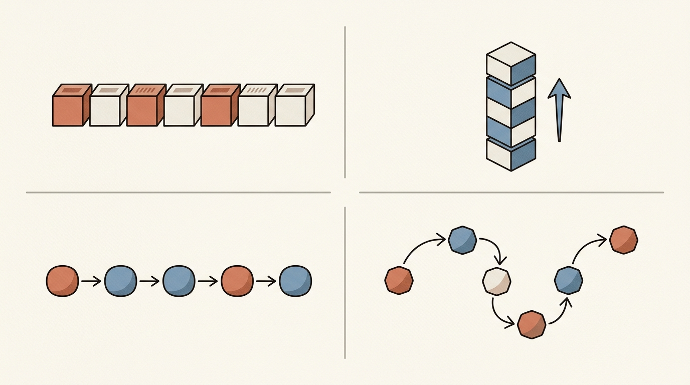
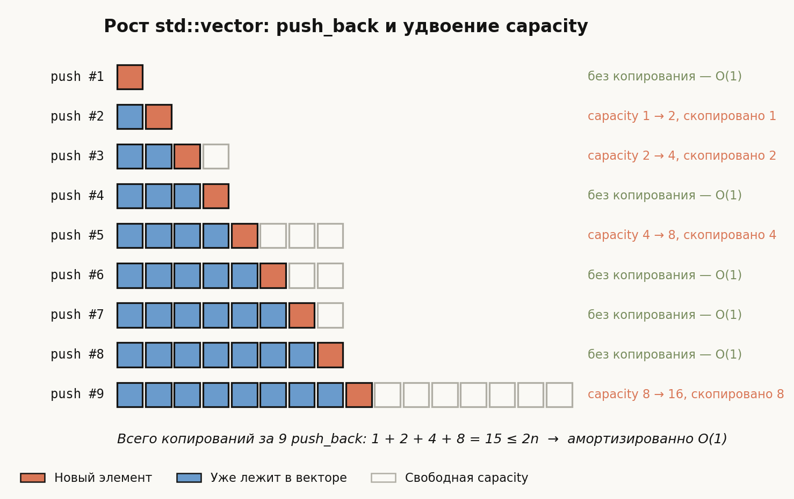
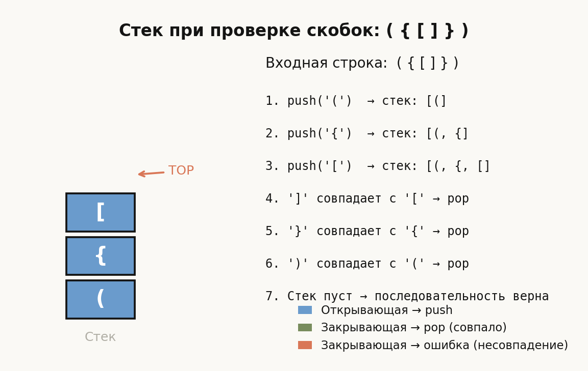
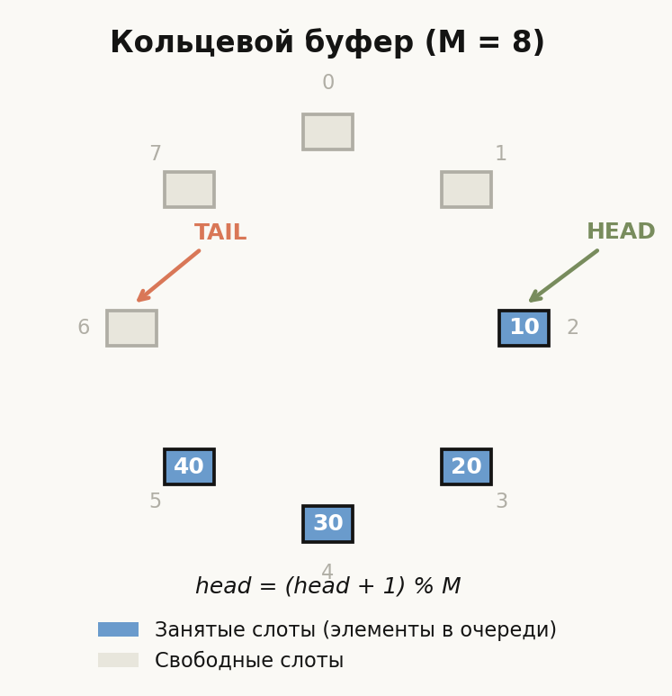
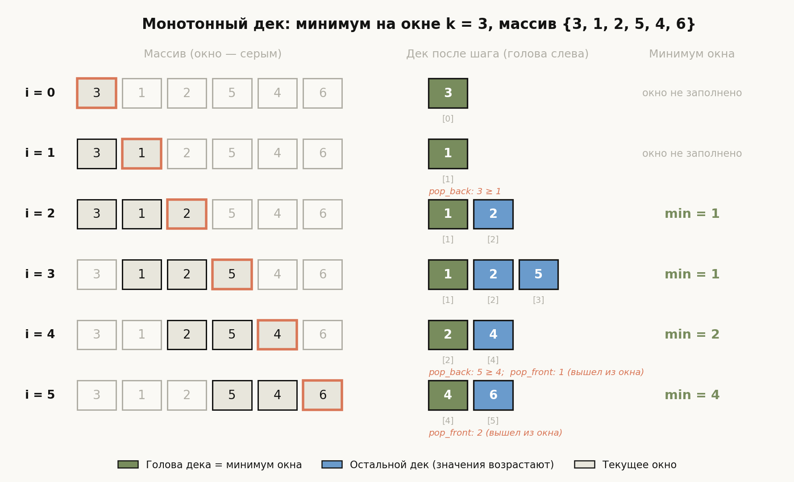
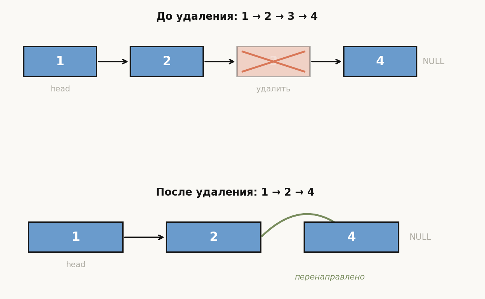

# Лекция 2: Простейшие структуры данных — массивы, стеки, очереди, связные списки



Программы работают с данными, и способ их организации в памяти определяет скорость работы алгоритмов. Выбор неподходящей структуры данных может превратить алгоритм с $O(n)$ в $O(n^2)$ — даже если логика написана верно. Эта лекция знакомит с базовыми «кирпичиками»: массивом, стеком, очередью, деком и связным списком. Мы разберём, как они устроены изнутри, какие операции выполняют за $O(1)$, а какие за $O(n)$, и почему это важно для ШАД.

Главная линия лекции:

$$
\text{Массив (случайный доступ)}
\;\to\;
\text{Стек / Очередь (порядок обработки)}
\;\to\;
\text{Список (гибкая вставка)}
\;\to\;
\text{Сравнение: что когда выбирать}
$$

**Как читать эту лекцию:** разделы 1–5 — устройство каждой структуры с кодом; раздел 6 — сводная таблица сложностей; разделы 7–9 — ошибки, ШАД, итог.

---

## План

1. Массив (array)
2. Стек (stack)
3. Очередь (queue)
4. Дек (deque)
5. Связный список (linked list)
6. Сравнение структур данных
7. Типичные ошибки
8. Что важно для поступления в ШАД
9. Итог
10. Вопросы для самопроверки

---

## 1. Массив (array)

### Определение

> **Массив** — непрерывный блок памяти, в котором элементы одного типа расположены последовательно. Доступ к элементу по индексу $i$ выполняется за $O(1)$: адрес элемента вычисляется как $\text{base} + i \cdot \text{sizeof}(T)$.

### Статический массив

Размер фиксирован на этапе компиляции. Память выделяется на стеке (или в сегменте данных).

```cpp
#include <iostream>

int main() {
    const int N = 5;
    int a[N] = {10, 20, 30, 40, 50};

    // Случайный доступ за O(1)
    std::cout << a[2] << "\n"; // 30

    // Обход за O(n)
    for (int i = 0; i < N; i++) {
        std::cout << a[i] << " ";
    }
    // Вывод: 10 20 30 40 50
    return 0;
}
```

### Динамический массив: std::vector

`std::vector<T>` размещает данные в куче и автоматически управляет памятью.

```cpp
#include <iostream>
#include <vector>

int main() {
    std::vector<int> v;

    // push_back: O(1) амортизированно
    for (int i = 1; i <= 6; i++) {
        v.push_back(i * 10);
        std::cout << "size=" << v.size()
                  << " capacity=" << v.capacity() << "\n";
    }
    // Случайный доступ: O(1)
    std::cout << v[3] << "\n"; // 40

    // Вставка в середину: O(n) из-за сдвигов
    v.insert(v.begin() + 2, 999);
    // v теперь: 10 20 999 30 40 50 60

    return 0;
}
```

### Удвоение capacity (amortized analysis)

Когда `size == capacity`, вектор выделяет новый блок в 2 раза больше и копирует все элементы. Это дорого — $O(n)$. Но такое удвоение происходит редко: после $n$ операций `push_back` суммарное число копирований не превышает $2n$, поэтому амортизированная стоимость одного `push_back` — $O(1)$.

$$
\text{Суммарные копирования} = 1 + 2 + 4 + \ldots + n = 2n - 1 = O(n)
\;\Rightarrow\;
\text{на один } \texttt{push\_back}: O(1)
$$



Диаграмма показывает девять последовательных `push_back`: синие клетки — уже лежащие элементы, оранжевая — только что добавленный, пустые — зарезервированная, но не занятая capacity. Дорогие операции (справа помечены оранжевым) случаются только в моменты удвоения — при переходе через 1, 2, 4, 8; все остальные вставки — дешёвые $O(1)$. Видно и геометрию амортизации: чем дороже копирование, тем реже оно происходит, поэтому суммарно за $n$ вставок копируется не более $2n$ элементов.

**Почему амортизация работает: метод монет.** Ключевое наблюдение: дорогое копирование при удвоении с capacity $c$ до $2c$ случается только когда вектор *заполнился*, а сразу после предыдущего удвоения он был заполнен лишь наполовину. Значит, между двумя дорогими операциями обязаны пройти $c/2$ дешёвых `push_back` — дороговизна и редкость жёстко связаны, и это можно оформить как инвариант. Пусть каждый `push_back` кладёт на «счёт» вектора 2 монеты, а копирование одного элемента стоит 1 монету. **Инвариант:** к моменту каждого удвоения на счету не меньше монет, чем элементов, которые предстоит скопировать. База: первое копирование (push #2, один элемент) оплачено двумя монетами push #1. Переход: после удвоения до capacity $2c$ счёт потрачен, но следующее удвоение скопирует $2c$ элементов и наступит ровно через $c$ новых `push_back` — они внесут как раз $2c$ монет. Проверьте на диаграмме: копирование восьми элементов на push #9 оплачено монетами четырёх вставок #6–#9. Итого $n$ операций вносят $2n$ монет, и вся работа (вставки плюс копирования) не превышает $3n$ — то есть $O(1)$ на операцию, причём не «в среднем по удачным данным», а гарантированно для любой последовательности вставок.

### Кеш-дружелюбность

Элементы массива лежат подряд в памяти. Процессор загружает данные блоками (cache line, обычно 64 байта). Обход массива — один из самых быстрых паттернов доступа: каждая загрузка из кеша обрабатывает $64 / \text{sizeof}(T)$ элементов сразу.

---

## 2. Стек (stack)

### Определение

> **Стек** — структура данных, реализующая принцип **LIFO** (Last In — First Out): последний добавленный элемент извлекается первым.

Основные операции — все $O(1)$:
- `push(x)` — добавить элемент на вершину;
- `pop()` — удалить элемент с вершины;
- `top()` — прочитать вершину без удаления;
- `empty()` — проверить, пуст ли стек.

### Реализация на массиве

```cpp
#include <iostream>
#include <stdexcept>

struct Stack {
    static const int MAXN = 1000;
    int data[MAXN];
    int top_index = -1; // индекс вершины; -1 означает пустой стек

    void push(int x) {
        if (top_index + 1 >= MAXN) throw std::overflow_error("Stack overflow");
        data[++top_index] = x;
    }
    void pop() {
        if (top_index < 0) throw std::underflow_error("Stack underflow");
        --top_index;
    }
    int top() const {
        if (top_index < 0) throw std::underflow_error("Stack is empty");
        return data[top_index];
    }
    bool empty() const { return top_index < 0; }
};
```

### std::stack в STL

```cpp
#include <stack>
#include <iostream>

int main() {
    std::stack<int> s;
    s.push(1); s.push(2); s.push(3);
    while (!s.empty()) {
        std::cout << s.top() << " "; // 3 2 1
        s.pop();
    }
    return 0;
}
```

### Применение 1: проверка правильности скобочной последовательности

Алгоритм: идём по строке слева направо. Открывающую скобку кладём в стек. Закрывающую — сравниваем с вершиной стека; если совпадает, снимаем вершину; иначе последовательность неправильная. В конце стек должен быть пуст.



На схеме — момент обработки строки `({[]})` после первых трёх символов: в стеке лежат `(`, `{`, `[`, вершина (TOP) — последняя открывающая. Справа перечислены все семь шагов: три `push` для открывающих скобок, затем три `pop` — каждая закрывающая совпала с вершиной, — и финальная проверка «стек пуст». Ключевая идея видна геометрически: стек «помнит» открывающие скобки в обратном порядке, поэтому вершина всегда соответствует самой недавней незакрытой скобке.

```cpp
#include <iostream>
#include <stack>
#include <string>

bool is_balanced(const std::string& s) {
    std::stack<char> st;
    for (char c : s) {
        if (c == '(' || c == '[' || c == '{') {
            st.push(c);
        } else if (c == ')' || c == ']' || c == '}') {
            if (st.empty()) return false;
            char top = st.top(); st.pop();
            if ((c == ')' && top != '(') ||
                (c == ']' && top != '[') ||
                (c == '}' && top != '{')) {
                return false;
            }
        }
    }
    return st.empty();
}

int main() {
    std::cout << is_balanced("({[]})") << "\n"; // 1 (true)
    std::cout << is_balanced("({[})") << "\n";  // 0 (false)
    std::cout << is_balanced("((()") << "\n";   // 0 (false)
    return 0;
}
```

Сложность: $O(n)$ по времени и $O(n)$ по памяти (в худшем случае все символы открывающие).

**Почему алгоритм корректен.** Ключевое наблюдение: в правильной скобочной последовательности пары скобок не «перекрещиваются» — закрывающая скобка всегда закрывает **самую недавнюю** из ещё не закрытых открывающих. Порядок «последней пришла — первой ушла» и есть LIFO, поэтому стек здесь не трюк, а точная модель задачи. **Инвариант:** после обработки первых $i$ символов стек содержит в точности все открывающие скобки префикса, ещё не получившие пары, — в порядке появления, самая недавняя на вершине. База: $i = 0$, стек пуст, незакрытых скобок нет. Переход: открывающая скобка кладётся на вершину — она и становится новой «самой недавней незакрытой», инвариант сохранён; закрывающая же обязана быть парой именно вершины — пара с любой более глубокой скобкой стека дала бы перекрещивание через незакрытую вершину. Поэтому если вершина не совпала (или стек пуст) — последовательность неправильна и досрочный `false` корректен, а если совпала — `pop` снимает закрывшуюся пару и восстанавливает инвариант. На схеме выше это видно в числах: после `({[` стек держит ровно три незакрытые скобки, и `]})` снимает их строго в обратном порядке. Цикл делает ровно $n$ шагов (завершаемость тривиальна), а финальная проверка `st.empty()` — это инвариант в момент $i = n$: пустой стек означает «незакрытых скобок не осталось», что и есть определение правильной последовательности. Отсюда же и сложность $O(n)$: каждый символ порождает не более одного `push` и одного `pop`.

### Применение 2: обратная польская нотация (RPN)

В RPN операнды идут перед оператором: `3 4 + 5 *` означает $(3+4) \times 5 = 35$. Алгоритм вычисления использует стек: числа кладём в стек, при операторе снимаем два числа, применяем операцию, кладём результат обратно.

Разберём вычисление `2 3 4 + *` по шагам:

| Токен | Действие | Стек после |
|---|---|---|
| `2` | push(2) | `[2]` |
| `3` | push(3) | `[2, 3]` |
| `4` | push(4) | `[2, 3, 4]` |
| `+` | pop 4 и 3, push 3+4=7 | `[2, 7]` |
| `*` | pop 7 и 2, push 2·7=14 | `[14]` |

Ответ — единственное оставшееся число: 14. Обратите внимание на порядок: первым снимается **правый** операнд (`b`), вторым — левый (`a`); для `+` и `*` это неважно, но для `-` и `/` перепутать порядок — типичная ошибка.

```cpp
#include <iostream>
#include <sstream>
#include <stack>
#include <string>

int eval_rpn(const std::string& expr) {
    std::stack<int> st;
    std::istringstream iss(expr);
    std::string token;
    while (iss >> token) {
        if (token == "+" || token == "-" || token == "*") {
            int b = st.top(); st.pop();
            int a = st.top(); st.pop();
            if (token == "+") st.push(a + b);
            else if (token == "-") st.push(a - b);
            else st.push(a * b);
        } else {
            st.push(std::stoi(token));
        }
    }
    return st.top();
}

int main() {
    std::cout << eval_rpn("3 4 + 5 *") << "\n"; // 35
    std::cout << eval_rpn("2 3 4 + *") << "\n"; // 14
    return 0;
}
```

---

## 3. Очередь (queue)

### Определение

> **Очередь** — структура данных, реализующая принцип **FIFO** (First In — First Out): первый добавленный элемент извлекается первым.

Основные операции — все $O(1)$:
- `push(x)` (enqueue) — добавить элемент в конец;
- `pop()` (dequeue) — удалить элемент из начала;
- `front()` — прочитать первый элемент;
- `back()` — прочитать последний элемент;
- `empty()` — проверить, пуста ли очередь.

### Реализация кольцевым буфером

Наивная реализация на массиве с `head = 0` требует $O(n)$ на каждый `pop` (сдвиг элементов). Кольцевой буфер решает проблему: используем два указателя `head` и `tail`; сдвиг — операция по модулю $m$ (размер буфера).

```cpp
#include <iostream>
#include <stdexcept>

struct CircularQueue {
    static const int M = 8; // размер буфера
    int data[M];
    int head = 0; // индекс первого элемента
    int tail = 0; // индекс следующей свободной позиции
    int sz = 0;

    bool empty() const { return sz == 0; }
    bool full()  const { return sz == M; }

    void push(int x) {
        if (full()) throw std::overflow_error("Queue is full");
        data[tail] = x;
        tail = (tail + 1) % M;
        sz++;
    }
    void pop() {
        if (empty()) throw std::underflow_error("Queue is empty");
        head = (head + 1) % M;
        sz--;
    }
    int front() const {
        if (empty()) throw std::underflow_error("Queue is empty");
        return data[head];
    }
};

int main() {
    CircularQueue q;
    q.push(10); q.push(20); q.push(30);
    std::cout << q.front() << "\n"; // 10
    q.pop();
    std::cout << q.front() << "\n"; // 20
    return 0;
}
```

Ключевое: `head = (head + 1) % M` — сдвиг по кольцу за $O(1)$ вместо $O(n)$.



На рисунке буфер из $M = 8$ слотов свёрнут в кольцо: занятые слоты (синие, значения 10–40) идут от указателя HEAD к указателю TAIL, свободные — серые. HEAD указывает на первый элемент (его вернёт `front()`), TAIL — на первую свободную позицию (туда запишет `push`). При `pop` HEAD просто сдвигается по кольцу на один слот — формула `(head + 1) % M` внизу; никакие элементы физически не перемещаются, поэтому операция стоит $O(1)$. Когда указатель доходит до слота 7, следующий шаг возвращает его в слот 0 — буфер используется бесконечно по кругу.

### std::queue в STL

```cpp
#include <queue>
#include <iostream>

int main() {
    std::queue<int> q;
    q.push(1); q.push(2); q.push(3);
    while (!q.empty()) {
        std::cout << q.front() << " "; // 1 2 3
        q.pop();
    }
    return 0;
}
```

### Применение: обход в ширину (BFS)

Очередь — основной инструмент алгоритма BFS на графе. На каждом шаге берём вершину из начала очереди, обрабатываем её, кладём непосещённых соседей в конец. Гарантируется обход в порядке увеличения расстояния от источника.

```cpp
#include <iostream>
#include <queue>
#include <vector>

void bfs(int start, const std::vector<std::vector<int>>& adj) {
    int n = adj.size();
    std::vector<bool> visited(n, false);
    std::queue<int> q;
    q.push(start);
    visited[start] = true;
    while (!q.empty()) {
        int v = q.front(); q.pop();
        std::cout << v << " ";
        for (int u : adj[v]) {
            if (!visited[u]) {
                visited[u] = true;
                q.push(u);
            }
        }
    }
    std::cout << "\n";
}
```

---

## 4. Дек (deque — double-ended queue)

### Определение

> **Дек** — структура данных, позволяющая добавлять и удалять элементы с **обоих концов** за $O(1)$.

Операции:
- `push_front(x)`, `push_back(x)` — добавить в начало / конец;
- `pop_front()`, `pop_back()` — удалить из начала / конца;
- `front()`, `back()` — прочитать начало / конец.

Дек обобщает и стек (`push_back` / `pop_back`), и очередь (`push_back` / `pop_front`).

### std::deque в STL

Стандартный `std::deque<T>` реализован через набор фиксированных блоков (не один непрерывный массив). Это обеспечивает $O(1)$ для операций с концами и $O(1)$ для случайного доступа, но с бо́льшой константой, чем у вектора.

```cpp
#include <deque>
#include <iostream>

int main() {
    std::deque<int> d;
    d.push_back(2);
    d.push_front(1);
    d.push_back(3);
    // d: 1 2 3
    std::cout << d.front() << "\n"; // 1
    std::cout << d.back()  << "\n"; // 3
    d.pop_front();
    // d: 2 3
    std::cout << d[0] << "\n"; // 2
    return 0;
}
```

### Применение: минимум на скользящем окне

Дек позволяет найти минимум на отрезке длины $k$ для всех позиций за суммарное время $O(n)$. В деке хранятся индексы в порядке возрастания значений — это классическая задача на «монотонный дек».

Интуиция: пусть в окне есть два элемента $a[j]$ и $a[i]$, причём $j < i$ и $a[j] \geq a[i]$. Тогда $a[j]$ **никогда** не понадобится: он не меньше $a[i]$ и к тому же выйдет из окна раньше. Такие «бесперспективные» элементы удаляем с хвоста дека сразу при добавлении нового. В результате значения в деке строго возрастают от головы к хвосту, и минимум окна — всегда голова. Каждый индекс попадает в дек один раз и удаляется один раз, отсюда суммарное $O(n)$.

**Почему минимум — всегда голова: инвариант.** Сформулируем точно, что сохраняется. **Инвариант:** после обработки элемента $i$ дек содержит ровно те индексы текущего окна, справа от которых (в пределах окна) нет элемента не больше их, — и значения по этим индексам строго возрастают от головы к хвосту. База: до первого элемента дек пуст. Переход — три действия шага, каждое сохраняет инвариант: (1) `pop_front` выбрасывает индекс, покинувший окно, — а выйти из окна могла только голова, потому что индексы в деке возрастают слева направо; (2) `pop_back` выбрасывает все индексы $j$ с $a[j] \geq a[i]$ — для них новый элемент $i$ как раз стал «элементом правее и не больше»; (3) `push_back(i)` добавляет сам $i$, справа от которого в окне пока никого нет. После шага (2) все оставшиеся значения строго меньше $a[i]$, поэтому возрастание не нарушено. Из инварианта немедленно следует корректность: минимум окна либо сам лежит в деке, либо был выброшен — но выбрасывали только те элементы, у которых в окне есть сосед справа не больше их, то есть заведомо не единственный минимум; а из возрастания значений минимум дека — голова. Сложность: каждый из $n$ индексов делает ровно один `push_back` и не более одного `pop`, значит всего $\leq 2n$ операций с деком — $O(n)$, хотя отдельный шаг может выполнить много `pop_back`. Это та же амортизация, что у вектора: дорогие шаги заранее оплачены дешёвыми.



На трассировке — все шесть шагов алгоритма для массива $\{3, 1, 2, 5, 4, 6\}$ и окна $k = 3$: слева массив с текущим окном (серая подложка) и обрабатываемым элементом (оранжевая рамка), в центре — дек после шага, справа — минимум окна. Оба свойства инварианта видны глазами: значения в деке всегда возрастают от головы к хвосту, и минимум окна — всегда голова (зелёная). На шаге $i = 1$ единица выбросила из дека тройку, на шаге $i = 4$ четвёрка выбросила пятёрку — «бесперспективные» элементы исчезают, не дожидаясь выхода из окна, и именно поэтому голова никогда не оказывается устаревшей.

```cpp
#include <deque>
#include <vector>
#include <iostream>

// Возвращает вектор минимумов на окне размера k
std::vector<int> sliding_min(const std::vector<int>& a, int k) {
    std::deque<int> dq; // хранит индексы
    std::vector<int> result;
    int n = a.size();
    for (int i = 0; i < n; i++) {
        // Убираем индексы, вышедшие за пределы окна
        while (!dq.empty() && dq.front() < i - k + 1) dq.pop_front();
        // Убираем индексы с большими значениями (они не нужны)
        while (!dq.empty() && a[dq.back()] >= a[i]) dq.pop_back();
        dq.push_back(i);
        if (i >= k - 1) result.push_back(a[dq.front()]);
    }
    return result;
}

int main() {
    std::vector<int> a = {3, 1, 2, 5, 4, 6};
    for (int x : sliding_min(a, 3)) std::cout << x << " "; // 1 1 2 4
    return 0;
}
```

---

## 5. Связный список (linked list)

### Односвязный список

> **Связный список** — набор узлов, каждый из которых хранит значение и указатель на следующий узел.

```cpp
struct Node {
    int val;
    Node* next;
    Node(int v, Node* n = nullptr) : val(v), next(n) {}
};
```

**Вставка после узла** — $O(1)$: меняем лишь два указателя.

```cpp
// Вставить узел с value после узла prev
void insert_after(Node* prev, int value) {
    Node* new_node = new Node(value, prev->next);
    prev->next = new_node;
}
```

**Поиск** — $O(n)$: перебираем узлы по цепочке.

**Удаление узла** — $O(1)$ если известен предыдущий узел, иначе $O(n)$ на поиск.

```cpp
// Удалить узел после prev
void delete_after(Node* prev) {
    if (prev->next == nullptr) return;
    Node* to_delete = prev->next;
    prev->next = to_delete->next;
    delete to_delete;
}
```

### Полный пример: создание, вывод, вставка, удаление

```cpp
#include <iostream>

struct Node {
    int val;
    Node* next;
    Node(int v, Node* n = nullptr) : val(v), next(n) {}
};

void print_list(Node* head) {
    for (Node* p = head; p != nullptr; p = p->next) {
        std::cout << p->val;
        if (p->next) std::cout << " -> ";
    }
    std::cout << "\n";
}

int main() {
    // Строим список: 1 -> 2 -> 4
    Node* head = new Node(1, new Node(2, new Node(4)));
    print_list(head); // 1 -> 2 -> 4

    // Вставляем 3 после узла со значением 2
    Node* p = head->next; // p указывает на узел 2
    Node* new_node = new Node(3, p->next);
    p->next = new_node;
    print_list(head); // 1 -> 2 -> 3 -> 4

    // Удаляем узел 3 (после узла 2)
    Node* to_del = p->next;
    p->next = to_del->next;
    delete to_del;
    print_list(head); // 1 -> 2 -> 4

    // Освобождаем память
    while (head) {
        Node* tmp = head->next;
        delete head;
        head = tmp;
    }
    return 0;
}
```



Верхняя схема — список до удаления: узел 3 (перечёркнут оранжевым) подлежит удалению. Нижняя — после: зелёная дуга показывает единственное реальное изменение — указатель `next` узла 2 теперь ведёт мимо удалённого узла прямо к узлу 4. Сами узлы 1, 2 и 4 не перемещаются в памяти — в этом и состоит преимущество списка перед массивом, где удаление из середины потребовало бы сдвинуть все последующие элементы.

### Двусвязный список

В двусвязном списке каждый узел хранит два указателя: `next` и `prev`. Это позволяет удалять узел, зная только указатель на него самого — за $O(1)$.

```cpp
struct DNode {
    int val;
    DNode* prev;
    DNode* next;
    DNode(int v) : val(v), prev(nullptr), next(nullptr) {}
};
```

### std::list в STL

`std::list<T>` — двусвязный список. Вставка и удаление за $O(1)$ при наличии итератора. Нет случайного доступа (`list[i]` недоступен).

```cpp
#include <list>
#include <iostream>

int main() {
    std::list<int> lst = {1, 2, 4};
    auto it = lst.begin();
    std::advance(it, 2); // O(n)! итератор на элемент 4
    lst.insert(it, 3);   // O(1): вставить 3 перед 4
    for (int x : lst) std::cout << x << " "; // 1 2 3 4
    return 0;
}
```

### Недостатки связного списка

- **Нет случайного доступа**: доступ к $i$-му элементу — $O(n)$.
- **Плохая кеш-локальность**: узлы разбросаны по куче, процессор не может предзагрузить следующий элемент.
- **Накладные расходы памяти**: каждый узел хранит один или два указателя (8 байт каждый на 64-битной системе).

На практике `std::vector` часто быстрее `std::list` даже при частых вставках в середину — из-за разницы в кеш-эффективности.

---

## 6. Сравнение структур данных

| Операция | `array` / `vector` | `stack` | `queue` | `list` |
|---|---|---|---|---|
| Случайный доступ $a[i]$ | $O(1)$ | — | — | $O(n)$ |
| Вставка в конец | $O(1)$* | $O(1)$ (push) | $O(1)$ (push) | $O(1)$ |
| Вставка в начало | $O(n)$ | — | — | $O(1)$ |
| Вставка в середину | $O(n)$ | — | — | $O(1)$** |
| Удаление из конца | $O(1)$ | $O(1)$ (pop) | — | $O(1)$ |
| Удаление из начала | $O(n)$ | — | $O(1)$ (pop) | $O(1)$ |
| Удаление из середины | $O(n)$ | — | — | $O(1)$** |
| Поиск элемента | $O(n)$ | $O(n)$ | $O(n)$ | $O(n)$ |
| Кеш-эффективность | высокая | высокая | высокая | низкая |

\* Амортизированно.  
\*\* При наличии итератора на нужный узел.

### Когда что выбирать

- **Массив / вектор**: случайный доступ, обходы, сортировка. По умолчанию — `std::vector`.
- **Стек**: задачи с отменой действий, рекурсия без рекурсии, скобочные последовательности.
- **Очередь**: обход в ширину, задачи «обрабатывай в порядке поступления».
- **Дек**: минимум на окне, задачи, где нужны операции с обоих концов.
- **Список**: когда вставок/удалений много и они происходят по известному итератору.

---

## 7. Типичные ошибки

**1. Выход за границы массива (out of bounds)**

```cpp
int a[5];
a[5] = 10; // undefined behavior: индексы 0..4
```
Компилятор не проверяет границы для C-массивов. Используйте `a.at(i)` у `std::vector` — бросает `std::out_of_range`.

**2. Удаление из пустого стека/очереди**

```cpp
std::stack<int> s;
s.pop(); // undefined behavior: стек пуст
```
Всегда проверяйте `empty()` перед `pop()` и `top()`.

**3. Утечка памяти в связном списке**

```cpp
Node* head = new Node(1, new Node(2));
head = new Node(0, head); // добавили в начало
// ...
delete head; // удалили только первый узел, остальные потеряны!
```
При работе с сырыми указателями освобождайте каждый узел вручную или используйте `std::shared_ptr`/`std::unique_ptr`.

**4. Инвалидация итераторов вектора после `push_back`**

```cpp
std::vector<int> v = {1, 2, 3};
auto it = v.begin();
v.push_back(4); // может произойти перераспределение памяти!
std::cout << *it; // undefined behavior: итератор инвалидирован
```
После любого `push_back` / `insert` во вектор все итераторы и указатели на элементы могут быть инвалидированы.

**5. Забытый `% M` в кольцевом буфере**

```cpp
// Неправильно:
tail = tail + 1;   // tail выйдет за границу массива
// Правильно:
tail = (tail + 1) % M;
```
Всегда оборачивайте индексы кольцевого буфера по модулю.

**6. Случайный доступ к std::list**

```cpp
std::list<int> lst = {1, 2, 3};
int x = lst[1]; // ОШИБКА КОМПИЛЯЦИИ: list не поддерживает operator[]
```
Для случайного доступа используйте `std::advance(it, k)` — но это $O(k)$, не $O(1)$.

---

## 8. Что важно для поступления в ШАД

- Знать сложность всех базовых операций для каждой структуры данных наизусть.
- Уметь реализовать стек, очередь и связный список с нуля на C++ без STL.
- Объяснять, почему `push_back` у вектора — $O(1)$ амортизированно, и что такое амортизированный анализ.
- Реализовывать алгоритм проверки скобочной последовательности и вычисления RPN.
- Понимать, как кольцевой буфер обеспечивает $O(1)$ для операций очереди.
- Знать разницу между односвязным и двусвязным списком: где нужен prev-указатель.
- Видеть задачи, в которых `std::vector` предпочтительнее `std::list`, несмотря на $O(n)$ вставку в середину (кеш-эффективность).
- Уметь применять дек для задачи «минимум на скользящем окне» за $O(n)$.

---

## 9. Итог

Массив обеспечивает случайный доступ за $O(1)$ и максимальную кеш-эффективность ценой медленной вставки в середину. Стек и очередь — специализированные ограничения на порядок доступа (LIFO и FIFO), реализуемые поверх массива за $O(1)$ на все операции. Дек объединяет оба принципа и незаменим при задачах на скользящее окно. Связный список допускает $O(1)$ вставку и удаление в любом месте при известном итераторе, но платит за это отсутствием случайного доступа и плохой кеш-локальностью.

Выбор структуры данных — это компромисс между видами операций, которые будут преобладать. Знание этих компромиссов позволяет превращать $O(n^2)$ решения в $O(n)$ или $O(n \log n)$, что и проверяет ШАД на вступительных олимпиадах.

---

## 10. Вопросы для самопроверки

1. Почему доступ к элементу массива по индексу выполняется за $O(1)$? Напишите формулу вычисления адреса.
2. Объясните механизм удвоения capacity у `std::vector`. Докажите, что амортизированная стоимость одного `push_back` — $O(1)$.
3. Что такое LIFO и FIFO? Приведите бытовой пример каждого принципа.
4. Реализуйте стек на массиве без STL. Какие граничные случаи нужно обработать?
5. Почему наивная реализация очереди на массиве с `head = 0` имеет сложность $O(n)$ на операцию `pop`? Как кольцевой буфер решает эту проблему?
6. Чем отличается дек от стека и от очереди? Назовите операцию, которую умеет дек, но не умеет стек.
7. Напишите алгоритм проверки правильности скобочной последовательности. Какова его сложность?
8. Вычислите вручную выражение в обратной польской нотации: `5 1 2 + 4 * + 3 -`. Трассируйте стек.
9. Чем односвязный список отличается от двусвязного? В каком случае необходим двусвязный?
10. Почему на практике `std::vector` часто быстрее `std::list` даже для задач с частыми вставками? Что такое кеш-локальность?
11. Дан вектор `{3, 1, 2, 5, 4, 6}` и окно размера 3. Найдите минимум в каждом окне с помощью монотонного дека.
12. Что произойдёт с итераторами на элементы `std::vector`, если после их получения вызвать `push_back`? Почему?
