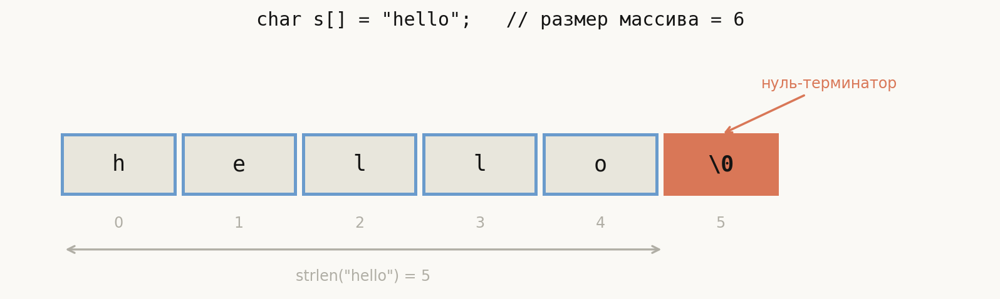
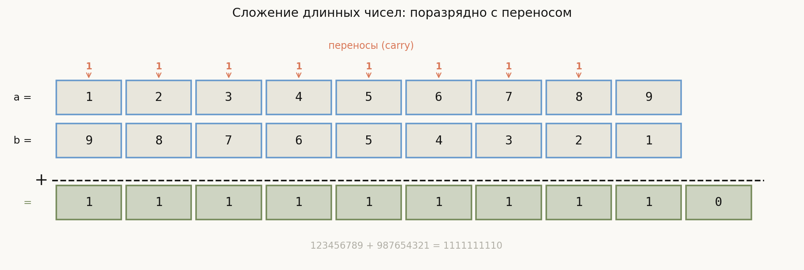
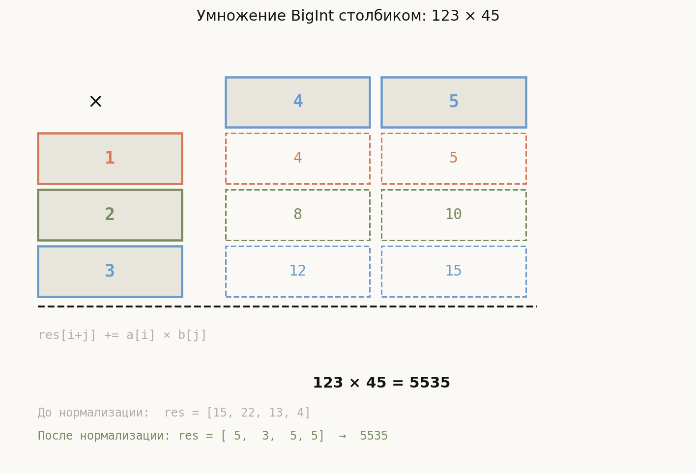
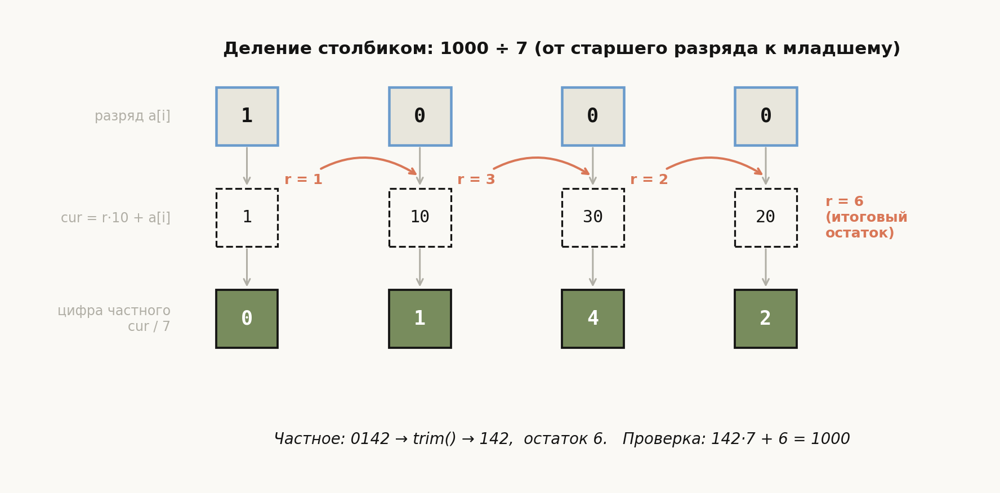

# Лекция 3: Строки и длинная арифметика


Компьютеры работают с числами, но людям нужны слова — а ещё иногда нужны числа, которые не умещаются ни в какой стандартный тип. Эта лекция закрывает оба пробела. Сначала разберём, как хранятся и обрабатываются строки в C и C++: от низкоуровневого массива символов с нулём-терминатором до удобного `std::string` с итераторами. Затем перейдём к **длинной арифметике** — технике, позволяющей считать с числами в сотни и тысячи цифр. Именно она лежит в основе криптографии, вычислительной алгебры и олимпиадных задач, где ответ нужно выдать «по модулю 10^9+7»... или вообще без модуля.

Главная линия лекции:

$$
\text{char array + \textbackslash0}
\;\to\;
\text{std::string}
\;\to\;
\text{базовые алгоритмы}
\;\to\;
\text{BigInt: сложение, умножение, деление}
$$

**Как читать эту лекцию:** разделы 1–3 — строки (C и C++, базовые алгоритмы); разделы 4–8 — длинная арифметика от представления до деления столбиком; разделы 9–12 — типичные ошибки, что важно для ШАД, итог и вопросы.

---

## План

1. Строки в C: char-массив и нуль-терминатор
2. Строки в C++: std::string
3. Алгоритмы на строках (базовые)
4. Длинная арифметика: постановка и представление
5. Сложение длинных чисел
6. Сравнение длинных чисел
7. Умножение «в столбик»
8. Деление «в столбик»
9. Типичные ошибки
10. Что важно для поступления в ШАД
11. Итог
12. Вопросы для самопроверки

---

## 1. Строки в C: char-массив и нуль-терминатор

### Определение

Строка в языке C — это массив элементов типа `char`, заканчивающийся **нуль-терминатором** `'\0'` (байт со значением 0). Нуль-терминатор сигнализирует конец строки и **не является** частью содержимого, но занимает одну ячейку массива.

> **Правило**: для строки из $n$ символов нужен массив размером не менее $n + 1$.



На схеме — строка `"hello"` в памяти: шесть ячеек с индексами 0–5. Пять синих ячеек содержат символы, шестая (оранжевая) — нуль-терминатор `'\0'`. Скобка внизу подчёркивает: `strlen` вернёт 5, потому что считает только содержательные символы, но массив обязан вмещать 6 байт. Все функции C-строк (`strlen`, `strcpy`, `printf("%s")`) ищут именно этот нулевой байт, чтобы понять, где строка кончается, — если его нет, они уйдут читать чужую память.

### strlen — длина за O(n)

Стандартная функция `strlen` из `<cstring>` проходит по символам до `'\0'` и считает их:

```cpp
#include <cstring>
#include <cstdio>

int main() {
    char s[] = "hello";      // {'h','e','l','l','o','\0'}, размер = 6
    printf("%zu\n", strlen(s)); // 5 — нуль не считается
    return 0;
}
```

Сложность — $O(n)$, где $n$ — длина строки. Каждый вызов `strlen` заново проходит весь массив, поэтому не стоит вызывать его в цикле.

### Функции `<cstring>`

| Функция | Что делает | Сложность |
|---|---|---|
| `strlen(s)` | длина строки | $O(n)$ |
| `strcpy(dst, src)` | копирует `src` в `dst` (включая `'\0'`) | $O(n)$ |
| `strcat(dst, src)` | приписывает `src` к концу `dst` | $O(n + m)$ |
| `strcmp(a, b)` | лексикографическое сравнение; 0 если равны | $O(\min(n,m))$ |

### Пример: конкатенация в C

```cpp
#include <cstring>
#include <cstdio>

int main() {
    char buf[64] = "Hello, ";
    char name[]  = "ШАД";
    strcat(buf, name);       // buf = "Hello, ШАД"
    printf("%s\n", buf);
    return 0;
}
```

> **Опасность**: `strcat` и `strcpy` не проверяют размер буфера. Если `dst` слишком мал, происходит **переполнение буфера** — классическая уязвимость. В серьёзном коде используйте `strncpy`/`strncat` или переходите на C++.

---

## 2. Строки в C++: std::string

### Конструкторы и базовый интерфейс

`std::string` из `<string>` — класс, который управляет памятью автоматически. Нет нужды думать о размере буфера.

```cpp
#include <string>
#include <iostream>

int main() {
    std::string a = "hello";
    std::string b(5, 'x');    // "xxxxx"
    std::string c = a + ", " + b; // конкатенация

    std::cout << c << "\n";           // hello, xxxxx
    std::cout << c.size() << "\n";    // 12
    std::cout << c[0] << "\n";        // h
    return 0;
}
```

### Ключевые методы

| Метод | Что делает | Сложность |
|---|---|---|
| `s.size()` / `s.length()` | количество символов | $O(1)$ |
| `s[i]` | символ по индексу (без проверки границ) | $O(1)$ |
| `s.substr(pos, len)` | подстрока начиная с `pos`, длиной `len` | $O(\text{len})$ |
| `s.find(sub)` | первое вхождение `sub` (или `string::npos`) | $O(n \cdot m)$ |
| `s.rfind(sub)` | последнее вхождение `sub` | $O(n \cdot m)$ |
| `s + t` | новая строка — конкатенация | $O(\|s\| + \|t\|)$ |
| `s += t` | добавляет `t` к `s` | $O(\|t\|)$ амортиз. |
| `s < t`, `s == t` | лексикографическое сравнение | $O(\min(\|s\|, \|t\|))$ |

### Итераторы и `reverse`

`s.begin()` указывает на первый символ, `s.end()` — на позицию за последним. Это позволяет использовать стандартные алгоритмы:

```cpp
#include <algorithm>
#include <string>
#include <iostream>

int main() {
    std::string s = "abcde";
    std::reverse(s.begin(), s.end()); // "edcba"
    std::cout << s << "\n";
    return 0;
}
```

### Пример: проверка палиндрома

Строка — палиндром, если читается одинаково слева направо и справа налево.

```cpp
#include <algorithm>
#include <string>
#include <iostream>

bool isPalindrome(const std::string& s) {
    std::string rev = s;
    std::reverse(rev.begin(), rev.end());
    return s == rev;
}

int main() {
    std::string words[] = {"level", "hello", "racecar"};
    for (const auto& w : words) {
        std::cout << w << ": " << (isPalindrome(w) ? "да" : "нет") << "\n";
    }
    // level: да
    // hello: нет
    // racecar: да
    return 0;
}
```

Сложность: $O(n)$ на копирование + $O(n)$ на разворот + $O(n)$ на сравнение = $O(n)$.

Альтернатива через два указателя — без дополнительной памяти:

```cpp
bool isPalindrome2(const std::string& s) {
    int l = 0, r = (int)s.size() - 1;
    while (l < r) {
        if (s[l] != s[r]) return false;
        l++; r--;
    }
    return true;
}
```

---

## 3. Алгоритмы на строках (базовые)

### Подсчёт вхождений символа: O(n)

```cpp
#include <string>
#include <iostream>

int countChar(const std::string& s, char c) {
    int cnt = 0;
    for (char x : s)
        if (x == c) cnt++;
    return cnt;
}

int main() {
    std::string s = "abracadabra";
    std::cout << "Букв 'a': " << countChar(s, 'a') << "\n"; // 5
    return 0;
}
```

### Наивный поиск подстроки: O(n·m)

Идея: для каждой позиции `i` в тексте проверяем, совпадает ли подстрока `pattern` начиная с `i`.

```cpp
#include <string>
#include <vector>
#include <iostream>

std::vector<int> naiveSearch(const std::string& text, const std::string& pattern) {
    int n = text.size(), m = pattern.size();
    std::vector<int> positions;
    for (int i = 0; i <= n - m; i++) {
        bool match = true;
        for (int j = 0; j < m; j++) {
            if (text[i + j] != pattern[j]) { match = false; break; }
        }
        if (match) positions.push_back(i);
    }
    return positions;
}

int main() {
    auto pos = naiveSearch("abababc", "aba");
    for (int p : pos) std::cout << p << " "; // 0 2
    std::cout << "\n";
    return 0;
}
```

В худшем случае (например, текст `"aaaa…a"`, паттерн `"aaa…ab"`) — $O(n \cdot m)$. Алгоритмы Кнута–Морриса–Пратта и Рабина–Карпа дают $O(n + m)$ и $O(n)$ ожидаемо соответственно, но рассматриваются в отдельных лекциях.

### Преобразование строка ↔ число

```cpp
#include <string>
#include <iostream>

int main() {
    // Строка -> число
    std::string s = "12345";
    int  a = std::stoi(s);   // int
    long b = std::stol(s);   // long
    double d = std::stod("3.14"); // double

    // Число -> строка
    std::string t = std::to_string(42);    // "42"
    std::string u = std::to_string(3.14);  // "3.140000"

    std::cout << a + 1 << "\n"; // 12346
    std::cout << t << "\n";     // 42
    return 0;
}
```

---

## 4. Длинная арифметика: постановка и представление

### Зачем нужна длинная арифметика

Стандартные типы ограничены:
- `int` (32 бит) — до $\approx 2 \times 10^9$;
- `long long` (64 бит) — до $\approx 9.2 \times 10^{18}$.

Но $100! \approx 9.3 \times 10^{157}$. Задачи на комбинаторику, теорию чисел и криптографию требуют чисел с **сотнями и тысячами цифр**.

### Представление: вектор цифр

Длинное неотрицательное целое число хранится как вектор «цифр» в некотором **основании** $B$:

$$
N = d_0 + d_1 \cdot B + d_2 \cdot B^2 + \ldots + d_{k-1} \cdot B^{k-1}
$$

Соглашение (принятое в этой лекции): **младший разряд хранится в `digits[0]`**.

Пример при $B = 10$: число $1234$ → `digits = {4, 3, 2, 1}`.

**Почему младший в `[0]`?** При сложении и умножении перенос всегда идёт «вправо» — на следующий индекс. Вектор с ведущим разрядом в `[0]` потребовал бы итерации в обратном порядке.

### Выбор основания

| Основание $B$ | Плюсы | Минусы |
|---|---|---|
| $10$ | легко читать/печатать | много операций для больших чисел |
| $10^9$ | мало элементов, быстрее | при умножении нужен `long long` для промежуточного |
| $2^{32}$ | максимальная плотность | ввод/вывод через конвертацию |

В этой лекции используем $B = 10$ для ясности. В производительных реализациях берут $B = 10^9$.

### Структура BigInt

```cpp
#include <vector>
#include <string>
#include <algorithm>
#include <iostream>

struct BigInt {
    std::vector<int> d; // d[0] — младший разряд, base 10

    // Конструктор из числа
    BigInt(long long v = 0) {
        if (v == 0) d.push_back(0);
        while (v > 0) { d.push_back(v % 10); v /= 10; }
    }

    // Конструктор из строки "12345"
    BigInt(const std::string& s) {
        for (int i = (int)s.size() - 1; i >= 0; i--)
            d.push_back(s[i] - '0');
        trim();
    }

    void trim() { // убрать ведущие нули
        while (d.size() > 1 && d.back() == 0)
            d.pop_back();
    }

    void print() const {
        for (int i = (int)d.size() - 1; i >= 0; i--)
            std::cout << d[i];
        std::cout << "\n";
    }
};
```

---

## 5. Сложение длинных чисел

### Алгоритм

Складываем поразрядно слева направо (от младшего к старшему), поддерживая перенос (`carry`):

$$
\text{sum}[i] = a[i] + b[i] + \text{carry}
$$

$$
\text{carry}_{\text{new}} = \lfloor \text{sum}[i] / B \rfloor, \quad \text{digit}[i] = \text{sum}[i] \bmod B
$$

Сложность: $O(\max(n, m))$, где $n, m$ — количество цифр.



На схеме складываются $123456789 + 987654321$. Верхние два ряда — разряды слагаемых, нижний зелёный — результат $1111111110$. Оранжевые единицы над верхним рядом — переносы: в каждом разряде сумма $\geq 10$, поэтому единица «уезжает» в соседний старший разряд. Обратите внимание на длину результата: десять цифр против девяти у слагаемых — последний перенос породил новый старший разряд, именно поэтому в коде цикл продолжается, пока `carry` не обнулится.

### Пример: 999 + 1 = 1000

Разряды (основание 10, младший слева): `a = {9,9,9}`, `b = {1}`.

| i | a[i] | b[i] | carry | sum | digit | новый carry |
|---|------|------|-------|-----|-------|-------------|
| 0 |  9   |  1   |  0    | 10  |  0    |  1          |
| 1 |  9   |  0   |  1    | 10  |  0    |  1          |
| 2 |  9   |  0   |  1    | 10  |  0    |  1          |
| 3 | —    | —    |  1    |  1  |  1    |  0          |

Результат: `{0, 0, 0, 1}` = 1000. Перенос создал новую цифру.

### Почему алгоритм корректен

**Ключевое наблюдение.** Перенос — единственный канал, по которому разряд влияет на соседей, и он никогда не превышает 1: максимум в одном разряде — $9 + 9 + 1 = 19 < 20$, откуда новый перенос $\lfloor 19/10 \rfloor = 1$. По индукции carry $\in \{0, 1\}$ на всех шагах (в общем основании $B$: $(B-1) + (B-1) + 1 = 2B - 1 < 2B$).

**Инвариант.** После обработки разряда $i$ уже выписанные цифры вместе с переносом представляют точную сумму младших разрядов слагаемых:

$$
\sum_{j \leq i} \text{digit}[j] \cdot B^j + \text{carry} \cdot B^{i+1} = (\text{младшие } i{+}1 \text{ разрядов } a) + (\text{младшие } i{+}1 \text{ разрядов } b).
$$

База: перед циклом carry = 0, обе стороны равны нулю. Переход: шаг вычисляет $\text{sum} = a[i] + b[i] + \text{carry}$ и раскладывает его по тождеству $\text{sum} \cdot B^i = (\text{sum} \bmod B) \cdot B^i + \lfloor \text{sum}/B \rfloor \cdot B^{i+1}$ — равенство лишь перегруппировано, ничего не потеряно и не добавлено. Завершаемость: когда разряды обоих чисел исчерпаны, $\text{sum} = \text{carry} \leq 1$, и новый перенос заведомо 0 — поэтому цикл `for (i = 0; i < n || carry; i++)` делает не более одного «лишнего» шага. Именно этот шаг записал четвёртую цифру в примере $999 + 1$: после третьего разряда инвариант гласил $000 + 1 \cdot 10^3 = 999 + 1$, и последний шаг превратил перенос в цифру. После выхода carry = 0, и инвариант превращается в утверждение «выписанные цифры — в точности $a + b$». Сложность считывается из структуры: один шаг на разряд плюс возможный шаг для последнего переноса — $O(\max(n, m))$.

### Реализация

```cpp
BigInt add(const BigInt& a, const BigInt& b) {
    BigInt res;
    res.d.clear();
    int carry = 0;
    int n = std::max(a.d.size(), b.d.size());
    for (int i = 0; i < n || carry; i++) {
        int sum = carry;
        if (i < (int)a.d.size()) sum += a.d[i];
        if (i < (int)b.d.size()) sum += b.d[i];
        res.d.push_back(sum % 10);
        carry = sum / 10;
    }
    return res;
}

int main() {
    BigInt a("999"), b("1");
    BigInt c = add(a, b);
    c.print(); // 1000
    return 0;
}
```

---

## 6. Сравнение длинных чисел

### Алгоритм

1. Если у чисел разное количество цифр (после удаления ведущих нулей), большее то, у которого цифр больше.
2. Если количество цифр одинаково — сравниваем разряды от **старшего** к младшему (т.е. от `d.back()` к `d[0]`).

Сложность: $O(n)$.

```cpp
// Возвращает -1, 0, 1
int cmp(const BigInt& a, const BigInt& b) {
    if (a.d.size() != b.d.size())
        return a.d.size() < b.d.size() ? -1 : 1;
    for (int i = (int)a.d.size() - 1; i >= 0; i--) {
        if (a.d[i] != b.d[i])
            return a.d[i] < b.d[i] ? -1 : 1;
    }
    return 0; // равны
}

int main() {
    BigInt x("12345"), y("9999");
    int r = cmp(x, y);
    std::cout << (r == 1 ? "x > y" : r == -1 ? "x < y" : "x == y") << "\n";
    // 12345 имеет 5 цифр, 9999 — 4. Вывод: x > y
    return 0;
}
```

---

## 7. Умножение «в столбик»

### Алгоритм O(n²)

Умножение «в столбик» — то же, что делают в начальной школе, но в терминах разрядов:

$$
\text{res}[i+j] \mathrel{+}= a[i] \times b[j]
$$

После заполнения `res` нормализуем переносы.

Сложность: $O(n \cdot m)$.



Сетка показывает все шесть частичных произведений $a_i \times b_j$ для $123 \times 45$: каждая цифра первого множителя (строки) умножается на каждую цифру второго (столбцы). Ключ к алгоритму — правило внизу: произведение $a[i] \times b[j]$ попадает в ячейку результата с индексом $i + j$, потому что $a_i B^i \cdot b_j B^j = a_i b_j B^{i+j}$. Несколько произведений могут попасть в одну ячейку (и накопить там число больше 9) — это исправляет заключительная нормализация переносов, показанная в двух нижних строках.

### Пример: 123 × 45 = 5535

`a = {3,2,1}`, `b = {5,4}` (основание 10, младший в `[0]`).

| i\j | j=0 (b=5) | j=1 (b=4) |
|-----|-----------|-----------|
| i=0 (a=3) | res[0] += 15 | res[1] += 12 |
| i=1 (a=2) | res[1] += 10 | res[2] += 8  |
| i=2 (a=1) | res[2] += 5  | res[3] += 4  |

До нормализации: `res = {15, 22, 13, 4}`.

Нормализация (справа налево, т.е. от `[0]`):
- `res[0]=15` → digit=5, carry=1; `res[1] += 1` → 23
- `res[1]=23` → digit=3, carry=2; `res[2] += 2` → 15
- `res[2]=15` → digit=5, carry=1; `res[3] += 1` → 5
- `res[3]=5`  → digit=5, carry=0

Результат: `{5, 3, 5, 5}` → 5535. ✓

### Почему алгоритм корректен

**Ключевое наблюдение.** Умножение в столбик — это не отдельный алгоритм, а раскрытие скобок. По дистрибутивности

$$
a \cdot b = \Big(\sum_i a_i B^i\Big)\Big(\sum_j b_j B^j\Big) = \sum_{i,j} a_i b_j \, B^{i+j},
$$

и двойной цикл лишь группирует слагаемые по степеням $B$: в ячейке $\text{res}[k]$ накапливается сумма всех $a_i b_j$ с $i + j = k$. Поэтому сразу после двойного цикла выполняется точное равенство $\sum_k \text{res}[k] \cdot B^k = a \cdot b$ — просто «цифры» пока могут быть больше 9. Проверим на примере $123 \times 45$: до нормализации `res = {15, 22, 13, 4}`, и $15 + 22 \cdot 10 + 13 \cdot 100 + 4 \cdot 1000 = 5535$ — ответ верен ещё **до** нормализации.

**Инвариант нормализации.** Величина $\sum_k \text{res}[k] \cdot B^k$ не меняется ни на одном шаге нормализации, потому что замена $c \to c \bmod B$ в разряде $k$ с добавкой $\lfloor c/B \rfloor$ к разряду $k+1$ — это тождество $c \cdot B^k = (c \bmod B) \cdot B^k + \lfloor c/B \rfloor \cdot B^{k+1}$. Проход идёт от младших разрядов к старшим, поэтому уже обработанный разряд никогда не портится: переносы уходят только «вверх». После прохода все разряды меньше $B$, то есть получено каноническое представление того же числа $a \cdot b$.

Двух замечаний хватает для полной строгости: ячеек $n + m$ достаточно, поскольку $a \cdot b < B^n \cdot B^m = B^{n+m}$; переполнения `int` при $B = 10$ нет, поскольку каждая ячейка до нормализации не превышает $81 \cdot \min(n, m)$ (не более $\min(n,m)$ произведений, каждое $\leq 9 \cdot 9$). Сложность видна из структуры: $n \cdot m$ элементарных произведений плюс $O(n + m)$ на нормализацию — итого $O(n \cdot m)$.

### Реализация

```cpp
BigInt multiply(const BigInt& a, const BigInt& b) {
    int n = a.d.size(), m = b.d.size();
    BigInt res;
    res.d.assign(n + m, 0);

    for (int i = 0; i < n; i++)
        for (int j = 0; j < m; j++)
            res.d[i + j] += a.d[i] * b.d[j];

    // Нормализация переносов
    for (int i = 0; i < n + m - 1; i++) {
        res.d[i + 1] += res.d[i] / 10;
        res.d[i] %= 10;
    }

    res.trim();
    return res;
}

int main() {
    BigInt a("123"), b("45");
    BigInt c = multiply(a, b);
    c.print(); // 5535
    return 0;
}
```

### Алгоритм Карацубы — упоминание

Школьное умножение — $O(n^2)$. Алгоритм **Карацубы** (1962) делит числа пополам и сводит 4 рекурсивных умножения к 3:

$$
T(n) = 3 \cdot T(n/2) + O(n) \implies T(n) = O(n^{\log_2 3}) \approx O(n^{1.585})
$$

Для $n > 1000$ цифр Карацуба заметно быстрее. Реализация нетривиальна — рассматривается в продвинутых курсах.

---

## 8. Деление «в столбик»

### Деление длинного на короткое: O(n)

Простой случай: делим BigInt на обычное целое `int`. Алгоритм — классическое деление столбиком от старшего разряда к младшему:

```
remainder = 0
для i от (n-1) вниз до 0:
    текущее = remainder * B + a[i]
    result[i] = текущее / divisor
    remainder = текущее % divisor
```

```cpp
// Деление BigInt на int, возвращает частное; остаток в rem
BigInt divShort(const BigInt& a, int divisor, int& rem) {
    BigInt res;
    res.d.resize(a.d.size());
    long long r = 0;
    for (int i = (int)a.d.size() - 1; i >= 0; i--) {
        long long cur = r * 10 + a.d[i];
        res.d[i] = (int)(cur / divisor);
        r = cur % divisor;
    }
    rem = (int)r;
    res.trim();
    return res;
}

int main() {
    BigInt a("1000");
    int rem;
    BigInt q = divShort(a, 7, rem);
    q.print();                       // 142
    std::cout << rem << "\n";        // 6  (1000 = 142 * 7 + 6)
    return 0;
}
```



Диаграмма трассирует `divShort` для $1000 \div 7$. Верхний ряд — разряды делимого от старшего к младшему (обратите внимание: деление, в отличие от сложения и умножения, идёт **от старшего** разряда). В каждом столбце вычисляется `cur = r·10 + a[i]` (пунктирная ячейка), из него получается очередная цифра частного `cur / 7` (зелёная ячейка), а остаток `cur % 7` по оранжевой дуге переносится в следующий столбец. После обработки всех разрядов последний остаток $r = 6$ — это остаток от всего деления, а частное $0142$ после `trim()` превращается в $142$.

### Почему алгоритм корректен

**Ключевое наблюдение.** Деление уголком в каждый момент поддерживает одно равенство: «просмотренная часть делимого уже поделена». **Инвариант:** после обработки разрядов от старшего до $i$-го, если $P$ — число, образованное просмотренными разрядами (префикс делимого), $Q$ — число из уже выписанных цифр частного, а $d$ — делитель, то

$$
P = Q \cdot d + r, \qquad 0 \leq r < d.
$$

База: до цикла $P = Q = r = 0$. Переход: очередной разряд приписывается к просмотренной части, $P' = 10P + a[i]$. Подставим $P = Qd + r$:

$$
P' = 10Qd + (10r + a[i]) = 10Qd + \text{cur}, \qquad \text{cur} = \lfloor \text{cur}/d \rfloor \cdot d + (\text{cur} \bmod d),
$$

откуда $P' = (10Q + \lfloor \text{cur}/d \rfloor) \cdot d + (\text{cur} \bmod d)$ — это в точности новое частное $Q'$ (старое с приписанной цифрой) и новый остаток $r' < d$. Осталось проверить, что приписывается действительно **одна** цифра: из $r \leq d - 1$ следует $\text{cur} = 10r + a[i] \leq 10d - 10 + 9 < 10d$, значит $\lfloor \text{cur}/d \rfloor \leq 9$. Проследите инвариант по столбцам диаграммы: после двух разрядов $P = 10 = 1 \cdot 7 + 3$, после трёх $P = 100 = 14 \cdot 7 + 2$. Когда цикл дошёл до конца, $P$ — всё делимое, и инвариант превращается в определение деления с остатком: $1000 = 142 \cdot 7 + 6$. Завершаемость очевидна (один проход по разрядам), сложность — $O(n)$; промежуточное `cur` не превышает $10d$, поэтому при делителе-`int` его держат в `long long`.

### Деление длинного на длинное: O(n²)

Алгоритм «школьного деления» длинного числа на длинное значительно сложнее. Идея:

1. Двигаемся от старших разрядов делимого.
2. На каждом шаге подбираем очередную цифру частного (0–9 или 0 до $B-1$) двоичным поиском или пробой.
3. Вычитаем произведение и продолжаем.

Сложность: $O(n^2)$. Полная реализация (алгоритм D Кнута) требует нормализации и обработки граничных случаев — её обычно берут из готовой библиотеки (Python `int`, Java `BigInteger`).

---

## 9. Типичные ошибки

### 1. Выход за пределы буфера (C-строки)

```cpp
char buf[5];
strcpy(buf, "Hello!"); // ОШИБКА: "Hello!" = 6 символов + '\0' = 7 байт, в buf влезает только 4+1
```

Буфер должен быть размером **не менее `strlen(src) + 1`**. Решение: использовать `std::string` или `strncpy`.

### 2. Забытый нуль-терминатор

```cpp
char s[5] = {'h','e','l','l','o'}; // нет '\0'!
printf("%s\n", s); // undefined behavior — будет печатать мусор до случайного '\0'
```

При ручном заполнении char-массива всегда добавляйте `s[n] = '\0'`.

### 3. Потеря ведущих нулей в BigInt

Если не вызывать `trim()`, числа вроде `0007` могут сравниваться некорректно (длина 4 вместо 1). Всегда удаляйте ведущие нули после операций.

### 4. Переполнение при умножении разрядов

При $B = 10^9$ произведение двух разрядов может достигать $(10^9 - 1)^2 \approx 10^{18}$, что не помещается в `int`. Промежуточный аккумулятор при умножении должен быть `long long`:

```cpp
// ОШИБКА:
res.d[i + j] += a.d[i] * b.d[j]; // int * int = int — overflow при B=10^9

// ПРАВИЛЬНО:
res.d[i + j] += (long long)a.d[i] * b.d[j];
```

### 5. Использование `string::npos` без проверки

```cpp
std::string s = "hello";
size_t pos = s.find("xyz");
// pos == string::npos (очень большое беззнаковое число)
std::cout << s[pos]; // ОШИБКА: выход за пределы
```

Всегда проверяйте результат `find`:

```cpp
if (pos != std::string::npos) { /* используем pos */ }
```

### 6. Итерация strlen в цикле

```cpp
// МЕДЛЕННО: strlen вызывается n раз, итого O(n²)
for (size_t i = 0; i < strlen(s); i++) { ... }

// БЫСТРО: запомнить длину один раз
size_t n = strlen(s);
for (size_t i = 0; i < n; i++) { ... }
```

---

## 10. Что важно для поступления в ШАД

- Знать разницу между C-строками и `std::string`: где используется нуль-терминатор, каков размер буфера
- Уметь реализовать поиск подстроки наивным алгоритмом и оценить его сложность как $O(n \cdot m)$
- Понимать концепцию длинной арифметики: представление числа как вектора цифр в основании $B$, соглашение о порядке хранения разрядов
- Уметь написать сложение BigInt с переносом за $O(\max(n,m))$
- Уметь написать умножение BigInt «в столбик» за $O(n \cdot m)$ с нормализацией переносов
- Знать алгоритм деления длинного числа на короткое целое за $O(n)$
- Правильно сравнивать BigInt: сначала по длине, затем поразрядно от старшего
- Понимать, зачем нужен `trim()` и когда возникают ведущие нули
- Знать название и асимптотику алгоритма Карацубы: $O(n^{1.585})$
- Уметь читать число из строки (`stoi`, `stol`) и записывать обратно (`to_string`)

---

## 11. Итог

Строки в C — это массивы символов с нуль-терминатором, требующие ручного управления памятью; стандартные функции `strlen`, `strcpy`, `strcmp` обеспечивают базовые операции. В C++ класс `std::string` берёт управление памятью на себя и предоставляет богатый интерфейс: методы `size`, `substr`, `find`, конкатенация, лексикографическое сравнение и итераторы для работы со стандартными алгоритмами.

Длинная арифметика позволяет работать с числами произвольной величины, храня их как вектор «цифр» в основании $B$ (обычно 10 или $10^9$) с младшим разрядом по индексу 0. Сложение выполняется за $O(\max(n,m))$ с переносом carry, умножение — за $O(n \cdot m)$ как сумма частичных произведений, деление на короткое число — за $O(n)$ с накоплением остатка. Алгоритм Карацубы ускоряет умножение до $O(n^{1.585})$ за счёт рекурсивного деления и является основой более быстрых методов, применяемых в промышленных библиотеках.

---

## 12. Вопросы для самопроверки

1. Почему для строки из $n$ символов в C нужен массив размера не менее $n+1$? Что произойдёт, если выделить ровно $n$?

2. Какова сложность однократного вызова `strlen`? Что произойдёт с асимптотикой программы, если вызывать `strlen` в условии цикла `for (int i = 0; i < strlen(s); i++)`?

3. Чем отличается `s.find("abc")` от `s.find("abc", pos)`? Что вернёт `find`, если подстрока не найдена?

4. Каков результат `std::string("abc") < std::string("abd")`? Объясните, как работает лексикографическое сравнение.

5. Почему в BigInt при хранении в основании $B = 10^9$ промежуточное произведение `a[i] * b[j]` нужно вычислять в `long long`, а не `int`?

6. Опишите алгоритм сложения двух BigInt. Что происходит с `carry` после обработки всех разрядов? Приведите пример, когда итоговый результат имеет на одну цифру больше, чем каждое из слагаемых.

7. Почему при сравнении двух BigInt сначала сравнивают длины векторов, а потом разряды? Что будет, если сравнивать только разряды, не учитывая длину?

8. Реализуйте умножение BigInt на обычное целое число `k` за $O(n)$. Как нужно изменить цикл умножения «в столбик» для этого случая?

9. Что такое алгоритм Карацубы? Какова его временная сложность и почему она лучше, чем $O(n^2)$ у школьного умножения?

10. Напишите функцию, которая принимает строку с десятичным числом и возвращает BigInt. Нужно ли обрабатывать ведущие нули во входной строке?
