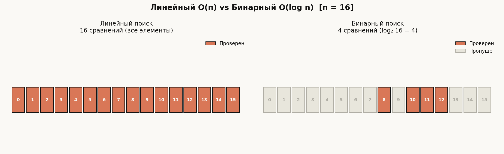
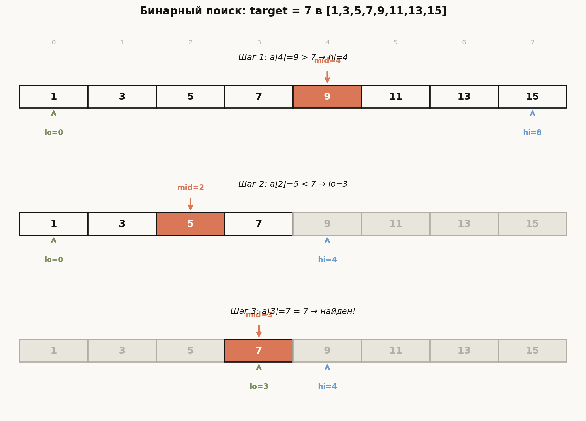
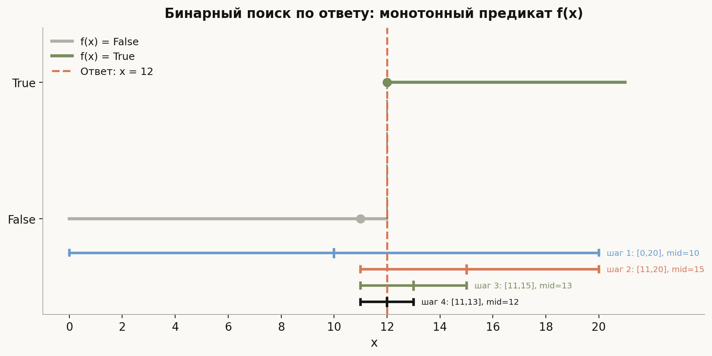
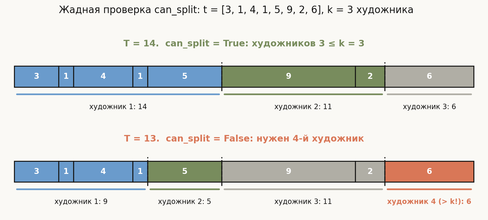

# Лекция 4: Поиск — линейный и бинарный


Поиск — самая фундаментальная операция в программировании: прежде чем что-то сделать с данными, нужно это что-то найти. Казалось бы, задача тривиальная: посмотреть каждый элемент по очереди. Но именно здесь рождается ключевая идея алгоритмики — **использовать структуру данных**. Если массив отсортирован, один вопрос «больше или меньше?» уничтожает сразу половину оставшихся кандидатов. Это превращает O(n) в O(log n) — разницу между секундами и часами на больших данных.

Главная линия лекции:

$$
\text{линейный поиск O}(n) \;\to\; \text{бинарный поиск O}(\log n) \;\to\; \text{бинарный поиск по ответу} \;\to\; \text{нижняя оценка}
$$

**Как читать эту лекцию:** раздел 1 — линейный поиск и его нижняя оценка; раздел 2 — бинарный поиск с инвариантом; раздел 3 — шаблон lower\_bound / upper\_bound из STL; раздел 4 — бинарный поиск по ответу; раздел 5 — теоретическая нижняя оценка для сравнительных алгоритмов.

---

## План

1. Линейный поиск
2. Бинарный поиск: идея и инвариант цикла
3. lower\_bound, upper\_bound и STL
4. Бинарный поиск по ответу
5. Теоретико-информационная нижняя оценка
6. Типичные ошибки
7. Что важно для поступления в ШАД
8. Итог
9. Вопросы для самопроверки

---

## 1. Линейный поиск

> **Определение.** Линейный поиск — последовательный просмотр всех элементов массива до нахождения нужного или до конца массива. Время: O(n), память: O(1).

### Идея

Никаких предположений о данных: массив может быть в любом порядке. Единственное, что можно сделать — проверить каждый элемент. В худшем случае нужный элемент окажется последним (или его не будет вовсе), и мы сделаем n сравнений.

### Реализация на C++

```cpp
// Найти первое вхождение target в a[0..n-1].
// Возвращает индекс или -1, если не найдено.
int linear_search(const int* a, int n, int target) {
    for (int i = 0; i < n; i++) {
        if (a[i] == target)
            return i;
    }
    return -1;
}
```

### Применения

- **Поиск максимума / минимума** — нет возможности остановиться раньше конца.
- **Поиск по условию** — например, первый элемент, делящийся на 7.
- **Неотсортированные данные** — бинарный поиск неприменим.

```cpp
// Поиск максимума
int find_max(const int* a, int n) {
    int best = a[0];
    for (int i = 1; i < n; i++)
        if (a[i] > best) best = a[i];
    return best;
}

// Первый элемент, делящийся на k
int find_divisible(const int* a, int n, int k) {
    for (int i = 0; i < n; i++)
        if (a[i] % k == 0) return i;
    return -1;
}
```

### Нижняя оценка для неотсортированного массива

**Теорема.** Любой алгоритм, использующий только сравнения, требует в худшем случае $\Omega(n)$ сравнений для поиска элемента в неотсортированном массиве размера $n$.

**Доказательство (adversary argument).** Представим противника, который не фиксирует массив заранее, а отвечает на сравнения так, чтобы максимально затруднить работу алгоритма. Если алгоритм не проверил элемент $a[i]$, противник может поставить туда любое значение — в том числе целевое, если его там ещё не нашли, или другое, если нашли. Значит, пока непроверенных позиций больше одной, противник может скрывать там ответ. Алгоритм обязан проверить все $n$ элементов.



Картинка — мотивация всей остальной лекции. Слева линейный поиск на массиве из 16 элементов: проверены (оранжевые) все 16 ячеек — и по только что доказанной нижней оценке иначе нельзя. Справа тот же массив, но отсортированный: бинарному поиску хватает $\log_2 16 = 4$ проверок, остальные 12 элементов (серые) он даже не читает. Разрыв растёт стремительно: при $n = 10^9$ это миллиард проверок против тридцати.

---

## 2. Бинарный поиск: идея и инвариант цикла

> **Предусловие.** Массив $a[0..n-1]$ отсортирован по неубыванию: $a[0] \leq a[1] \leq \ldots \leq a[n-1]$.

> **Идея.** Сравним $a[\mathrm{mid}]$ с target. Если $a[\mathrm{mid}] < \mathrm{target}$, то target не может быть в $[lo, mid]$ — сужаем область до $[mid+1, hi)$. Иначе сужаем до $[lo, mid)$. Каждый шаг уменьшает область вдвое, поэтому шагов не более $\lceil \log_2 n \rceil$.

### Инвариант цикла

Инвариант — утверждение, истинное в начале и в конце каждой итерации цикла. Для бинарного поиска:

$$
\text{Инвариант: если target присутствует в массиве, то } a[\mathrm{lo}] \leq \mathrm{target} < a[\mathrm{hi}] \text{ (т.е. ответ лежит в } [lo, hi))
$$

- **Инициализация:** $lo = 0$, $hi = n$. Если target есть, он лежит в $[0, n)$ — тривиально.
- **Шаг:** $mid = lo + (hi - lo) / 2$. Если $a[mid] < target$, положим $lo = mid + 1$; инвариант сохранён, т.к. $a[mid] < target$ исключает всё до $mid$ включительно. Если $a[mid] \geq target$, положим $hi = mid$; инвариант сохранён.
- **Завершение:** $hi - lo$ строго убывает на каждом шаге (т.к. $lo \leq mid < hi$), поэтому цикл конечен.

### Поиск точного совпадения

```cpp
// Найти индекс target в отсортированном a[0..n-1].
// Возвращает -1, если не найдено.
int binary_search(const int* a, int n, int target) {
    int lo = 0, hi = n;   // Инвариант: ответ в [lo, hi)
    while (lo < hi) {
        int mid = lo + (hi - lo) / 2;  // защита от переполнения
        if (a[mid] == target) return mid;
        if (a[mid] < target)  lo = mid + 1;
        else                  hi = mid;
    }
    return -1;
}
```

### Трассировка: найти 7 в [1, 3, 5, 7, 9, 11, 13, 15]

| Шаг | lo | hi | mid | a[mid] | Действие |
|-----|----|----|-----|--------|----------|
| 1   | 0  | 8  | 4   | 9      | 9 > 7 → hi = 4 |
| 2   | 0  | 4  | 2   | 5      | 5 < 7 → lo = 3 |
| 3   | 3  | 4  | 3   | 7      | 7 == 7 → return 3 |

За три шага вместо возможных восьми.



Три ряда рисунка — те же три шага таблицы. Серые ячейки — уже исключённая часть массива, белые — текущий отрезок поиска $[lo, hi)$, оранжевая — элемент $a[mid]$, с которым идёт сравнение. Зелёная стрелка `lo` и синяя `hi` показывают, как границы стягиваются: после первого сравнения отброшена правая половина, после второго — левая четверть, на третьем шаге отрезок сжался до одного элемента, и он оказался искомым. Так выглядит инвариант в действии: target всегда внутри белой зоны.

### Почему mid = lo + (hi - lo) / 2, а не (lo + hi) / 2

Если lo и hi оба близки к `INT_MAX` (например, при поиске по ответу на большом диапазоне), сумма `lo + hi` вызовет **переполнение** знакового int. Формула `lo + (hi - lo) / 2` даёт тот же результат без переполнения, т.к. `hi - lo` не превышает диапазона.

---

## 3. lower\_bound, upper\_bound и STL

На практике редко ищут точное совпадение — чаще нужна позиция для вставки или граница диапазона равных элементов.

> **lower\_bound(a, a+n, x)** — наименьший индекс $i$ такой, что $a[i] \geq x$ (первый элемент, не меньший x).

> **upper\_bound(a, a+n, x)** — наименьший индекс $i$ такой, что $a[i] > x$ (первый элемент, больший x).

### Реализация lower\_bound

```cpp
// Первый индекс i в [0, n] такой, что a[i] >= target.
// Если все элементы < target, возвращает n.
int lower_bound_impl(const int* a, int n, int target) {
    int lo = 0, hi = n;
    // Инвариант: a[lo-1] < target <= a[hi] (с граничными соглашениями)
    while (lo < hi) {
        int mid = lo + (hi - lo) / 2;
        if (a[mid] < target) lo = mid + 1;
        else                 hi = mid;
    }
    return lo;
}
```

### Реализация upper\_bound

```cpp
// Первый индекс i в [0, n] такой, что a[i] > target.
int upper_bound_impl(const int* a, int n, int target) {
    int lo = 0, hi = n;
    while (lo < hi) {
        int mid = lo + (hi - lo) / 2;
        if (a[mid] <= target) lo = mid + 1;
        else                  hi = mid;
    }
    return lo;
}
```

### Пример: найти первый элемент ≥ 6 в [1, 3, 5, 7, 9]

| Шаг | lo | hi | mid | a[mid] | Действие |
|-----|----|----|-----|--------|----------|
| 1   | 0  | 5  | 2   | 5      | 5 < 6 → lo = 3 |
| 2   | 3  | 5  | 4   | 9      | 9 ≥ 6 → hi = 4 |
| 3   | 3  | 4  | 3   | 7      | 7 ≥ 6 → hi = 3 |
| 4   | lo=hi=3, выход | | | | return 3 |

`a[3] = 7` — первый элемент ≥ 6. Корректно.

### Почему на выходе lo — именно ответ

**Ключевое наблюдение.** Инвариант `lower_bound` удобно читать как утверждение о **двух зонах**, растущих навстречу друг другу: всё строго левее `lo` меньше target ($\forall i < lo:\ a[i] < \text{target}$), всё начиная с `hi` — не меньше ($\forall i \geq hi:\ a[i] \geq \text{target}$); между зонами лежит «неизвестность» $[lo, hi)$.

- **База:** $lo = 0$, $hi = n$ — обе зоны пусты, оба утверждения выполнены тривиально.
- **Переход** использует сортированность в обе стороны. Если $a[mid] < \text{target}$, то все элементы левее $mid$ не превосходят $a[mid]$ и потому тоже меньше target — левую зону можно расширить до $mid + 1$. Если $a[mid] \geq \text{target}$, то все элементы правее $mid$ не меньше $a[mid]$ и потому не меньше target — правая зона расширяется до $mid$. Элемент, попавший в зону, остаётся в ней навсегда: границы движутся только навстречу.
- **Завершение:** $mid$ всегда лежит строго внутри $[lo, hi)$, поэтому оба обновления строго сужают неизвестность; через $\leq \lceil \log_2 n \rceil$ шагов $lo = hi$.

В момент выхода зоны смыкаются: $a[lo - 1] < \text{target} \leq a[lo]$ — значит, `lo` и есть первый индекс с $a[i] \geq \text{target}$. Краевые случаи покрываются сами: $lo = n$ означает «левая зона — весь массив, таких элементов нет», $lo = 0$ — «все элементы подходят». На трассировке выше цикл вышел с $lo = hi = 3$: слева $\{1, 3, 5\} < 6$, справа $\{7, 9\} \geq 6$ — зоны сомкнулись ровно на ответе. Заметьте: алгоритм ни разу не сравнивал на равенство, поэтому `lower_bound` корректен и тогда, когда target в массиве отсутствует.

### Использование STL

```cpp
#include <algorithm>
#include <vector>

std::vector<int> v = {1, 3, 5, 7, 7, 9};

// lower_bound: первый >= 7
auto it1 = std::lower_bound(v.begin(), v.end(), 7);
// it1 указывает на первую 7, т.е. v[3]

// upper_bound: первый > 7
auto it2 = std::upper_bound(v.begin(), v.end(), 7);
// it2 указывает на 9, т.е. v[5]

// Количество вхождений 7:
int count = it2 - it1;  // = 2

// Проверка наличия элемента:
bool found = (it1 != v.end() && *it1 == 7);  // true
```

**Важно:** STL-функции работают за O(log n) только для итераторов произвольного доступа (vector, array). Для list они работают за O(n).

---

## 4. Бинарный поиск по ответу

Бинарный поиск применяется не только к данным, но и к **ответу**. Если нам нужно найти минимальное значение $k$, при котором выполняется некоторое условие $f(k)$, и $f$ монотонна (сначала все False, потом все True), то можно бинарно искать первый True.

$$
\underbrace{f(0) = \text{False}, \ldots, f(k-1) = \text{False}}_{\text{нет}}, \underbrace{f(k) = \text{True}, f(k+1) = \text{True}, \ldots}_{\text{есть}}
$$



График показывает монотонный предикат $f(x)$: серая ступень — зона False ($x < 12$), зелёная — зона True ($x \geq 12$), оранжевый пунктир — искомая граница $x = 12$. Под осью — четыре шага бинарного поиска: цветные скобки — отрезок $[lo, hi]$ на каждом шаге, вертикальная засечка — точка $mid$, в которой вычисляется предикат. Если $f(mid) = \text{False}$, отбрасывается левая часть (шаг 1), если True — правая (шаги 2–4); скобки стягиваются к границе, и в ней поиск останавливается. Сортированный массив — частный случай этой картинки с предикатом $f(i) = (a[i] \geq \text{target})$.

### Шаблон

```cpp
// Найти минимальный x в [lo, hi) такой, что f(x) = true.
// Предусловие: f монотонна: false...false...true...true.
// Постусловие: возвращает первый x с f(x) = true.
int binary_search_answer(int lo, int hi) {
    // Инвариант: f(lo-1)=false, f(hi)=true (с граничными соглашениями)
    while (lo < hi) {
        int mid = lo + (hi - lo) / 2;
        if (f(mid)) hi = mid;      // mid подходит, ищем левее
        else        lo = mid + 1;  // mid не подходит, ищем правее
    }
    return lo;  // lo == hi — первый True
}
```

### Пример 1: целочисленный квадратный корень

Найти минимальное $x \geq 0$ такое, что $x^2 \geq N$, т.е. $\lceil\sqrt{N}\rceil$.

```cpp
#include <iostream>

// f(x): x*x >= N
// Монотонна: false для малых x, true для больших.
long long isqrt_ceil(long long N) {
    if (N <= 0) return 0;
    long long lo = 0, hi = N;  // x^2 >= N невозможно при x > N (для N>=1)
    // Улучшим границу: sqrt(N) <= N/2 + 1 для N > 1
    hi = std::min(N, (long long)2e9);  // для N <= 4e18
    while (lo < hi) {
        long long mid = lo + (hi - lo) / 2;
        if (mid * mid >= N) hi = mid;
        else                lo = mid + 1;
    }
    return lo;
}

int main() {
    std::cout << isqrt_ceil(25) << "\n";  // 5
    std::cout << isqrt_ceil(26) << "\n";  // 6
    std::cout << isqrt_ceil(1)  << "\n";  // 1
}
```

### Пример 2: задача о художниках

**Условие.** Есть $n$ картин, $i$-я картина занимает $t[i]$ времени. Нужно распределить картины между $k$ художниками (каждый берёт непрерывный отрезок) так, чтобы минимизировать максимальное время работы художника.

**Бинарный поиск по ответу:** ищем минимальное время $T$ такое, что можно разделить картины между $k$ художниками, если каждый тратит не более $T$ времени.

```cpp
#include <iostream>
#include <vector>
#include <numeric>
#include <algorithm>

// f(T): можно ли уложиться, если максимум = T?
bool can_split(const std::vector<long long>& t, int k, long long T) {
    int painters = 1;
    long long current = 0;
    for (long long ti : t) {
        if (ti > T) return false;  // одна картина не помещается
        if (current + ti > T) {
            painters++;
            current = ti;
            if (painters > k) return false;
        } else {
            current += ti;
        }
    }
    return true;
}

long long min_time(const std::vector<long long>& t, int k) {
    long long lo = *std::max_element(t.begin(), t.end());
    long long hi = std::accumulate(t.begin(), t.end(), 0LL);
    // Инвариант: can_split(lo-1) = false, can_split(hi) = true
    while (lo < hi) {
        long long mid = lo + (hi - lo) / 2;
        if (can_split(t, k, mid)) hi = mid;
        else                      lo = mid + 1;
    }
    return lo;
}

int main() {
    std::vector<long long> t = {3, 1, 4, 1, 5, 9, 2, 6};
    std::cout << min_time(t, 3) << "\n";  // 14
}
```

**Трассировка для t=[3,1,4,1,5,9,2,6], k=3:**

Сумма = 31, max = 9. Ищем в [9, 31].

| lo  | hi  | mid | can(mid,3) | Действие |
|-----|-----|-----|------------|----------|
| 9   | 31  | 20  | True       | hi = 20  |
| 9   | 20  | 14  | True       | hi = 14  |
| 9   | 14  | 11  | False      | lo = 12  |
| 12  | 14  | 13  | False      | lo = 14  |
| 14  | 14  | —   | —          | return 14|

Ответ: **14**. Проверим границу с обеих сторон.

- `can_split(14)` = True: жадная раскладка даёт отрезки $[3,1,4,1,5] = 14$, $[9,2] = 11$, $[6] = 6$ — три художника, каждый в пределах 14.
- `can_split(13)` = False: жадно набираем $[3,1,4,1] = 9$ (добавить 5 нельзя: 14 > 13), затем $[5] = 5$ (добавить 9 нельзя), затем $[9,2] = 11$ (добавить 6 нельзя: 17 > 13) — а картина 6 требует уже четвёртого художника.

**Почему жадная проверка корректна.** Ключевое наблюдение: жадный художник, набирающий картины «пока влезает», после каждого номера художника закрывает максимально возможный префикс — и это преимущество не теряется. Оформим индукцией по числу художников. **Инвариант:** для любого допустимого разбиения (все отрезки с суммой $\leq T$) первые $j$ жадных художников покрывают не меньше картин, чем первые $j$ художников этого разбиения. База $j = 0$ тривиальна. Переход: отрезок $(j{+}1)$-го художника допустимого разбиения заканчивается на некоторой картине $e$; жадный $(j{+}1)$-й начинает не левее его начала (по инварианту для $j$), поэтому кусок «от старта жадного до $e$» — часть допустимого отрезка и тоже имеет сумму $\leq T$; а жадный останавливается, только когда следующая картина уже не влезает, — значит, он дойдёт как минимум до $e$. Инвариант сохранён. Следствие: если существует хоть какое-то допустимое разбиение на $k$ отрезков, то $k$ жадных художников покрывают все картины, и `can_split` вернёт `true`. Обратное очевидно: если жадный уложился, допустимое разбиение предъявлено им самим. Значит, `can_split(T)` истинно **тогда и только тогда**, когда разбиение существует, — жадная проверка не «эвристика», а точный предикат.



На диаграмме — обе жадные раскладки массива $t = [3,1,4,1,5,9,2,6]$ (ширина клетки пропорциональна времени картины). При $T = 14$ (сверху) жадный набирает $[3,1,4,1,5] = 14$, $[9,2] = 11$, $[6] = 6$ — три художника, предикат истинен. При $T = 13$ (снизу) каждый отрезок обрывается чуть раньше — $[3,1,4,1] = 9$, $[5] = 5$, $[9,2] = 11$ — и картина 6 достаётся уже четвёртому художнику: предикат ложен. Граница между False и True проходит между 13 и 14, и именно её находит бинарный поиск.

**Ключевой принцип:** функция `can_split` монотонна по T: если можно за T, то можно за T+1 — то же самое разбиение остаётся допустимым. Это гарантирует корректность бинарного поиска.

---

## 5. Теоретико-информационная нижняя оценка

**Вопрос:** можно ли найти элемент в отсортированном массиве быстрее, чем за O(log n)?

> **Теорема.** Любой алгоритм на основе сравнений, выполняющий поиск в отсортированном массиве размера $n$, требует в худшем случае $\Omega(\log n)$ сравнений.

**Доказательство через дерево решений.**

Любой детерминированный сравнительный алгоритм можно представить бинарным **деревом решений**: в каждом внутреннем узле — одно сравнение, два исхода (да/нет), в каждом листе — ответ. При поиске одного из $n$ элементов (или вывода «нет»), возможных ответов не менее $n + 1$. Значит, листьев не менее $n + 1$.

Бинарное дерево высоты $h$ имеет не более $2^h$ листьев. Следовательно:

$$
2^h \geq n + 1 \implies h \geq \log_2(n+1) = \Omega(\log n)
$$

Поскольку высота — это количество сравнений в наихудшем случае, получаем нижнюю оценку $\Omega(\log n)$.

Бинарный поиск делает $\lceil \log_2(n+1) \rceil$ сравнений в худшем случае — **оптимально по этой нижней оценке**.

**Аналогия с сортировкой.** Для сортировки $n$ элементов листьев нужно $n!$ (все перестановки), откуда $h \geq \log_2(n!) \geq (n/2)\log_2(n/2) = \Omega(n \log n)$ — нижняя оценка сортировки сравнениями.

---

## 6. Типичные ошибки

**Ошибка 1: Переполнение при вычислении mid.**

```cpp
// Плохо — возможно переполнение int если lo и hi велики
int mid = (lo + hi) / 2;

// Хорошо — эквивалентно, без переполнения
int mid = lo + (hi - lo) / 2;
```

**Ошибка 2: Бесконечный цикл из-за неправильного обновления границ.**

```cpp
// Плохо: если a[mid] < target, lo = mid (не продвигается при lo = mid)
while (lo < hi) {
    int mid = lo + (hi - lo) / 2;
    if (a[mid] < target) lo = mid;  // ошибка: lo не растёт когда hi = lo+1
    else hi = mid;
}

// Хорошо: lo всегда увеличивается
if (a[mid] < target) lo = mid + 1;
```

**Ошибка 3: Поиск в неотсортированном массиве.**

Бинарный поиск корректен только при отсортированном массиве. Применение к неотсортированным данным даёт неправильный ответ без каких-либо сообщений об ошибке — коварная ошибка.

```cpp
// Пример неправильного использования:
int a[] = {5, 1, 3, 7, 2};
// binary_search(a, 5, 3) вернёт неверный результат!
// Надо: std::sort(a, a+5) перед поиском — или линейный поиск.
```

**Ошибка 4: Неправильный инвариант в lower\_bound.**

```cpp
// Плохо: условие a[mid] <= target вместо a[mid] < target
// Это даёт upper_bound, а не lower_bound!
while (lo < hi) {
    int mid = lo + (hi - lo) / 2;
    if (a[mid] <= target) lo = mid + 1;  // это upper_bound!
    else hi = mid;
}
```

**Ошибка 5: Неправильные начальные границы при поиске по ответу.**

```cpp
// Плохо: lo = 0, hi = N, если f(0) может быть True (нет гарантии False)
// Или hi слишком мал — ответ за границей диапазона.

// Хорошо: убедиться, что:
// f(lo - 1) = false (или lo — минимально возможный ответ)
// f(hi) = true  (или hi — заведомо подходящее значение)
```

**Ошибка 6: Путаница между `<` и `<=` в условии цикла.**

Шаблон с `lo < hi` и `hi = mid` / `lo = mid + 1` дают «half-open» интервал [lo, hi). Если перепутать с `lo <= hi` и `hi = mid - 1`, нужна другая логика — смешивать нельзя.

---

## 7. Что важно для поступления в ШАД

- Знать и реализовывать линейный и бинарный поиск с нуля без STL.
- Уметь формулировать и поддерживать инвариант цикла бинарного поиска.
- Различать lower\_bound и upper\_bound: формулы, отличия в условии (`<` vs `<=`).
- Защита от переполнения: формула `lo + (hi - lo) / 2`.
- Доказывать завершимость бинарного поиска: `hi - lo` строго убывает.
- Применять бинарный поиск по ответу: распознавать монотонную функцию и формулировать предикат.
- Знать нижнюю оценку $\Omega(\log n)$ для поиска в отсортированном массиве и её доказательство через дерево решений.
- Оценивать сложность: линейный — O(n), бинарный — O(log n) времени, оба O(1) памяти.
- Использовать `std::lower_bound` / `std::upper_bound` и понимать, что они требуют.

---

## 8. Итог

Линейный поиск универсален, но медленен: O(n) — и это нижняя оценка для неотсортированных данных, которую нельзя улучшить. Бинарный поиск использует монотонность (отсортированность) и за O(log n) сравнений находит ответ — что оптимально по нижней оценке из дерева решений. Ключ к корректности бинарного поиска — строгое поддержание инварианта цикла и правило `lo = mid + 1` / `hi = mid`, не допускающее бесконечного цикла. Идея «делить область вдвое» обобщается до бинарного поиска по ответу: если искомое значение лежит в числовом диапазоне и функция «подходит ли значение $k$?» монотонна, стандартный шаблон находит оптимальный ответ за O(log(R-L)) итераций.

---

## 9. Вопросы для самопроверки

1. Почему линейный поиск требует $\Omega(n)$ сравнений на неотсортированном массиве? Опишите adversary argument.
2. Какое предусловие необходимо для корректности бинарного поиска?
3. Сформулируйте инвариант цикла бинарного поиска. Как он поддерживается при обновлении `lo` и `hi`?
4. Почему формула `mid = lo + (hi - lo) / 2` безопаснее, чем `mid = (lo + hi) / 2`?
5. В чём разница между `lower_bound` и `upper_bound`? Напишите условие внутри цикла для каждого.
6. Как с помощью `lower_bound` и `upper_bound` найти количество вхождений элемента в отсортированном массиве?
7. Какое условие на функцию $f$ необходимо для применения бинарного поиска по ответу?
8. Опишите шаблон бинарного поиска по ответу. Какой инвариант нужно поддерживать?
9. Докажите, что в задаче о художниках функция `can_split(T)` монотонна по T.
10. Почему любой сравнительный алгоритм поиска в отсортированном массиве требует $\Omega(\log n)$ сравнений? Обоснуйте через дерево решений.
11. Что произойдёт, если применить бинарный поиск к неотсортированному массиву?
12. Каковы временная и пространственная сложности бинарного поиска? Является ли он оптимальным?
