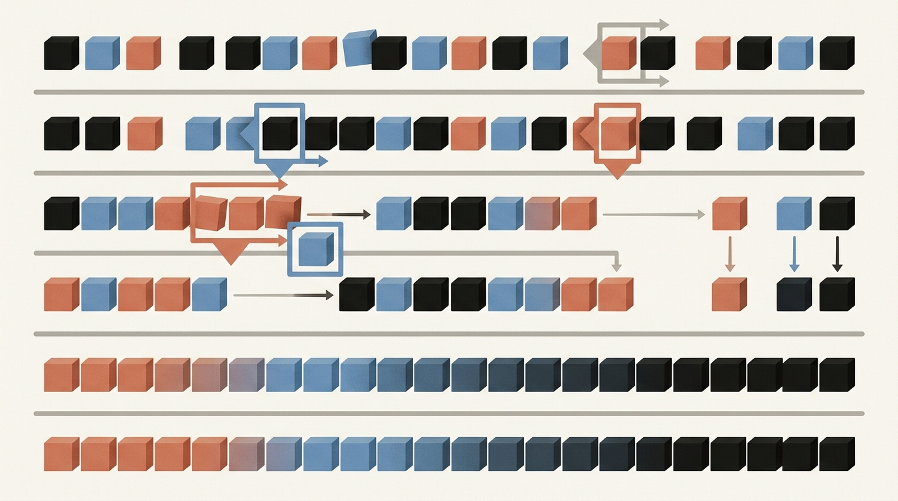

# Лекция 5: Сортировки



Сортировка — одна из фундаментальных задач информатики. Каждый раз, когда поисковик выдаёт результаты по релевантности, база данных строит индекс или компилятор упорядочивает символы, в основе лежит эффективная сортировка. Эта лекция отвечает на два вопроса: насколько быстро сортировка может работать в принципе — и как устроены алгоритмы, которые подходят к этому пределу.

Главная линия лекции:

$$
\text{нижняя граница } \Omega(n \log n) \;\to\; \text{квадратичные алгоритмы (вставки, пузырёк)} \;\to\; \text{оптимальные алгоритмы (слияние, быстрая)}
$$

**Как читать эту лекцию:**
- Начните с раздела 1 — он объясняет, почему невозможно сделать лучше $O(n \log n)$ для сравнительных сортировок.
- Разделы 2–3 — «медленные» сортировки; важны для понимания инвариантов и для малых массивов.
- Разделы 4–5 — основные рабочие лошадки; разберите пошаговые трассировки.
- Раздел 6 — сводная таблица для быстрого сравнения перед экзаменом.

---

## План

1. Нижняя теоретико-информационная оценка
2. Сортировка пузырьком
3. Сортировка вставками
4. Сортировка слиянием
5. Быстрая сортировка
6. Сравнительная таблица алгоритмов
7. Типичные ошибки
8. Что важно для поступления в ШАД
9. Итог
10. Вопросы для самопроверки

---

## 1. Нижняя теоретико-информационная оценка

### Постановка задачи

Рассмотрим *сравнительные сортировки* — алгоритмы, которые получают информацию о порядке элементов исключительно через сравнения вида $a_i < a_j$. Сюда входят пузырёк, вставки, слияние, быстрая сортировка.

Вопрос: можно ли отсортировать $n$ элементов менее чем за $\Theta(n \log n)$ сравнений в худшем случае?

### Дерево решений

Любой детерминированный сравнительный алгоритм можно изобразить в виде **дерева решений**:
- Каждый внутренний узел — одно сравнение $a_i \le a_j$ (два ребра: «да» и «нет»).
- Каждый лист — один из возможных результирующих порядков.

Для $n$ элементов существует ровно $n!$ различных перестановок, поэтому дерево должно содержать **не менее $n!$ листьев**.

### Оценка высоты дерева

Бинарное дерево высоты $h$ имеет не более $2^h$ листьев. Следовательно:

$$
2^h \ge n! \implies h \ge \log_2(n!)
$$

По формуле Стирлинга:

$$
\log_2(n!) = \sum_{k=1}^{n} \log_2 k \ge \int_1^n \log_2 x \,dx = \frac{n \log_2 n - n}{\ln 2} = \Theta(n \log n)
$$

Более точно: $\log_2(n!) \ge \frac{n}{2} \log_2 \frac{n}{2} = \Omega(n \log n)$.

### Вывод

$$
\boxed{\text{Любой сравнительный алгоритм сортировки требует } \Omega(n \log n) \text{ сравнений в худшем случае.}}
$$

Это означает, что сортировки слиянием и (в среднем) быстрая сортировка **асимптотически оптимальны**.

> **Замечание.** Если элементы имеют специальную структуру (например, целые числа в ограниченном диапазоне), можно обойтись без сравнений и выйти за этот предел — например, *сортировка подсчётом* работает за $O(n + k)$.

---

## 2. Сортировка пузырьком

### Идея

На каждом проходе соседние элементы сравниваются и меняются местами, если они стоят не по порядку. Максимальный элемент «всплывает» на правильную позицию за один проход. После $k$ проходов последние $k$ элементов стоят на своих местах.

### Оптимизация с флагом

Если за весь проход не произошло ни одного обмена, массив уже отсортирован и можно остановиться раньше.

```cpp
#include <vector>
#include <algorithm>

void bubbleSort(std::vector<int>& a) {
    int n = static_cast<int>(a.size());
    for (int i = 0; i < n - 1; ++i) {
        bool swapped = false;
        for (int j = 0; j < n - 1 - i; ++j) {
            if (a[j] > a[j + 1]) {
                std::swap(a[j], a[j + 1]);
                swapped = true;
            }
        }
        if (!swapped) break; // массив уже упорядочен
    }
}
```

### Сложность

| Случай | Время | Комментарий |
|---|---|---|
| Лучший | $O(n)$ | Массив уже отсортирован, один проход с флагом |
| Средний | $O(n^2)$ | В среднем $\approx n^2/4$ обменов |
| Худший | $O(n^2)$ | Массив отсортирован в обратном порядке |

**Память:** $O(1)$ (in-place).  
**Устойчивость:** устойчивая (stable) — равные элементы не меняются местами.

---

## 3. Сортировка вставками

### Идея

Массив делится на отсортированный префикс и неотсортированный суффикс. На каждом шаге берём очередной элемент из суффикса и вставляем его на правильное место в префикс, сдвигая элементы вправо.

### Пример: трассировка на [5, 3, 8, 1, 4]

```
Шаг 0: [5 | 3 8 1 4]   ключ = 3
         сдвигаем 5 вправо: [_ 5 8 1 4]
         ставим 3 на место:  [3 5 | 8 1 4]

Шаг 1: [3 5 | 8 1 4]   ключ = 8
         8 > 5, сдвига нет:  [3 5 8 | 1 4]

Шаг 2: [3 5 8 | 1 4]   ключ = 1
         сдвигаем 8, 5, 3:   [_ 3 5 8 4]
         ставим 1 на место:  [1 3 5 8 | 4]

Шаг 3: [1 3 5 8 | 4]   ключ = 4
         сдвигаем 8, 5:      [1 3 _ 5 8]
         ставим 4 на место:  [1 3 4 5 8]
```

### Реализация

```cpp
#include <vector>

void insertionSort(std::vector<int>& a) {
    int n = static_cast<int>(a.size());
    for (int i = 1; i < n; ++i) {
        int key = a[i];
        int j = i - 1;
        while (j >= 0 && a[j] > key) {
            a[j + 1] = a[j];
            --j;
        }
        a[j + 1] = key;
    }
}
```

### Сложность

| Случай | Время | Комментарий |
|---|---|---|
| Лучший | $O(n)$ | Массив уже отсортирован, нет сдвигов |
| Средний | $O(n^2)$ | В среднем $\approx n^2/4$ сдвигов |
| Худший | $O(n^2)$ | Обратный порядок, максимум сдвигов |

**Память:** $O(1)$ (in-place).  
**Устойчивость:** устойчивая.

**Практическое достоинство:** отлично работает на маленьких ($n \le 16$) и почти отсортированных массивах. Поэтому `std::sort` переключается на вставки при рекурсии к малым подзадачам.

---

## 4. Сортировка слиянием

### Идея: разделяй и властвуй

1. **Разделить** массив пополам.
2. **Рекурсивно** отсортировать каждую половину.
3. **Слить** две отсортированные половины в одну.

### Рекуррентность и её решение

Пусть $T(n)$ — число операций для массива размера $n$:

$$
T(n) = 2T\!\left(\frac{n}{2}\right) + O(n), \quad T(1) = O(1)
$$

По основной теореме (Master Theorem), $a=2$, $b=2$, $f(n)=\Theta(n)$, $n^{\log_b a} = n^1$:

$$
T(n) = \Theta(n \log n)
$$

### Пример: трассировка на [5, 3, 8, 1, 4, 2]

```
Разделение (сверху вниз):
[5 3 8 1 4 2]
[5 3 8]       [1 4 2]
[5 3] [8]     [1 4] [2]
[5] [3]       [1] [4]

Слияние (снизу вверх):
[5] + [3] -> [3 5]
[3 5] + [8] -> [3 5 8]
[1] + [4] -> [1 4]
[1 4] + [2] -> [1 2 4]
[3 5 8] + [1 2 4] -> [1 2 3 4 5 8]
```

### Реализация

```cpp
#include <vector>

// Слияние двух отсортированных половин a[l..mid] и a[mid+1..r]
void merge(std::vector<int>& a, int l, int mid, int r) {
    std::vector<int> tmp(r - l + 1);
    int i = l, j = mid + 1, k = 0;
    while (i <= mid && j <= r) {
        if (a[i] <= a[j]) {
            tmp[k++] = a[i++];
        } else {
            tmp[k++] = a[j++];
        }
    }
    while (i <= mid) tmp[k++] = a[i++];
    while (j <= r)   tmp[k++] = a[j++];
    for (int idx = 0; idx < k; ++idx) {
        a[l + idx] = tmp[idx];
    }
}

void mergeSort(std::vector<int>& a, int l, int r) {
    if (l >= r) return;
    int mid = l + (r - l) / 2;
    mergeSort(a, l, mid);
    mergeSort(a, mid + 1, r);
    merge(a, l, mid, r);
}

// Точка входа
void mergeSort(std::vector<int>& a) {
    if (!a.empty()) mergeSort(a, 0, static_cast<int>(a.size()) - 1);
}
```

### Применение: подсчёт инверсий

**Инверсия** — пара $(i, j)$ с $i < j$ и $a[i] > a[j]$. Количество инверсий характеризует «степень беспорядка» массива.

При слиянии: если элемент из правой половины встаёт раньше элемента из левой, он «перепрыгивает» через все оставшиеся элементы левой половины. Добавляем счётчик:

```cpp
long long inversions = 0;

void mergeCount(std::vector<int>& a, int l, int mid, int r) {
    std::vector<int> tmp(r - l + 1);
    int i = l, j = mid + 1, k = 0;
    while (i <= mid && j <= r) {
        if (a[i] <= a[j]) {
            tmp[k++] = a[i++];
        } else {
            inversions += (mid - i + 1); // все элементы a[i..mid] > a[j]
            tmp[k++] = a[j++];
        }
    }
    while (i <= mid) tmp[k++] = a[i++];
    while (j <= r)   tmp[k++] = a[j++];
    for (int idx = 0; idx < k; ++idx) a[l + idx] = tmp[idx];
}
```

### Сложность

| Случай | Время | Память |
|---|---|---|
| Лучший | $O(n \log n)$ | $O(n)$ |
| Средний | $O(n \log n)$ | $O(n)$ |
| Худший | $O(n \log n)$ | $O(n)$ |

**Устойчивость:** устойчивая (условие `a[i] <= a[j]` гарантирует порядок равных).

---

## 5. Быстрая сортировка

### Идея

Выбрать **опорный элемент** (pivot). Переставить массив так, чтобы все элементы меньше опорного оказались слева, равные — в середине, большие — справа. Рекурсивно применить к левой и правой частям.

### Разбиение по Ломуто

Пусть pivot = последний элемент. Поддерживаем указатель $i$ — граница «меньших».

```
Массив: [3, 6, 8, 10, 1, 2, 1], pivot = 1 (последний)
i = -1

j=0: a[0]=3 > 1, не меняем. i=-1
j=1: a[1]=6 > 1, не меняем. i=-1
j=2: a[2]=8 > 1, не меняем. i=-1
j=3: a[3]=10 > 1, не меняем. i=-1
j=4: a[4]=1 <= 1, i=0, swap(a[0],a[4]): [1, 6, 8, 10, 3, 2, 1]
j=5: a[5]=2 > 1, не меняем. i=0

Конец: swap(a[i+1], pivot): swap(a[1], a[6]): [1, 1, 8, 10, 3, 2, 6]
pivot на позиции 1. Левый подмассив [1], правый [8, 10, 3, 2, 6].
```

### Реализация с рандомизацией

```cpp
#include <vector>
#include <algorithm>
#include <cstdlib>

// Разбиение Ломуто, возвращает индекс pivot после разбиения
int partition(std::vector<int>& a, int lo, int hi) {
    // Рандомизация: выбираем случайный pivot и ставим в конец
    int randIdx = lo + std::rand() % (hi - lo + 1);
    std::swap(a[randIdx], a[hi]);

    int pivot = a[hi];
    int i = lo - 1;
    for (int j = lo; j < hi; ++j) {
        if (a[j] <= pivot) {
            ++i;
            std::swap(a[i], a[j]);
        }
    }
    std::swap(a[i + 1], a[hi]);
    return i + 1;
}

void quickSort(std::vector<int>& a, int lo, int hi) {
    if (lo >= hi) return;
    int p = partition(a, lo, hi);
    quickSort(a, lo, p - 1);
    quickSort(a, p + 1, hi);
}

void quickSort(std::vector<int>& a) {
    if (!a.empty()) quickSort(a, 0, static_cast<int>(a.size()) - 1);
}
```

### Анализ сложности

**Средний случай:** при случайном выборе pivot ожидаемая глубина рекурсии $O(\log n)$, каждый уровень обрабатывает $O(n)$ элементов:

$$
T(n) = O(n \log n) \text{ в среднем}
$$

**Худший случай:** если pivot всегда оказывается минимальным или максимальным (например, массив уже отсортирован и pivot = последний), рекуррентность $T(n) = T(n-1) + O(n)$, итого $O(n^2)$.

Рандомизация делает худший случай маловероятным: вероятность $O(n^2)$ для любого фиксированного входа экспоненциально мала.

### std::sort — интросортировка

`std::sort` в libstdc++ реализована как **introsort**:
- Начинает как быстрая сортировка.
- При превышении глубины рекурсии $2 \log n$ переключается на **сортировку кучей** (heapsort) — гарантия $O(n \log n)$ в худшем случае.
- При подзадаче размера $\le 16$ переключается на **вставки**.

### Сложность

| Случай | Время | Комментарий |
|---|---|---|
| Лучший | $O(n \log n)$ | Pivot всегда делит пополам |
| Средний | $O(n \log n)$ | Ожидаемое время при рандомизации |
| Худший | $O(n^2)$ | Плохой выбор pivot без рандомизации |

**Память:** $O(\log n)$ стека вызовов (in-place по данным).  
**Устойчивость:** неустойчивая.

---

## 6. Сравнительная таблица алгоритмов

| Алгоритм | Лучшее | Среднее | Худшее | Память | Стабильна |
|---|---|---|---|---|---|
| Пузырёк | $O(n)$ | $O(n^2)$ | $O(n^2)$ | $O(1)$ | Да |
| Вставки | $O(n)$ | $O(n^2)$ | $O(n^2)$ | $O(1)$ | Да |
| Слияние | $O(n \log n)$ | $O(n \log n)$ | $O(n \log n)$ | $O(n)$ | Да |
| Быстрая | $O(n \log n)$ | $O(n \log n)$ | $O(n^2)$ | $O(\log n)$ | Нет |

**Когда что использовать:**
- **Вставки** — $n \le 20$ или данные почти отсортированы.
- **Слияние** — нужна гарантия $O(n \log n)$ и устойчивость (например, сортировка связного списка).
- **Быстрая** — общий случай; на практике быстрее слияния из-за кэш-дружественности.
- **std::sort** — всегда для массивов на практике.

---

## 7. Типичные ошибки

1. **Неправильный индекс mid при слиянии.** Запись `mid = (l + r) / 2` вызывает переполнение при больших `l` и `r`. Правильно: `mid = l + (r - l) / 2`.

2. **Потеря устойчивости в merge.** Если в функции `merge` написать `a[i] < a[j]` вместо `a[i] <= a[j]`, равные элементы из правой половины будут вставляться раньше элементов из левой, и сортировка перестанет быть устойчивой.

3. **Всегда выбирать последний элемент как pivot.** На отсортированных или почти отсортированных данных (что часто встречается на практике) это гарантирует $O(n^2)$. Используйте рандомизацию или медиану трёх.

4. **Рекурсия без базового случая.** Забыть условие `if (lo >= hi) return` в quickSort или `if (l >= r) return` в mergeSort вызовет бесконечную рекурсию и stack overflow.

5. **Ошибка «off by one» в пузырьке.** Внутренний цикл должен идти до `n - 1 - i`, а не до `n - 1`, иначе выходим за границы массива при сравнении `a[j]` с `a[j+1]`.

6. **Утечка памяти при слиянии.** Выделять вспомогательный массив в каждом рекурсивном вызове неэффективно. Для критичного по скорости кода лучше аллоцировать буфер один раз и передавать его как параметр.

---

## 8. Что важно для поступления в ШАД

- **Нижняя оценка:** уметь объяснить аргумент через дерево решений и формулу Стирлинга. Понимать, что она применима только к сравнительным сортировкам.
- **Реализация без ошибок:** написать с нуля `mergeSort` с корректной функцией `merge` и `quickSort` с разбиением Ломуто — типичная задача на собеседовании.
- **Анализ рекуррентностей:** знать Master Theorem и уметь применять к $T(n) = 2T(n/2) + O(n)$.
- **Инверсии через merge sort:** понимать, как подсчитать число инверсий за $O(n \log n)$.
- **Худший случай quicksort:** привести конкретный пример входных данных (отсортированный массив + pivot = последний), объяснить, как рандомизация помогает.
- **Устойчивость:** знать, какие сортировки устойчивы и почему это важно (например, при лексикографической сортировке по нескольким ключам).
- **std::sort:** знать, что это introsort, и объяснять его поведение.

---

## 9. Итог

Сортировка — ключевой строительный блок в программировании. Теоретико-информационная нижняя оценка $\Omega(n \log n)$ устанавливает фундаментальный предел для любого алгоритма, основанного на сравнениях. Квадратичные алгоритмы (вставки, пузырёк) просты и полезны для малых данных; они демонстрируют важные техники: инварианты цикла, устойчивость, оптимизацию с ранним выходом.

Сортировка слиянием — первый алгоритм, достигающий нижней границы с гарантией в худшем случае. Быстрая сортировка асимптотически оптимальна в среднем, на практике быстрее из-за лучшей работы с кэшем и минимального оверхеда. Понимание обоих алгоритмов, их инвариантов и ограничений — обязательный фундамент для любого программиста, работающего с данными.

---

## 10. Вопросы для самопроверки

1. Почему нижняя оценка $\Omega(n \log n)$ применима только к сравнительным сортировкам? Приведите пример алгоритма, который её обходит, и объясните, за счёт чего.

2. Постройте дерево решений для сортировки трёх элементов. Сколько листьев минимально необходимо? Чему равна минимальная высота?

3. Объясните инвариант сортировки вставками. Что гарантируется в начале итерации $i$-го шага внешнего цикла?

4. Почему сортировка вставками работает за $O(n)$ на почти отсортированном массиве? Формализуйте «почти отсортированный» в терминах числа инверсий.

5. Напишите функцию `merge`, которая объединяет два отсортированных массива, и докажите её устойчивость.

6. Используя Master Theorem, решите рекуррентность $T(n) = 3T(n/3) + O(n)$. Сравните с рекуррентностью merge sort.

7. Покажите, что быстрая сортировка без рандомизации достигает $O(n^2)$ на входе $[1, 2, 3, \ldots, n]$ при выборе последнего элемента как pivot.

8. Как подсчитать число инверсий в массиве за $O(n \log n)$? Опишите модификацию merge sort.

9. Сравните сортировку слиянием и быструю по памяти: в чём принципиальное различие? Когда предпочтительнее слияние?

10. Что такое introsort? Как он комбинирует несколько алгоритмов для достижения $O(n \log n)$ с хорошей практической скоростью?

11. Можно ли сделать быструю сортировку устойчивой? Какую цену придётся заплатить?

12. Докажите, что после $k$-го прохода пузырька $k$ наибольших элементов стоят на правильных позициях.
