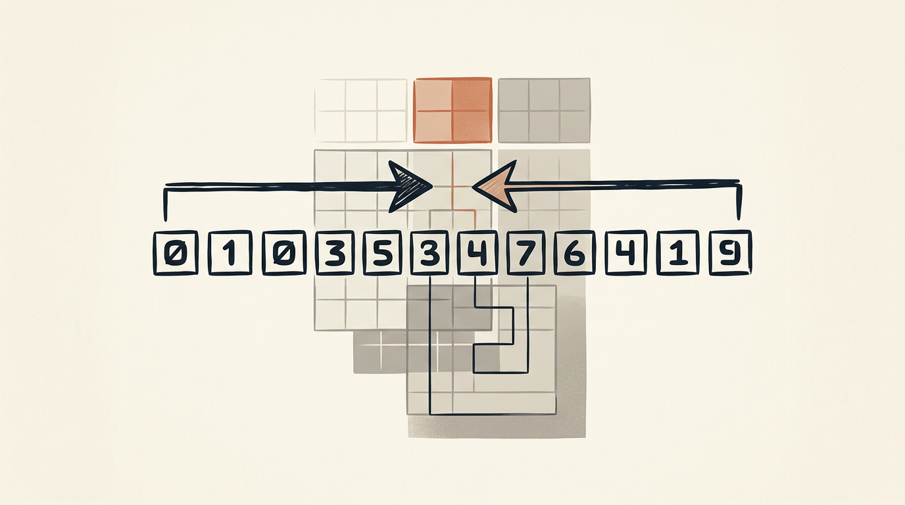

# Лекция 6: Метод двух указателей и префиксные суммы



Многие задачи на массивы сводятся к вопросу «найти подотрезок с некоторым свойством» или «ответить на серию запросов суммы». Наивные решения дают $O(n^2)$ или $O(n^2 m)$, что не проходит ни по времени, ни по памяти. Метод двух указателей и префиксные суммы — первые инструменты, которые выводят нас в $O(n)$ или $O(1)$ на запрос. Эта лекция строится на базовых знаниях массивов и циклов и служит фундаментом для бинарного поиска, скользящего окна и разреженных таблиц.

Главная линия лекции:

$$
\text{Наивный } O(n^2) \;\to\; \text{Два указателя } O(n) \;\to\; \text{Префиксные суммы } O(1)\text{ на запрос}
$$

**Как читать эту лекцию:**
- Каждый раздел содержит точную формулировку идеи, затем разобранный пример и шаблон кода на C++.
- Читайте примеры с карандашом: трассируйте переменные вручную.
- Раздел 5 (обобщение) можно пропустить при первом чтении и вернуться после раздела 3.
- Задачи для самопроверки закрепляют каждую технику по отдельности.

---

## План

1. Метод двух указателей
2. Скользящее окно
3. Префиксные суммы
4. Двумерные префиксные суммы
5. Обобщение на произвольную обратимую операцию
6. Типичные ошибки
7. Что важно для поступления в ШАД
8. Итог
9. Вопросы для самопроверки

---

## 1. Метод двух указателей

### Идея

Держим два индекса $l$ и $r$, которые обходят массив совместно. Ключевое условие: при фиксированном $l$ существует порог $r^*(l)$ такой, что свойство выполняется для всех $r \le r^*(l)$ и не выполняется для $r > r^*(l)$ — **монотонное свойство**. Тогда при переходе $l \to l+1$ порог $r^*$ не уменьшается, и правый указатель можно продвигать только вперёд. Суммарно оба указателя пробегают не более $2n$ позиций — итого $O(n)$.

**Когда применимо:** массив отсортирован, или рассматриваемое свойство (например, сумма подотрезка) монотонно при расширении/сужении окна.

### Шаблон (expandable window)

```cpp
int l = 0;
for (int r = 0; r < n; r++) {
    // expand window: add A[r]
    while (/* window [l,r] violates condition */) {
        // shrink from left: remove A[l]
        l++;
    }
    // now [l,r] is the largest valid window ending at r
    ans = max(ans, r - l + 1);
}
```

Альтернативный шаблон (сходящиеся указатели):

```cpp
int l = 0, r = n - 1;
while (l < r) {
    if (/* condition met */) {
        // found answer
        break;
    } else if (/* need larger sum */) {
        l++;
    } else {
        r--;
    }
}
```

### Пример 1. Пара с заданной суммой (отсортированный массив)

Дан отсортированный массив $A = [1, 2, 3, 4, 5, 6, 7]$. Найти пару $(A[l], A[r])$ с суммой $S = 9$.

Трассировка (l слева, r справа, движутся навстречу):

| Шаг | l | r | A[l] | A[r] | Сумма | Действие |
|-----|---|---|------|------|-------|----------|
| 1 | 0 | 6 | 1 | 7 | 8 | < 9, сдвинуть l вправо |
| 2 | 1 | 6 | 2 | 7 | 9 | = 9, **найдено!** |

Ответ: пара $(2, 7)$.

```cpp
#include <bits/stdc++.h>
using namespace std;

int main() {
    vector<int> A = {1, 2, 3, 4, 5, 6, 7};
    int S = 9;
    int l = 0, r = (int)A.size() - 1;
    while (l < r) {
        int s = A[l] + A[r];
        if (s == S) {
            cout << A[l] << " + " << A[r] << " = " << S << "\n";
            break;
        } else if (s < S) {
            l++;
        } else {
            r--;
        }
    }
}
```

### Пример 2. Длиннейший подотрезок с суммой <= K (неотрицательные числа)

Дан массив неотрицательных целых чисел $A$. Найти длину наибольшего подотрезка $[l, r]$ с суммой $\le K$.

Монотонность: если $\text{sum}[l, r] > K$, то $\text{sum}[l, r'] > K$ для любого $r' > r$. Следовательно, при сдвиге $l$ вправо порог $r$ не уменьшается.

```cpp
#include <bits/stdc++.h>
using namespace std;

int longestSubarrayLeK(const vector<int>& A, int K) {
    int n = A.size();
    long long cur = 0;
    int ans = 0;
    for (int l = 0, r = 0; r < n; r++) {
        cur += A[r];
        while (cur > K) {
            cur -= A[l];
            l++;
        }
        ans = max(ans, r - l + 1);
    }
    return ans;
}
```

Сложность: $O(n)$ по времени, $O(1)$ по памяти.

---

## 2. Скользящее окно

### Фиксированное окно шириной k

Частный случай двух указателей: $r - l = k - 1$ всегда. Окно сдвигается на 1 шаг вправо: добавляем $A[r]$, удаляем $A[l]$.

**Максимальная сумма подотрезка длины k:**

```cpp
#include <bits/stdc++.h>
using namespace std;

int maxSumWindow(const vector<int>& A, int k) {
    int n = A.size();
    if (n < k) return -1;
    long long cur = 0;
    for (int i = 0; i < k; i++) cur += A[i];
    long long best = cur;
    for (int r = k; r < n; r++) {
        cur += A[r] - A[r - k];
        best = max(best, cur);
    }
    return (int)best;
}
```

Сложность: $O(n)$.

### Минимум в скользящем окне (deque)

Чтобы найти минимум в каждом окне за $O(n)$ суммарно, используем **монотонную деку**: храним индексы так, что значения в деке не убывают (спереди — минимум окна).

```cpp
#include <bits/stdc++.h>
using namespace std;

vector<int> minWindow(const vector<int>& A, int k) {
    int n = A.size();
    deque<int> dq; // stores indices
    vector<int> ans;
    for (int r = 0; r < n; r++) {
        // remove elements outside window
        while (!dq.empty() && dq.front() <= r - k)
            dq.pop_front();
        // maintain non-decreasing values
        while (!dq.empty() && A[dq.back()] >= A[r])
            dq.pop_back();
        dq.push_back(r);
        if (r >= k - 1)
            ans.push_back(A[dq.front()]);
    }
    return ans;
}
```

Сложность: $O(n)$ — каждый элемент добавляется и удаляется из деки не более одного раза.

---

## 3. Префиксные суммы

### Определение и построение

Для массива $A[0..n-1]$ определим массив префиксных сумм $P[0..n]$:

$$
P[0] = 0, \quad P[i] = P[i-1] + A[i-1] \quad (1 \le i \le n)
$$

Тогда сумма на полуинтервале $[l, r)$ (то есть $A[l] + \ldots + A[r-1]$) вычисляется за $O(1)$:

$$
\text{sum}(l, r) = P[r] - P[l]
$$

Для включающего отрезка $[l, r]$ (индексы 0-based):

$$
\text{sum}(l, r) = P[r+1] - P[l]
$$

Построение — $O(n)$; каждый запрос — $O(1)$.

```cpp
#include <bits/stdc++.h>
using namespace std;

int main() {
    vector<int> A = {3, 1, 4, 1, 5, 9};
    int n = A.size();
    vector<long long> P(n + 1, 0);
    for (int i = 0; i < n; i++)
        P[i + 1] = P[i] + A[i];

    // sum of A[1..3] = A[1]+A[2]+A[3] = 1+4+1 = 6
    int l = 1, r = 3;
    cout << "sum[1..3] = " << P[r + 1] - P[l] << "\n"; // 6

    // sum of A[0..5] = 3+1+4+1+5+9 = 23
    cout << "sum[0..5] = " << P[6] - P[0] << "\n"; // 23
}
```

### Разобранный пример

Массив $A = [3, 1, 4, 1, 5, 9]$:

| i | 0 | 1 | 2 | 3 | 4 | 5 |
|---|---|---|---|---|---|---|
| A | 3 | 1 | 4 | 1 | 5 | 9 |

| i | 0 | 1 | 2 | 3 | 4 | 5 | 6 |
|---|---|---|---|---|---|---|---|
| P | 0 | 3 | 4 | 8 | 9 | 14 | 23 |

- $\text{sum}[1..3] = P[4] - P[1] = 9 - 3 = 6$ ✓ ($1 + 4 + 1 = 6$)
- $\text{sum}[0..5] = P[6] - P[0] = 23 - 0 = 23$ ✓

### Подотрезки с заданной суммой (prefix + hashmap)

Найдем количество подотрезков с суммой ровно $T$. Заметим: $\text{sum}[l, r] = T \Leftrightarrow P[r+1] - P[l] = T \Leftrightarrow P[l] = P[r+1] - T$.

```cpp
#include <bits/stdc++.h>
using namespace std;

int countSubarraysWithSum(const vector<int>& A, int T) {
    unordered_map<long long, int> cnt;
    cnt[0] = 1; // empty prefix
    long long psum = 0;
    int ans = 0;
    for (int x : A) {
        psum += x;
        ans += cnt[psum - T];
        cnt[psum]++;
    }
    return ans;
}
```

Сложность: $O(n)$ среднее, $O(n)$ памяти.

---

## 4. Двумерные префиксные суммы

### Построение

Для матрицы $A[n][m]$ строим $P[n+1][m+1]$, где $P[i][j]$ — сумма прямоугольника $[0, i) \times [0, j)$:

$$
P[i][j] = A[i-1][j-1] + P[i-1][j] + P[i][j-1] - P[i-1][j-1]
$$

```cpp
// Build
vector<vector<long long>> P(n + 1, vector<long long>(m + 1, 0));
for (int i = 1; i <= n; i++)
    for (int j = 1; j <= m; j++)
        P[i][j] = A[i-1][j-1] + P[i-1][j] + P[i][j-1] - P[i-1][j-1];
```

### Запрос за O(1)

Сумма прямоугольника с углами $(r_1, c_1)$ и $(r_2, c_2)$ (включительно, 0-indexed):

$$
\text{sum}(r_1, c_1, r_2, c_2) = P[r_2+1][c_2+1] - P[r_1][c_2+1] - P[r_2+1][c_1] + P[r_1][c_1]
$$

```cpp
auto query = [&](int r1, int c1, int r2, int c2) -> long long {
    return P[r2+1][c2+1] - P[r1][c2+1] - P[r2+1][c1] + P[r1][c1];
};
```

### Разобранный пример

Матрица $3 \times 3$:

```
A =
 1  2  3
 4  5  6
 7  8  9
```

Строим $P[4][4]$:

```
P =
  0   0   0   0
  0   1   3   6
  0   5  12  21
  0  12  27  45
```

Запрос — сумма прямоугольника $(1, 1)$ — $(2, 2)$ (строки 1–2, столбцы 1–2):

$$
P[3][3] - P[1][3] - P[3][1] + P[1][1] = 27 - 6 - 12 + 1 = 10
$$

Проверка: $5 + 6 + 8 + 9 = 28$... Нет, $(r_1=1, c_1=1, r_2=2, c_2=2)$:

$$
P[3][3] - P[1][3] - P[3][1] + P[1][1] = 27 - 6 - 12 + 1 = 10
$$

Прямая проверка: $A[1][1] + A[1][2] + A[2][1] + A[2][2] = 5 + 6 + 8 + 9 = 28$. Пересчитаем $P$:

| i\j | 0 | 1 | 2 | 3 |
|----|---|---|---|---|
| 0  | 0 | 0 | 0 | 0 |
| 1  | 0 | 1 | 3 | 6 |
| 2  | 0 | 5 | 12 | 21 |
| 3  | 0 | 12 | 27 | 45 |

$P[3][3] - P[1][3] - P[3][1] + P[1][1] = 45 - 6 - 12 + 1 = 28$ ✓

(При запросе всей матрицы: $P[3][3] - P[0][3] - P[3][0] + P[0][0] = 45$.)

---

## 5. Обобщение на произвольную обратимую операцию

### Группа и обратимость

Префиксные суммы работают, потому что у сложения есть **обратная операция** — вычитание. В общем виде: если $(\mathcal{G}, \oplus)$ — **группа** (замкнутость, ассоциативность, нейтральный элемент $e$, обратный элемент), то можно строить префиксный массив по операции $\oplus$ и отвечать на запросы $[l, r]$ за $O(1)$.

### Пример: XOR на отрезке

XOR образует группу (обратная операция совпадает с прямой: $x \oplus x = 0$).

$$
P_{\oplus}[0] = 0, \quad P_{\oplus}[i] = A[0] \oplus A[1] \oplus \ldots \oplus A[i-1]
$$

$$
\text{xor}[l, r] = P_{\oplus}[r+1] \oplus P_{\oplus}[l]
$$

```cpp
#include <bits/stdc++.h>
using namespace std;

int main() {
    vector<int> A = {3, 5, 1, 7, 2};
    int n = A.size();
    vector<int> P(n + 1, 0);
    for (int i = 0; i < n; i++)
        P[i + 1] = P[i] ^ A[i];

    // xor[1..3] = A[1]^A[2]^A[3] = 5^1^7 = 3
    int l = 1, r = 3;
    cout << "xor[1..3] = " << (P[r + 1] ^ P[l]) << "\n"; // 3
}
```

### Что НЕ работает

- **Максимум/минимум** — нет обратной операции. Для запросов максимума нужны разреженные таблицы (Sparse Table) или деревья отрезков.
- **Произведение по модулю** — работает только если все элементы обратимы (нет нулей).

### Сводная таблица

| Операция | Обратима? | Префиксный запрос O(1)? |
|---|---|---|
| Сложение | Да | Да |
| XOR | Да | Да |
| Умножение (без нулей) | Да | Да |
| Максимум/Минимум | Нет | Нет (нужен Sparse Table) |
| GCD | Нет (в общем случае) | Нет |

---

## 6. Типичные ошибки

1. **Off-by-one в префиксных суммах.** Путаница между `P[r+1] - P[l]` и `P[r] - P[l-1]`. Всегда определяйте $P$ как «сумма первых $i$ элементов» и придерживайтесь одного соглашения.

2. **Забытый `P[0] = 0`.** Без нулевого элемента запрос, начинающийся с индекса 0, даёт неверный результат (обращение к `P[-1]`).

3. **Переполнение `int`.** Сумма $n = 10^5$ элементов по $10^9$ каждый не влезает в `int`. Используйте `long long` для $P$.

4. **Два указателя на неотсортированном/немонотонном массиве.** Метод требует монотонного свойства. На произвольном массиве сдвиг $l$ не гарантирует, что условие улучшится.

5. **Изменение `l` в обоих вложенных циклах.** Вложенный `while` на $l$ должен только сужать окно; если внутри него ещё изменять $r$, сложность сломается.

6. **Дека минимума: неверное условие выхода.** Условие `dq.front() <= r - k` (а не `< r - k`): элемент с индексом `r - k` уже вне окна `[r-k+1, r]`, поэтому `<=`.

7. **2D prefix: забыть вычесть пересечение.** Формула включения-исключения: нужно прибавить $P[r_1][c_1]$, иначе угол вычтется дважды.

8. **Hashmap для подотрезков: не инициализировать `cnt[0] = 1`.** Без начального нуля пропускаются подотрезки, начинающиеся с индекса 0.

---

## 7. Что важно для поступления в ШАД

- **Два указателя** — стандартный инструмент для задач на строки и массивы. Нужно уметь обосновывать монотонность и доказывать $O(n)$.
- **Префиксные суммы** — базовая техника; вопросы на них встречаются в задачах с матрицами и строками.
- **2D prefix** — часто встречается в задачах про прямоугольники на сетке.
- **XOR-prefix** — типовая задача: найти подотрезок с нулевым XOR или XOR = $k$.
- **Деке минимума** часто предшествуют вопросы «зачем не просто хранить минимум?» — готовьте ответ.
- На экзамене ожидают **строгое доказательство сложности**, а не просто правильный ответ.
- Умение комбинировать: два указателя + хэш-таблица, prefix + binary search.

---

## 8. Итог

Метод двух указателей превращает наивный перебор $O(n^2)$ в линейный алгоритм за счёт монотонного свойства: правый указатель никогда не откатывается назад. Скользящее окно — частный случай с фиксированной шириной; монотонная дека решает задачу минимума за $O(n)$.

Префиксные суммы переносят стоимость со времени запроса на время предобработки: один проход $O(n)$ позволяет отвечать на произвольные запросы суммы за $O(1)$. Обобщение на группы (XOR, произведение) расширяет технику на другие операции. Двумерный вариант с формулой включения-исключения решает прямоугольные запросы на матрице.

---

## 9. Вопросы для самопроверки

1. Почему метод двух указателей требует монотонного свойства? Приведите пример, когда он даёт неверный ответ без монотонности.

2. Докажите, что в шаблоне expandable window каждый элемент обрабатывается правым указателем ровно один раз и левым — не более одного раза. Какова итоговая сложность?

3. Напишите алгоритм двух указателей для задачи: найти все тройки в отсортированном массиве с суммой равной $S$. Какова его сложность?

4. Определите $P[i]$ для массива $A = [5, -3, 2, 8, -1]$. Чему равна $\text{sum}[2..4]$?

5. Почему нельзя применить технику префиксных сумм для запроса максимума на отрезке? Что нужно использовать вместо неё?

6. Реализуйте подсчёт количества подотрезков с суммой, кратной $k$, используя хэш-таблицу и префиксные суммы по модулю.

7. Как построить 2D-prefix для матрицы $n \times m$ и ответить на запрос суммы прямоугольника $(r_1, c_1)$–$(r_2, c_2)$? Напишите формулу запроса и поясните каждый член.

8. Монотонная дека: покажите на примере массива $[3, 1, 2, 5, 4]$ с окном $k = 3$ работу алгоритма поиска минимума. Запишите состояние деки после каждого шага.

9. Дан массив из $n$ целых чисел (в том числе отрицательных). Можно ли найти длиннейший подотрезок с суммой $\le K$ методом двух указателей? Обоснуйте ответ.

10. Сколько различных подотрезков $[l, r]$ массива $A = [1, 0, 1, 0, 1]$ имеют XOR равный 1? Решите, используя XOR-prefix.
