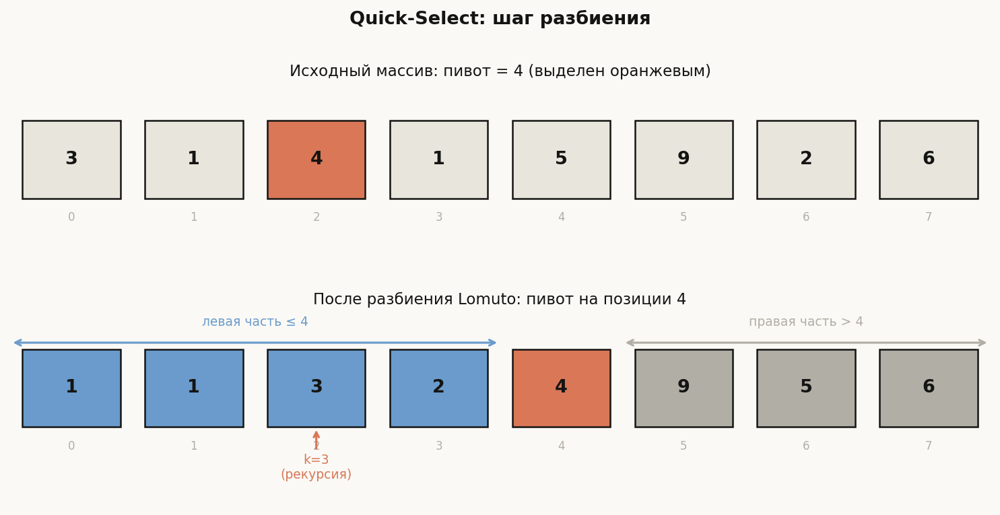
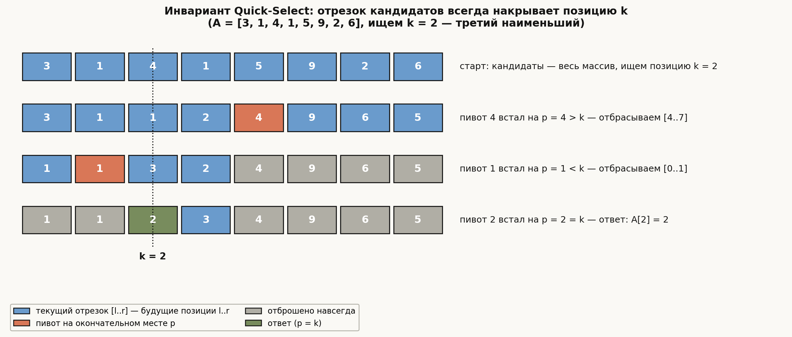
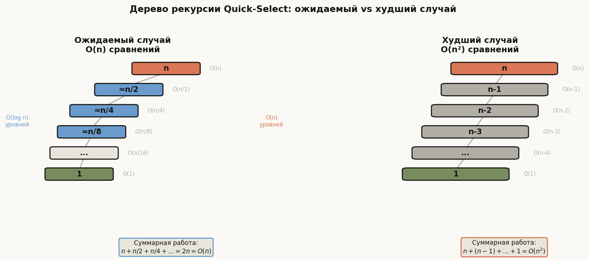
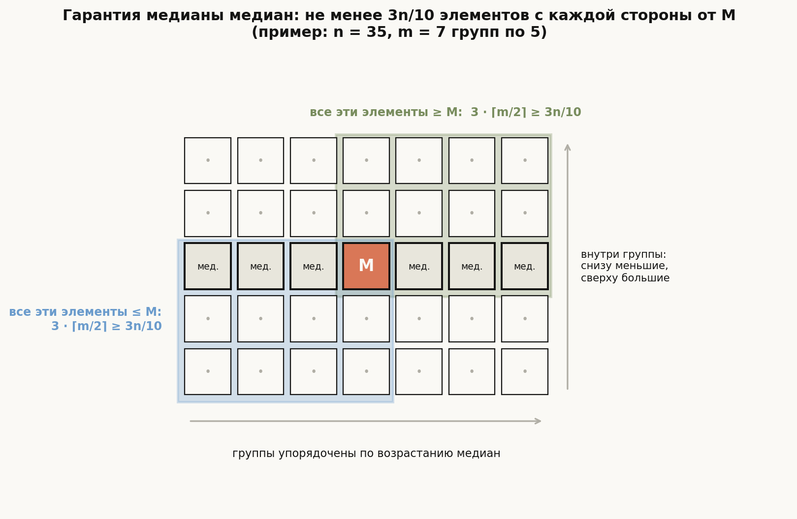
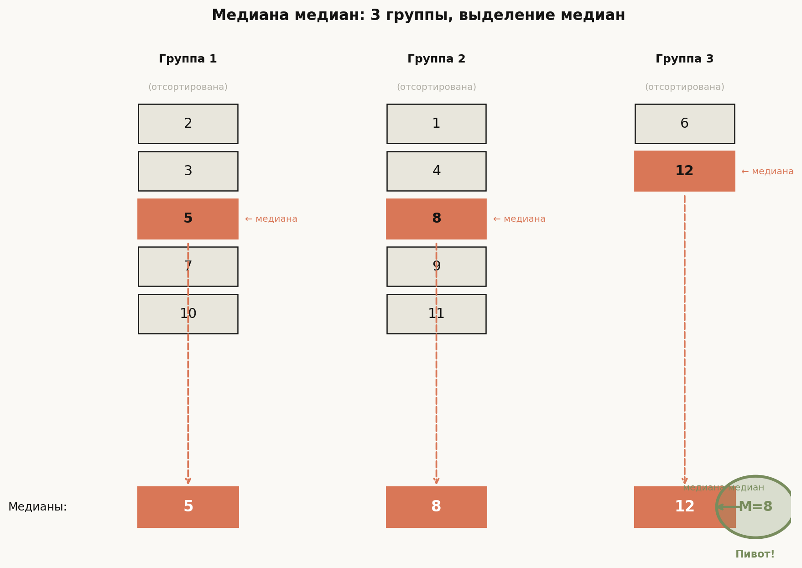

# Лекция 7: Порядковые статистики: Quick-Select и медиана медиан


Представьте задачу: дан несортированный массив из миллиона чисел, и нужно найти 500 000-й наименьший элемент — медиану. Наивный путь — отсортировать весь массив за $O(n \log n)$ и взять нужный элемент. Но зачем сортировать *всё*, если нас интересует *одна* позиция? Эта лекция посвящена алгоритмам, которые решают задачу поиска $k$-й порядковой статистики за $O(n)$ — как в среднем (рандомизированный Quick-Select), так и в худшем случае (детерминированный метод медианы медиан). Оба алгоритма строятся на идее разбиения (partition) из Quick-Sort — только без лишней рекурсии.

Главная линия лекции:

$$
\text{Задача: } k\text{-я статистика за } O(n) \;\to\; \text{Quick-Select (рандом.)} \;\to\; \text{Медиана медиан (детерм.)}
$$

**Как читать эту лекцию:**
- Убедитесь, что понимаете разбиение Lomuto из лекции по Quick-Sort — здесь оно используется как чёрный ящик
- Раздел 2 (Quick-Select) прочтите вместе с кодом, трассируя пример вручную
- Раздел 3 (Median of Medians) требует внимания к числам: `3n/10` и `7n/10` — ключевые константы
- Раздел 4 сравнивает алгоритмы — полезно перед собеседованием

---

## План

1. Постановка задачи: $k$-я порядковая статистика
2. Рандомизированный Quick-Select
3. Детерминированный алгоритм: медиана медиан
4. Сравнение алгоритмов
5. Типичные ошибки
6. Что важно для поступления в ШАД
7. Итог
8. Вопросы для самопроверки

---

## 1. Постановка задачи: $k$-я порядковая статистика

**Определение.** Пусть дан массив $A[0..n-1]$ из $n$ различных чисел. $k$-я порядковая статистика — это элемент, который занял бы позицию с индексом $k-1$ (0-индексация: позиция $k-1$) после сортировки массива.

Частные случаи:
- $k = 1$ — минимум
- $k = n$ — максимум
- $k = \lfloor n/2 \rfloor$ — медиана

**Наивное решение:** отсортировать массив за $O(n \log n)$, вернуть $A[k-1]$. Для миллиона элементов — примерно 20 миллионов операций. Можно ли быстрее?

**Цель:** найти $k$-ю порядковую статистику за $O(n)$ — линейное время, без полной сортировки.

**Ключевая идея.** После операции разбиения (partition) с пивотом $p$ мы точно знаем *ранг* $p$ в массиве — позицию, которую он займёт в отсортированном массиве. Если его ранг равен $k-1$ — ответ найден. Если меньше — искомый элемент правее. Если больше — левее. Рекурсивно продолжаем только в одной части.

**Пример (мотивация).** Массив `[3, 1, 4, 1, 5, 9, 2, 6]`, ищем 3-й наименьший ($k=3$). Отсортированный вид: `[1, 1, 2, 3, 4, 5, 6, 9]`. Ответ: $2$. Можем ли мы найти $2$, не сортируя весь массив? Да — и увидим как.

---

## 2. Рандомизированный Quick-Select

### 2.1 Алгоритм

Quick-Select использует то же разбиение Lomuto, что и Quick-Sort, но рекурсирует только в одну половину.

**Разбиение Lomuto.** Выбирается пивот $x = A[r]$ (последний элемент). Элементы меньше $x$ перемещаются влево от пивота. Пивот занимает итоговую позицию $p$. Все $A[l..p-1] \leq x$, все $A[p+1..r] > x$.

**Алгоритм Quick-Select** (найти элемент ранга $k$ в $A[l..r]$, 0-индексация):

```
QuickSelect(A, l, r, k):
    if l == r: return A[l]
    pivot_idx = random(l, r)
    swap(A[pivot_idx], A[r])        // пивот в конец
    p = Lomuto_partition(A, l, r)   // p — итоговая позиция пивота
    if p == k:
        return A[p]
    else if p > k:
        return QuickSelect(A, l, p-1, k)
    else:
        return QuickSelect(A, p+1, r, k)
```

### 2.2 Полный код на C++

```cpp
#include <algorithm>
#include <random>
#include <vector>

// Разбиение Lomuto: пивот = A[r]
// Возвращает итоговую позицию пивота
int lomuto_partition(std::vector<int>& A, int l, int r) {
    int x = A[r];
    int i = l - 1;
    for (int j = l; j < r; ++j) {
        if (A[j] <= x) {
            ++i;
            std::swap(A[i], A[j]);
        }
    }
    std::swap(A[i + 1], A[r]);
    return i + 1;
}

// Найти k-й наименьший (0-индексация: k=0 это минимум)
int quick_select(std::vector<int>& A, int l, int r, int k) {
    if (l == r) return A[l];

    // Рандомизация: выбираем случайный пивот
    std::mt19937 rng(std::random_device{}());
    std::uniform_int_distribution<int> dist(l, r);
    int pivot_idx = dist(rng);
    std::swap(A[pivot_idx], A[r]);

    int p = lomuto_partition(A, l, r);

    if (p == k) {
        return A[p];
    } else if (p > k) {
        return quick_select(A, l, p - 1, k);
    } else {
        return quick_select(A, p + 1, r, k);
    }
}

// Публичный интерфейс: k-й наименьший (1-индексация для удобства)
int kth_smallest(std::vector<int> A, int k) {
    return quick_select(A, 0, (int)A.size() - 1, k - 1);
}

// Стандартная библиотека: std::nth_element
// Перестраивает A так, что A[k] = k-й наименьший, за O(n) в среднем
#include <iostream>
int main() {
    std::vector<int> A = {3, 1, 4, 1, 5, 9, 2, 6};
    int k = 3; // ищем 3-й наименьший

    // Через наш алгоритм
    std::cout << "Quick-Select: " << kth_smallest(A, k) << "\n"; // 2

    // Через std::nth_element (0-индексация)
    std::nth_element(A.begin(), A.begin() + k - 1, A.end());
    std::cout << "nth_element:  " << A[k - 1] << "\n"; // 2

    return 0;
}
```

### 2.3 Трассировка примера

Массив `[3, 1, 4, 1, 5, 9, 2, 6]`, ищем $k=3$ (3-й наименьший, 0-индексация: $k=2$).

**Шаг 1.** Пивот = $4$ (индекс 2). Перемещаем в конец: `[3, 1, 6, 1, 5, 9, 2, 4]`.

Разбиение Lomuto по пивоту $4$:
- Проходим массив, собираем элементы $\leq 4$: $3, 1, 1, 2$ — их 4 штуки.
- Пивот $4$ встаёт на позицию $p = 4$ (индекс 4 в 0-индексации).
- Массив: `[3, 1, 1, 2, 4, 9, 6, 5]`



На диаграмме — этот же шаг: сверху исходный массив с пивотом $4$ (оранжевый), снизу массив после разбиения. Синяя зона — элементы $\le 4$, серая — элементы $> 4$; пивот стоит на своей окончательной позиции 4. Искомый индекс $k=2$ лежит в синей зоне, поэтому правую часть и сам пивот можно больше никогда не трогать — в этом и есть выигрыш Quick-Select по сравнению с Quick-Sort.

**Шаг 2.** Ищем $k=2$ (0-индексация). $p=4 > 2$ — рекурсируем в левую часть `[3, 1, 1, 2]` (индексы 0–3).

**Шаг 3.** Пивот = $1$ (случайный выбор). Разбиение: `[1, 1, 3, 2]`, $p = 1$.

$p=1 < 2$ — рекурсируем в правую часть `[3, 2]` (индексы 2–3), ищем $k=2$.

**Шаг 4.** Пивот = $2$. Разбиение: `[2, 3]`, $p = 2$.

$p = 2 = k$ — найдено! Ответ: $A[2] = 2$. Верно: отсортированный массив `[1,1,2,3,4,5,6,9]`, 3-й элемент (1-индексация) = $2$.

### Почему можно отбрасывать половину целиком

**Ключевое наблюдение.** Разбиение ставит пивот на его **окончательную позицию**: после partition слева от $p$ стоят ровно $p - l$ элементов, каждый $\le$ пивота, справа — только большие. Значит, в полностью отсортированном массиве пивот стоял бы именно на позиции $p$ — и мы узнали это, ничего не отсортировав.

**Инвариант.** Перед каждым вызовом `QuickSelect(A, l, r, k)`: *отрезок $A[l..r]$ содержит в точности те элементы, которые в отсортированном массиве занимали бы позиции $l..r$, и $l \le k \le r$.*

*База:* первый вызов — отрезок $[0, n-1]$ содержит все элементы, и $0 \le k \le n-1$. *Переход:* partition переставляет элементы только внутри $[l..r]$, поэтому множество элементов отрезка не меняется. После разбиения $A[l..p-1]$ — это все элементы отрезка, не превосходящие пивота: в отсортированном массиве именно они займут позиции $l..p-1$; аналогично элементы $A[p+1..r]$ займут позиции $p+1..r$. Дальше три случая:

- $p = k$: элемент $A[p]$ стоит на позиции $k$ и в отсортированном массиве стоял бы там же — ответ найден;
- $p > k$: элемент ранга $k$ лежит в $A[l..p-1]$, и инвариант выполнен для вызова $(l,\, p-1,\, k)$;
- $p < k$: симметрично, инвариант выполнен для вызова $(p+1,\, r,\, k)$.

Отброшенную часть можно **забыть навсегда**: по инварианту в ней лежат элементы чужих рангов. В трассировке выше после шага 1 ($p = 4 > k = 2$) отрезок $[0..3] = [3, 1, 1, 2]$ — это в точности будущие позиции 0–3, а пивот $4$ вместе с $[9, 6, 5]$ больше никогда не трогается; после шага 3 ($p = 1 < 2$) отброшены и позиции 0–1.

**Завершаемость.** Каждый вызов исключает из отрезка хотя бы пивот, так что отрезок строго укорачивается; в вырожденном случае $l = r$ инвариант даёт $k = l$, и `A[l]` — ответ. Именно один рекурсивный вызов вместо двух (сравните с Quick-Sort) превращает суммарную работу в геометрическую прогрессию — это подсчитано в следующем разделе.



Диаграмма воспроизводит трассировку из раздела 2.3 честной симуляцией: в каждой строке синим показан текущий отрезок $[l..r]$ — по инварианту в нём лежат ровно элементы будущих позиций $l..r$; оранжевым — пивот, вставший на окончательное место $p$; серым — отброшенные навсегда элементы. Пунктир — искомая позиция $k = 2$: она ни разу не покидает синюю зону, пока очередной пивот не встаёт ровно на неё (зелёная клетка).

### 2.4 Анализ сложности

**Лучший случай:** пивот всегда делит массив пополам. Тогда $T(n) = T(n/2) + O(n)$, решение: $T(n) = O(n)$.

**Худший случай:** пивот всегда минимум или максимум. Тогда $T(n) = T(n-1) + O(n)$, решение: $T(n) = O(n^2)$. Именно поэтому нужна рандомизация.



Слева — типичная (ожидаемая) картина: размер задачи на каждом уровне примерно делится пополам, суммарная работа — убывающая геометрическая прогрессия $n + n/2 + n/4 + \ldots = O(n)$. Справа — худший случай: каждый пивот отщепляет всего один элемент, уровней $O(n)$, работа складывается в арифметическую прогрессию $n + (n-1) + \ldots = O(n^2)$. Сравните с Quick-Sort: там даже в хорошем случае суммарная работа $O(n \log n)$, потому что обрабатываются *обе* части; здесь на каждом уровне остаётся только одна.

**Среднее (ожидаемое) время с рандомизацией.** Пусть $E[T(n)]$ — ожидаемое число операций на массиве размера $n$.

Ключевое наблюдение: пивот является «хорошим», если он попадает в центральную половину отсортированного массива (от $n/4$ до $3n/4$-го элемента). Вероятность этого — $1/2$. «Хороший» пивот гарантирует, что следующий подмассив не больше $3n/4$.

$$
E[T(n)] \leq \sum_{i=0}^{\log_{4/3} n} O\!\left(\left(\frac{3}{4}\right)^i \cdot n\right) = O(n) \cdot \sum_{i=0}^{\infty} \left(\frac{3}{4}\right)^i = O(n) \cdot 4 = O(n)
$$

Геометрическая прогрессия со знаменателем $3/4$ суммируется в $4$, итого $E[T(n)] \leq 4n$ — линейное ожидаемое время.

**Итог:** Quick-Select работает за $O(n)$ в среднем, $O(n^2)$ в худшем случае (крайне маловероятно при рандомизации).

### 2.5 `std::nth_element` в стандартной библиотеке

В C++ STL функция `std::nth_element(first, nth, last)` реализует именно рандомизированный Quick-Select (или его вариант introselect). После вызова:
- `*nth` равен элементу, который стоял бы на позиции `nth` в отсортированном массиве
- Элементы левее `nth` не больше `*nth`
- Элементы правее `nth` не меньше `*nth`
- Гарантия: $O(n)$ в среднем (introselect даёт $O(n)$ в худшем случае в реализациях GCC/LLVM)

---

## 3. Детерминированный алгоритм: медиана медиан

### 3.1 Мотивация

Рандомизированный Quick-Select теоретически может деградировать до $O(n^2)$. Хотя на практике это крайне маловероятно, в некоторых задачах (например, системах реального времени или при враждебных входных данных) нужна гарантия $O(n)$ в худшем случае.

**Ключевая идея:** если мы заранее выбираем пивот, который *гарантированно* делает разбиение не хуже $30\%/70\%$, то рекуррентность $T(n) = T(7n/10) + O(n)$ даёт $T(n) = O(n)$.

### 3.2 Алгоритм (5 шагов)

**Шаг 1.** Разделить массив на $\lceil n/5 \rceil$ групп по 5 элементов (последняя группа может быть меньше).

**Шаг 2.** Отсортировать каждую группу (5 элементов сортируются за $O(1)$ — фиксированное число сравнений). Найти медиану каждой группы — средний элемент.

**Шаг 3.** Рекурсивно найти медиану $M$ из $\lceil n/5 \rceil$ медиан (вызов того же алгоритма).

**Шаг 4.** Использовать $M$ как пивот — выполнить разбиение массива по $M$.

**Шаг 5.** Рекурсивно искать $k$-й элемент в нужной половине.

```cpp
#include <algorithm>
#include <vector>

// Медиана 5 (или меньше) элементов за O(1)
int median_of_small(std::vector<int>& A, int l, int r) {
    std::sort(A.begin() + l, A.begin() + r + 1);
    return A[(l + r) / 2];
}

// Разбиение по заданному пивоту (не случайному)
// Возвращает итоговую позицию пивота
int partition_by_pivot(std::vector<int>& A, int l, int r, int pivot) {
    // Найти пивот и переместить в конец
    for (int i = l; i <= r; ++i) {
        if (A[i] == pivot) {
            std::swap(A[i], A[r]);
            break;
        }
    }
    int x = A[r];
    int i = l - 1;
    for (int j = l; j < r; ++j) {
        if (A[j] <= x) {
            ++i;
            std::swap(A[i], A[j]);
        }
    }
    std::swap(A[i + 1], A[r]);
    return i + 1;
}

// Медиана медиан: гарантированный O(n) в худшем случае
int median_of_medians(std::vector<int>& A, int l, int r, int k);

int median_of_medians(std::vector<int>& A, int l, int r, int k) {
    int n = r - l + 1;
    if (n <= 5) {
        std::sort(A.begin() + l, A.begin() + r + 1);
        return A[l + k];
    }

    // Шаг 1-2: разделить на группы по 5, найти медианы
    std::vector<int> medians;
    for (int i = l; i <= r; i += 5) {
        int group_end = std::min(i + 4, r);
        medians.push_back(median_of_small(A, i, group_end));
    }

    // Шаг 3: рекурсивно найти медиану медиан
    int med_size = (int)medians.size();
    int M = median_of_medians(medians, 0, med_size - 1, (med_size - 1) / 2);

    // Шаг 4: разбить по M
    int p = partition_by_pivot(A, l, r, M);

    // Шаг 5: рекурсия в нужную часть
    int rank = p - l; // ранг пивота внутри [l..r]
    if (rank == k) {
        return A[p];
    } else if (rank > k) {
        return median_of_medians(A, l, p - 1, k);
    } else {
        return median_of_medians(A, p + 1, r, k - rank - 1);
    }
}
```

### 3.3 Почему пивот $M$ даёт разбиение $30\%/70\%$?

**Интуиция.** Представим все группы столбиками, отсортированными снизу вверх, и расставим столбики слева направо по возрастанию их медиан. Тогда $M$ окажется ровно в центре «сетки». Всё, что правее и выше центра, заведомо $\ge M$; всё, что левее и ниже, — заведомо $\le M$. Каждый из этих «уголков» — примерно $3/5 \cdot 1/2 = 3/10$ всех элементов.



На диаграмме $n = 35$ элементов, $m = 7$ групп-столбиков по 5; средняя строка — медианы групп, $M$ — центральная из них (оранжевая). Зелёная область (медиана и два элемента над ней в каждом из $\lceil m/2 \rceil$ правых столбиков) — элементы, гарантированно $\ge M$: их $3 \cdot 4 = 12 \ge 3n/10 = 10.5$. Синяя область симметрично даёт столько же элементов $\le M$. Про остальные элементы (белые клетки) ничего не известно — но и этого достаточно, чтобы ни одна из частей разбиения не превысила $7n/10$.

Теперь формально. Обозначим число групп $m = \lceil n/5 \rceil$.

$M$ — это медиана $m$ медиан. Значит, хотя бы $\lceil m/2 \rceil$ медиан $\geq M$.

Каждая такая медиана является средним элементом своей группы из 5, значит в своей группе ещё 2 элемента $\geq$ своей медианы $\geq M$.

Итого элементов, которые $\geq M$:

$$
3 \cdot \left\lceil \frac{m}{2} \right\rceil \geq 3 \cdot \frac{n/5}{2} = \frac{3n}{10}
$$

Симметрично, элементов $\leq M$ тоже не менее $3n/10$.

Значит, правая часть (элементы $> M$) содержит не более:

$$
n - \frac{3n}{10} = \frac{7n}{10}
$$

элементов. Аналогично для левой части. Гарантированное разбиение: не хуже $30\%/70\%$.

### 3.4 Трассировка примера

**Задача:** найти медиану (6-й из 12 наименьших) в массиве `[7, 2, 10, 5, 3, 8, 1, 9, 4, 11, 6, 12]`.

**Шаг 1.** Делим на группы по 5 (последняя — 2 элемента, так как $\lceil 12/5 \rceil = 3$ группы):
- Группа 1: `[7, 2, 10, 5, 3]`
- Группа 2: `[8, 1, 9, 4, 11]`
- Группа 3: `[6, 12]`

**Шаг 2.** Сортируем каждую группу и берём медиану:
- Группа 1: `[2, 3, 5, 7, 10]` → медиана = $5$
- Группа 2: `[1, 4, 8, 9, 11]` → медиана = $8$
- Группа 3: `[6, 12]` → медиана = $6$ (берём меньший из двух)

**Шаг 3.** Медианы: `[5, 8, 6]`. Рекурсивно находим медиану: отсортируем `[5, 6, 8]`, медиана = $M = 6$.



Диаграмма показывает шаги 1–3 на этом примере: три отсортированные группы-столбика, в каждой оранжевым выделена медиана (5, 8 и 6), внизу — ряд медиан, из которого выбирается медиана медиан $M = 6$ (зелёный круг) — будущий пивот. Обратите внимание, что $M$ не обязан быть настоящей медианой всего массива — он лишь гарантированно «не слишком крайний».

**Шаг 4.** Разбиваем исходный массив по пивоту $M=6$:
- Элементы $\leq 6$: `[2, 5, 3, 1, 4, 6]` — 6 элементов
- Пивот $6$ встаёт на позицию 5 (0-индексация)
- Элементы $> 6$: `[7, 10, 8, 9, 11, 12]` — 6 элементов

**Шаг 5.** Ищем 6-й элемент (1-индексация), $k=5$ в 0-индексации. Ранг пивота $= 5 = k$. Ответ: $6$. (Отсортированный: `[1,2,3,4,5,6,7,8,9,10,11,12]`, медиана = $6$. Верно!)

### 3.5 Доказательство $T(n) = O(n)$

**Рекуррентное соотношение:**

$$
T(n) \leq T\!\left(\frac{n}{5}\right) + T\!\left(\frac{7n}{10}\right) + O(n)
$$

где:
- $T(n/5)$ — рекурсивный поиск медианы медиан (из $\lceil n/5 \rceil$ медиан)
- $T(7n/10)$ — рекурсия в большей части после разбиения (не более $7n/10$ элементов)
- $O(n)$ — группировка, сортировки групп и разбиение

**Доказательство методом подстановки:** покажем, что $T(n) \leq cn$ для некоторой константы $c$.

Предположим, $T(n) \leq cn$ выполняется для всех значений $< n$. Тогда:

$$
T(n) \leq c \cdot \frac{n}{5} + c \cdot \frac{7n}{10} + an = cn\!\left(\frac{1}{5} + \frac{7}{10}\right) + an = cn \cdot \frac{9}{10} + an
$$

Нам нужно $cn \cdot \frac{9}{10} + an \leq cn$, то есть $an \leq cn \cdot \frac{1}{10}$, откуда $c \geq 10a$.

При $c = 10a$ неравенство выполняется. Значит, $T(n) = O(n)$. $\blacksquare$

---

## 4. Сравнение алгоритмов

| Алгоритм | Лучшее | Среднее | Худшее | Дополнит. память |
|---|---|---|---|---|
| Сортировка + взятие | $O(n \log n)$ | $O(n \log n)$ | $O(n \log n)$ | $O(1)$–$O(n)$ |
| Quick-Select (рандом.) | $O(n)$ | $O(n)$ | $O(n^2)$ | $O(\log n)$ стек ожид., $O(n)$ худш. |
| Медиана медиан | $O(n)$ | $O(n)$ | $O(n)$ | $O(\log n)$ стек |
| `std::nth_element` | $O(n)$ | $O(n)$ | $O(n)$* | $O(\log n)$ |

*В реализациях GCC/Clang `nth_element` использует introselect — гибрид Quick-Select и медианы медиан с гарантией $O(n)$ в худшем случае.

**Практический вывод:** рандомизированный Quick-Select используется почти везде на практике из-за меньших константных факторов. Медиана медиан важна для теоретических гарантий и как доказательство существования линейного детерминированного алгоритма.

---

## 5. Типичные ошибки

1. **Неправильная 0/1 индексация.** Путаница между «$k$-й наименьший в 1-индексации» ($k=1$ — минимум) и «индекс в массиве» ($k=0$ — минимум). В коде нужно чётко определиться и придерживаться одного соглашения. Ошибка проявляется в граничных случаях ($k=1$ или $k=n$).

2. **Рекурсия в обе половины вместо одной.** Quick-Select рекурсирует только в *одну* часть — ту, где находится искомый элемент. Если рекурсировать в обе (как в Quick-Sort), сложность будет $O(n \log n)$. Проверяйте: после определения позиции пивота $p$ выполняется ровно один рекурсивный вызов.

3. **Неверная передача $k$ при рекурсии вправо.** При рекурсии в правую часть $[p+1..r]$ нужно искать не $k$-й, а $(k - p - 1)$-й элемент в правой части. Забыть вычесть $p+1$ — классическая ошибка.

4. **Размер группы 3 вместо 5 в медиане медиан.** При группах по 3 гарантированное разбиение — $1/3$ с каждой стороны, рекуррентность становится $T(n) \leq T(n/3) + T(2n/3) + O(n)$, которая даёт $O(n \log n)$, а не $O(n)$. Нужно не менее 5 (оптимально — 5 или 7).

5. **Сортировка медиан всего массива вместо малых групп.** Сортировка всего массива в шаге 2 делает алгоритм медленнее; смысл в том, что *группы* из 5 сортируются за $O(1)$ — фиксированное число шагов.

6. **Изменение исходного массива.** `std::nth_element` и Quick-Select переставляют элементы массива in-place. Если нужно сохранить исходный порядок, нужно работать с копией.

---

## 6. Что важно для поступления в ШАД

- **Рекуррентность Quick-Select:** уметь записать $E[T(n)] \leq cn$ и показать, что $c=4$ подходит (через геометрическую прогрессию со знаменателем $3/4$).
- **Ключевой факт медианы медиан:** $M$ гарантирует разбиение не хуже $30\%/70\%$ — нужно вывести $3n/10$ самостоятельно, а не просто запомнить.
- **Рекуррентность детерминированного алгоритма:** $T(n) \leq T(n/5) + T(7n/10) + O(n)$ и доказательство $T(n)=O(n)$ методом подстановки.
- **Группы размером 5:** понимать, почему не 3 (даёт $O(n \log n)$) и не 7 (даёт $O(n)$, но с большей константой).
- **На практике:** знать `std::nth_element` и его гарантии; уметь сказать, когда предпочесть детерминированный вариант.
- **Сложность по памяти:** рекурсия использует $O(\log n)$ стека в лучшем случае и $O(n)$ в худшем (итеративная версия Quick-Select решает проблему).

---

## 7. Итог

Quick-Select — элегантное расширение Quick-Sort: вместо двух рекурсивных вызовов делается один, и ожидаемое время снижается с $O(n \log n)$ до $O(n)$. Это достигается случайным выбором пивота, который с вероятностью $1/2$ попадает в «хорошую» половину, а геометрическая прогрессия $\sum (3/4)^i = 4$ замыкает доказательство.

Медиана медиан устраняет зависимость от случайности: выбирая пивот через рекурсивный поиск медианы медиан групп по 5, алгоритм гарантирует разбиение не хуже $30\%/70\%$. Рекуррентность $T(n) \leq T(n/5) + T(7n/10) + O(n)$ решается в $O(n)$, потому что $1/5 + 7/10 = 9/10 < 1$. Это один из немногих алгоритмов, где детерминированное решение теоретически оптимально при кажущейся сложности конструкции.

---

## 8. Вопросы для самопроверки

1. Что такое $k$-я порядковая статистика? Каковы ранги минимума, максимума и медианы?

2. Опишите алгоритм разбиения Lomuto. Что является инвариантом цикла?

3. В Quick-Select после разбиения пивот оказался на позиции $p=5$ в массиве размера $n=10$. Ищем $k=3$ (0-индексация). В какую часть и с каким $k$ рекурсируем?

4. Почему рандомизация необходима для Quick-Select? Приведите пример входных данных, на которых нерандомизированный Quick-Select с пивотом = последний элемент работает за $O(n^2)$.

5. Выведите оценку $E[T(n)] = O(n)$ для рандомизированного Quick-Select через геометрическую прогрессию. Какая вероятность «хорошего» пивота?

6. Опишите 5 шагов алгоритма медианы медиан. Почему группы размером 5, а не 3?

7. Докажите, что пивот $M$ (медиана медиан) гарантирует, что в каждой части не менее $3n/10$ элементов.

8. Запишите рекуррентность для медианы медиан и докажите $T(n) = O(n)$ методом подстановки.

9. Чем `std::nth_element` отличается от полной сортировки? Какое состояние массива гарантирует эта функция после вызова?

10. Сравните Quick-Select и медиану медиан: в каком случае на практике предпочтительнее каждый из алгоритмов?

11. Можно ли реализовать Quick-Select итеративно (без рекурсии)? Как это повлияет на потребление памяти стека?

12. Почему не работает группировка по 3 в медиане медиан? Выпишите рекуррентность и покажите, что она даёт $\Omega(n \log n)$.
