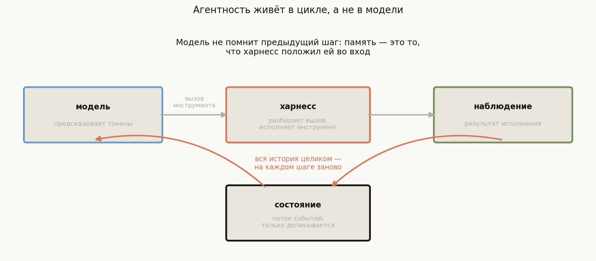
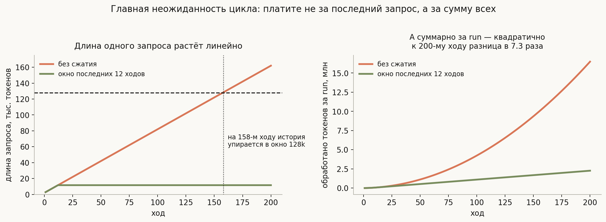
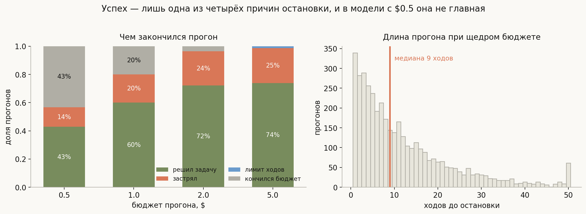
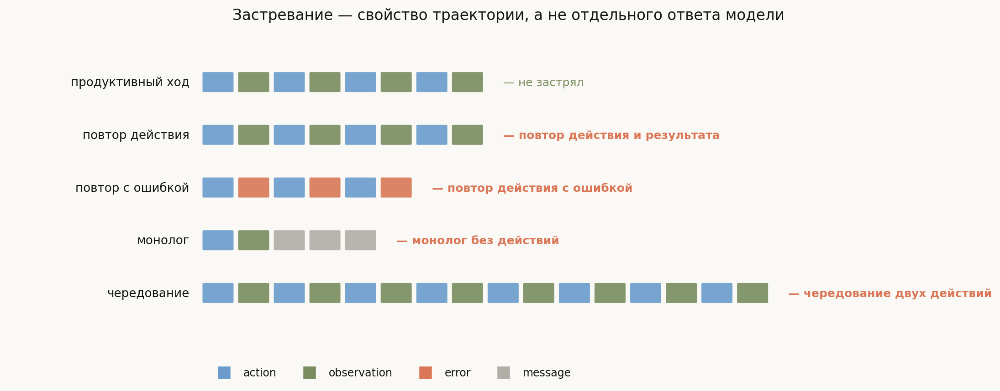

# Агентный цикл: что такое харнесс

**Вопрос**: Что такое агентный харнесс и чем он отличается от модели? Как устроен цикл, где живёт состояние, когда цикл останавливается и почему агент застревает?

Разговор про агентов регулярно спотыкается о подмену: обсуждают «модель, которая умеет пользоваться инструментами», хотя модель ничего такого не умеет. Языковая модель по-прежнему делает ровно одно — предсказывает следующий токен по входу. Она не исполняет код, не читает файлы и не помнит, что делала минуту назад.

Всё, что выглядит как действие, делает программа вокруг модели. Она разбирает выход модели, находит там описание вызова инструмента, исполняет его сама, кладёт результат обратно во вход и просит модель сходить ещё раз. Эта программа и называется **харнессом** (harness — упряжь: то, через что модель соединяют с миром).

Отсюда главный тезис темы, из которого выводится всё остальное:

> **Агентность живёт в цикле, а не в модели.**

Из него следует, что почти все интересные свойства агента — свойства цикла, а не нейросети. Память — это то, что харнесс положил во вход. Способность остановиться — условие в коде, а не намерение модели. Зацикливание — свойство траектории, которое ни на одном отдельном шаге не видно. И стоимость, как мы увидим, растёт квадратично именно из-за устройства цикла, а не из-за модели.

## План

1. Что делает модель и чего она не делает
2. Цикл: три роли и одна петля
3. Состояние: поток событий, который только дописывается
4. Цикл умножает токены квадратично
5. Остановка: успех — лишь одна из причин
6. Застревание: свойство траектории
7. Единицы измерения: шаг, ход, прогон
8. Что харнесс меняет, а что нет
9. Что спрашивают на собеседовании
10. Типичные ошибки
11. Итог

---

## 1. Что делает модель и чего она не делает

Модель принимает последовательность токенов и возвращает распределение на следующий токен. Всё. У неё нет побочных эффектов, нет доступа к файловой системе, нет памяти между вызовами.

Когда говорят, что «модель вызвала инструмент», происходит вот что: модель сгенерировала текст, который **выглядит** как вызов — в специальном формате, которому её обучили. Дальше начинается работа харнесса: разобрать этот текст, проверить, что такой инструмент есть, что аргументы валидны, исполнить его и вернуть результат.

Это различение — не буквоедство. Из него сразу следуют практические вещи:

- Модель может «вызвать» несуществующий инструмент или передать аргументы неверного типа. Валидация — обязанность харнесса.
- Модель может выдумать результат вызова, не дожидаясь исполнения. Харнесс обязан не дать этому попасть в историю как настоящему наблюдению.
- Один и тот же промпт с разными харнессами даёт разное поведение, потому что различаются описания инструментов, формат вызова и то, что возвращается в качестве наблюдения.

## 2. Цикл: три роли и одна петля

Минимальный цикл состоит из трёх ролей и одного повторения:

1. **Модель** получает всю историю и порождает либо текст для пользователя, либо вызов инструмента.
2. **Харнесс** разбирает вызов, проверяет его и исполняет.
3. **Наблюдение** — результат исполнения — дописывается в историю, и всё начинается заново.

Стоит остановиться на слове «всю». Модель не помнит предыдущий шаг: между вызовами у неё нет состояния вообще. Поэтому на каждой итерации харнесс посылает **всю накопленную историю заново**. Это устройство и порождает большинство инженерных проблем темы.

В реальных реализациях у шага есть ещё один нюанс. Например, в OpenHands SDK метод `Agent.step()` описан так: сделать вызов модели, исполнить инструмент, дописать в состояние и либо пометить разговор законченным, либо просто вернуть управление — а решение о следующей итерации принимает объект разговора, а не агент. Разделение «кто делает шаг» и «кто решает, делать ли следующий» — типичное и важное: оно позволяет ставить лимиты и прерывания снаружи от агента.

## 3. Состояние: поток событий, который только дописывается

Наивная реализация хранила бы историю как список сообщений в формате чата. На практике почти все харнессы хранят её как **поток событий** (event stream), который только дописывается: сообщение пользователя, действие агента, наблюдение, ошибка, системное событие.

Разница существеннее, чем кажется.

**События богаче сообщений.** У наблюдения есть идентификатор вызова, к которому оно относится, время, стоимость, метаданные инструмента. В формат чата это не укладывается — а нужно и для отладки, и для восстановления после сбоя.

**Только дописывание даёт воспроизводимость.** Если ничего не переписывается, разговор можно проиграть заново с любого места, а состояние восстановить из журнала. Именно поэтому в SDK встречается отдельный `EventStore`.

**Представление для модели — производное.** То, что уходит в модель, собирается из потока событий отдельным преобразованием: часть событий пропускается, часть сжимается, часть переформатируется. Поток — источник истины, вход модели — его проекция. Эту проекцию и называют **view**, и у неё есть свои инварианты — но это тема [следующей лекции блока](../README.md).

## 4. Цикл умножает токены квадратично

Самая недооценённая деталь всего устройства, и её стоит уметь посчитать в уме.

На ходу $N$ харнесс посылает всю историю: системный промпт, описания инструментов и все предыдущие $N-1$ ходов. Если один ход добавляет $c$ токенов, длина запроса растёт линейно: $L_N \approx S + cN$. Но заплатить придётся за **каждый** запрос, а суммарно за прогон это

$$\sum_{N=1}^{T} (S + cN) \;=\; S\,T + c\,\frac{T(T+1)}{2} \;=\; O(T^2)$$

Числа на графике посчитаны для правдоподобных величин: 2000 токенов системного промпта и 800 токенов на ход (ответ модели плюс результат инструмента).

- Длина **одного** запроса растёт линейно, и на **158-м ходу** история упирается в окно 128k. То есть длинная сессия рано или поздно перестаёт помещаться независимо от того, сколько вы готовы платить.
- Суммарно за 200 ходов обрабатывается **16.5 млн токенов** — при том, что уникального содержимого всего около 160 тысяч. Одно и то же перечитывается снова и снова.
- Простейшее сжатие — держать окно последних 12 ходов — сокращает суммарный объём в **7.3 раза**.

Два практических следствия. Первое: интуиция «сессия стоит примерно как её последний запрос» неверна на порядок, и оценивать бюджет надо по сумме. Второе: кэширование префикса промпта здесь не косметическая оптимизация, а то, что делает длинные сессии экономически возможными, — ведь общий префикс у соседних запросов огромен.

## 5. Остановка: успех — лишь одна из причин

Модель не умеет решить, что работа закончена, — она умеет сгенерировать текст, который харнесс интерпретирует как «закончил». Поэтому остановка целиком на стороне цикла, и условий там больше, чем кажется. В OpenHands SDK, например, одновременно живут: явное завершение агентом, **лимит итераций** (по умолчанию 500), **детектор застревания** и **потолок бюджета в долларах** на прогон.

Здесь важно оговориться: это **симуляция с придуманными вероятностями**, а не замер реальных агентов. Она нужна не для того, чтобы назвать долю успеха, а чтобы показать структуру: четыре условия конкурируют, и какое сработает первым — зависит от настроек, а не от задачи. При скупом бюджете в $0.5 успехом заканчивается 43% прогонов, при $5 — 74%, и разница целиком объясняется тем, что дешёвые прогоны обрываются раньше, чем агент успевает дойти до решения.

Отсюда правило, которое стоит произнести на собеседовании: **отчёт агента о неудаче и обрыв по лимиту — разные события**, и их нельзя смешивать в одну метрику. Если 30% прогонов упёрлись в потолок итераций, вы измеряете не качество агента, а свой лимит.

## 6. Застревание: свойство траектории

Отдельная беда цикла в том, что каждый отдельный шаг выглядит разумно, а последовательность — нет. Модель запускает тест, видит падение, запускает тест снова. Каждый вызов оправдан; вместе они бессмысленны.

Поэтому харнессы содержат детектор застревания, работающий **по хвосту потока событий**. Четыре паттерна, которые ловят на практике, реализованы в `generate_visuals.py` и проверены на трассах:

- **Повтор действия и результата** — одно и то же действие с одним и тем же наблюдением подряд.
- **Повтор действия с ошибкой** — то же, но каждый раз с ошибкой; отдельное правило с меньшим порогом, потому что ошибка сигнал более явный.
- **Монолог** — подряд идут сообщения без единого действия и без участия пользователя: модель рассуждает вместо того, чтобы что-то делать.
- **Чередование** — два действия по кругу; повтора нет, но и прогресса тоже.

Продуктивная трасса на той же реализации не помечается ни одним правилом.

Заметьте, что все четыре — эвристики с порогами, а не строгие критерии. Настоящий критерий («агент не приближается к цели») не вычислим, поэтому его заменяют наблюдаемыми симптомами. Это типичный для всей темы приём: неформализуемое требование подменяется проверяемым признаком, а порог настраивается.

## 7. Единицы измерения: шаг, ход, прогон

Терминология путается, и на собеседовании стоит договориться о словах явно:

- **Шаг** (step) — одна итерация цикла: вызов модели плюс исполнение инструментов.
- **Ход** (turn) — часто синоним шага, но иногда означает обмен с пользователем; уточняйте.
- **Прогон** (run) — работа до остановки по любой из причин раздела 5.
- **Разговор** (conversation, session) — может содержать несколько прогонов: пользователь дал задачу, агент отработал, пользователь уточнил, агент отработал снова.

Практическая ценность различения простая: лимиты и бюджеты обычно ставятся **на прогон**, а не на разговор, и метрики качества считаются тоже по прогонам.

## 8. Что харнесс меняет, а что нет

Полезная проверка понимания: что можно улучшить, не трогая модель.

**Меняется харнессом:** набор и описания инструментов; формат вызова; что именно возвращается как наблюдение (усечение вывода, форматирование ошибок); стратегия сжатия контекста; условия остановки; изоляция и разрешения; повтор при сбоях; параллельное исполнение независимых вызовов.

**Не меняется:** способность модели рассуждать, объём её знаний, склонность выдумывать факты. Харнесс может уменьшить **последствия** галлюцинации — например, проверив, что файл действительно существует, — но не саму склонность.

Отсюда правильная постановка вопроса «наш агент плохо работает»: сначала выяснить, ошибается модель в рассуждении или харнесс подаёт ей плохую информацию. Второе встречается чаще и чинится дешевле.

## 9. Что спрашивают на собеседовании

**Чем харнесс отличается от модели?** Модель предсказывает токены и не имеет ни памяти, ни побочных эффектов. Харнесс — цикл вокруг неё: разбирает вызовы, исполняет инструменты, ведёт состояние, решает, когда остановиться.

**Почему длинная сессия дорожает нелинейно?** Каждый шаг посылает всю историю заново, поэтому суммарно обрабатывается $O(T^2)$ токенов: 16.5 млн за 200 ходов при 160k уникального содержимого.

**Где хранится память агента?** В потоке событий на стороне харнесса. Модель не помнит ничего между вызовами; вход собирается заново каждый раз.

**Кто решает, что задача выполнена?** Харнесс. Модель лишь генерирует сигнал завершения, а рядом с ним работают лимит итераций, бюджет и детектор застревания.

**Как понять, что агент застрял?** По хвосту траектории: повтор действия, повтор с ошибкой, монолог без действий, чередование двух действий. Все — эвристики с порогами.

**Почему поток событий, а не список сообщений?** События богаче (идентификаторы вызовов, стоимость, метаданные), дописывание даёт воспроизводимость и восстановление, а вход модели — производная проекция.

**Что можно улучшить, не трогая модель?** Инструменты и их описания, формат наблюдений, сжатие контекста, лимиты, изоляцию, повторы. Не улучшить — качество рассуждения и склонность к выдумыванию.

## 10. Типичные ошибки

- **Говорить «модель вызвала инструмент».** Модель сгенерировала текст; вызвал харнесс. Из этой подмены растёт непонимание, кто отвечает за валидацию.
- **Считать, что у модели есть память.** Между вызовами состояния нет; вся память — во входе, собранном харнессом.
- **Оценивать стоимость по последнему запросу.** Платить приходится за сумму всех, а она квадратична по числу ходов.
- **Смешивать «агент сдался» и «сработал лимит».** Это разные исходы; смешение превращает метрику качества в метрику настроек.
- **Ждать, что модель сама остановится.** Условия остановки — код в цикле, и их несколько.
- **Ловить застревание по одному ответу.** Оно не видно на отдельном шаге; нужен взгляд на хвост траектории.
- **Чинить харнессом то, что чинится только моделью.** Изоляция уменьшает вред от галлюцинации, но не её вероятность.

## 11. Итог

Харнесс — это программа, превращающая модель, которая умеет только предсказывать токены, в систему, которая делает что-то в мире: он разбирает выход модели, исполняет инструменты, ведёт историю и решает, когда остановиться. Отсюда центральный тезис: агентность живёт в цикле, и почти все свойства агента — свойства цикла. Память существует лишь как поток событий на стороне харнесса, который дописывается и проецируется во вход модели заново на каждой итерации; из этого повторного отправления всей истории напрямую следует квадратичный рост числа обработанных токенов — 16.5 млн за 200 ходов при 160 тысячах уникального содержимого, — а заодно и то, что длинная сессия однажды перестаёт помещаться в окно независимо от бюджета. Остановка тоже целиком принадлежит циклу: рядом с сигналом завершения от модели работают лимит итераций, потолок расходов и детектор застревания, ловящий по хвосту траектории повторы, монолог и хождение по кругу — эвристики с порогами вместо невычислимого критерия «агент не приближается к цели». И главное практическое следствие: значительная часть качества агента настраивается вне модели — описаниями инструментов, форматом наблюдений, сжатием контекста и лимитами.

---

## Что рядом

- [`generate_visuals.py`](generate_visuals.py) — код диаграмм; рост контекста, детектор застревания и симуляция остановок считаются здесь
- [README трека](../README.md) — какие харнессы служат источником примеров
- [Эссе о спирали](../../../essays/spiral/new_spiral.md) — философская сторона той же темы: возврат естественного языка через отрицание формального
