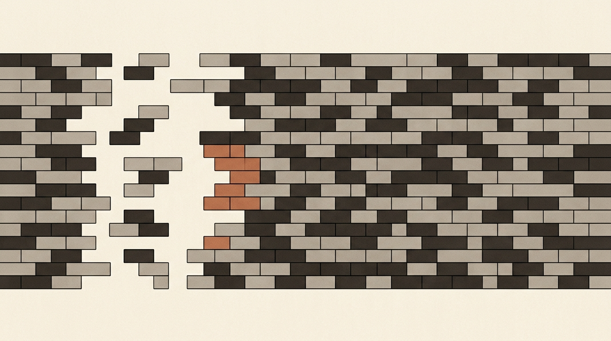
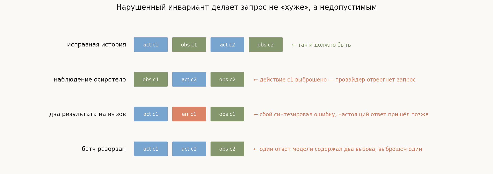
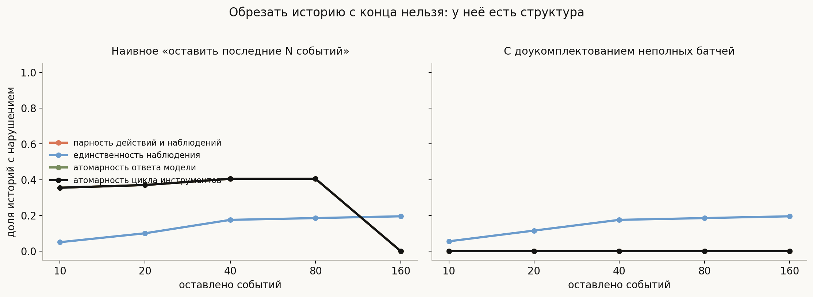
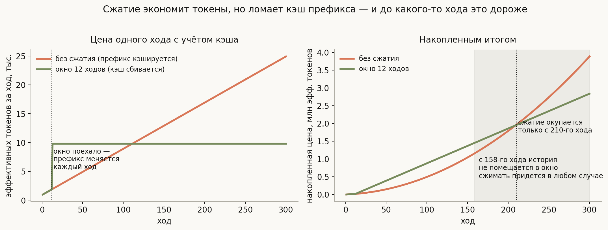

# Управление контекстом и его инварианты

**Вопрос**: Почему у агента кончается контекст и что с этим делают? Почему нельзя просто обрезать историю с начала? Какие свойства истории обязаны сохраняться при сжатии?

[Предыдущая лекция](../agent-loop/lesson.md) закончилась неприятным фактом: цикл посылает всю историю заново на каждом шаге, поэтому длина запроса растёт линейно и на 158-м ходу упирается в окно 128k. Дальше сессия физически не помещается — и никакие деньги этого не исправят.

Значит, историю надо сокращать. И здесь начинается тема, которую обычно недооценивают, потому что она звучит просто: «выбросить старое». На самом деле задача выглядит иначе:

> **Сжатие контекста — это не суммаризация, а удаление под ограничениями.**

У истории агента есть **структура**, и она не декоративная. Действие и его результат связаны идентификатором вызова; один ответ модели может содержать несколько вызовов; провайдеры требуют строгого соответствия между ними. Нарушьте эту структуру — и запрос станет не «чуть хуже», а **недопустимым**: API вернёт ошибку.

Поэтому правильная постановка такая: есть поток событий, надо выбрать подмножество, влезающее в бюджет, при условии сохранения нескольких инвариантов. И почти вся инженерия темы — про эти инварианты, а не про то, чем именно суммировать.

## План

1. Почему история — не список сообщений
2. Четыре инварианта и откуда они взялись
3. Что ломает наивная обрезка
4. Доукомплектование чинит не всё
5. Стратегии сжатия
6. Сжатие против кэширования префикса
7. Что теряется и как это заметить
8. Что спрашивают на собеседовании
9. Типичные ошибки
10. Итог

---

## 1. Почему история — не список сообщений

В формате чата история выглядит как чередование ролей: пользователь, ассистент, пользователь. Для агента это не так.

Один ответ модели может содержать **несколько вызовов инструментов** сразу — например, прочитать три файла параллельно. Харнесс разбивает такой ответ на отдельные события, потому что каждый вызов исполняется и завершается сам по себе. Но для провайдера это по-прежнему **одно сообщение**, которое надо уметь собрать обратно.

У каждого вызова есть идентификатор (`tool_call_id`), и результат привязан именно к нему, а не к позиции в списке. Именно поэтому история — граф связей, а не последовательность строк, и выбрасывать из неё элементы наугад нельзя.

## 2. Четыре инварианта и откуда они взялись

В OpenHands SDK эти требования вынесены в отдельные объекты — «свойства представления». Их четыре, и у каждого своя причина, укоренённая в реальном контракте API, а не в эстетике.

**Парность действий и наблюдений.** На каждый `tool_call_id` в представлении должно быть ровно одно наблюдение. Anthropic, например, требует, чтобы каждому `tool_use` соответствовал ровно один `tool_result` в непосредственно следующем сообщении. Осиротевшее наблюдение (действие выброшено, результат остался) — гарантированная ошибка запроса.

**Единственность наблюдения.** На один вызов не больше одного результата. Причина этого свойства особенно поучительна: при **восстановлении после сбоя** харнесс синтезирует событие-ошибку для вызова, повисшего в воздухе, — а потом настоящее наблюдение всё-таки приходит, с опозданием. В истории оказываются два результата на один идентификатор. Это задача распределённых систем, протёкшая в управление контекстом.

**Атомарность ответа модели.** События, порождённые одним ответом (общий `llm_response_id`), либо все в представлении, либо все выброшены. Иначе исходное сообщение не собрать обратно.

**Атомарность цикла инструментов.** Непрерывная цепочка пар «действие — наблюдение» тоже неделима. Причина техническая и очень конкретная: у моделей Anthropic с включённым режимом рассуждения первый элемент такой цепочки несёт блок размышления, и его положение проверяется контрольной суммой. Выбросьте любой элемент — придётся выбросить всю цепочку.

Обратите внимание на общую черту: **все четыре — про целостность, а не про смысл**. Ни одно не говорит «сохрани важное». Они говорят «не сделай запрос невалидным». Это разные задачи, и путать их не стоит.

## 3. Что ломает наивная обрезка

Самая очевидная стратегия — оставить последние $N$ событий. Проверим, что с ней не так, на 200 синтетических историях по 40 ходов, где ответ модели с вероятностью 0.35 содержит несколько вызовов, а в каждой пятой истории случается восстановление после сбоя.

Левая панель: наивная обрезка нарушает парность и атомарность в **36–40%** историй. Причина проста — граница отсечения проходит где попало, в том числе посередине батча из трёх вызовов.

Обратите внимание, что при 160 оставленных событиях нарушения исчезают: история просто помещается целиком, и обрезки не происходит. Это удобная проверка того, что мы измеряем именно эффект обрезки.

## 4. Доукомплектование чинит не всё

Естественное лечение: после обрезки **доукомплектовать неполные батчи** — если от ответа модели остался хоть один элемент, вернуть остальные. Правая панель показывает результат: парность и обе атомарности падают в ноль при любом размере окна.

А вот **единственность наблюдения так и остаётся нарушенной в 6–20%** историй.

Это не недоработка, а важный вывод: **четыре инварианта не сводятся друг к другу, потому что нарушаются по разным причинам**. Парность и атомарность ломает обрезка — их и чинит правило, обратное обрезке. А дубликаты наблюдений появились ещё до всякого сжатия, при восстановлении после сбоя, и никакое доукомплектование их не уберёт: нужен отдельный проход дедупликации.

Отсюда и устройство настоящих реализаций: свойства проверяются и восстанавливаются **по очереди**, каждое своим механизмом, а не одной универсальной функцией.

## 5. Стратегии сжатия

Инварианты задают рамку допустимого; внутри неё живут собственно стратегии.

**Скользящее окно.** Держать последние $W$ ходов. Просто, предсказуемо, дёшево. Минус очевиден: то, что выехало за окно, исчезает бесследно — вместе с формулировкой задачи, если она была в начале.

**Суммаризация.** Заменить старый кусок истории текстовым пересказом, сделанным той же моделью. В SDK это `LLMSummarizingCondenser`. Плюс — сохраняется суть; минусы серьёзнее, чем кажется: пересказ стоит отдельного вызова модели, он сам может исказить факты, и он необратим — потерянную деталь уже не вернуть.

**Пайплайн.** Несколько стратегий подряд: например, сначала усечь длинные наблюдения, потом свернуть старые ходы, потом применить окно. В SDK для этого есть `PipelineCondenser`. Это преобладающий подход на практике, потому что разные части истории заслуживают разного обращения: вывод `ls` на тысячу строк и формулировка задачи — не одно и то же.

**Ничего не сжимать, но не всё показывать.** Отдельно стоит помнить, что поток событий и вход модели — разные вещи. Часто достаточно **не удалять**, а не показывать: событие остаётся в журнале для отладки и восстановления, но в представление не попадает. Это возвращает разговор к разделу 3 предыдущей лекции: источник истины — поток, вход модели — его проекция.

## 6. Сжатие против кэширования префикса

Здесь прячется контринтуитивный результат, ради которого стоит считать, а не рассуждать.

Провайдеры кэшируют **префикс** промпта: если начало запроса совпадает с предыдущим, оно обрабатывается сильно дешевле (порядка десятикратной скидки). Для агента без сжатия это идеальный случай: история только дописывается, поэтому весь запрос, кроме последнего хода, — неизменившийся префикс.

А теперь скользящее окно. Как только оно поехало, из начала запроса **выпадает старое** — и префикс меняется на каждом ходу. Кэш перестаёт попадать почти полностью.

Посчитано при десятикратной скидке на кэш, 2000 токенах системного промпта и 800 на ход:

| Момент | Что происходит |
|---|---|
| ход 21 | сжатие **дороже** в 3.8 раза |
| ход 112 | цена одного хода сравнивается |
| ход 158 | несжатая история перестаёт помещаться в окно |
| ход 210 | сжатие окупается накопленным итогом |

Прочитайте эту таблицу целиком, и вывод окажется резким: **окно, где сжатие экономит деньги, наступает позже, чем момент, когда сжимать приходится в любом случае**. То есть экономия — вообще не тот аргумент.

Отсюда честная формулировка: сжатие нужно, **чтобы влезть**, а не чтобы сэкономить. А если вы сжимаете ради экономии при работающем кэше префикса — скорее всего, делаете хуже. Из этого же следует практический приём: сжимать **редко и большими кусками**, а не понемногу каждый ход. Один разрыв кэша раз в двадцать ходов обходится дешевле, чем двадцать разрывов подряд.

## 7. Что теряется и как это заметить

Инварианты гарантируют, что запрос останется валидным. Они ничего не говорят о том, останется ли он **полезным**. Типичные потери:

- **Исходная формулировка задачи.** Уехала за окно — и агент постепенно начинает решать не то. Лечится закреплением: первое сообщение никогда не выбрасывается.
- **Уже проверенные гипотезы.** Забыв, что путь не сработал, агент пробует его снова. Это прямая дорога к застреванию из предыдущей лекции — только вызванному не моделью, а сжатием.
- **Договорённости с пользователем.** «Не трогай файлы в `legacy/`» имеет свойство исчезать ровно тогда, когда нужнее всего.

Заметить это трудно, потому что симптом отложен: сжатие произошло на 30-м ходу, а странное поведение началось на 45-м. Практический приём — логировать сам факт сжатия как событие и при разборе инцидента сначала смотреть, не было ли сжатия перед сбоем.

## 8. Что спрашивают на собеседовании

**Почему нельзя просто обрезать историю с начала?** У неё структура: действия и наблюдения связаны идентификаторами, один ответ модели может содержать несколько вызовов. Обрезка по границе события нарушает парность в 36–40% случаев, и запрос становится невалидным.

**Какие инварианты должны сохраняться?** Парность действий и наблюдений, единственность наблюдения на вызов, атомарность ответа модели, атомарность цикла инструментов.

**Откуда берётся два результата на один вызов?** Из восстановления после сбоя: харнесс синтезирует ошибку для повисшего вызова, а настоящий результат приходит позже.

**Достаточно ли доукомплектовать неполные батчи?** Нет. Это чинит парность и атомарность, но не дубликаты — они возникли до сжатия и требуют отдельной дедупликации.

**Чем плоха суммаризация?** Стоит отдельного вызова модели, может исказить факты и необратима.

**Как сжатие взаимодействует с кэшированием префикса?** Скользящее окно меняет префикс каждый ход и обнуляет кэш. При десятикратной скидке сжатие окупается только к 210-му ходу — позже, чем становится обязательным.

**Когда сжимать?** Редко и большими кусками, а не понемногу каждый ход: каждый разрыв кэша стоит дорого.

## 9. Типичные ошибки

- **Считать сжатие суммаризацией.** Это удаление под ограничениями; суммаризация — лишь одна из стратегий внутри рамки.
- **Обрезать по числу токенов, не глядя на структуру.** Граница попадёт в середину батча, и запрос отвергнет провайдер.
- **Думать, что доукомплектование батчей решает всё.** Дубликаты наблюдений оно не трогает.
- **Сжимать ради экономии при работающем кэше.** До сотни ходов это дороже, чем не сжимать вовсе.
- **Сжимать понемногу каждый ход.** Каждый раз сбивается кэш; лучше редко и крупно.
- **Выбрасывать первое сообщение.** Формулировка задачи — последнее, что стоит терять.
- **Удалять событие из журнала вместо того, чтобы не показывать его модели.** Поток событий нужен для отладки и восстановления; проекция для модели — отдельная сущность.
- **Искать причину странного поведения только в последних ходах.** Сжатие даёт отложенный симптом.

## 10. Итог

Контекст агента кончается неизбежно, потому что цикл дописывает историю и посылает её заново, — но сокращать её наивно нельзя: история не список сообщений, а структура, где действия связаны с наблюдениями идентификаторами вызовов, а один ответ модели может порождать несколько событий сразу. Отсюда правильная постановка: сжатие есть удаление под ограничениями, и ограничения эти — не про смысл, а про целостность, потому что их нарушение делает запрос не менее полезным, а попросту невалидным. Четыре инварианта — парность, единственность наблюдения, атомарность ответа и атомарность цикла инструментов — не сводятся друг к другу: измерение показывает, что доукомплектование неполных батчей полностью чинит парность и атомарность, но оставляет 6–20% историй с дубликатами наблюдений, потому что те возникли раньше, при восстановлении после сбоя. Внутри рамки инвариантов живут стратегии — окно, суммаризация, пайплайн, — и выбирать между ними стоит, помня, что сжатие конфликтует с кэшированием префикса: при десятикратной скидке скользящее окно окупается только к 210-му ходу, тогда как обязательным становится уже к 158-му. Значит, сжимают не ради экономии, а чтобы влезть, и делать это лучше редко и большими кусками.

---

## Что рядом

- [`generate_visuals.py`](generate_visuals.py) — инварианты реализованы кодом и проверены на 200 историях; конфликт с кэшем посчитан
- [Агентный цикл](../agent-loop/lesson.md) — откуда берётся квадратичный рост и почему контекст кончается
- [README трека](../README.md) — какие харнессы служат источником примеров
