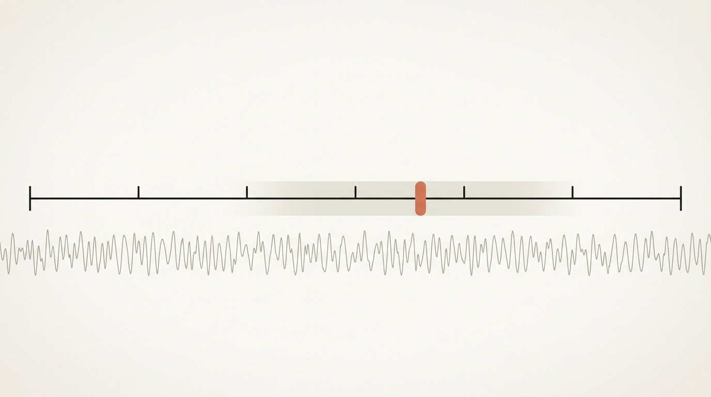
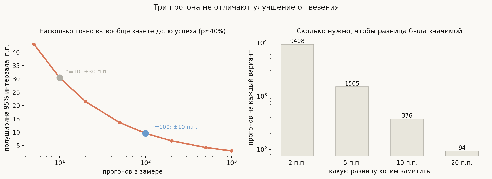
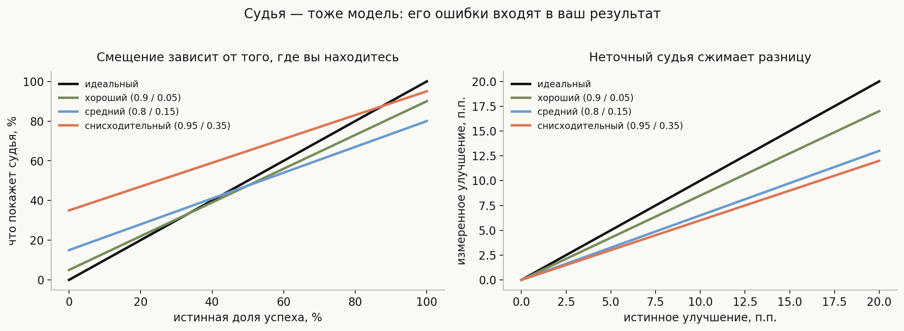
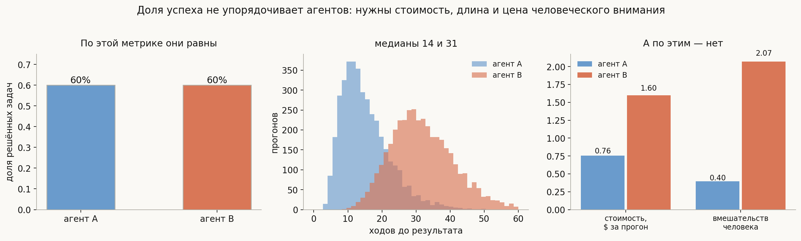

# Как понять, что харнесс работает

**Вопрос**: Как измерять качество агента? Почему «прогнали десять задач, стало лучше» ничего не значит? Можно ли использовать модель как судью и что с этим не так?

Все предыдущие лекции трека описывали, как что-то улучшить: сжать контекст, переписать описания инструментов, добавить критика, вынести разведку в подагента. Каждое такое изменение хочется проверить — и вот здесь начинается тема, в которой ошибаются чаще всего.

Проблема в том, что успех агента **не наблюдаем напрямую**. У классификатора есть метка, с которой можно сравнить ответ. У агента есть траектория из полусотни шагов и вопрос «решил ли он задачу», на который часто нет однозначного ответа даже у человека. Всё, что вы измеряете, — это оценка через прибор, который сам шумит и смещает.

> **Улучшение агента вы не наблюдаете, а оцениваете — и точность этой оценки почти всегда переоценивают.**

## План

1. Почему это трудно
2. Шум: сколько прогонов действительно нужно
3. Судья — тоже модель
4. Что мерить, кроме доли успеха
5. Результат против процесса
6. Бенчмарки и их пределы
7. Что спрашивают на собеседовании
8. Типичные ошибки
9. Итог

---

## 1. Почему это трудно

Три свойства задачи, которых нет в обычной оценке моделей.

**Недетерминизм.** Один и тот же агент на одной и той же задаче даёт разные траектории. Успех — случайная величина, а не свойство пары «агент, задача».

**Длинные траектории.** Ошибка на пятом шаге может не проявиться до сорокового, а может не проявиться вовсе. Приписать неудачу конкретному решению обычно невозможно.

**Нет единственного правильного ответа.** «Починил баг» — это прошли тесты? не сломал остальное? написал понятный код? Для многих задач правильных решений много, и формальная проверка покрывает лишь часть требований.

Отсюда всё остальное: раз успех случаен, нужна статистика; раз ответ неоднозначен, нужен судья; раз судья тоже модель, нужна оценка судьи.

## 2. Шум: сколько прогонов действительно нужно

Самая частая и самая дорогая ошибка в этой теме — делать выводы по маленькой выборке.

При доле успеха около 40%:

- **10 прогонов** дают 95-процентный интервал шириной **±30 процентных пунктов**. Это значит, что измерив «60%», вы не можете исключить ни 30%, ни 90%. Практически никакой информации.
- **100 прогонов** сужают интервал до **±10 п.п.** — уже что-то, но всё ещё грубо.
- Чтобы уверенно заметить улучшение на **5 п.п.**, нужно около **1500 прогонов на каждый вариант**.

Последнее число стоит запомнить, потому что оно ломает привычную практику. Изменение, которое даёт +5 п.п. — вполне достойное улучшение, — на выборке из полусотни задач попросту неотличимо от шума.

Что с этим делать практически:

**Не сравнивать по одному прогону на задачу.** Прогонять каждую задачу несколько раз и усреднять — так вы отделяете разброс агента от разброса задач.

**Использовать парное сравнение.** Гонять оба варианта на одном и том же наборе задач с одинаковыми условиями: дисперсия разницы намного меньше дисперсии каждой величины, и нужный размер выборки падает.

**Не гнаться за малыми улучшениями.** Если бюджет позволяет 100 прогонов, вы способны заметить разницу порядка 15–20 п.п. Изменения меньшего масштаба на таком бюджете просто не проверяются, и честнее это признать, чем показывать таблицу с тремя знаками.

## 3. Судья — тоже модель

Когда формальной проверки нет, качество оценивают моделью: ей дают формулировку задачи и стенограмму и просят вынести вердикт. В OpenHands SDK это функция `judge_goal`, устроенная как чистое отображение «цель плюс стенограмма → вердикт со скалярной оценкой», причём ответ судьи разбирается **консервативно** — по той же схеме поиска объекта, что и в [лекции про инструменты](../tools-and-function-calling/lesson.md).

Подход рабочий, но у него есть свойство, которое надо считать, а не игнорировать: судья ошибается, и его ошибки входят в ваш результат.

Левая панель показывает смещение самой доли успеха. Судья, который принимает 95% правильных решений, но при этом одобряет 35% неправильных, покажет высокую долю успеха почти независимо от того, что происходит на самом деле.

Правая панель важнее для практики. Судья с чувствительностью 0.8 и долей ложных одобрений 0.15 **сжимает измеренное улучшение до 65% от истинного**: реальные +10 п.п. вы увидите как +6.5. Комбинируя это с предыдущим разделом, получаем неприятный вывод: неточный судья не просто добавляет шум, он **систематически уменьшает наблюдаемый эффект**, а значит, требует ещё большей выборки.

Отсюда практические требования к судье:

- **Измерять его согласие с человеком** на размеченной подвыборке — иначе вы не знаете, во что превращается ваш результат.
- **Судить по критериям, а не по общему впечатлению**: список проверяемых условий даёт заметно более устойчивый вердикт, чем вопрос «хорошо ли решено».
- **Не судить моделью то, что проверяется кодом.** Если есть тесты — запускайте тесты. Судья нужен там, где формальной проверки нет.
- **Помнить про склонность к своим ответам.** Модель, оценивающая результат той же модели, систематически снисходительнее; это документированный эффект, и он смещает сравнение агентов на разных моделях.

## 4. Что мерить, кроме доли успеха

Даже безупречно измеренная доля успеха не упорядочивает агентов.

Два агента решают ровно **60%** задач. Но:

| | агент A | агент B |
|---|---|---|
| ходов до результата (медиана) | 14 | 31 |
| стоимость прогона | $0.76 | $1.60 |
| вмешательств человека | 0.4 | 2.1 |

По единственной метрике они неразличимы, по остальным — вдвое различаются. И «вмешательства человека» здесь, пожалуй, важнее всего остального: агент, требующий двух подтверждений на прогон, не экономит время, ради которого его заводили.

Минимальный разумный набор метрик выглядит так: **доля успеха, стоимость, число ходов, число вмешательств человека и доля прогонов, оборвавшихся по лимиту**. Последнее — прямо из [первой лекции](../agent-loop/lesson.md): если треть прогонов упёрлась в потолок итераций, вы измеряете свои настройки, а не агента.

## 5. Результат против процесса

Есть два принципиально разных подхода, и путать их не стоит.

**Оценка результата** (outcome): смотрим только на конечное состояние — прошли ли тесты, появился ли нужный файл, верен ли ответ. Дёшево, объективно, автоматизируемо. Но ничего не говорит о том, **как** получилось: агент мог решить задачу, случайно снеся половину проекта.

**Оценка процесса** (process): смотрим на траекторию — были ли лишние действия, повторы, опасные операции, откаты. Дороже и субъективнее, зато отвечает на вопрос, почему не получилось, и позволяет чинить конкретное место.

Практическая связка простая: результат нужен для **сравнения** вариантов, процесс — для **отладки**. Пытаться отлаживать по доле успеха бесполезно: она говорит, что стало хуже, но не где.

И отдельный приём, который стоит завести: **проверять инварианты на траектории**, а не только результат. Не трогал ли агент файлы вне рабочего каталога, не выполнял ли запрещённых команд, не зациклился ли. Это дешёвая автоматическая оценка процесса, не требующая судьи.

## 6. Бенчмарки и их пределы

Публичные наборы задач полезны и обязательно должны использоваться, но у них есть свойства, которые нужно держать в голове.

**Загрязнение.** Задачи из популярных наборов почти наверняка попали в обучающие данные модели. Высокий результат может означать не умение решать, а знакомство с ответом.

**Подгонка под метрику.** Как только по бенчмарку начинают сравниваться, его начинают оптимизировать — в том числе способами, не переносящимися на реальные задачи.

**Несовпадение распределения.** Ваши задачи почти наверняка отличаются от бенчмарковых по размеру репозитория, качеству формулировок и наличию тестов. Хороший результат на публичном наборе — слабое основание ожидать того же у себя.

Отсюда стандартная рекомендация: публичный бенчмарк для **сопоставимости с другими**, собственный набор из реальных задач — для **решений о своём продукте**. И собственный набор нужно закрывать от посторонних, иначе он повторит судьбу публичных.

## 7. Что спрашивают на собеседовании

**Почему оценка агентов сложнее, чем оценка модели?** Недетерминизм, длинные траектории, отсутствие единственного правильного ответа. Успех — случайная величина, а не свойство пары «агент, задача».

**Сколько прогонов нужно?** Гораздо больше, чем кажется: при доле успеха 40% десять прогонов дают интервал ±30 п.п., а для надёжного обнаружения разницы в 5 п.п. нужно около 1500 на вариант.

**Как сократить нужную выборку?** Парным сравнением на одном и том же наборе задач и несколькими прогонами каждой задачи.

**Что не так с моделью-судьёй?** Она ошибается, и её ошибки входят в результат: судья 0.8/0.15 сжимает истинное улучшение до 65%. Плюс склонность к ответам собственной модели.

**Как проверять судью?** Измерять согласие с человеком на размеченной подвыборке и судить по списку критериев, а не по общему впечатлению.

**Достаточно ли доли успеха?** Нет. Два агента с одинаковыми 60% могут отличаться вдвое по стоимости, длине прогона и числу вмешательств человека.

**Чем оценка результата отличается от оценки процесса?** Результат дёшев и годится для сравнения; процесс дороже, но нужен для отладки. Дешёвая замена процессной оценке — автоматическая проверка инвариантов на траектории.

## 8. Типичные ошибки

- **Делать выводы по десятку прогонов.** Интервал шире любого разумного эффекта.
- **Сравнивать по одному прогону на задачу.** Разброс агента смешивается с разбросом задач.
- **Считать вердикт судьи истиной.** Без замера согласия с человеком вы не знаете, что измерили.
- **Судить моделью то, что проверяется тестами.** Формальная проверка точнее и дешевле.
- **Оценивать результат работы модели ею же самой.** Систематическая снисходительность к своим ответам.
- **Смотреть только на долю успеха.** Она не различает дорогого и дешёвого агента.
- **Не отделять обрыв по лимиту от неудачи.** Иначе метрика измеряет настройки.
- **Верить публичному бенчмарку про свои задачи.** Загрязнение, подгонка и другое распределение.

## 9. Итог

Оценка агента отличается от оценки модели тем, что успех здесь не наблюдаем: он случаен из-за недетерминизма, размазан по длинной траектории и часто не имеет единственного правильного определения. Отсюда первое и главное следствие — статистическое: при доле успеха около 40% десять прогонов дают доверительный интервал шириной ±30 процентных пунктов, а чтобы уверенно заметить улучшение в 5 пунктов, нужно порядка полутора тысяч прогонов на вариант, из-за чего привычная практика «прогнали десяток задач, стало лучше» не даёт вообще никакой информации. Второе следствие — про прибор: там, где нет формальной проверки, судьёй работает модель, и её собственные ошибки не просто добавляют шум, а систематически сжимают наблюдаемый эффект — судья с чувствительностью 0.8 и долей ложных одобрений 0.15 показывает лишь 65% истинного улучшения. Третье — про то, что мерить: доля успеха не упорядочивает агентов, поскольку два агента с одинаковыми 60% могут вдвое различаться по стоимости, длине прогона и, что важнее всего, по числу требуемых вмешательств человека. И наконец, оценка результата годится для сравнения вариантов, а для отладки нужна оценка процесса, дешёвой заменой которой служит автоматическая проверка инвариантов на траектории.

---

## Что рядом

- [`generate_visuals.py`](generate_visuals.py) — размеры выборки, смещение от судьи и различие агентов посчитаны здесь
- [Агентный цикл](../agent-loop/lesson.md) — почему обрыв по лимиту нельзя считать неудачей
- [Подагенты и делегирование](../subagents-and-delegation/lesson.md) — критик как частный случай судьи внутри прогона
- [Метрики детекции](../../ml-interviews/ml-algorithms/deep-learning/computer-vision/detection-metrics/lesson.md) — там та же мысль: метрика есть протокол, а не формула
