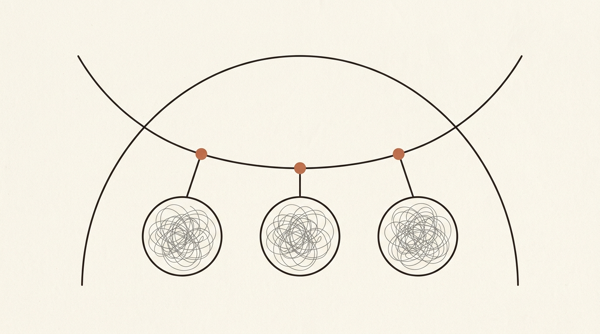
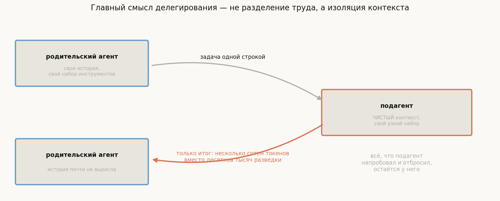
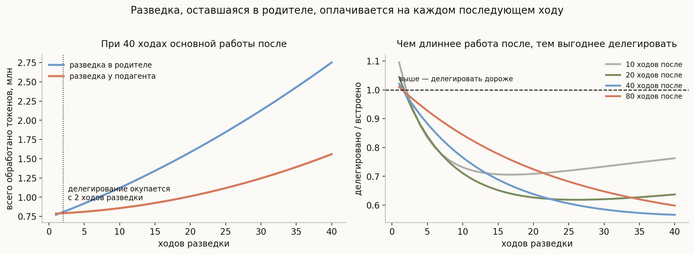
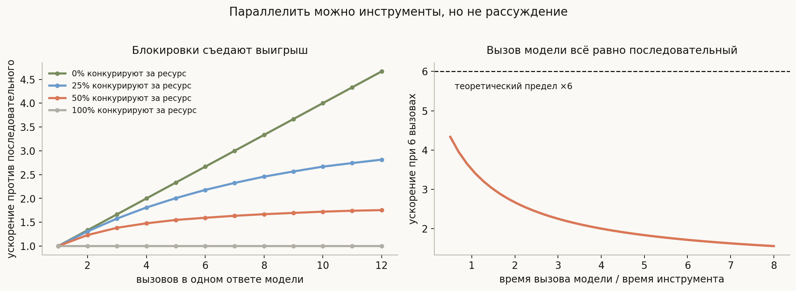
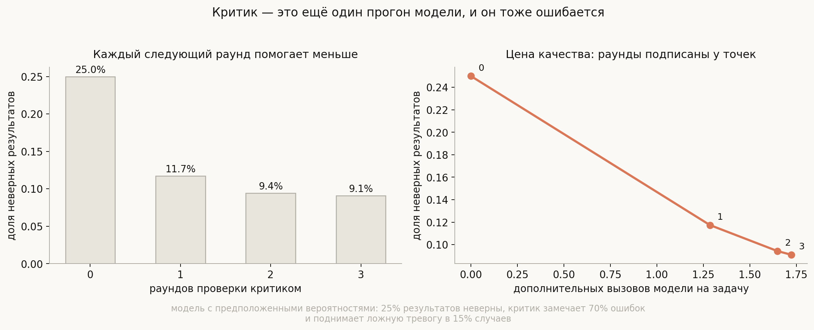

# Подагенты, параллельность и делегирование

**Вопрос**: Зачем агенту порождать подагентов? Можно ли исполнять несколько вызовов инструментов одновременно и что этому мешает? Помогает ли отдельный «критик»?

Про подагентов обычно говорят как про разделение труда: один специализируется на поиске, другой на правке, третий на тестах. Это правда, но это не главная причина, и объяснение через специализацию ведёт к неверным решениям — например, к попытке завести подагента на каждую роль.

Настоящая причина видна, если вспомнить [квадратичный рост контекста](../agent-loop/lesson.md): всё, что попало в историю, оплачивается на **каждом** последующем ходу. А разведка — чтение десятка файлов, три неудачные гипотезы, длинные выводы `grep` — это как раз то, что нужно **сделать и забыть**.

> **Делегирование — это в первую очередь управление контекстом, а не разделение труда.**

Подагент получает чистый контекст, делает грязную работу у себя и возвращает родителю только итог. Всё, что он напробовал и отбросил, остаётся при нём и умирает вместе с ним.

## План

1. Что подагент получает и что возвращает
2. Экономика делегирования
3. Что передавать: задача, а не история
4. Параллельность: инструменты можно, рассуждение нельзя
5. Разделяемые ресурсы и блокировки
6. Критик: вторая пара глаз
7. Чего делегирование не чинит
8. Что спрашивают на собеседовании
9. Типичные ошибки
10. Итог

---

## 1. Что подагент получает и что возвращает

Подагент — это отдельный экземпляр того же цикла, со своей историей, своим набором инструментов и своими лимитами. Родитель вызывает его как обычный инструмент: передаёт формулировку задачи, получает результат.

Асимметрия здесь принципиальная. **Вход** — короткий: одна-две фразы задачи. **Выход** — тоже короткий: итог на несколько сотен токенов. А между ними у подагента может пройти двадцать ходов с десятками тысяч токенов разведки, которых родитель никогда не увидит.

Именно эта асимметрия и есть механизм: делегирование превращает длинный процесс в короткое событие с точки зрения родительской истории.

## 2. Экономика делегирования

Делегирование не бесплатно: у подагента свой системный промпт и свои описания инструментов, которые надо оплатить заново. Значит, есть точка окупаемости — посчитаем её.

При 800 токенах на ход, 2000 токенах системного промпта родителя, 3000 у подагента и итоге в 300 токенов:

- **Делегирование окупается уже с двух ходов разведки** — при условии, что после неё родителю предстоит ещё 40 ходов работы.
- При 20 ходах разведки делегированный вариант стоит **64%** от встроенного.

Правая панель показывает, от чего это зависит сильнее всего: **от длины работы после разведки**. Если родитель после этого сделает ещё три хода, делегировать почти бессмысленно — разведка всё равно почти не успеет накопить платы. Если сорок — выигрыш существенный.

Отсюда правило, которое стоит держать в голове: делегируют не потому, что задача сложная, а потому, что **её промежуточные результаты не нужны дальше**. Хороший кандидат на подагента — вопрос, ответ на который короткий, а путь к нему длинный.

## 3. Что передавать: задача, а не история

Соблазн передать подагенту родительскую историю «чтобы он был в курсе» уничтожает всю выгоду: контекст перестаёт быть чистым, и вы получаете два дорогих агента вместо одного.

Работающий подход — передавать **формулировку задачи**, составленную родителем, а не сырую историю. Это, кстати, отдельная работа для модели: сжать всё, что она знает, в самодостаточное задание. И качество этого задания определяет качество результата больше, чем что-либо ещё.

Симметрично на возврате: подагент должен вернуть **ответ, а не отчёт о проделанной работе**. Если он возвращает «я посмотрел файлы A, B, C, потом попробовал X, не вышло, потом Y» — вы снова оплатили разведку, просто в пересказе.

Отсюда практический приём: явно задавать формат ответа подагента в его системном промпте — что именно и в каком объёме он обязан вернуть.

## 4. Параллельность: инструменты можно, рассуждение нельзя

Отдельная тема — одновременное исполнение. Модель может в **одном** ответе запросить сразу несколько вызовов инструментов, и харнесс вправе исполнить их параллельно.

Но выигрыш ограничен, и по двум разным причинам.

**Вызов модели остаётся последовательным.** Правая панель: даже при идеальной параллельности инструментов ускорение упирается в долю времени, которую занимает сам вызов модели. При шести вызовах теоретический предел ×6 достигается только если модель отвечает мгновенно. В реальных пропорциях (модель отвечает дольше, чем работает инструмент) ускорение оказывается около **×2.7** вместо шести.

**Ресурсы конфликтуют.** Левая панель: если четверть вызовов конкурирует за один и тот же ресурс, ускорение падает с ×2.7 до **×2.2**.

Это ровно тот случай, когда полезно помнить, что харнесс — обычная параллельная программа со всеми её проблемами.

## 5. Разделяемые ресурсы и блокировки

Почему вызовы вообще конфликтуют: два одновременных редактирования одного файла дают потерянную правку; два процесса в одном рабочем каталоге мешают друг другу; счётчик, увеличенный дважды, увеличивается один раз.

Поэтому исполнитель параллельных вызовов — не просто пул потоков. В OpenHands SDK это `ParallelToolExecutor` с настраиваемым пределом одновременности и **менеджером блокировок ресурсов**: инструмент объявляет, какой ресурс он трогает, и вызовы с одинаковым ключом ресурса выстраиваются в очередь.

Две тонкости, которые стоит знать.

**Блокировки порождают взаимоблокировки.** В коде SDK прямо оговорено, что подагент не должен захватывать ресурсы, которые держит родитель, — иначе получится классический дедлок между агентом и его же потомком.

**Порядок результатов не определён.** Параллельные вызовы завершаются в произвольном порядке, а в историю их надо положить так, чтобы соблюсти инварианты из [лекции про контекст](../context-management/lesson.md): каждому действию своё наблюдение, и все события одного ответа модели — единым блоком.

## 6. Критик: вторая пара глаз

Отдельный приём — прогнать результат через второй экземпляр модели, задача которого не решать, а **проверять**. В SDK это `CriticMixin`: критик оценивает результат и может отправить работу на доработку, а также решает, продолжать ли уточнение после сигнала о завершении.

Работает ли это? Посчитаем на явной модели.

Оговорка та же, что и раньше: вероятности **предположены**, а не измерены — 25% результатов неверны, критик замечает 70% ошибок и поднимает ложную тревогу в 15% случаев. Картинка про форму зависимости, а не про реальные доли.

| Раундов проверки | Доля неверных | Лишних вызовов модели |
|---|---|---|
| 0 | 25.0% | 0 |
| 1 | 11.7% | 1.29 |
| 2 | 9.4% | 1.65 |
| 3 | 9.1% | 1.72 |

**Первый раунд даёт больше половины всего выигрыша**, второй — заметно меньше, третий почти ничего. Причина очевидна из модели: критик ловит не все ошибки, а доработка сама может внести новую. Есть предел, ниже которого повторные проверки не опускают, и он определяется качеством критика, а не их числом.

Практический вывод: один раунд проверки — почти всегда хорошая сделка, три — обычно нет. И отдельно стоит помнить, что **критик ошибается тоже**: 15% ложных тревог означают лишние доработки правильных результатов, то есть чистые потери.

## 7. Чего делегирование не чинит

Полезно очертить границы, чтобы не ждать от приёма лишнего.

**Оно не делает модель умнее.** Подагент — та же модель с тем же качеством рассуждения. Если задача не по силам, разделение её на подзадачи поможет только если подзадачи действительно проще.

**Оно вводит новую точку отказа — формулировку.** Родитель может поставить задачу неточно, и подагент безупречно решит не то. Это самый частый способ сломать делегирование, и он не виден в логах подагента: там всё выглядит правильным.

**Оно множит стоимость на плохих задачах.** Если результат подагента приходится перепроверять и переспрашивать, вы платите за оба контекста и не экономите ни на одном.

**Оно не спасает от общей путаницы.** Если родитель сам не понимает, что делает, набор подагентов сделает то же самое, только дороже и в нескольких местах сразу.

## 8. Что спрашивают на собеседовании

**Зачем нужны подагенты?** Прежде всего для изоляции контекста: разведка не попадает в родительскую историю и не оплачивается на каждом последующем ходу. Специализация — приятное следствие, а не причина.

**Когда делегировать невыгодно?** Когда после делегирования родителю осталось мало работы: тогда фиксированная плата за отдельный контекст не окупается.

**Что передавать подагенту?** Самодостаточную формулировку задачи, а не историю. И требовать от него ответ, а не отчёт.

**Может ли модель запросить несколько инструментов сразу?** Да, это штатный режим: один ответ модели содержит несколько вызовов, и харнесс вправе исполнить их параллельно.

**Что ограничивает выигрыш от параллельности?** Вызов модели остаётся последовательным (при шести вызовах ускорение около ×2.7 вместо ×6), а конкуренция за общие ресурсы снижает его дальше — до ×2.2 при четверти конфликтующих вызовов.

**Зачем блокировки ресурсов?** Два одновременных изменения одного файла или каталога дают гонку. Инструмент объявляет ресурс, вызовы с одним ключом выстраиваются в очередь.

**Помогает ли критик?** Один раунд снимает больше половины ошибок, дальнейшие дают всё меньше, и критик сам ошибается — ложные тревоги стоят лишних доработок.

## 9. Типичные ошибки

- **Заводить подагента ради специализации.** Главная выгода — изоляция контекста; специализация без неё почти не окупается.
- **Передавать подагенту родительскую историю.** Это уничтожает всю экономию: чистого контекста больше нет.
- **Позволять подагенту возвращать отчёт.** Пересказ разведки — та же разведка, только дороже.
- **Делегировать в конце работы.** Если после этого родителю почти нечего делать, фиксированная плата не окупится.
- **Считать параллельность бесплатным ускорением.** Модель отвечает последовательно, а инструменты конкурируют за ресурсы.
- **Забывать про блокировки.** Параллельные правки одного файла — обычная гонка данных.
- **Давать подагенту захватывать ресурсы родителя.** Прямой путь к взаимоблокировке.
- **Наращивать раунды критика.** После первого отдача резко падает, а ложные тревоги остаются.

## 10. Итог

Подагент существует не ради разделения труда, а ради изоляции контекста: он делает длинную грязную работу у себя и возвращает родителю короткий итог, поэтому вся разведка не оседает в родительской истории и не оплачивается на каждом последующем ходу. Экономика этого проста и считается: при разумных допущениях делегирование окупается уже с двух ходов разведки, но лишь при условии, что родителю после неё есть чем заняться, — иначе фиксированная плата за отдельный системный промпт и набор инструментов не отбивается. Передавать подагенту нужно самодостаточную задачу, а не историю, и требовать от него ответ, а не отчёт, иначе выгода исчезает. Параллельное исполнение нескольких вызовов из одного ответа модели — штатный режим, но выигрыш ограничен дважды: вызов модели остаётся последовательным, из-за чего шесть вызовов дают около ×2.7 вместо ×6, а конкуренция за общие ресурсы срезает и это, из-за чего исполнителю нужны блокировки и правило не захватывать ресурсы родителя. Наконец, критик как вторая пара глаз окупается ровно один раз: первый раунд снимает больше половины ошибок, а дальнейшие упираются в собственное качество критика и в его ложные тревоги.

---

## Что рядом

- [`generate_visuals.py`](generate_visuals.py) — экономика делегирования, пределы параллельности и модель критика посчитаны здесь
- [Агентный цикл](../agent-loop/lesson.md) — откуда берётся квадратичная плата за разведку
- [Управление контекстом](../context-management/lesson.md) — инварианты, которые обязаны пережить параллельное исполнение
- [Песочница и разрешения](../sandbox-and-permissions/lesson.md) — почему у подагента должен быть свой, более узкий набор прав
