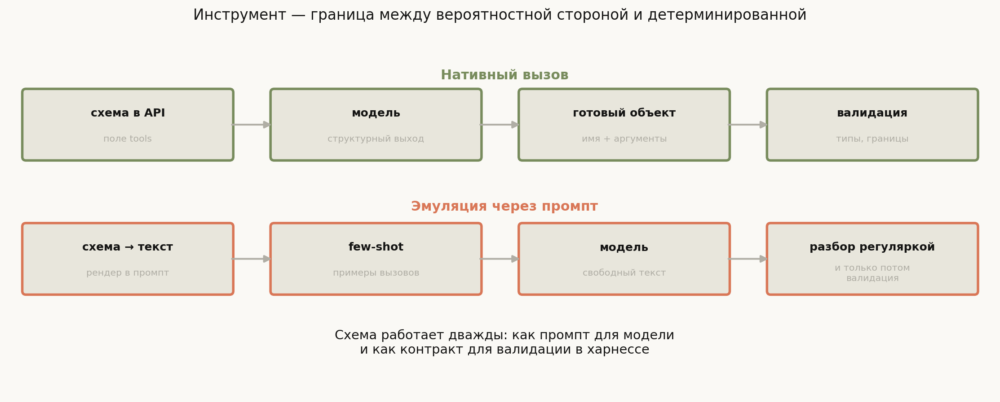
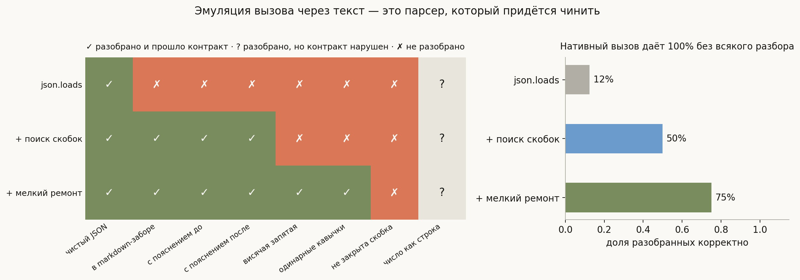
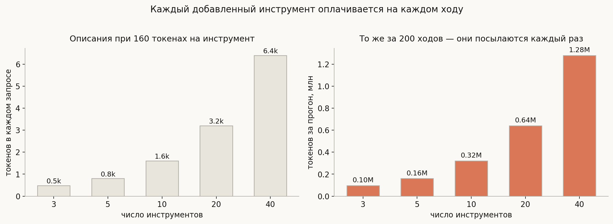
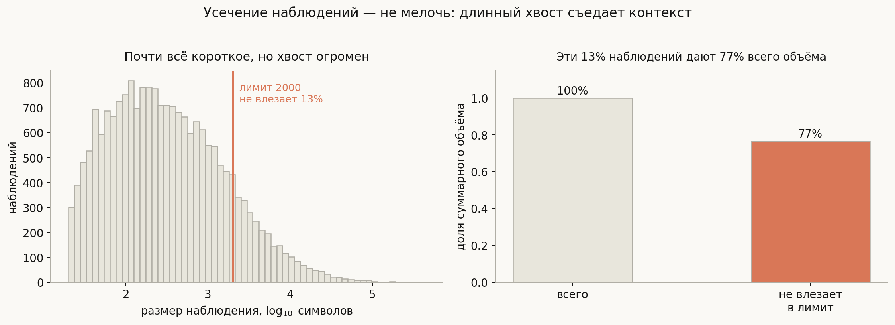

# Инструменты и function calling

**Вопрос**: Как модель «вызывает» инструмент? Чем нативный вызов отличается от эмуляции через промпт? Что такое хорошее описание инструмента и почему их нельзя добавлять бесконечно?

Инструмент — это место, где сходятся две системы с несовместимыми свойствами. С одной стороны модель: вероятностная, способная выдать что угодно, включая синтаксически правильный вызов несуществующей функции. С другой — код: детерминированный, требующий точных типов и падающий от лишней запятой.

Отсюда рамка всей темы:

> **Инструмент — это контракт на границе вероятностного и детерминированного, и схема работает по обе стороны границы сразу.**

Одна и та же JSON-схема служит двум разным целям: для модели она **промпт** (по ней модель понимает, что можно делать и как), для харнесса — **валидатор** (по ней проверяется, что пришло). Из этой двойной роли выводится почти всё практическое: почему описание инструмента — это работа промпт-инженера, почему валидацию нельзя пропустить даже при нативном вызове, и почему количество инструментов упирается в бюджет контекста.

## План

1. Два пути: нативный вызов и эмуляция
2. Разбор — это парсер, и он ломается
3. Разбор не равно валидность
4. Описание инструмента как промпт
5. Сколько инструментов помещается
6. Наблюдение — тоже интерфейс
7. Идемпотентность и повторы
8. MCP: инструменты как внешний протокол
9. Что спрашивают на собеседовании
10. Типичные ошибки
11. Итог

---

## 1. Два пути: нативный вызов и эмуляция

**Нативный вызов.** Провайдер принимает список схем в отдельном поле запроса и возвращает вызов структурно — отдельным полем ответа, а не текстом. Модель обучена этому формату, а декодирование часто ограничено грамматикой, поэтому синтаксически неверный вызов практически невозможен.

**Эмуляция через промпт.** Если модель нативного вызова не поддерживает, харнесс делает то же самое руками: рендерит схему в человекочитаемый текст, вставляет её в системный промпт, добавляет few-shot примеры правильных вызовов и затем **разбирает свободный текст** ответа регулярными выражениями.

Масштаб этой работы стоит оценить: в OpenHands SDK конвертер, занимающийся ровно этим, — почти тысяча строк кода. Там и рендер вложенных схем с `anyOf`/`oneOf`, и подстановка примеров под конкретный набор инструментов, и регулярка для обратного разбора результатов вида `EXECUTION RESULT of [...]`. Тысяча строк — хорошая мера того, насколько «просто попросить модель написать JSON» отличается от промышленного решения.

## 2. Разбор — это парсер, и он ломается

Проверим, насколько хрупок разбор. Возьмём восемь правдоподобных вариантов того, что модель выдаёт вместо чистого JSON, и три уровня парсера.

- **`json.loads` как есть** справляется с **12%**: достаточно markdown-забора или фразы «сейчас прочитаю файл» перед вызовом, чтобы всё сломалось.
- **Поиск объекта по фигурным скобкам** поднимает до **50%**: пояснения вокруг перестают мешать.
- **Мелкий ремонт** (снять забор, убрать висячие запятые, заменить одинарные кавычки) даёт **75%**.

И это на восьми заранее известных видах порчи. В реальности их больше, и каждый новый чинится очередной заплаткой в парсере.

Нативный вызов даёт 100% **без всякого разбора**: там нечего парсить, структура приходит структурой. Отсюда практический вывод: если модель поддерживает нативный вызов — пользуйтесь им, а эмуляцию держите как запасной путь для моделей, которые не умеют.

## 3. Разбор не равно валидность

Обратите внимание на последний столбец таблицы: «число как строка». Модель написала `"lines": "40"` вместо `"lines": 40`. Все три парсера разбирают это без единой жалобы — JSON корректен. Но контракт нарушен: инструмент ждёт число.

Это принципиально важное различение, и его стоит проговорить явно:

- **Разбор** отвечает на вопрос «удалось ли извлечь структуру».
- **Валидация** отвечает на вопрос «соответствует ли структура контракту».

Второе не следует из первого — и, что важнее, **нативный вызов гарантирует только первое**. Провайдер вернёт вам синтаксически корректный объект, но он может содержать имя несуществующего инструмента, отсутствующий обязательный аргумент, число вне допустимого диапазона или путь за пределы рабочего каталога.

Поэтому валидация обязательна всегда, независимо от способа вызова. И в SDK это отражено буквально: два разных класса исключений — ошибка конверсии и ошибка валидации — потому что это разные стадии с разными способами восстановления. Из ошибки валидации есть осмысленный выход: вернуть модели понятное сообщение о том, что именно не так, и дать исправиться.

## 4. Описание инструмента как промпт

Раз схема попадает модели во вход, её текст — это промпт, а значит, работает по законам промпта, а не документации.

Что из этого следует практически:

**Описание должно говорить, когда применять, а не только что делает.** «Читает файл» бесполезно. «Читает файл целиком; для файлов больше 2000 строк используй `search_in_file`» — уже сообщает модели границу применимости.

**Имена аргументов — часть подсказки.** `p` и `path` различаются для модели сильнее, чем для программиста: у второго есть смысл, выученный на обучающих данных.

**Соседние инструменты должны различаться.** Если у вас есть `edit_file` и `write_file` с похожими описаниями, модель будет путать их — и это не её ошибка, а ваша: контракт неоднозначен.

**Ошибки — тоже промпт.** Сообщение `Error: EACCES` учит модель меньше, чем `Нет прав на запись в /etc/hosts. Файлы вне рабочего каталога недоступны.` Второе позволяет исправиться, первое — только повторить.

Отсюда общий приём: относитесь к набору инструментов как к API, который читает не программист, а нетерпеливый стажёр, видящий документацию впервые и не имеющий возможности задать вопрос.

## 5. Сколько инструментов помещается

У щедрости с инструментами есть цена, и она регулярно оказывается неожиданной.

Описания инструментов лежат в системном промпте и посылаются **на каждом ходу**. При 160 токенах на инструмент двадцать инструментов — это 3200 токенов в каждом запросе и **0.6 млн токенов за прогон** в 200 ходов, ещё до всякого полезного содержимого.

Смягчающее обстоятельство: описания стоят в самом начале запроса и не меняются, поэтому попадают в кэшируемый префикс — а значит, обходятся примерно вдесятеро дешевле (см. [лекцию про контекст](../context-management/lesson.md)). Но именно поэтому их нельзя менять по ходу сессии: добавили инструмент на середине — сбили кэш всей истории.

Есть и вторая цена, которую не видно в токенах: **чем больше инструментов, тем чаще модель выбирает не тот**. Внимание распределяется между вариантами, а близкие по смыслу инструменты конкурируют. Отсюда типичное решение — не один плоский список из сорока штук, а несколько наборов, подключаемых под задачу, или делегирование части работы подагенту со своим коротким набором.

## 6. Наблюдение — тоже интерфейс

Про описания инструментов помнят все, про формат наблюдений — редко. А это ровно такой же промпт, только в обратную сторону: то, что модель узнаёт о мире, целиком определяется тем, как харнесс отформатировал результат.

Главная практическая проблема — размер. Вывод инструмента ничем не ограничен: `ls` большого каталога, стек-трейс, содержимое лога.

На правдоподобном распределении размеров при лимите в 2000 символов **13.5%** наблюдений не помещаются — но именно на них приходится **77% суммарного объёма**. Классическая картина длинного хвоста: почти всё короткое, а весь вес в редких гигантах.

Отсюда практика: усекать надо обязательно, но не с начала и не с конца. У длинного вывода информативны **оба края** — начало команды и её финальный результат, — а середина обычно однородна. Стандартный приём: оставить голову и хвост, а между ними явно написать, сколько строк пропущено. Явная отметка важна: без неё модель считает, что видит полный вывод, и делает выводы из обрезанных данных.

## 7. Идемпотентность и повторы

Цикл повторяет вызовы: из-за сетевых сбоев, из-за перезапуска, из-за того, что модель решила попробовать ещё раз. Поэтому у инструментов появляется требование, знакомое из распределённых систем.

**Идемпотентные** операции (прочитать файл, найти по шаблону, получить статус) можно повторять свободно. **Неидемпотентные** (создать ветку, отправить письмо, увеличить счётчик) при повторе дают неверный результат.

Практические приёмы прямолинейны: где возможно — делать операцию идемпотентной по построению (`mkdir -p` вместо `mkdir`); где нельзя — передавать ключ идемпотентности, чтобы повтор распознавался; а в описании инструмента честно писать, что операция необратима, чтобы модель не пробовала её «на всякий случай».

Здесь же смыкается с темой следующей лекции: необратимые операции — это ровно те, ради которых существуют подтверждения и песочница.

## 8. MCP: инструменты как внешний протокол

Долгое время каждый харнесс определял инструменты по-своему, и один и тот же «прочитать файл» приходилось писать заново под каждую систему. **MCP** (Model Context Protocol) — попытка развязать это: инструменты живут в отдельном процессе-сервере и объявляют себя по стандартному протоколу, а харнесс их только подключает.

Выигрыш очевиден — переиспользование и изоляция: сервер инструментов может работать в отдельном контейнере с собственными правами. Плата тоже понятна: лишний слой, сетевые задержки, а главное — **новая поверхность доверия**. Подключая чужой MCP-сервер, вы даёте ему описывать инструменты, которые увидит ваша модель; недобросовестное описание — это инъекция в промпт.

## 9. Что спрашивают на собеседовании

**Как модель вызывает инструмент?** Никак: она порождает описание вызова, а исполняет харнесс. При нативной поддержке вызов приходит структурно, иначе харнесс рендерит схемы в промпт и разбирает текст.

**Чем нативный вызов лучше эмуляции?** Не требует разбора вовсе. В прогоне на восьми видах порчи `json.loads` справляется с 12%, терпимый парсер — с 75%, нативный путь — со 100%.

**Нужна ли валидация при нативном вызове?** Да. Провайдер гарантирует синтаксис, но не контракт: имя может быть неизвестным, тип аргумента неверным, путь — за пределами песочницы.

**Как написать хорошее описание инструмента?** Указывать не только что делает, но и когда применять и когда не применять; давать осмысленные имена аргументам; различать близкие инструменты; писать ошибки так, чтобы по ним можно было исправиться.

**Почему нельзя дать агенту сорок инструментов?** Описания посылаются каждый ход (20 инструментов — 3200 токенов на запрос, 0.6 млн за прогон), и точность выбора падает с ростом числа близких вариантов.

**Что делать с огромным выводом инструмента?** Усекать, сохраняя оба края и явно помечая пропуск. В измерении 13.5% наблюдений дают 77% объёма.

**Зачем инструментам идемпотентность?** Цикл повторяет вызовы при сбоях и по инициативе модели; неидемпотентная операция при повторе даёт неверный результат.

## 10. Типичные ошибки

- **Считать, что нативный вызов снимает необходимость валидации.** Он гарантирует синтаксис, а не контракт.
- **Путать неудачу разбора и нарушение контракта.** Это разные стадии с разными способами восстановления; смешение мешает вернуть модели вразумительную ошибку.
- **Писать описания как документацию для программиста.** Это промпт: важно, когда применять, а не только что делает.
- **Возвращать модели системную ошибку как есть.** По `EACCES` исправиться нельзя, по объяснению — можно.
- **Добавлять инструменты без счёта.** Каждый оплачивается на каждом ходу и размывает выбор.
- **Менять набор инструментов посреди сессии.** Сбивается кэш префикса всей истории.
- **Отдавать наблюдение целиком или резать вслепую.** Нужны оба края и явная отметка о пропуске, иначе модель считает обрезанное полным.
- **Забывать про повторы.** Неидемпотентный инструмент рано или поздно выполнится дважды.

## 11. Итог

Инструмент — это граница между вероятностной моделью и детерминированным кодом, и держится она на схеме, которая работает сразу с двух сторон: для модели это промпт, для харнесса — контракт. При нативной поддержке вызов приходит структурой и разбирать нечего; при эмуляции через промпт харнесс рендерит схемы в текст, добавляет примеры и парсит свободный ответ — и парсер этот хрупок, что видно на измерении: `json.loads` справляется с 12% правдоподобных выходов, терпимый разбор — с 75%. Но даже стопроцентно надёжный разбор не отменяет валидации, потому что синтаксическая корректность и соответствие контракту — разные вещи: `"lines": "40"` разбирается идеально и всё равно недопустимо. Дальше начинается экономика: описания инструментов посылаются каждый ход, двадцать инструментов стоят 0.6 млн токенов за прогон и вдобавок размывают выбор модели, поэтому наборы держат небольшими и не меняют посреди сессии. Симметричная и чаще забываемая сторона — формат наблюдений: вывод инструмента не ограничен, 13.5% наблюдений съедают 77% объёма, и усекать их надо, сохраняя оба края и явно помечая пропуск, иначе модель примет обрезанное за полное.

---

## Что рядом

- [`generate_visuals.py`](generate_visuals.py) — парсеры, валидатор и распределение размеров наблюдений реализованы и посчитаны здесь
- [Агентный цикл](../agent-loop/lesson.md) — куда встраивается вызов инструмента
- [Управление контекстом](../context-management/lesson.md) — почему описания инструментов стоит держать в кэшируемом префиксе
