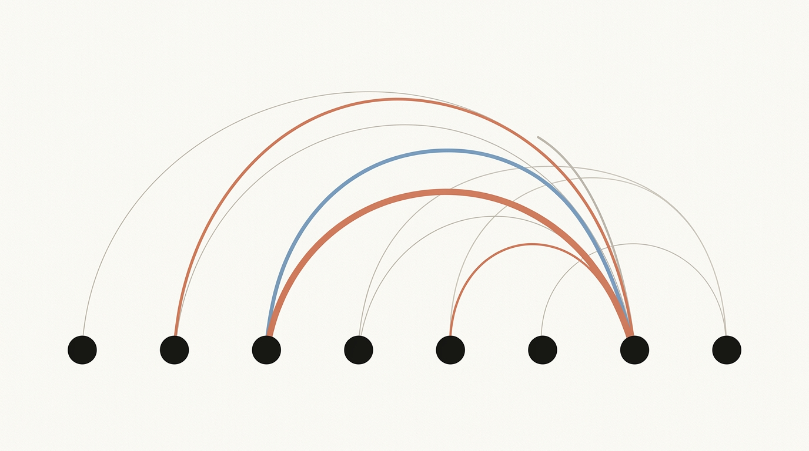
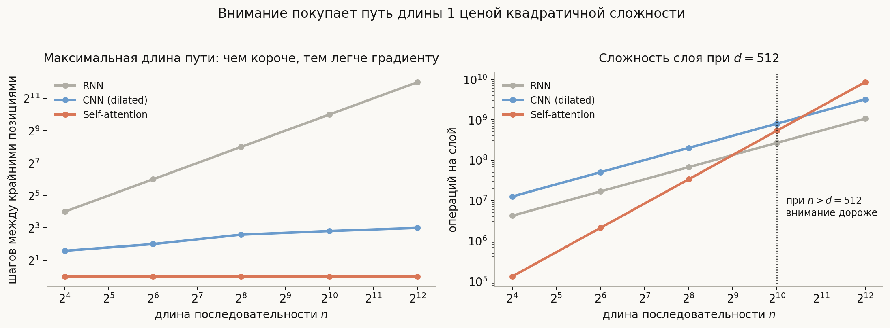
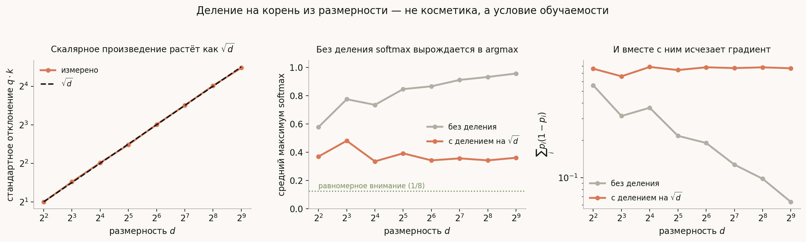
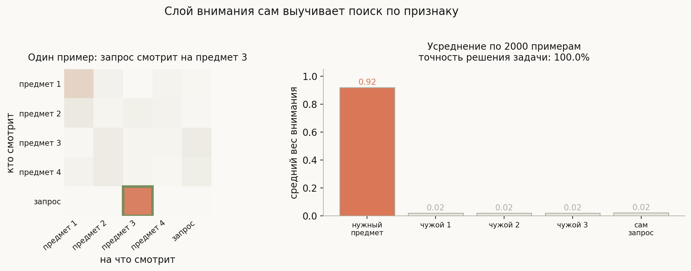
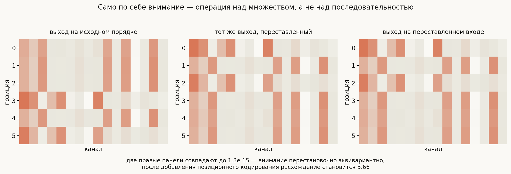
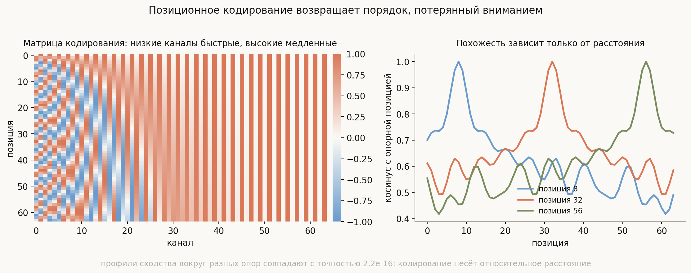

# Self-attention и трансформеры

**Вопросы (EN)**: What is the motivation for self-attention? Why choose it over RNNs and CNNs? Why multi-headed attention? How does the number of heads affect performance?

Внимание проще, чем кажется по формуле. Это **взвешенное среднее**: выход в каждой позиции — выпуклая комбинация векторов-значений всех позиций. Необычно в нём ровно одно: веса не фиксированы и не выучены заранее, а вычисляются на лету из самого содержимого — насколько запрос одной позиции похож на ключ другой.

Отсюда удобная рамка для всей темы. Всё, что делает внимание сильным, — следствие того, что веса **содержательные и глобальные**: любая позиция достаёт нужную ей информацию из любой другой за один шаг. А всё остальное в блоке трансформера существует, чтобы починить то, чего взвешенное усреднение **не может само**:

- оно не различает порядок → позиционное кодирование;
- оно линейно по значениям → полносвязный слой;
- одного канала не хватает, когда нужно достать сразу несколько вещей → несколько голов;
- глубокая стопка таких слоёв не обучается → residual и нормализация.

Если держать этот список в голове, архитектура перестаёт быть набором деталей и становится списком заплат к одной операции. Ниже каждый пункт проверен прогоном, а не заявлен.

## План

1. Чем плохи RNN и CNN
2. Внимание как обучаемый поиск
3. Зачем делить на корень из размерности
4. Что внимание умеет само
5. Оно не знает о порядке
6. Оно линейно по значениям
7. Multi-head: зачем и сколько голов
8. Остальной блок: residual и нормализация
9. Маскирование и три вида внимания
10. Цена: квадрат по длине
11. Что спрашивают на собеседовании
12. Типичные ошибки
13. Итог

---

## 1. Чем плохи RNN и CNN

Задача, ради которой всё затевалось, — уловить зависимость между далеко стоящими словами. Мерой трудности здесь служит **длина пути**: сколько последовательных операций разделяет две позиции. Чем путь длиннее, тем сильнее размывается градиент по дороге.

**RNN** обрабатывает последовательность по одному шагу: между первым и последним словом $n$ операций, и все они строго последовательны. Отсюда две беды сразу — затухающий градиент и невозможность параллелить обучение по длине.

**CNN** с дилатацией даёт логарифмический путь, что уже неплохо, и полностью параллелится. Но окно фиксировано: чтобы связать далёкие позиции, нужна глубина.

**Self-attention** даёт путь длины **1** между любыми двумя позициями и полный параллелизм: все веса считаются одной матричной операцией.

Правая панель показывает, чем за это платят. Сложность слоя внимания $O(n^2 d)$ против $O(n d^2)$ у RNN, и точка перелома ровно там, где $n$ сравнивается с $d$. При типичном $d = 512$ на коротких текстах внимание дешевле, а на длинных — заметно дороже. Это и есть главный компромисс темы.

## 2. Внимание как обучаемый поиск

Каждая позиция порождает три вектора линейными проекциями входа: **запрос** $q$ («что мне нужно»), **ключ** $k$ («что я могу предложить») и **значение** $v$ («что я отдам, если меня выберут»).

$$\mathrm{Attention}(Q, K, V) = \mathrm{softmax}\!\left(\frac{QK^\top}{\sqrt{d_k}}\right) V$$

Читается это как поиск по ассоциативной памяти: $QK^\top$ даёт похожесть каждого запроса на каждый ключ, softmax превращает похожести в веса, сумма которых равна единице, и результат — взвешенное среднее значений.

Полезно проговорить, почему проекций именно три, а не одна. Роль «что я ищу» и роль «чем я полезен другим» — разные, и склеивать их в один вектор незачем: тогда позиция была бы вынуждена искать похожих на себя. Разделение $Q$ и $K$ позволяет искать по одному признаку, а отдавать по другому.

## 3. Зачем делить на корень из размерности

Деталь, которая выглядит технической, а на деле определяет, обучится ли модель вообще.

Если координаты $q$ и $k$ независимы со средним 0 и дисперсией 1, то $q \cdot k$ — сумма $d$ таких произведений, и её стандартное отклонение растёт как $\sqrt{d}$.

Левая панель: измеренное отклонение ложится на $\sqrt{d}$ точно — при $d = 512$ это 22.3 против теоретических 22.6.

Что это значит для softmax, показывает средняя панель. Логиты разлетаются на десятки, softmax насыщается и вырождается в жёсткий argmax: средний максимальный вес при $d = 512$ равен **0.956** без деления против **0.360** с делением.

Почему это плохо, показывает правая панель. Градиент softmax по логитам пропорционален $p(1-p)$, а у насыщенного распределения эта величина обращается в ноль: **0.064** против **0.769**, разница в 12 раз. Модель, у которой внимание с самого начала жёсткое, почти не получает сигнала для его перестройки — она застревает в случайном выборе, сделанном при инициализации.

Отсюда точная формулировка для ответа: делят не «чтобы числа были поменьше», а чтобы дисперсия логитов не зависела от размерности и softmax оставался в рабочем режиме, где у него есть градиент.

## 4. Что внимание умеет само

Проверим, что механизм действительно выучивает поиск, а не просто красиво описывается. В `generate_visuals.py` один слой внимания обучается градиентным спуском на задаче «найди по признаку»: даны четыре предмета, у каждого свой тип и своё значение, плюс запрос — тип; нужно назвать значение предмета этого типа.

Слой решает задачу с точностью **100%**, а карта внимания оказывается ровно такой, какой должна быть: строка запроса кладёт **0.92** веса на нужный предмет и по 0.02 на всех остальных. Никто не подсказывал модели, куда смотреть, — это выучено из одной лишь функции потерь.

Здесь же полезная граница возможностей. Задача решается одним слоем потому, что **ответ лежит на той же позиции, что и совпадение**. Классическая задача «значение стоит сразу после ключа» одним слоем уже не решается: чтобы сопоставить с ключом, а взять со следующей позиции, нужны две головы одна над другой — сначала голова, копирующая предыдущий токен, затем голова сопоставления. Это и есть знаменитая **induction head**, и она объясняет, почему у трансформера слоёв много, а не один.

## 5. Оно не знает о порядке

Взвешенное среднее не различает, в каком порядке стоят слагаемые. Формально: если переставить входные позиции, выход переставится точно так же — операция **перестановочно эквивариантна**.

Это не рассуждение, а тождество: на прогоне выход на переставленном входе совпадает с переставленным выходом с точностью **1.3 · 10⁻¹⁵**, то есть до машинного эпсилон. Для внимания «мама мыла раму» и «раму мыла мама» — один и тот же объект.

Лечится добавлением к входу **позиционного кодирования**. После него та же перестановка меняет результат уже на 3.66 — позиции перестали быть взаимозаменяемыми.

Синусоидальный вариант из исходной статьи задаёт каналы с разными частотами: быстрые различают соседние позиции, медленные — далёкие. Ключевое его свойство видно на правой панели: похожесть двух позиций зависит **только от расстояния между ними**, а не от абсолютных номеров. Профили вокруг разных опорных точек совпадают с точностью $2.2 \cdot 10^{-16}$.

Именно это свойство даёт надежду на обобщение на длины, не встречавшиеся при обучении, — надежду, надо сказать, частичную: на практике качество за пределами обученных длин всё равно падает, и современные схемы (RoPE, ALiBi) кодируют относительную позицию явно, а не через сложение с входом.

## 6. Оно линейно по значениям

Пункт, который чаще всего пропускают, а он объясняет половину параметров модели.

Выход внимания — выпуклая комбинация векторов $v$: $\sum_i \alpha_i v_i$, где веса $\alpha$ зависят от входа, но сами $v$ входят **линейно**. Если зафиксировать веса внимания, слой превращается в линейное отображение. Никакой поточечной нелинейности внутри внимания нет.

Значит, стопка из одних только слоёв внимания не смогла бы вычислить ничего сложнее взвешенных усреднений линейных проекций. Поэтому в блоке рядом с вниманием стоит **полносвязная сеть** (FFN), применяемая к каждой позиции независимо:

$$\mathrm{FFN}(x) = W_2\,\sigma(W_1 x + b_1) + b_2$$

Разделение труда получается чистым: **внимание перемешивает информацию между позициями, FFN обрабатывает её внутри позиции**. Внутренняя размерность FFN обычно вчетверо больше модельной ($d_{ff} = 4d$), из-за чего на FFN приходится примерно **две трети параметров блока** — при $d = 512$ это $8d^2$ против $4d^2$ у внимания. Отсюда и популярный вопрос «где в трансформере хранятся знания»: скорее в FFN, чем во внимании.

## 7. Multi-head: зачем и сколько голов

Одно взвешенное среднее выражает **одно** отношение: softmax по своей природе выделяет один-два источника, и одна голова вынуждена выбирать, какую именно связь отслеживать. Но в предложении одновременно важны и синтаксическая связь, и кореференция, и лексическая близость.

**Multi-head** решает это буквально: $h$ независимых механизмов внимания в подпространствах размерности $d_k = d/h$, результаты которых конкатенируются и смешиваются матрицей $W^O$.

Три факта, которые стоит знать точно:

**Число параметров от числа голов не зависит.** Проекции всех голов вместе — те же матрицы $d \times d$, просто нарезанные на $h$ блоков. Меняется не объём, а разбиение.

**Размерность каждой головы падает как $d/h$.** Отсюда компромисс: больше голов — больше разных отношений, но каждое выражается в более узком подпространстве. При $d = 512$ и $h = 8$ на голову приходится 64 измерения; при $h = 64$ осталось бы по 8, и голова почти ничего не смогла бы различить.

**Многие головы избыточны.** Это измеренный результат, а не догадка: в работе Michel и др. (2019) значительную долю голов обученного трансформера можно удалить после обучения почти без потери качества. При этом обучать сразу с малым числом голов хуже, чем обучить много и обрезать, — избыточность помогает оптимизации.

Насколько головы вообще решают исход, видно на прогоне из `notebook.ipynb`. Задача требует достать **два** элемента сразу: запрос называет два типа, ответ — сумма их значений. При сходимости одна голова упирается в **43.7%**, а две и четыре доходят до **100%** (случайная угадайка — 20%). Это не улучшение на проценты, а граница между «решает» и «не решает»: одному усреднению приходится смешивать оба предмета в один вектор, из которого их уже не разделить.

А вот популярное объяснение «каждая голова смотрит на своё отношение» прогон **не подтверждает**. Все головы кладут примерно по 0.49 на оба нужных предмета — карты внимания у них почти одинаковые. Разделение труда происходит не там: у каждой головы своя матрица значений $W^V$, и каждая извлекает из одной и той же смеси свою линейную проекцию. Двух разных проекций хватает, чтобы восстановить оба слагаемых, одной — нет. Точная формулировка получается такая: **головы дают несколько независимых линейных каналов поверх общего механизма**, а не несколько разных взглядов на текст. Интерпретируемые головы в больших моделях действительно находят, но это следствие обучения на богатых данных, а не устройство механизма.

Практический ответ на «как число голов влияет на качество»: до некоторого порога рост помогает, дальше выходит на плато, а при слишком большом $h$ качество падает из-за узости голов. Типичный выбор 8–16 при $d = 512$–1024 — не теория, а эмпирика.

## 8. Остальной блок: residual и нормализация

Полный блок — это внимание и FFN, каждый обёрнутый остаточной связью и нормализацией слоя.

**Residual** нужен не только градиенту. У него есть содержательная роль: позиция сохраняет собственное представление и **добавляет** к нему то, что вычитала из контекста. Без остаточной связи каждый слой перезаписывал бы содержимое усреднением, и глубокая стопка вырождалась бы — все позиции сходились бы к одному вектору.

**LayerNorm, а не BatchNorm.** Причина простая: нормировать по батчу для последовательностей неудобно, потому что длины разные, а статистики батча зависят от того, что попало в него рядом. LayerNorm нормирует по признакам внутри одного примера и от батча не зависит вовсе — важное свойство при генерации по одному токену.

**Pre-norm против post-norm.** В исходной статье нормализация стояла после остаточной связи (post-norm), и такую модель приходилось обучать с прогревом learning rate, иначе она расходилась. Сейчас почти везде используют **pre-norm** — нормализация перед подблоком, — потому что при нём остаточный путь от входа к выходу остаётся чистым и глубокие модели обучаются устойчиво без прогрева.

## 9. Маскирование и три вида внимания

Одна и та же операция обслуживает три разных режима, и путаница между ними — частая ошибка на собеседовании.

**Self-attention энкодера.** $Q$, $K$, $V$ берутся из одной последовательности, маски нет, каждая позиция видит все. Так работает BERT.

**Маскированное self-attention декодера.** То же самое, но позиции запрещено смотреть вперёд: в матрицу похожестей до softmax добавляется $-\infty$ выше диагонали. Это делает модель авторегрессионной и позволяет обучать её на всех позициях сразу, а не по одной. Так работает GPT.

**Cross-attention.** $Q$ из декодера, а $K$ и $V$ из энкодера: декодер спрашивает, энкодер отвечает. Именно этот механизм в задаче перевода связывает генерируемое слово с исходным предложением.

Отдельно стоит помнить про маску паддинга: в батче последовательности разной длины дополняются до общей, и внимание к паддингу нужно занулять, иначе модель усредняет мусор.

## 10. Цена: квадрат по длине

Матрица похожестей имеет размер $n \times n$, поэтому и время, и **память** растут квадратично. Память здесь часто больнее: при обучении матрицу внимания нужно хранить для обратного прохода на каждом слое и в каждой голове.

Направлений борьбы три, и полезно различать их по природе:

**Считать честно, но экономить память.** FlashAttention не меняет математику вообще: он вычисляет тот же результат блоками, не материализуя матрицу $n \times n$ целиком. Точность не страдает.

**Считать не всё.** Разреженное внимание (Longformer, BigBird) ограничивает, кто на кого смотрит: локальное окно плюс несколько глобальных позиций. Сложность становится линейной ценой ограничения связей.

**Приблизить softmax.** Linformer, Performer и родственники раскладывают внимание через низкоранговые или ядровые приближения, получая линейную сложность ценой приближения.

Стоит понимать, что квадратичность — не единственное узкое место современных моделей: при генерации по одному токену узким местом становится чтение KV-кэша из памяти, и оптимизации там уже другие (multi-query и grouped-query attention).

## 11. Что спрашивают на собеседовании

**Почему self-attention лучше RNN?** Путь длины 1 между любыми позициями вместо $n$ и полный параллелизм по длине. Плата — $O(n^2)$ вместо $O(n)$.

**Всегда ли внимание дешевле?** Нет. Слой внимания $O(n^2 d)$, слой RNN $O(n d^2)$: перелом при $n \approx d$. На длинных последовательностях внимание дороже.

**Зачем делить на $\sqrt{d_k}$?** Дисперсия скалярного произведения растёт как $d$, softmax насыщается и градиент исчезает: в прогоне $\sum p(1-p)$ падает с 0.77 до 0.06 при $d = 512$.

**Почему нужно позиционное кодирование?** Внимание перестановочно эквивариантно — проверено до $10^{-15}$. Без позиций «мама мыла раму» и «раму мыла мама» неразличимы.

**Зачем в блоке FFN?** Внимание линейно по значениям и только перемешивает позиции; вся поточечная нелинейность — в FFN. На него приходится около двух третей параметров блока.

**Зачем несколько голов и как их число влияет на качество?** Они дают несколько независимых линейных каналов поверх внимания: в прогоне на задаче с двумя обращениями одна голова упирается в 43.7%, две доходят до 100%. Число параметров от $h$ не зависит, но размерность головы падает как $d/h$; типичный оптимум 8–16, а многие головы после обучения можно удалить почти без потерь.

**Чем маскированное внимание отличается от обычного?** Запретом смотреть вперёд через $-\infty$ до softmax; это делает модель авторегрессионной.

**Почему LayerNorm, а не BatchNorm?** Не зависит от батча и от длины последовательности, что критично при генерации по одному токену.

## 12. Типичные ошибки

- **Говорить, что внимание «выбирает» одну позицию.** Это взвешенное среднее по всем; жёсткий выбор — вырожденный случай, и обычно нежелательный.
- **Считать деление на $\sqrt{d_k}$ косметикой.** Без него softmax насыщается уже при инициализации и модель не обучается.
- **Забывать, что внимание линейно по $V$.** Отсюда непонимание, зачем в блоке FFN и где в модели основная масса параметров.
- **Думать, что больше голов всегда лучше.** При фиксированном $d$ голова сужается как $d/h$; после порога качество падает.
- **Верить, что каждая голова отвечает за своё отношение.** В прогоне карты внимания у всех голов почти одинаковы; различаются проекции значений, а не то, куда головы смотрят.
- **Считать, что число голов меняет число параметров.** Не меняет — меняется только разбиение тех же матриц.
- **Путать позиционную маску и маску паддинга.** Первая делает модель авторегрессионной, вторая исключает служебные токены; нужны обе и по разным причинам.
- **Считать, что трансформер «понимает порядок».** Порядок приходит исключительно из позиционного кодирования; сам механизм работает с множеством.
- **Называть FlashAttention приближением.** Он считает то же самое, просто не материализуя матрицу; приближения — это Linformer и Performer.

## 13. Итог

Self-attention — это взвешенное среднее, у которого веса вычисляются из содержимого: каждая позиция сравнивает свой запрос с ключами всех остальных и забирает их значения в пропорции похожести. Отсюда его сила — путь длины 1 между любыми позициями и полный параллелизм, — и отсюда же его цена: квадратичные время и память, из-за чего при $n$ порядка $d$ он становится дороже рекуррентного слоя. Всё остальное в блоке трансформера чинит то, чего одно усреднение не может: деление на $\sqrt{d_k}$ удерживает softmax в режиме, где у него есть градиент (иначе он падает более чем на порядок), позиционное кодирование возвращает порядок, потерянный перестановочной эквивариантностью, полносвязный слой добавляет поточечную нелинейность, которой во внимании нет вовсе, несколько голов дают несколько независимых линейных каналов, без которых задача с двумя обращениями не решается вовсе (43.7% против 100%), а residual и LayerNorm делают глубокую стопку обучаемой. Проверка на обученном слое показывает, что механизм действительно выучивает содержательный поиск — 100% на задаче поиска по признаку и вес 0.92 на нужном элементе, — но и очерчивает границу: то, что требует сопоставления и сдвига одновременно, одним слоем не решается, и именно поэтому слоёв много.

---

## Что рядом

- [`notebook.ipynb`](notebook.ipynb) — внимание с нуля на numpy: маскирование, multi-head, специализация голов и стоимость по длине
- [`generate_visuals.py`](generate_visuals.py) — код диаграмм; масштабирование, эквивариантность и обучение слоя считаются на данных
- [RNN and LSTM](../RNN%20and%20LSTM.md) — что было до и почему длина пути важна
- [Векторные представления слов](../../nlp/word-embeddings/lesson.md) — контекстные представления как логическое завершение дистрибутивной гипотезы
- [Архитектуры детекции объектов](../../computer-vision/object-detection-architectures/lesson.md) — DETR и предсказание множества
- [Архитектуры сегментации](../../computer-vision/segmentation-architectures/lesson.md) — Mask2Former и глобальный контекст с первого слоя

---
*Источник: [MLIB](https://huyenchip.com/ml-interviews-book/)*
