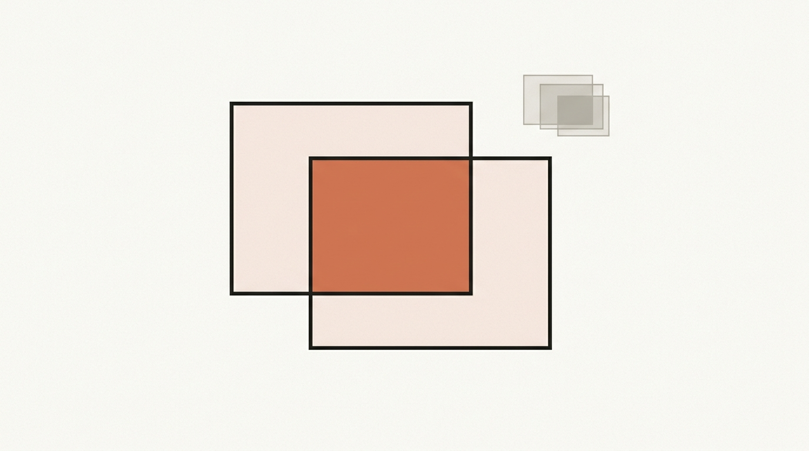
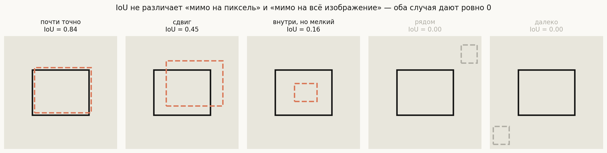
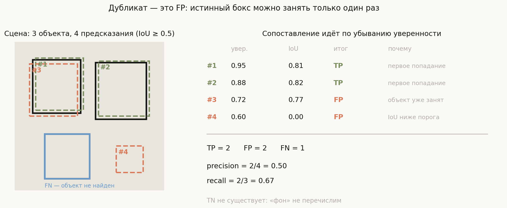
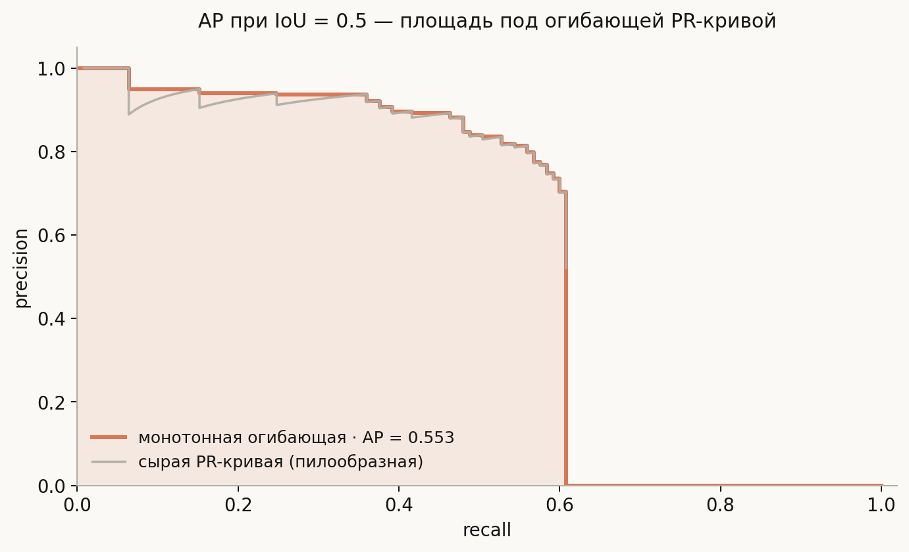
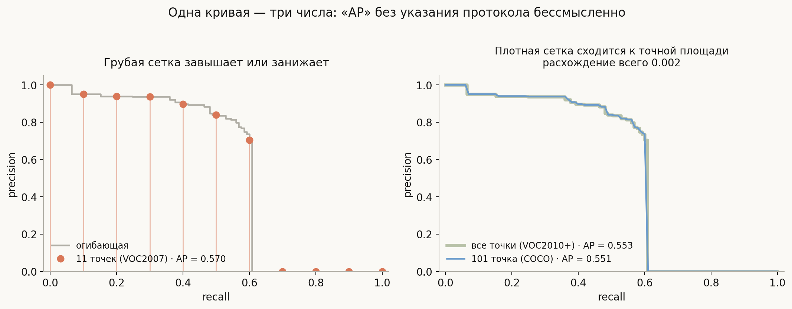
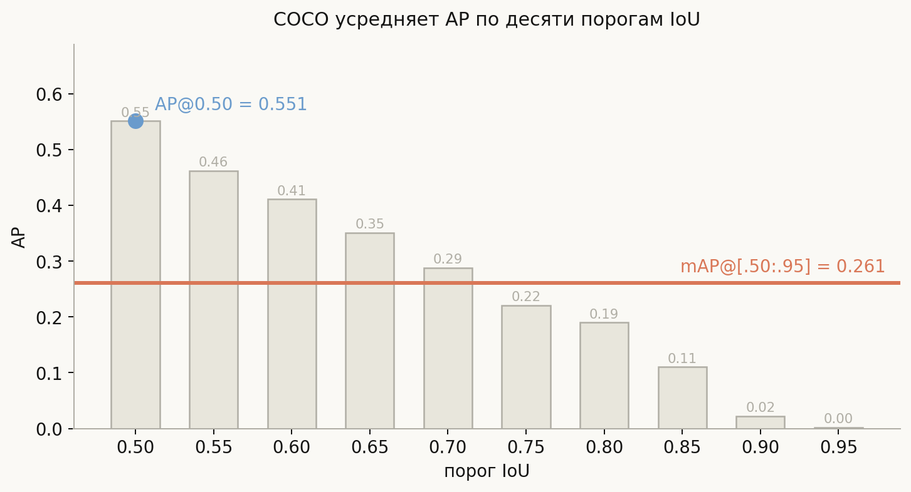

# Метрики детекции: IoU, PR-кривая, AP и mAP

**Вопрос**: Как измеряют качество детектора? Что такое IoU, AP и mAP, чем отличается mAP@0.5 от mAP@[.5:.95] и в чём слабые места этих метрик?

В классификации оценка тривиальна: предсказание либо совпало с меткой, либо нет. В детекции такой роскоши нет. Предсказанный бокс почти никогда не совпадает с истинным пиксель в пиксель — он «примерно там». Значит, прежде чем что-то считать, надо решить два вопроса: **насколько близко считается попаданием** и **какое предсказание с каким объектом сравнивать**.

Второй вопрос — это та же задача назначения, что и при обучении детектора (см. [архитектуры](../object-detection-architectures/lesson.md)), только теперь она решается на этапе оценки и по другим правилам. Именно из неё вырастает всё остальное: TP и FP определены не сами по себе, а относительно выбранного сопоставления. Метрика детекции — это в первую очередь **протокол сопоставления**, и только во вторую — формула.

Отсюда практическое следствие, которое стоит держать в голове весь разговор: число «mAP = 0.55» само по себе не значит ничего. Без указания протокола — какой порог IoU, какая интерполяция, какой датасет — оно не сравнимо ни с чем.

## План

1. IoU и его слепое пятно
2. TP, FP, FN — и почему нет TN
3. Precision и recall как функции порога уверенности
4. AP: площадь под огибающей
5. Три способа посчитать AP по одной кривой
6. mAP: усреднение по классам и по порогам IoU
7. Чего mAP не видит
8. Что спрашивают на собеседовании
9. Типичные ошибки
10. Итог

---

## 1. IoU и его слепое пятно

**Intersection over Union** — отношение площади пересечения к площади объединения двух боксов:

$$\mathrm{IoU}(A, B) = \frac{|A \cap B|}{|A \cup B|} \in [0, 1]$$

Свойство, ради которого её выбрали: **инвариантность к масштабу**. Смещение на 10 пикселей катастрофично для маленького объекта и незначительно для большого — IoU это учитывает автоматически, тогда как абсолютная ошибка координат не учитывает.

Числа посчитаны по реальным координатам. Обратите внимание на третий случай: бокс целиком **внутри** истинного, но вчетверо меньше — IoU всего 0.16. Полное вложение не спасает, если размеры не совпали.

А теперь слепое пятно, видное в двух правых панелях. Бокс, промахнувшийся на волос, и бокс на другом конце изображения дают **одинаковый IoU = 0**. Функция теряет всякую информацию, как только пересечение исчезает.

Для метрики это терпимо — оба случая одинаково плохи. Но если использовать $1 - \mathrm{IoU}$ как **функцию потерь**, то в области нулевого пересечения градиент равен нулю, и модель не знает, в какую сторону двигать бокс. Ровно поэтому появились **GIoU** (добавляет штраф за площадь минимального объемлющего прямоугольника, не занятую объединением), **DIoU** (штраф за расстояние между центрами) и **CIoU** (плюс согласованность пропорций). Это стандартный уточняющий вопрос: «чем плох IoU как loss».

## 2. TP, FP, FN — и почему нет TN

Правило сопоставления в VOC и COCO одинаково по сути: идём по предсказаниям **в порядке убывания уверенности**; каждое забирает наиболее перекрывающийся **ещё свободный** истинный бокс, если IoU не ниже порога.

Разберём результат построчно, потому что здесь прячется главная тонкость:

- **#1** (уверенность 0.95, IoU 0.81) — первое попадание, TP.
- **#2** (0.88, IoU 0.82) — другой объект, тоже TP.
- **#3** (0.72, IoU 0.77) — **FP, хотя IoU намного выше порога**. Объект уже занят предсказанием #1, а занять его дважды нельзя. Так метрика штрафует дубликаты.
- **#4** (0.60, IoU 0.00) — выдумка на пустом месте, FP.
- Третий объект не найден никем — **FN**.

Итого precision $= 2/4 = 0.50$, recall $= 2/3 \approx 0.67$.

Строка **#3** — сердце всей темы. Если бы порядок был другим и дубликат шёл первым, TP получил бы он, а #1 стал бы FP: **вердикт зависит от порядка обхода**, а порядок задаёт уверенность. Поэтому калибровка уверенности влияет на метрику даже при неизменной геометрии боксов.

И отдельно: **TN в детекции не существует**. Истинно-отрицательный ответ — это «модель правильно не нашла объект вот здесь», но «вот здесь» можно провести бесконечно много боксов. Фон не перечислим, поэтому все метрики, требующие TN — accuracy, specificity, ROC-AUC — в детекции неприменимы. Остаются precision и recall, которым TN не нужен.

## 3. Precision и recall как функции порога уверенности

Детектор выдаёт боксы с уверенностью. Отсечём по порогу — получим одну точку (precision, recall). Двигая порог от 1 к 0, получим кривую: высокий порог даёт мало предсказаний, высокую precision и низкий recall; низкий порог — наоборот.

На практике кривую строят не перебором порогов, а накопительно: сортируют все предсказания по уверенности и идут сверху вниз, пересчитывая

$$\text{precision} = \frac{TP}{TP + FP}, \qquad \text{recall} = \frac{TP}{\text{число истинных объектов}}$$

после каждого шага. Знаменатель recall постоянен, поэтому recall **монотонно не убывает**, а precision скачет вверх-вниз: каждое TP её поднимает, каждое FP роняет. Отсюда характерная пилообразная форма.

Заметьте обрыв справа: кривая не доходит до recall = 1. Это не артефакт — часть объектов детектор не находит ни при каком пороге, и максимальный достижимый recall равен доле найденных. В этом прогоне он около 0.61.

## 4. AP: площадь под огибающей

**Average Precision** — площадь под PR-кривой. Но интегрировать пилу неудобно и неустойчиво, поэтому её сначала заменяют **монотонной огибающей**: в каждой точке берут максимум precision правее.

$$p_{\text{interp}}(r) = \max_{\tilde r \,\ge\, r} p(\tilde r)$$

Содержательный смысл: если, снизив порог, можно получить и больший recall, и большую precision, то работать при исходном пороге просто нет причин — такая точка кривой не является разумной рабочей. Огибающая выбрасывает заведомо проигрышные точки.

Дальше AP — площадь под этой ступенчатой функцией. На картинке выше AP при IoU = 0.5 равен 0.553.

## 5. Три способа посчитать AP по одной кривой

Здесь начинается путаница, из-за которой числа из разных статей часто несравнимы.

- **VOC2007, 11 точек.** Огибающая берётся в recall $\in \{0, 0.1, \dots, 1.0\}$ и усредняется. Грубо: на той же кривой даёт **0.570**.
- **VOC2010+, все точки.** Точная площадь под огибающей — **0.553**.
- **COCO, 101 точка.** Сетка recall $\{0, 0.01, \dots, 1.0\}$ — **0.551**, практически совпадает с точной площадью.

Разброс между 11-точечной и точной версией здесь около 0.017 — на лидерборде это заметная разница. Отсюда правило: **«AP» без указания протокола — бессмысленное число.** Если на собеседовании называют AP, уместно уточнить, какой именно.

## 6. mAP: усреднение по классам и по порогам IoU

Буква **m** — это *mean* по классам: AP считается отдельно для каждого класса, затем усредняется. Усреднение **невзвешенное**, поэтому редкий класс с десятью примерами влияет на итог ровно так же, как класс с десятью тысячами. Это часто удивляет и стоит помнить.

COCO добавил второе усреднение — **по порогам IoU**: AP считается при порогах $0.50, 0.55, \dots, 0.95$ и усредняется по этим десяти значениям. Обозначается **mAP@[.50:.95]**, или просто **AP** в таблицах COCO.

Разница огромна и хорошо видна на прогоне: AP@0.50 равен **0.551**, а mAP@[.50:.95] — **0.261**, то есть более чем вдвое меньше. Причина понятна из столбиков: при пороге 0.50 «попаданием» считается довольно грубый бокс, а при 0.90 требуется почти пиксельная точность, и AP падает практически до нуля.

Отсюда важное следствие: **mAP@[.50:.95] измеряет не только «нашёл ли», но и «насколько точно обвёл»**. Детектор, который уверенно находит все объекты, но рисует боксы небрежно, получит приличный AP@0.50 и плохой mAP@[.50:.95]. Строгая метрика вознаграждает качество локализации.

COCO публикует и разрезы по размеру объекта — **AP_small / AP_medium / AP_large**. Они полезнее агрегата: если общий mAP просел, разрез обычно показывает, что виноваты мелкие объекты, и подсказывает, куда смотреть (разрешение входа, уровни FPN).

## 7. Чего mAP не видит

Здесь отделяют тех, кто метрику применял, от тех, кто про неё читал.

**mAP почти не замечает дубликатов, если они неуверенные.** В прогоне из `notebook.ipynb` я менял порог NMS от 0.1 до 1.0. Строгий порог 0.1 ощутимо вредит — AP@0.50 падает с 0.639 до 0.544, потому что подавляются настоящие детекции соседних объектов. А вот мягкий порог почти бесплатен: **без подавления вообще** mAP@[.50:.95] равен 0.309 — ровно столько же, сколько в оптимуме. Дубликаты неуверенные, после сортировки они оседают в хвосте кривой, где precision и так низкая, и площади почти не отнимают. Беды несимметричны: пересуппрессия дороже недосуппрессии.

**mAP поощряет выдавать как можно больше боксов.** Тот же эффект в чистом виде: отсечение неуверенных предсказаний поднимает precision в рабочей точке с 0.36 до 0.92, а mAP при этом только падает — с 0.305 до 0.210. Именно поэтому детекторы на соревнованиях отдают по сто боксов на изображение: метрика за это не наказывает. В продукте так делать нельзя — пользователь видит не площадь под кривой, а одну рабочую точку, и лишние боксы там просто мусор на экране.

**mAP не говорит, какой порог ставить в проде.** Она интегрирует по всем порогам сразу. Для запуска нужна одна рабочая точка, и выбирают её по цене ошибок, а не по mAP.

**mAP не оценивает калибровку.** Важен только порядок уверенностей, а не их абсолютные значения. Модель, у которой все уверенности лежат в диапазоне 0.9–0.95, получит тот же mAP, что и хорошо откалиброванная, — при одинаковом ранжировании.

**mAP несопоставим между датасетами.** «Наша модель даёт 0.45» не значит ничего без указания датасета: mAP на COCO и на своём наборе из трёх классов — величины разной природы.

## 8. Что спрашивают на собеседовании

**Почему в детекции не используют accuracy?** Нет TN: фон не перечислим, боксов на пустом месте можно провести бесконечно много.

**Что значит mAP@0.5 против mAP@[.5:.95]?** Первая — порог попадания 0.5, мягкая, оценивает в основном «нашёл ли». Вторая усредняет по десяти порогам до 0.95 и дополнительно требует точной локализации; она всегда заметно ниже.

**Зачем нужна монотонная огибающая?** Чтобы выбросить точки кривой, которые заведомо проигрывают: если снижение порога даёт одновременно больше recall и больше precision, работать в исходной точке смысла нет.

**Как считается TP при нескольких попаданиях в один объект?** Только первое по уверенности; остальные — FP. Так штрафуются дубликаты.

**Может ли добавление предсказаний уменьшить mAP?** Уверенных — да, если они ложные: они портят голову кривой. Неуверенных — почти нет: они попадают в хвост, где precision уже низкая.

**Чем плох IoU как функция потерь?** При нулевом пересечении градиент нулевой, направление движения бокса неизвестно. Лечится GIoU / DIoU / CIoU.

## 9. Типичные ошибки

- **Называть AP, не называя протокол.** VOC2007 (11 точек), VOC2010+ (все точки) и COCO (101 точка) дают на одной кривой разные числа: здесь 0.570, 0.553 и 0.551.
- **Считать, что высокий IoU гарантирует TP.** Нет: если объект уже занят более уверенным предсказанием, детекция с IoU 0.77 всё равно FP.
- **Использовать ROC-AUC.** Она требует FPR, то есть TN, которых в детекции нет.
- **Думать, что mAP@[.5:.95] — это «то же самое, только строже».** Это качественно другая метрика: она измеряет ещё и точность локализации, а не только факт обнаружения.
- **Настраивать порог NMS по mAP.** В широком диапазоне метрика почти не меняется, и оптимизация по ней уведёт в режим с горой лишних боксов на каждом изображении.
- **Забывать про невзвешенность усреднения по классам.** Редкий класс весит столько же, сколько частый; провал на одном редком классе способен уронить общий mAP.
- **Сравнивать mAP между датасетами.** Числа сопоставимы только внутри одного набора данных и одного протокола.
- **Путать порог уверенности и порог IoU.** Первый решает, какие предсказания вообще берём; второй — что считать попаданием. Это независимые ручки.

## 10. Итог

Метрика детекции — это прежде всего протокол сопоставления, и только потом формула. IoU задаёт, что считать попаданием, и хороша своей масштабной инвариантностью, но слепа за пределами пересечения, из-за чего как loss требует поправок вроде GIoU. Сопоставление идёт по убыванию уверенности, каждый истинный бокс можно занять лишь однажды — так дубликаты становятся FP; TN в задаче не существует, поэтому живут только precision и recall. Проходя по отсортированным предсказаниям, получают PR-кривую, заменяют её монотонной огибающей и берут площадь — это AP; способ взятия площади различается между VOC2007, VOC2010+ и COCO, поэтому AP без указания протокола несравним. mAP усредняет AP по классам невзвешенно, а в версии COCO ещё и по десяти порогам IoU, из-за чего mAP@[.50:.95] оказывается кратно ниже AP@0.50 и измеряет уже не только обнаружение, но и точность обводки. Главное же — понимать, чего метрика не видит: она почти не штрафует неуверенные дубликаты, поощряет выдавать как можно больше боксов, ничего не говорит о калибровке и не подсказывает рабочий порог для продакшена.

---

## Что рядом

- [`notebook.ipynb`](notebook.ipynb) — реализация mAP с нуля, проверенная на посчитанном вручную примере, плюс прогоны про NMS и хвост кривой
- [`generate_visuals.py`](generate_visuals.py) — код всех диаграмм; сопоставление и все варианты AP считаются по правилам VOC/COCO
- [Архитектуры детекции объектов](../object-detection-architectures/lesson.md) — откуда берутся предсказания, которые здесь оцениваются
- Смежное: [Confusion Matrix Precision Recall](../../../../ml/objectives-metrics-evaluation/Confusion%20Matrix%20Precision%20Recall.md), [F1 Score](../../../../ml/objectives-metrics-evaluation/F1%20Score.md)
