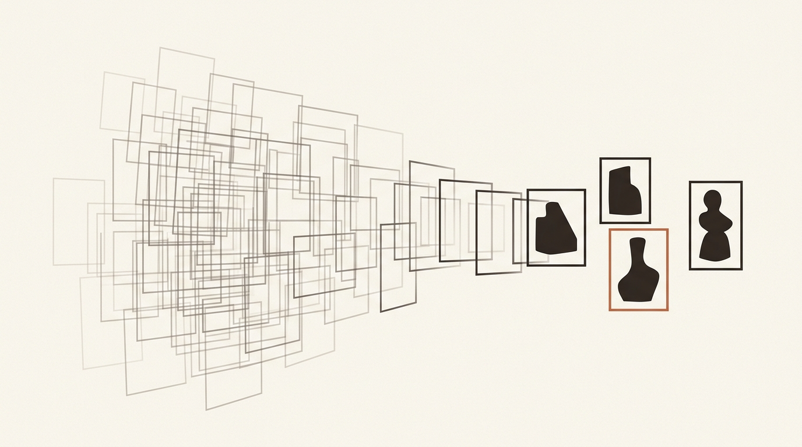
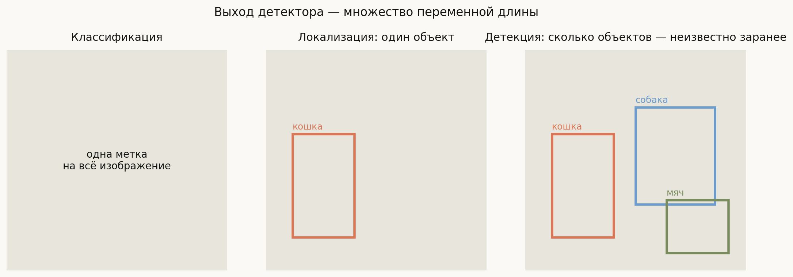
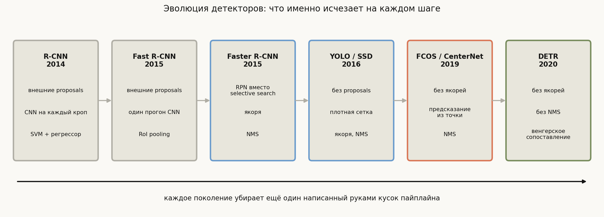
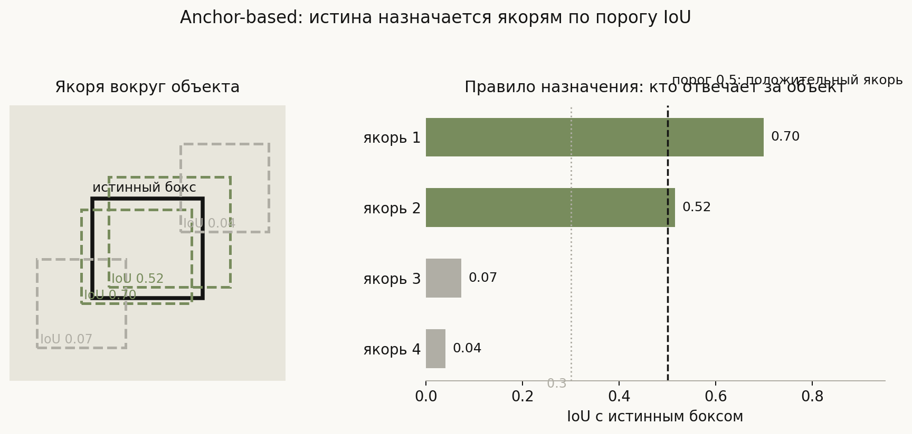
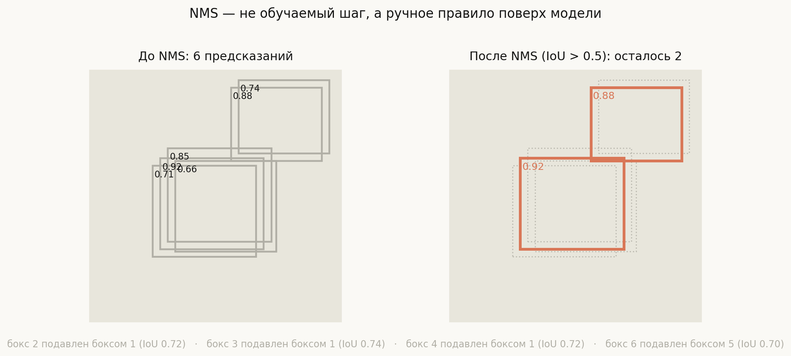
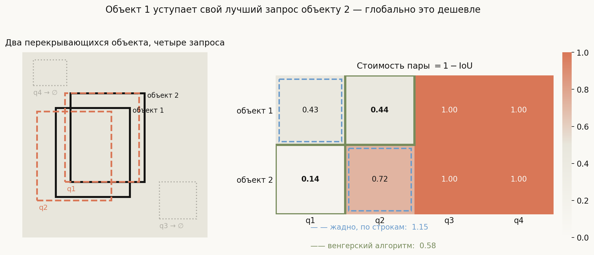

# Архитектуры детекции объектов

**Вопрос**: Как устроены основные семейства детекторов — R-CNN, YOLO, DETR? Чем они отличаются и почему появлялись именно в таком порядке?

Детекция кажется естественным продолжением классификации: та же свёрточная сеть, только на выходе не одна метка, а несколько боксов с метками. На самом деле между ними лежит пропасть, и вся история архитектур — это история борьбы с ней. Классификатор выдаёт **вектор фиксированной длины**. Детектор должен выдать **множество переменной длины**: на картинке может быть ноль объектов, а может быть сорок, и заранее неизвестно сколько.

Обычная нейросеть так не умеет — у неё фиксированная форма выхода. Значит, нужно как-то свести задачу к предсказанию фиксированного размера, а потом превратить это в множество. Способ, которым каждое поколение архитектур делает этот трюк, и есть главное, что их различает.

Из этого следует и второй, менее очевидный сюжет. Если модель выдаёт много предсказаний, а истинных объектов мало, то на каждом шаге обучения нужно решить: **какое предсказание за какой объект отвечает**. Это задача назначения (assignment), и она — настоящий водораздел между семействами. R-CNN назначает по порогу IoU, FCOS — по попаданию точки внутрь бокса, DETR — венгерским алгоритмом. Если на собеседовании вы объясните различия через способ назначения, а не через «двухстадийный против одностадийного», это будет ответ другого уровня.

## План

1. Почему детекция сложнее классификации
2. Два способа получить кандидатов
3. Семейство R-CNN: proposals
4. Одностадийные: YOLO и SSD
5. Якоря и назначение по IoU
6. NMS — костыль, который держался шесть лет
7. Anchor-free: FCOS и CenterNet
8. DETR: детекция как предсказание множества
9. Что спрашивают на собеседовании
10. Типичные ошибки
11. Итог

---

## 1. Почему детекция сложнее классификации

Три задачи выстраиваются по возрастанию сложности выхода:

- **Классификация** — один вектор вероятностей на изображение;
- **Локализация** — один бокс и одна метка (объект ровно один, форма выхода фиксирована);
- **Детекция** — множество пар «бокс + метка» неизвестной заранее мощности.

Именно третий случай ломает стандартную схему. Проблем сразу три:

1. **Переменное число выходов.** Сеть не может иметь «столько выходов, сколько объектов».
2. **Отсутствие порядка.** Ответ — множество, а не список: перестановка двух боксов не меняет ответа. Значит, обычная поэлементная функция потерь неприменима — она наказала бы модель за «неправильный порядок», которого не существует.
3. **Назначение.** Чтобы посчитать потерю, надо сначала решить, какое предсказание сравнивать с каким объектом.

Стандартный обходной путь: сделать **фиксированное и заведомо избыточное** число предсказаний (сотни или тысячи), а потом отобрать из них немногие. Тогда форма выхода снова постоянна. Вопрос лишь в том, откуда берутся кандидаты и как из избыточного набора получить чистый ответ.

## 2. Два способа получить кандидатов

**Двухстадийный.** Сначала отдельный механизм предлагает несколько сотен–тысяч мест, где *что-то есть* (без указания класса). Затем каждое место классифицируется и уточняется. Плюс — второй этап работает с малым числом хороших кандидатов, поэтому точность выше. Минус — два прогона, медленнее.

**Одностадийный.** Никаких предложений: сетка предсказаний покрывает всё изображение сразу, каждая ячейка отвечает за свой участок. Один проход, быстрее, но кандидатов на порядки больше и подавляющее большинство из них — фон. Отсюда сильнейший дисбаланс классов, с которым пришлось отдельно бороться (Focal Loss в RetinaNet).

Общая линия развития читается на этой схеме одним движением: **каждое поколение убирает из пайплайна ещё один написанный руками кусок**. Сначала уходит внешний генератор предложений, потом якоря, потом NMS. Это тот же сюжет, что и во всём глубоком обучении: ручные признаки → выученные признаки, ручные эвристики → выученные решения.

## 3. Семейство R-CNN: proposals

**R-CNN (2014).** Selective search — классический алгоритм, не обучаемый — предлагает ~2000 регионов. Каждый регион вырезается, растягивается до фиксированного размера и **отдельно** прогоняется через CNN. Затем SVM классифицирует, а линейная регрессия уточняет бокс. Работает, но 2000 прогонов CNN на одно изображение — это десятки секунд.

**Fast R-CNN (2015).** Ключевая идея: свернуть изображение **один раз**, а регионы вырезать уже из карты признаков — операция **RoI pooling** приводит участок карты произвольного размера к фиксированной сетке. Один прогон вместо двух тысяч. Классификатор и регрессор бокса становятся головами одной сети, обучаемой end-to-end. Но selective search остаётся снаружи и теперь доминирует по времени.

**Faster R-CNN (2015).** Логичный шаг: сделать генерацию предложений частью сети. Появляется **RPN** (Region Proposal Network) — маленькая свёрточная голова, которая скользит по карте признаков и для каждой позиции говорит «объект / фон» и уточняет бокс относительно набора заранее заданных **якорей**. Теперь обучается всё, кроме NMS. Эта архитектура задала шаблон на годы вперёд.

> На собеседовании стоит уметь назвать, что именно менялось на каждом шаге: R-CNN → Fast (один прогон CNN, RoI pooling) → Faster (обучаемые предложения через RPN). Это самая частая уточняющая цепочка.

## 4. Одностадийные: YOLO и SSD

**YOLO (2016)** отказывается от предложений вовсе. Изображение делится сеткой $S \times S$; каждая ячейка предсказывает несколько боксов, уверенность и распределение по классам. Один прогон сети — и сразу финальные предсказания. Отсюда и название: *You Only Look Once*.

Цена — точность на маленьких и скученных объектах: у ранних версий каждая ячейка отвечала за ограниченное число объектов, и если в одну ячейку попадало несколько мелких целей, часть терялась.

**SSD (2016)** добавляет важную идею: предсказывать с **нескольких уровней** карты признаков. Ранние слои имеют высокое разрешение и видят мелкие объекты, глубокие — низкое разрешение и большое рецептивное поле, то есть крупные объекты. Эта мысль позже кристаллизовалась в **FPN** (Feature Pyramid Network) — стандартный сегодня способ объединять уровни, прокидывая семантику из глубоких слоёв обратно в высокоразрешающие.

Современные версии YOLO — это уже не исходная архитектура 2016 года, а гибрид: FPN-подобная шея, отдельные головы, чаще всего anchor-free. Название осталось как обозначение семейства быстрых одностадийных детекторов.

## 5. Якоря и назначение по IoU

**Якорь** — заранее заданный прямоугольник фиксированного размера и соотношения сторон, привязанный к позиции на карте признаков. Сеть предсказывает не сам бокс, а **поправку** к якорю. Это ключевой приём: предсказывать небольшое смещение относительно разумной заготовки намного легче, чем абсолютные координаты с нуля.

Отсюда правило назначения: истинный объект приписывается тем якорям, у которых с ним достаточно высокий IoU.

$$\mathrm{IoU}(A, B) = \frac{|A \cap B|}{|A \cup B|}$$

Числа на картинке посчитаны по реальным координатам. Порог обычно 0.5: якорь с IoU выше считается **положительным** и обязан предсказать этот объект; ниже 0.3 — **отрицательным** (фон); промежуточные часто просто игнорируются, чтобы не зашумлять обучение. На схеме положительный якорь ровно один, ещё один попал в серую зону.

Отсюда же и главная боль якорей: их размеры и пропорции — **гиперпараметры**, которые надо подбирать под датасет. Детектор, настроенный на пешеходов, плохо перенесётся на спутниковые снимки, где объекты другой формы. Плюс якорей приходится генерировать десятки тысяч, и почти все они — фон.

## 6. NMS — костыль, который держался шесть лет

Плотная сетка предсказаний неизбежно порождает дубликаты: соседние якоря вокруг одного объекта все уверенно репортят его. Чтобы получить чистый ответ, применяют **Non-Maximum Suppression**: отсортировать предсказания по уверенности, взять самое уверенное, выбросить все, у кого с ним IoU выше порога, повторить.

Из шести предсказаний осталось два — по одному на объект; подписи внизу показывают, какой бокс каким подавлен и с каким IoU.

Проблема в том, что **NMS не обучается**. Это правило, написанное руками поверх модели, со своим гиперпараметром — порогом. И у него есть неустранимый провал: если два объекта одного класса действительно сильно перекрываются (люди в толпе, машины в пробке), NMS уверенно удалит один из них как «дубликат». Ошибка встроена в само правило: оно не различает «две детекции одного объекта» и «два реально перекрывающихся объекта».

Это и есть та самая деталь, ради устранения которой появился DETR.

## 7. Anchor-free: FCOS и CenterNet

Следующее поколение убирает якоря. Логика простая: если якорь — это гиперпараметр, от которого зависит перенос на новые данные, то надо предсказывать бокс напрямую.

**FCOS (2019)** предсказывает для **каждой точки** карты признаков четыре расстояния — до левой, верхней, правой и нижней границ объекта, внутри которого эта точка лежит. Назначение становится тривиальным: точка отвечает за объект, если попадает внутрь его бокса. Никаких порогов IoU и никаких заготовок. Для точек, попавших сразу в несколько боксов, применяется разрешение по уровням пирамиды (мелкие объекты — на высоком разрешении) и вспомогательная ветка *centerness*, гасящая предсказания у краёв.

**CenterNet (2019)** идёт ещё дальше: объект — это **точка его центра**. Сеть предсказывает тепловую карту центров и отдельно регрессирует ширину и высоту. Дубликаты снимаются не через NMS, а простым выбором локальных максимумов на тепловой карте.

Якорей больше нет, а NMS в FCOS всё ещё остаётся.

## 8. DETR: детекция как предсказание множества

**DETR (2020)** ставит вопрос иначе: раз ответ — это множество, давайте прямо так задачу и сформулируем — **set prediction**.

Архитектура: CNN-бэкбон извлекает признаки, трансформер-энкодер обрабатывает их с глобальным вниманием (каждая позиция видит всё изображение), а декодер получает $N$ обучаемых **object queries** — фиксированное число «слотов» (в оригинале 100). Каждый слот выдаёт либо бокс с классом, либо специальную метку «нет объекта» ($\varnothing$).

Главное — функция потерь. Чтобы сравнить множество из $N$ предсказаний с $M$ истинными объектами, DETR сначала строит **оптимальное двудольное сопоставление** венгерским алгоритмом, минимизируя суммарную стоимость пар, и только потом считает потерю по сопоставленным парам.

Картинка показывает, почему сопоставление должно быть именно глобальным. Объект 1 чуть больше «хочет» запрос q1 (стоимость 0.43 против 0.44 у q2) — жадный выбор по строкам отдал бы q1 ему, и объекту 2 достался бы негодный q2 ценой 0.72; суммарно 1.15. Венгерский алгоритм видит картину целиком: объект 2 нуждается в q1 куда острее (0.14 против 0.72), поэтому q1 отдаётся ему, а объект 1 довольствуется почти равноценным q2. Итого 0.58 — вдвое дешевле.

Из этого механизма следует главное свойство: сопоставление **взаимно однозначно**, каждый объект получает ровно один запрос. Модель обучается не выдавать дубликаты — и **NMS становится не нужен**. Якорей тоже нет. Пайплайн наконец обучается целиком, от пикселей до финального множества.

Цена: оригинальный DETR сходился очень медленно (сотни эпох против десятков у Faster R-CNN) и заметно проседал на мелких объектах. Обе беды лечили последователи — **Deformable DETR** (разреженное внимание к немногим точкам вместо всех), **DINO** и другие; сегодня это конкурентоспособное семейство.

## 9. Что спрашивают на собеседовании

Готовые формулировки на самые частые уточняющие вопросы:

**Двухстадийный против одностадийного?** Двухстадийный сначала предлагает регионы, потом классифицирует их — исторически точнее, медленнее. Одностадийный предсказывает по плотной сетке за один проход — быстрее, но страдает от дисбаланса «объект/фон», который лечат Focal Loss.

**Зачем нужны якоря?** Предсказывать поправку к разумной заготовке легче, чем абсолютные координаты. Плата — гиперпараметры, которые надо подбирать под датасет.

**Почему от якорей отказались?** Их размеры и пропорции плохо переносятся между доменами, их приходится генерировать десятками тысяч, и почти все они — фон. Anchor-free предсказывает геометрию прямо из точки.

**Что не так с NMS?** Это необучаемое правило с гиперпараметром, и оно принципиально не различает «дубликат» и «второй реально перекрывающийся объект». В плотных сценах удаляет настоящие детекции.

**Как DETR обходится без NMS?** Через двудольное сопоставление: на обучении каждому объекту назначается ровно один запрос, поэтому дубликаты штрафуются напрямую и модель учится их не выдавать.

**Почему в DETR именно венгерский алгоритм, а не жадный выбор?** Жадный выбор оптимизирует каждую строку отдельно и застревает в локально хорошем, глобально плохом назначении. Нестабильное назначение означало бы, что один и тот же запрос на разных шагах отвечает за разные объекты — обучение бы разваливалось.

## 10. Типичные ошибки

- **Называть YOLO «алгоритмом», а не семейством.** YOLOv1 и современные версии различаются архитектурно сильнее, чем YOLOv1 и SSD. Уточняйте, о какой версии речь.
- **Считать двухстадийные детекторы устаревшими.** Они по-прежнему сильны там, где важна точность, а не latency; выбор диктуется бюджетом времени, а не «модностью».
- **Путать RoI pooling и NMS.** Первое — способ привести участок карты признаков к фиксированному размеру, второе — фильтрация дубликатов на выходе. Разные стадии, разные цели.
- **Говорить, что DETR «убрал якоря и NMS» и на этом останавливаться.** Ключ не в удалении как таковом, а в новой постановке — предсказании множества с двудольным сопоставлением; отсутствие NMS оттуда лишь следует.
- **Забывать про дисбаланс классов в одностадийных.** Это не мелочь: без Focal Loss или аналогичного приёма фон просто задавит градиенты.
- **Считать, что anchor-free автоматически означает отсутствие NMS.** FCOS — anchor-free, но NMS использует. Независимые оси.
- **Объяснять различия только через скорость.** Ось «быстро/точно» описывает следствия, а не устройство. Устройство описывает способ назначения истины предсказаниям.

## 11. Итог

Детекция отличается от классификации тем, что её ответ — множество переменной длины, а нейросеть умеет выдавать только фиксированную форму. Все архитектуры решают это одинаково по духу: делают избыточное фиксированное число предсказаний и затем сводят их к немногим. Различаются они тем, откуда берутся кандидаты и, главное, **как истина назначается предсказаниям**. R-CNN брал кандидатов извне, Faster R-CNN сделал их обучаемыми через RPN и назначал по порогу IoU к якорям, YOLO и SSD отказались от предложений в пользу плотной сетки, anchor-free выбросили якоря и стали назначать по попаданию точки внутрь бокса, а DETR переформулировал задачу как предсказание множества с двудольным сопоставлением — и тем самым избавился от NMS, последнего необучаемого куска пайплайна. Общая линия проста: каждое поколение убирает ещё одну написанную руками эвристику, и понимать эти архитектуры лучше всего именно по тому, какую эвристику оно убрало и чем заменило.

---

## Что рядом

- [`generate_visuals.py`](generate_visuals.py) — код всех диаграмм; IoU, шаги NMS и венгерское сопоставление считаются на реальных координатах
- Смежные темы: [Self-Attention and Transformers](../../architectures/Self-Attention%20and%20Transformers.md), [CNN Filter Pooling](../../architectures/CNN%20Filter%20Pooling.md), [Transfer Learning and GANs](../../architectures/Transfer%20Learning%20and%20GANs.md)
- Метрики детекции (IoU, NMS, mAP) вынесены в отдельную тему — она ещё не написана
