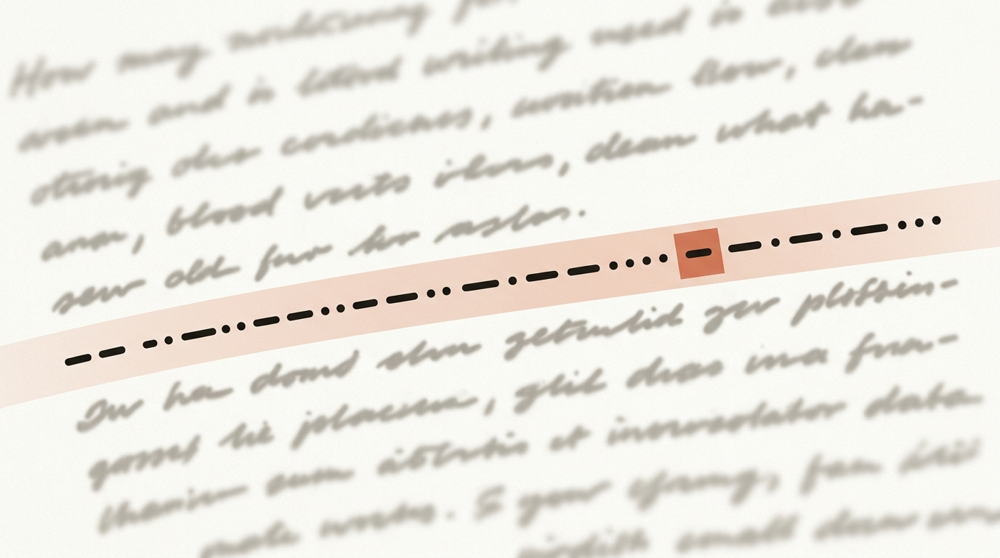
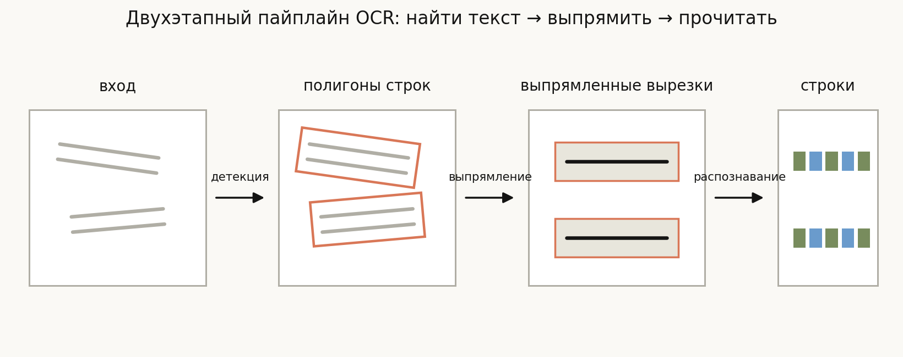
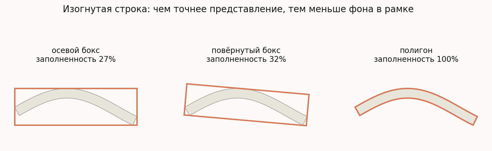
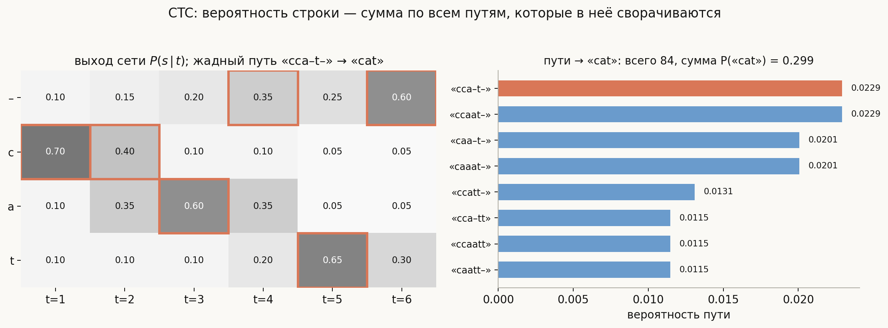
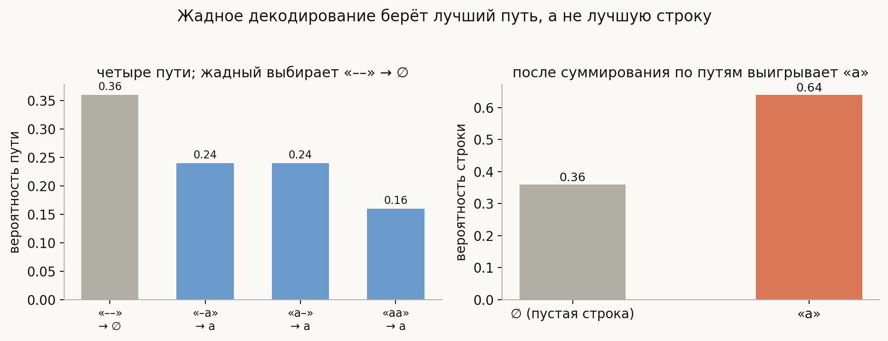
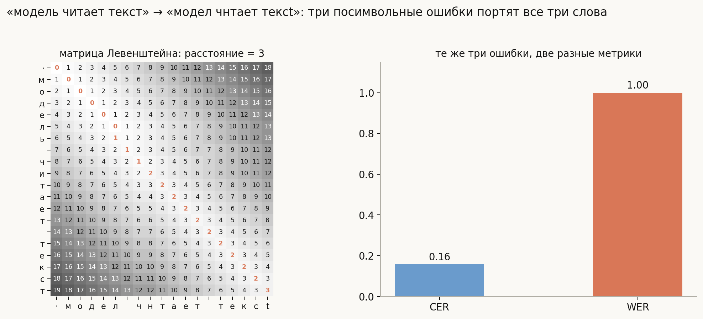

# OCR: детекция и распознавание текста

**Вопрос**: Как устроен современный OCR-пайплайн? Почему распознавание строки не сводится к классификации отдельных букв, зачем нужен CTC и blank-токен, чем CTC отличается от attention-декодера и как измеряют качество — CER или WER?

OCR выглядит решённой задачей — сканеры читают документы уже тридцать лет. Но «прочитать текст на фотографии» и «прочитать скан машинописной страницы» — задачи разной сложности, и всё интересное в современном OCR выросло из этой разницы. На фотографии текст бывает повёрнут, изогнут, частично закрыт, снят под углом и вперемешку с фоном; а главное — **никто не размечает позиции отдельных букв**. В датасете есть картинка со словом и строка-ответ, но нет информации о том, где кончается одна буква и начинается следующая.

Отсюда центральная тема лекции — снова **задача выравнивания**, та же, что была водоразделом в [детекции объектов](../object-detection-architectures/lesson.md). Сеть выдаёт предсказания фиксированной формы (столбцы карты признаков), ответ — строка переменной длины, и надо решить, какой столбец за какую букву отвечает. Два классических ответа на этот вопрос — **CTC** и **attention** — делят между собой почти все архитектуры распознавания, и их сравнение — самый частый вопрос по OCR на собеседованиях.

## План

1. Почему OCR — не классификация букв
2. Пайплайн: найти → выпрямить → прочитать
3. Детекция текста: геометрия против якорей
4. CRNN: изображение как последовательность
5. CTC: обучение без разметки позиций
6. Декодирование: лучший путь ≠ лучшая строка
7. Attention, трансформеры и OCR без OCR
8. Метрики: CER и WER
9. Что спрашивают на собеседовании
10. Типичные ошибки
11. Итог

---

## 1. Почему OCR — не классификация букв

Классический OCR девяностых работал именно так: бинаризовать изображение, нарезать на отдельные символы по промежуткам, каждый символ прогнать через классификатор. Эта схема разбивается о два факта.

**Сегментация на символы — сама по себе трудная задача.** Слипшиеся буквы, курсив, рукописный текст, засветки — в любой из этих ситуаций надёжно провести границы между символами не проще, чем прочитать слово целиком. Ошибка сегментации фатальна: классификатор получает половину буквы и честно классифицирует её в мусор.

**Разметки позиций не существует.** Собрать датасет «картинка слова → строка» дёшево. Собрать датасет «картинка слова → рамка каждой буквы» — на порядок дороже, и таких данных в масштабе просто нет.

Значит, нужна модель, которая берёт изображение и выдаёт **последовательность переменной длины**, обучаясь только по парам «картинка — строка». Сеть с фиксированной формой выхода так не умеет — это ровно та же пропасть, что между классификацией и детекцией. И обходят её похожим способом: выдать заведомо избыточное число предсказаний, а затем свернуть их в короткий ответ. Как именно сворачивать и как при этом считать лосс — здесь дороги расходятся на CTC и attention.

## 2. Пайплайн: найти → выпрямить → прочитать

Стандартный OCR — это **два отдельных этапа**, обучаемых, как правило, независимо:

1. **Детекция текста** — найти на изображении все строки (или слова) и описать их геометрию: боксом, повёрнутым боксом или полигоном.
2. **Распознавание** — каждую найденную область вырезать, привести к горизонтальной полосе фиксированной высоты (**rectification** — выпрямление) и превратить в строку символов.

Разделение удобно: у этапов разные данные, разные метрики и разные архитектуры, их можно улучшать независимо. Существуют и end-to-end модели (**text spotting**), где обе части обучаются вместе и распознавание подтягивает детекцию, но в продуктовых системах двухэтапная схема до сих пор доминирует — она проще в отладке и переиспользует готовые компоненты.

Стоит разделять и два режима задачи. **Документный OCR** (сканы, PDF): текст плотный, горизонтальный, но его много и важна структура — колонки, таблицы, порядок чтения. **Scene text** (фотографии улиц, витрин, ценников): текста мало, но геометрия произвольная. Дальше речь в основном о втором случае — он и был двигателем всех архитектур ниже.

## 3. Детекция текста: геометрия против якорей

Казалось бы, текст — это просто ещё один класс объектов: бери [Faster R-CNN или YOLO](../object-detection-architectures/lesson.md) и обучай. На практике текст — худший клиент якорной детекции.

Во-первых, **соотношения сторон**. Якоря проектируются под объекты с пропорциями от 1:2 до 2:1, а строка текста легко бывает 1:20. Чтобы покрыть такие формы, нужен отдельный зоопарк якорей. Во-вторых, **ориентация**: осевой бокс вокруг наклонной строки почти целиком состоит из фона. В-третьих, **изогнутые строки** — вывески, печати, этикетки — не описываются прямоугольником в принципе.

Числа на схеме посчитаны по площадям: в осевом боксе сама строка занимает **27%** площади, в минимальном повёрнутом — **32%**, и только полигон облегает её полностью. Остальное — фон, который попадёт в вырезку и будет мешать распознаванию.

Поэтому детекция текста ушла от якорей в сторону **сегментации** (см. [архитектуры сегментации](../segmentation-architectures/lesson.md)):

- **EAST** — плотное предсказание: каждый пиксель говорит «я внутри текста» и регрессирует параметры повёрнутого бокса своей строки. Без якорей и без предложений.
- **CRAFT** — предсказывает тепловые карты **отдельных символов** и связей между ними, а строки собирает группировкой. Хорошо переносится на изогнутый текст: строка — это цепочка символов, а цепочка может изгибаться как угодно.
- **DBNet** — сегментирует область текста и делает бинаризацию **дифференцируемой**, то есть порог отделения текста от фона обучается вместе с сетью. Быстрый и точный, частый выбор в продакшене (например, в PaddleOCR).

Общий итог: карта пикселей → связные компоненты → полигоны строк. Геометрия получается любой сложности, якоря не нужны.

## 4. CRNN: изображение как последовательность

Классическая архитектура распознавания — **CRNN** (Convolutional Recurrent Neural Network, 2015), и её схема переживает уже третье поколение бэкбонов.

Вырезанная строка приводится к фиксированной высоте (например, 32 пикселя) при произвольной ширине. Свёрточная часть сжимает высоту до 1, и карта признаков превращается в **последовательность столбцов**: каждый столбец — вектор признаков узкой вертикальной полосы изображения. Ширина картинки становится осью времени $t = 1, \dots, T$. Поверх столбцов — двунаправленная LSTM (сегодня чаще трансформерные слои), чтобы каждый столбец видел контекст соседей: «щ» и «ш» надёжнее различаются, когда видно окрестность. Наконец, каждый столбец независимо выдаёт softmax по алфавиту.

Получается матрица $P(s \mid t)$ размера $T \times |V|$ — вероятность каждого символа в каждой позиции. Столбцов заведомо больше, чем букв: на слово из 5 символов приходится 20–30 столбцов. Осталось понять, как из этой матрицы получить строку и, главное, как **обучать** сеть, если известна только строка-ответ, а соответствие «столбец → буква» неизвестно.

Для сильно искривлённых строк перед CRNN часто ставят обучаемое выпрямление: **STN** (Spatial Transformer Network) в архитектурах типа ASTER предсказывает деформацию, которая разгибает строку в горизонтальную полосу, и обучается end-to-end вместе с распознаванием — без разметки самой деформации.

## 5. CTC: обучение без разметки позиций

**CTC** (Connectionist Temporal Classification) — ответ на вопрос «как посчитать лосс, не зная выравнивания». Идея: не выбирать выравнивание, а **просуммировать по всем возможным**.

В алфавит добавляется специальный символ **blank** (обозначим «–»), означающий «здесь нет буквы». **Путь** — это выбор одного символа в каждом из $T$ столбцов. Путь сворачивается в строку по правилу: **схлопнуть подряд идущие повторы, затем выбросить blank**. Например, при $T = 6$: «cca–t–» → «cat», «c–aat–» → «cat», «ccaatt» → «cat».

Blank решает две задачи. Во-первых, столбцы, попавшие между буквами или на края, должны иметь честный ответ «ничего». Во-вторых — и это любимый уточняющий вопрос — **без blank невозможно записать двойные буквы**. Повторы схлопываются: путь «ваанна» сворачивается в «вана», и никакой путь без blank не даст «ванна». Двойную букву спасает только blank между повторами — «ван–на» → «ванна». Поэтому минимальная длина $T$ — это длина строки плюс число соседних повторов в ней.

Вероятность строки — сумма вероятностей всех путей, которые в неё сворачиваются:

$$P(y \mid x) = \sum_{\pi:\ \mathcal{B}(\pi) = y} \prod_{t=1}^{T} P(\pi_t \mid t, x)$$

Пример на схеме посчитан честно: $T = 6$, алфавит из четырёх символов, целевая строка «cat». Из $4^6 = 4096$ возможных путей в «cat» сворачиваются **84**, их суммарная вероятность — **0.299**. Считать такую сумму перебором нельзя (для реальных $T$ она астрономическая), но она раскладывается динамическим программированием — **forward-алгоритмом** за $O(T \cdot L)$, точно так же, как в HMM. В коде диаграммы forward-рекурсия сверена с полным перебором — числа совпадают.

Лосс — просто $-\log P(y \mid x)$, и он дифференцируем по всем выходам сети. Сеть **сама** решает, какие столбцы отдать буквам, а какие — blank: выравнивание не размечается, а выучивается. Это и есть главный трюк CTC, и он же используется в распознавании речи — задача там изоморфна.

За удобство платят двумя предположениями, о которых спрашивают отдельно: столбцы **условно независимы** (вероятность буквы в столбце не зависит от того, что предсказано в соседних — весь контекст только через признаки), а выравнивание **монотонно** (буквы идут в порядке письма, перестановок нет). Для чтения строки слева направо монотонность — то, что нужно; независимость же означает, что языковую модель CTC внутри себя почти не выучивает.

## 6. Декодирование: лучший путь ≠ лучшая строка

На инференсе нужна одна строка. Самое простое — **жадное декодирование**: в каждом столбце взять argmax и свернуть путь. Быстро, и в примере выше жадный путь «cca–t–» действительно даёт «cat». Но жадность выбирает **самый вероятный путь**, а не **самую вероятную строку** — а это разные вещи, потому что вероятность строки размазана по многим путям.

Минимальный контрпример посчитан на схеме: два столбца, алфавит {–, a}, в каждом столбце $P(–) = 0.6$. Жадный путь «––» имеет вероятность 0.36 и сворачивается в пустую строку. Но строка «a» собирается из трёх путей — «a–», «–a», «aa» — с суммарной вероятностью **0.64**. Самая вероятная строка почти вдвое вероятнее жадного ответа, а жадное декодирование её не видит.

Точный поиск самой вероятной строки NP-труден, поэтому используют **beam search по префиксам**: хранится $k$ лучших префиксов строки, и пути, сворачивающиеся в один префикс, **сливаются с суммированием вероятностей**. В этот же поиск удобно подмешивать **языковую модель** или словарь: счёт префикса умножается на его языковую вероятность (shallow fusion). Для документов с известным лексиконом (номера, даты, поля форм) это даёт большой прирост.

Практическая оговорка: обученные CTC-модели обычно **очень пиковые** — почти вся масса сидит на одном пути, и жадное декодирование от beam search отличается на доли процента. Поэтому в проде часто живёт именно жадное: контрпример выше важен для понимания, а не как приговор.

## 7. Attention, трансформеры и OCR без OCR

Второй способ свернуть столбцы в строку — **seq2seq с вниманием**: декодер порождает строку символ за символом, на каждом шаге глядя через attention на нужные столбцы энкодера. Выравнивание здесь тоже не размечается — оно возникает внутри механизма внимания. Отличия от CTC принципиальные:

- **Нет условной независимости.** Каждый следующий символ предсказывается с учётом уже порождённых — декодер несёт в себе неявную языковую модель. Отсюда лучшее качество на размытых и повреждённых участках: модель «догадывается» по контексту.
- **Нет монотонности по построению.** Внимание может блуждать; на длинных строках и повторах (серийные номера, «aaaa») это даёт характерные сбои — пропуски и зацикливания.
- **Автогрессия — это цена.** Декодирование последовательное, по шагу на символ, тогда как CTC выдаёт все столбцы за один проход.
- **Галлюцинации.** Встроенная языковая модель — палка о двух концах: на нечитаемом обрывке attention-модель уверенно напишет правдоподобное слово, которого на картинке нет. CTC на такое почти не способен — каждый символ должен быть поддержан своим столбцом. Для документов (суммы, номера договоров) это аргумент **за** CTC, каким бы старомодным он ни казался.

Трансформеры довели линию attention до конца: **TrOCR** — это ViT-энкодер плюс текстовый декодер, предобученные на синтетике; никакой свёрточно-рекуррентной специфики не осталось. А следующий шаг растворяет сам OCR: модели документного понимания — **Donut**, современные VLM — читают документ и отвечают на вопросы по нему **без явного этапа распознавания строк**, либо, как LayoutLM, принимают результат OCR как вход вместе с координатами. Граница «зрение отдельно, язык отдельно» исчезает; но когда нужен дословный и проверяемый текст — а не пересказ — явный OCR с CTC-гарантиями остаётся рабочей лошадкой.

## 8. Метрики: CER и WER

Выход OCR — строка, эталон — строка; естественная мера расхождения — **расстояние Левенштейна**: минимальное число вставок, удалений и замен символов. Нормировав его на длину эталона, получаем **CER** (Character Error Rate); та же конструкция на уровне слов даёт **WER** (Word Error Rate):

$$\mathrm{CER} = \frac{S + D + I}{N_{\text{симв}}}, \qquad \mathrm{WER} = \frac{S + D + I}{N_{\text{слов}}}$$

Пример на схеме посчитан динамикой: эталон «модель читает текст», гипотеза «модел чнтает тексt» — потерян мягкий знак, «и» прочитана как «н», в конце латинская «t» вместо кириллической «т». Расстояние равно **3**, CER = 3/19 ≈ **0.16**, но WER = **1.00**: каждая из трёх ошибок попала в своё слово, и все три слова неверны. В этом вся разница между метриками: WER отвечает «сколько слов придётся перепроверить», CER — «насколько плох текст посимвольно». Для OCR основная метрика — CER; WER добавляют там, где потребитель — поиск или индексация, живущие на словах.

Три вещи, о которых забывают:

- **CER может быть больше 1** — если модель нагаллюцинировала текста больше, чем есть в эталоне, вставок будет больше, чем символов в референсе. Это не «процент ошибок», а нормированное расстояние.
- **Нормализация решает.** Ошибка на схеме с латинской «t» — не выдумка: гомоглифы латиницы и кириллицы, «ё/е», регистр, типы кавычек и юникод-нормализация меняют CER на проценты. Сравнивать модели можно только при одинаковом протоколе нормализации.
- **Усреднение.** Микро-CER (сумма расстояний / сумма длин) и макро-CER (среднее по строкам) расходятся: макро завышает вклад коротких строк, где одна ошибка — это сразу 20–50%.

Полный пайплайн оценивают end-to-end: предсказанный полигон сопоставляется с эталонным по IoU (как в [метриках детекции](../detection-metrics/lesson.md)), и совпадением считается пара «геометрия сошлась **и** текст совпал»; из этого собирают precision/recall/F-score (протоколы ICDAR). Жёсткая связка: идеальное распознавание при слабой детекции даёт низкий F-score — и наоборот.

## 9. Что спрашивают на собеседовании

**Почему нельзя просто классифицировать буквы по отдельности?** Нет разметки позиций букв, а сегментация на символы ненадёжна (слипшиеся буквы, курсив); ошибка сегментации необратима.

**Зачем CTC нужен blank?** Дать столбцам честный ответ «здесь нет буквы» и сделать возможными двойные буквы: без blank «нн» в «ванне» схлопнется в «н». Минимальное $T$ — длина строки плюс число соседних повторов.

**Что такое CTC-лосс одним предложением?** Минус логарифм суммы вероятностей всех путей, сворачивающихся в целевую строку; сумма считается forward-алгоритмом за $O(T \cdot L)$.

**Какие предположения делает CTC?** Условная независимость столбцов и монотонность выравнивания. Первое — причина, по которой CTC слабо моделирует язык; второе для чтения слева направо безвредно.

**Чем жадное декодирование хуже beam search?** Жадность находит лучший путь, а не лучшую строку; вероятность строки — сумма по многим путям. На пиковых распределениях разница мала, но контрпример строится на двух столбцах.

**CTC против attention — когда что?** CTC: параллельный инференс, монотонность, не галлюцинирует, слабый язык. Attention: встроенная языковая модель, лучше на шуме, но автогрессивный, может блуждать на повторах и дописывать несуществующее.

**Почему текст не детектируют обычным якорным детектором?** Экстремальные соотношения сторон, произвольная ориентация и изогнутые строки; осевой бокс на наклонной строке — на три четверти фон. Поэтому EAST/CRAFT/DBNet строятся на сегментации.

**CER или WER?** Для OCR первичен CER; WER — там, где потребитель работает со словами. Одна посимвольная ошибка в каждом слове даёт WER = 1 при CER в единицы процентов.

## 10. Типичные ошибки

- **Считать CTC способом декодирования.** CTC — это функция потерь (и правило свёртки путей); декодирование — отдельный вопрос: жадное, beam search, с языковой моделью или без.
- **Забывать про повторы.** Свёртка без blank между повторами превращает «ванна» в «вана». Если распознаватель систематически теряет двойные буквы — смотреть, хватает ли столбцов ($T$ против длины строки) и предсказывается ли blank между повторами.
- **Верить, что жадный ответ — самая вероятная строка.** Это лучший путь; масса строки размазана по путям, и на неуверенных распределениях суммирование меняет ответ (0.64 против 0.36 в примере).
- **Кормить распознаватель кривыми вырезками.** Осевой бокс вокруг наклонной строки на 73% состоит из фона; без выпрямления (повёрнутый бокс, полигон, STN) распознаватель решает лишнюю задачу, за которую его не обучали.
- **Сравнивать CER из разных протоколов.** Регистр, «ё/е», пунктуация, юникод-гомоглифы — без фиксированной нормализации числа несопоставимы. Латинская «c» вместо кириллической «с» — это ошибка, которую глаз не видит, а метрика считает.
- **Ждать от WER градаций качества.** WER не отличает «одна буква не та» от «слово выдумано целиком» — оба случая стоят одно слово.
- **Доверять attention-модели дословность.** На нечитаемом фрагменте она напишет правдоподобное; для сумм, номеров и юридических текстов нужны либо CTC-модели, либо проверка уверенности и повторная валидация.
- **Мерить только распознавание.** Продуктовое качество — end-to-end: пропущенная детектором строка не попадёт в CER распознавателя, и метрика будет обманчиво хорошей.

## 11. Итог

Современный OCR — это два этапа: найти текст и прочитать его, и оба нетривиальны из-за геометрии и отсутствия посимвольной разметки. Детекция текста ушла от якорных боксов к сегментационным методам (EAST, CRAFT, DBNet), потому что строки бывают наклонными и изогнутыми, а осевой бокс вокруг них почти целиком состоит из фона. Распознавание превращает вырезанную строку в последовательность столбцов признаков, и центральная проблема — выравнивание столбцов с буквами — решается двумя способами. CTC суммирует вероятности всех путей, сворачивающихся в целевую строку (forward-алгоритмом, с blank-токеном для пауз и двойных букв), делает предположения о независимости и монотонности, декодируется параллельно и не галлюцинирует. Attention-декодер выучивает выравнивание внутри механизма внимания, несёт неявную языковую модель, лучше читает шум, но автогрессивен и способен уверенно дописывать несуществующий текст; трансформерная линия (TrOCR, Donut, VLM) постепенно растворяет OCR в общем документном понимании. Качество меряют расстоянием Левенштейна: CER — основная метрика, WER — взгляд на уровне слов, и три посимвольные ошибки легко дают CER 0.16 при WER 1.00; сравнивать числа можно только при одинаковой нормализации, а продукт оценивают end-to-end вместе с детекцией.

---

## Что рядом

- [`notebook.ipynb`](notebook.ipynb) — CTC с нуля: forward-алгоритм со сверкой на 200 случайных задачах, обучение выравнивания на слове «ванна», prefix beam search против жадного, CER/WER
- [`generate_visuals.py`](generate_visuals.py) — код всех диаграмм; CTC-суммы посчитаны forward-алгоритмом и сверены с полным перебором путей, расстояния — настоящей динамикой Левенштейна
- [Архитектуры детекции объектов](../object-detection-architectures/lesson.md) — задача назначения, якоря и почему они плохо подходят тексту
- [Архитектуры сегментации](../segmentation-architectures/lesson.md) — фундамент EAST/CRAFT/DBNet
- [Метрики детекции](../detection-metrics/lesson.md) — IoU-сопоставление, на котором строится end-to-end оценка OCR
