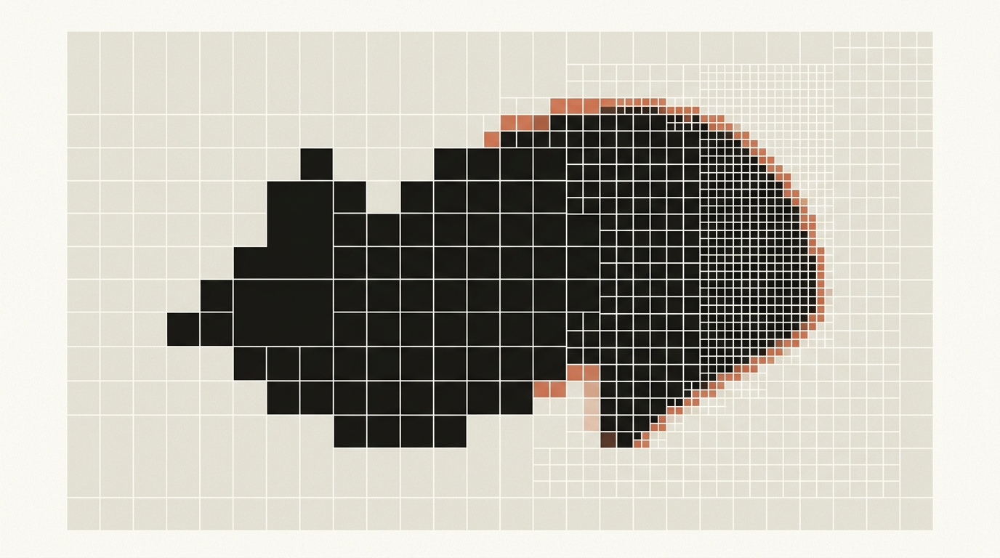
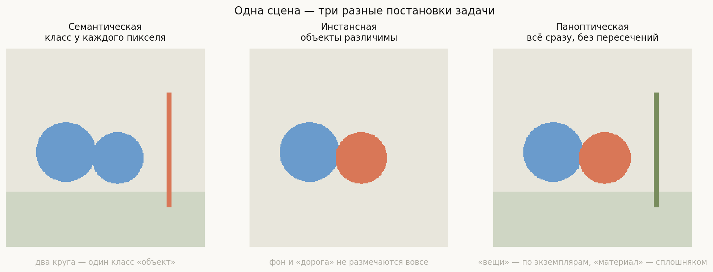
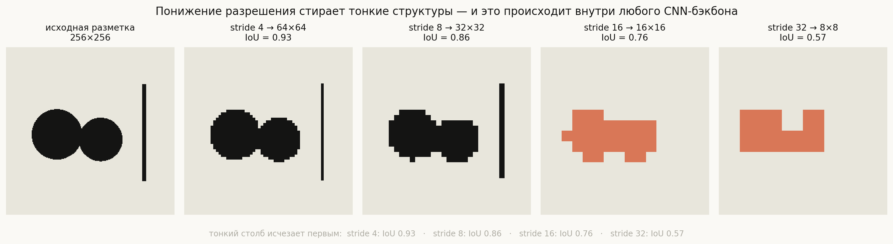
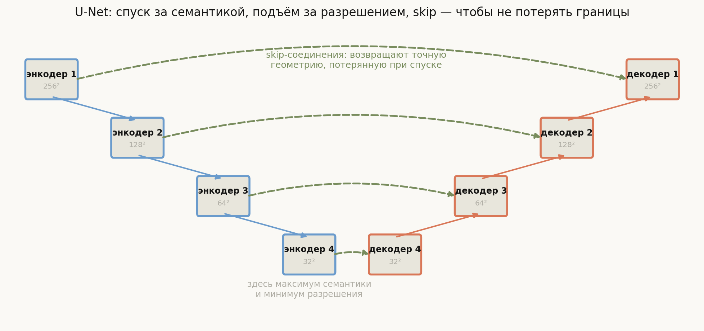
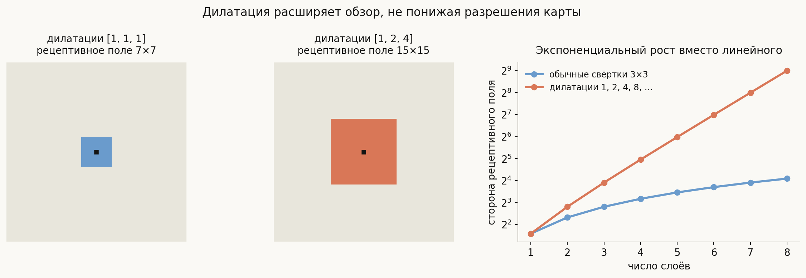
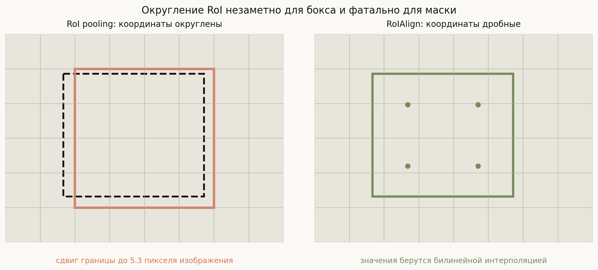

# Архитектуры сегментации

**Вопрос**: Чем семантическая сегментация отличается от инстансной и паноптической? Как устроены FCN, U-Net, DeepLab, Mask R-CNN и современные трансформерные подходы?

Сегментация выглядит как классификация, доведённая до предела: вместо одной метки на изображение — метка у каждого пикселя. Формально так и есть, и именно поэтому первым решением было просто прогнать классификатор скользящим окном по всем позициям. Но за этой простотой прячется конфликт, который определяет вообще все архитектуры сегментации.

Конфликт такой. Чтобы понять, **что** изображено, сети нужен широкий обзор: класс пикселя зависит от контекста далеко за его пределами. Обзор набирают глубиной и понижением разрешения — каждый stride-2 слой вдвое расширяет поле зрения в пересчёте на исходные пиксели. Но чтобы сказать, **где** проходит граница, нужно ровно противоположное — сохранённое разрешение. Классификатору хватает первого; сегментации нужно и то, и другое сразу.

Вся история архитектур — это разные ответы на вопрос «как получить семантику, не потеряв геометрию». U-Net возвращает потерянное разрешение по дороге наверх, DeepLab старается его не терять вовсе, трансформеры берут контекст без понижения масштаба. Если держать этот конфликт в голове, все семейства выстраиваются в одну понятную линию.

## План

1. Три постановки задачи: семантическая, инстансная, паноптическая
2. Почему это трудно: цена понижения разрешения
3. FCN: первая полностью свёрточная
4. U-Net: вернуть разрешение через skip-соединения
5. DeepLab: не терять разрешение вовсе
6. Mask R-CNN и цена округления
7. Трансформеры: сегментация как предсказание множества масок
8. Функции потерь
9. Что спрашивают на собеседовании
10. Типичные ошибки
11. Итог

---

## 1. Три постановки задачи

**Семантическая.** Каждому пикселю — класс. Два соседних объекта одного класса сливаются в одну область: на левой панели оба круга окрашены одинаково, различить их невозможно и не требуется.

**Инстансная.** Различаем экземпляры: круг слева и круг справа — разные объекты со своими масками. Зато аморфные области — небо, дорога, трава — не размечаются вовсе, потому что «экземпляр неба» не имеет смысла.

**Паноптическая.** Объединение: каждый пиксель получает и класс, и — если класс счётный — номер экземпляра. Разметка обязана быть **полной и без пересечений**: ни один пиксель не остаётся без метки и ни один не принадлежит двум сегментам сразу.

Отсюда терминология, которую стоит знать дословно: **things** — счётные объекты (человек, машина, круг), у них есть экземпляры; **stuff** — аморфный «материал» (небо, дорога, трава), экземпляров у него нет. Инстансная сегментация работает только с things, семантическая — со всем подряд, но без различения экземпляров, паноптическая — со всем и с различением.

Практический критерий выбора простой: нужно ли **считать** объекты. Если да — нужна инстансная или паноптическая; если достаточно знать, где проходит область класса, хватит семантической.

## 2. Почему это трудно: цена понижения разрешения

Стандартный CNN-бэкбон понижает разрешение в 32 раза: изображение 256×256 приходит к карте признаков 8×8. Посмотрим, что от разметки к этому моменту остаётся, если просто понизить и вернуть разрешение обратно.

Числа посчитаны на реальных масках. Даже при идеальном классификаторе — то есть если сеть не ошибается вообще, а мы лишь ограничены сеткой, — потолок качества падает так:

| stride | размер карты | IoU |
|---|---|---|
| 4 | 64×64 | 0.93 |
| 8 | 32×32 | 0.86 |
| 16 | 16×16 | 0.76 |
| 32 | 8×8 | 0.57 |

Обратите внимание, что именно исчезает первым. Тонкий столб доживает до stride 8 и полностью пропадает при 16 — тонкие протяжённые структуры (столбы, провода, ноги пешеходов, стебли на медицинских снимках) не переживают понижения масштаба. Круги при stride 32 сливаются в одну кляксу.

Это верхняя граница, не зависящая от качества обучения: **архитектура задаёт потолок раньше, чем начинается оптимизация**. Отсюда и все дальнейшие решения.

## 3. FCN: первая полностью свёрточная

**FCN (2015)** сделала два шага, которые кажутся очевидными только задним числом.

Первый: **убрать полносвязные слои**. В классификаторе последние слои принимают вектор фиксированной длины, поэтому и вход обязан быть фиксированного размера. Полносвязный слой поверх карты $7 \times 7$ эквивалентен свёртке $7 \times 7$ — если записать его как свёртку, сеть начинает принимать вход любого размера и выдавать не вектор, а **карту предсказаний**. Дёшево и меняет всё.

Второй: **научиться поднимать разрешение** обратно — транспонированной свёрткой (её часто неточно называют «деконволюцией»; обратной операцией к свёртке она не является).

Наивная версия FCN-32s поднимала карту stride 32 сразу в полное разрешение и давала грубые, оплывшие границы — ровно то, что видно в правой панели картинки выше. Поэтому появились FCN-16s и FCN-8s: перед подъёмом складывать предсказания с более ранних, высокоразрешающих слоёв. Это первая форма skip-соединений в сегментации, и именно она задала направление.

## 4. U-Net: вернуть разрешение через skip-соединения

**U-Net (2015)** довела идею до симметричной схемы, которая стала стандартом де-факто далеко за пределами медицинских снимков, для которых создавалась.

Энкодер спускается, набирая семантику и теряя разрешение; декодер поднимается обратно; на **каждом** уровне карта из энкодера конкатенируется с картой декодера того же размера. Разделение труда получается чистым: глубокие слои приносят ответ на вопрос «что это», skip-соединения — «где именно проходит граница».

Три детали, которые стоит помнить:

- **Конкатенация, а не сложение.** Признаки энкодера и декодера разной природы, и U-Net даёт следующему слою решать, как их смешивать, вместо того чтобы усреднять заранее.
- **Работает на малых данных.** U-Net создавалась для биомедицинских снимков, где размеченных изображений десятки, а не миллионы. Skip-соединения дают короткий путь градиенту и снижают потребность в данных.
- **Симметрия не обязательна.** Современные варианты берут в качестве энкодера предобученный ResNet или EfficientNet, оставляя декодер лёгким. Схема U-Net — про связи, а не про конкретные блоки.

## 5. DeepLab: не терять разрешение вовсе

Альтернативная стратегия: если проблема в понижении разрешения, может, просто не понижать? Но тогда рецептивное поле растёт слишком медленно — стопка обычных свёрток $3\times3$ добавляет к нему всего 2 пикселя за слой.

Решение — **дилатация** (atrous convolution): раздвинуть точки ядра, оставив число параметров прежним.

Слева видно, что даёт стопка из трёх свёрток: с дилатациями $[1,1,1]$ рецептивное поле $7\times7$, с $[1,2,4]$ — уже $15\times15$, при том же числе весов и **том же разрешении карты**. Правая панель показывает разницу в росте: на восьми слоях обычные свёртки дают сторону 17 пикселей, дилатация с удвоением — 511. Линейный рост против экспоненциального.

Поверх этого DeepLab ставит **ASPP** (Atrous Spatial Pyramid Pooling) — несколько параллельных ветвей с разными дилатациями, результаты которых объединяются. Смысл прямой: объекты бывают разного масштаба, и вместо одного компромиссного обзора модель получает сразу несколько и учится выбирать.

Итог: DeepLab работает на stride 8 или 16 вместо 32, сохраняя приличное разрешение и при этом имея широкий контекст. Плата — вычисления: карты признаков остаются большими на всю глубину сети.

## 6. Mask R-CNN и цена округления

Для инстансной сегментации нужно различать экземпляры, а это ровно то, что умеет детектор. **Mask R-CNN (2017)** отсюда и выросла: берём Faster R-CNN и добавляем к головам классификации и бокса третью — маленькую свёрточную сеть, предсказывающую бинарную маску внутри региона.

Два решения, которые стоит уметь объяснить.

**Маска предсказывается отдельно для каждого класса, а выбор класса делает другая голова.** То есть маска отвечает только на вопрос «объект или фон внутри этого региона», не конкурируя между классами. Это развязывает две задачи и заметно улучшает качество — в статье это подчёркнуто отдельно.

**RoIAlign вместо RoI pooling.** Вот главная деталь всей архитектуры.

RoI pooling округляет координаты региона до целых ячеек карты признаков — и делает это дважды: сначала при переводе бокса в координаты карты, потом при нарезке региона на ячейки. При stride 16 округление сдвигает границу до **5.3 пикселя** исходного изображения. Для бокса это несущественно: сдвиг в пару пикселей почти не меняет IoU. Для маски — катастрофа: маска предсказывается в сетке 28×28 внутри региона, и смещение всей системы координат на несколько пикселей смазывает каждую границу.

RoIAlign просто не округляет: сохраняет дробные координаты и берёт значения признаков билинейной интерполяцией в точках выборки. Изменение выглядит технической мелочью, а даёт один из крупнейших приростов в статье. Это любимый вопрос на собеседовании именно потому, что проверяет, читал ли человек статью или пересказывает общее описание.

## 7. Трансформеры: сегментация как предсказание множества масок

Дальше история повторяет то, что произошло с детекцией.

**SegFormer и подобные** заменяют свёрточный энкодер трансформерным. Выигрыш в том, что глобальный контекст доступен с первого слоя: механизму внимания не нужно копить рецептивное поле слой за слоем, он видит всю картинку сразу. Конфликт «разрешение против обзора» ослабевает у самого корня, а декодер становится очень лёгким.

**MaskFormer и Mask2Former** идут дальше и меняют саму постановку. Классический подход — «каждому пикселю свой класс» (per-pixel classification). Новый — **mask classification**: модель предсказывает набор из $N$ пар «маска + класс», а сопоставление с истиной делается **венгерским алгоритмом**, ровно как в [DETR](../object-detection-architectures/lesson.md#8-detr-детекция-как-предсказание-множества).

Красота в том, что эта постановка **единообразно покрывает все три задачи**. Семантическая сегментация — набор масок, где каждому классу соответствует одна маска. Инстансная — набор масок things с классами. Паноптическая — то же самое, просто маски покрывают всё изображение. Раньше под каждую задачу строили свою архитектуру; теперь одна модель обучается на любую, отличаясь лишь разметкой.

Общая линия та же, что и в детекции: **специализированные пайплайны с ручными эвристиками сменяются единой постановкой «предскажи множество»**.

## 8. Функции потерь

Отдельная тема, по которой почти всегда спрашивают, потому что здесь легко ошибиться.

**Пиксельная кросс-энтропия** — база. Проблема — дисбаланс: если объект занимает 2% пикселей, фон доминирует в градиенте, и модель быстро приходит к вырожденному решению «всё фон».

**Dice loss** оптимизирует перекрытие напрямую:

$$\mathcal{L}_{\text{Dice}} = 1 - \frac{2|P \cap G|}{|P| + |G|}$$

Знаменатель нормирован на размеры обеих масок, поэтому маленький объект вносит вклад, сопоставимый с большим — дисбаланс лечится самой формулой. Минус: у Dice-потери менее стабильные градиенты, особенно в начале обучения.

**На практике складывают обе**: `CE + Dice`. Кросс-энтропия даёт устойчивую оптимизацию, Dice — правильные приоритеты. Есть и другие варианты — Focal loss (гасит вклад лёгких пикселей), Tversky (асимметричный Dice, позволяет по-разному штрафовать FP и FN — полезно в медицине, где пропуск дороже ложной тревоги), boundary loss (отдельно штрафует ошибки на границах).

Подробнее про сами метрики и про то, чем Dice отличается от IoU, — в [соседней теме](../segmentation-metrics/lesson.md).

## 9. Что спрашивают на собеседовании

**В чём разница между тремя видами сегментации?** Семантическая — класс у пикселя без различения экземпляров; инстансная — экземпляры things без stuff; паноптическая — всё сразу, полное покрытие без пересечений.

**Зачем в U-Net skip-соединения?** Глубокие слои знают «что», но потеряли «где». Skip возвращает точную геометрию с высокоразрешающих уровней энкодера.

**Что такое atrous/dilated convolution и зачем?** Раздвинутое ядро: рецептивное поле растёт экспоненциально при том же числе параметров и без понижения разрешения карты.

**Чем RoIAlign лучше RoI pooling?** Не округляет координаты региона, берёт признаки билинейной интерполяцией. Для бокса округление терпимо, для маски — сдвигает всю систему координат и смазывает границы.

**Почему в Mask R-CNN маски предсказываются отдельно для каждого класса?** Чтобы маска решала только задачу «объект/фон» и не конкурировала с классификацией; классом занимается отдельная голова.

**Почему кросс-энтропия плоха при дисбалансе и что делать?** Фон доминирует в градиенте. Лечится Dice-потерей, которая нормирована на размеры масок, обычно в сумме с CE.

**Как трансформеры изменили сегментацию?** Глобальный контекст с первого слоя плюс переход к постановке mask classification, единой для всех трёх задач, с венгерским сопоставлением как в DETR.

## 10. Типичные ошибки

- **Считать, что инстансная сегментация — это «семантическая плюс разделение объектов».** Это разные разметки: инстансная не размечает stuff вообще, а семантическая не различает экземпляры. Одна не получается из другой постобработкой.
- **Называть транспонированную свёртку «деконволюцией».** Она не обращает свёртку; это просто обучаемый способ повысить разрешение. Плюс она даёт шахматные артефакты, из-за чего часто заменяется на upsample + обычную свёртку.
- **Думать, что U-Net нужна только в медицине.** Это универсальная схема энкодер-декодер со skip-соединениями; область применения давно шире.
- **Путать stride и дилатацию.** Stride понижает разрешение выхода, дилатация — нет. Обе расширяют рецептивное поле, но платят разную цену.
- **Считать RoIAlign косметикой.** Это одно из главных изменений в Mask R-CNN; для масок цена округления несопоставима с ценой для боксов.
- **Обучать на голой кросс-энтропии при сильном дисбалансе.** Модель сойдётся к «всё фон» и получит отличную пиксельную точность при нулевом IoU объекта.
- **Забывать про потолок разрешения.** Если тонкие структуры не переживают stride бэкбона, никакая функция потерь их не спасёт — нужно менять stride, дилатацию или разрешение входа.

## 11. Итог

Сегментация — это классификация каждого пикселя, и вся сложность в том, что ответ требует одновременно широкого контекста и точной геометрии, а глубокие сети покупают первое ценой второго. Прогон на реальных масках показывает масштаб проблемы: при типичном stride 32 даже идеальный классификатор упирается в IoU около 0.57, а тонкие протяжённые структуры пропадают уже к stride 16. FCN сделала сеть полностью свёрточной и научилась поднимать разрешение, U-Net вернула потерянную геометрию через skip-соединения на каждом уровне, DeepLab пошла другим путём — сохранять разрешение, а обзор добирать дилатацией, растущей экспоненциально. Инстансная сегментация выросла из детекции: Mask R-CNN добавила к Faster R-CNN голову масок, и ключевой деталью оказался RoIAlign, убравший округление координат, безобидное для бокса и разрушительное для маски. Наконец, трансформерные модели дали глобальный контекст с первого слоя и переформулировали задачу как предсказание множества масок с венгерским сопоставлением — постановку, единую для семантической, инстансной и паноптической сегментации сразу.

---

## Что рядом

- [`generate_visuals.py`](generate_visuals.py) — код диаграмм; потеря разрешения, рецептивные поля и сдвиг RoI считаются на реальных сетках
- [Метрики сегментации: mIoU, Dice и PQ](../segmentation-metrics/lesson.md) — как измерять то, что здесь строится
- [Архитектуры детекции объектов](../object-detection-architectures/lesson.md) — откуда Mask R-CNN берёт регионы и почему DETR важен для Mask2Former
- Смежное: [CNN Filter Pooling](../../architectures/CNN%20Filter%20Pooling.md), [Self-Attention and Transformers](../../architectures/Self-Attention%20and%20Transformers.md)
