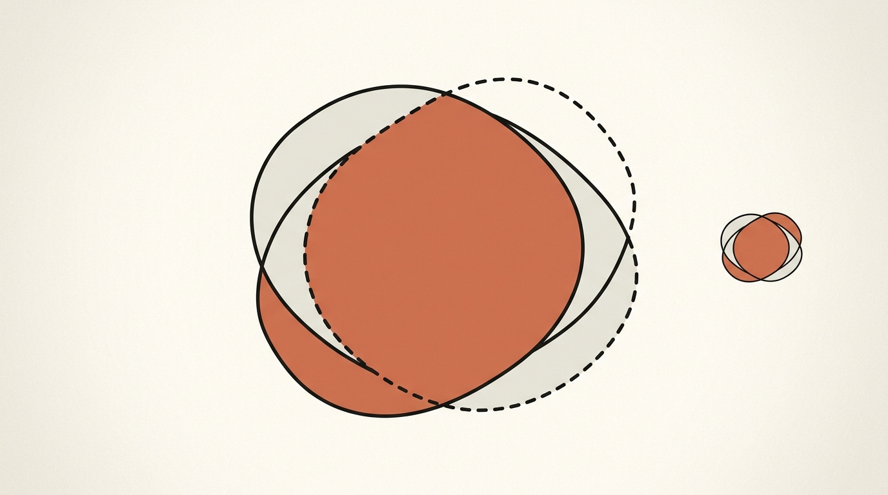
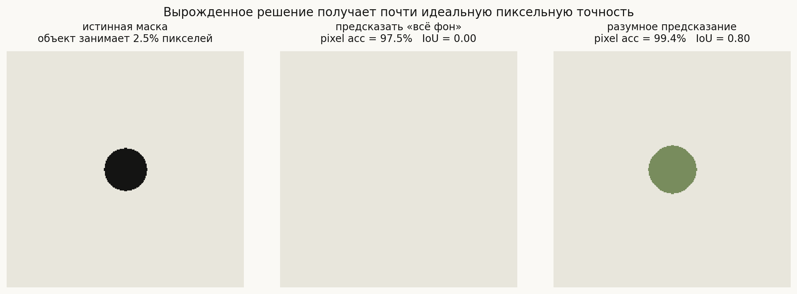
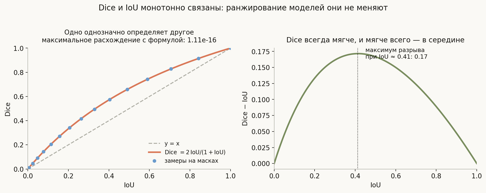
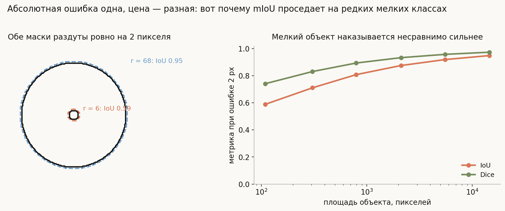
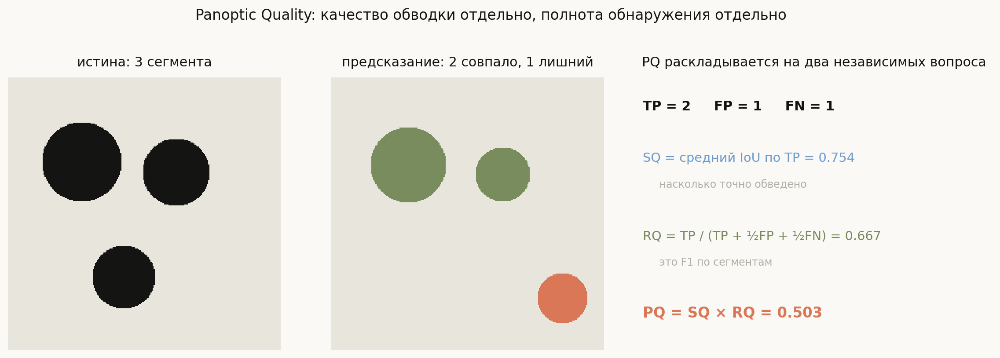

# Метрики сегментации: mIoU, Dice и PQ

**Вопрос**: Как измеряют качество сегментации? Чем Dice отличается от IoU, почему нельзя пользоваться пиксельной точностью и что такое Panoptic Quality?

Соблазн очевиден: раз сегментация — это классификация каждого пикселя, давайте и мерить её как классификацию, долей правильно предсказанных пикселей. Соблазн ровно настолько же губителен. В типичной задаче объект занимает считанные проценты кадра, и модель, не нашедшая вообще ничего, получит великолепную оценку.

Поэтому все работающие метрики сегментации устроены вокруг одной идеи: **считать не долю правильных пикселей, а перекрытие масок** — величину, у которой фон не стоит в числителе. Дальше начинаются различия: IoU и Dice меряют перекрытие двух чисел по-разному, mIoU добавляет усреднение по классам, а PQ разделяет два независимых вопроса — «нашёл ли объект» и «насколько точно обвёл».

И как в [метриках детекции](../../computer-vision/detection-metrics/lesson.md), самое важное здесь — не формулы, а понимание, чего каждая метрика **не видит**.

## План

1. Почему пиксельная точность не работает
2. IoU и mIoU
3. Dice: то же самое, но мягче
4. Чувствительность к размеру объекта
5. Panoptic Quality: два вопроса вместо одного
6. Mask AP для инстансной сегментации
7. Что выбирать
8. Что спрашивают на собеседовании
9. Типичные ошибки
10. Итог

---

## 1. Почему пиксельная точность не работает

Числа посчитаны на реальных масках. Объект занимает 2.5% кадра. Модель, предсказавшая «всё фон», получает **pixel accuracy 97.45%** и **IoU 0.000**. Одна метрика рапортует о почти идеальной работе, другая — о полном провале, и права вторая.

Причина в том, что пиксельная точность считает и правильно предсказанный фон тоже. А фона всегда подавляющее большинство, и предсказывать его легко. Метрика измеряет в основном то, насколько задача проста, а не насколько модель хороша.

Тот же дефект живёт и в функции потерь: обучение на голой пиксельной кросс-энтропии при сильном дисбалансе сходится ровно к этому вырожденному решению (см. [архитектуры](../segmentation-architectures/lesson.md#8-функции-потерь)).

Отсюда общее правило: **метрика сегментации не должна иметь фон в числителе.**

## 2. IoU и mIoU

Основная метрика — то же **Intersection over Union**, что и в детекции, но считаемое по пикселям маски, а не по площадям боксов:

$$\mathrm{IoU} = \frac{|P \cap G|}{|P \cup G|} = \frac{TP}{TP + FP + FN}$$

Правая запись показывает главное: **TN в формулу не входит**. Правильно угаданный фон не приносит ничего — ровно то свойство, которого не хватало пиксельной точности.

**mIoU** (mean IoU) — среднее IoU по классам: считаем IoU отдельно для каждого класса и усредняем. Это стандартная метрика семантической сегментации на Cityscapes, ADE20K, Pascal VOC.

Две детали, которые надо знать про усреднение:

- **Оно невзвешенное.** Класс «дорога», занимающий треть каждого кадра, и класс «светофор», занимающий доли процента, входят в среднее с одинаковым весом. Это сделано намеренно — иначе метрика измеряла бы только частые классы, — но означает, что **mIoU тянут вниз редкие классы**.
- **Пустые классы — отдельная морока.** Если класса нет ни в истине, ни в предсказании, IoU не определён ($0/0$). Разные реализации либо пропускают такой класс, либо ставят 1.0, и числа расходятся. При сравнении с чужими результатами это стоит уточнять.

Кроме mIoU встречаются **frequency-weighted IoU** (взвешенное по частоте — возвращает перекос в сторону частых классов) и **per-class IoU** — таблица по классам, которая на практике полезнее агрегата: она сразу показывает, какой класс развалился.

## 3. Dice: то же самое, но мягче

**Dice coefficient** (он же F1 по пикселям, он же коэффициент Сёренсена):

$$\mathrm{Dice} = \frac{2|P \cap G|}{|P| + |G|} = \frac{2\,TP}{2\,TP + FP + FN}$$

Ключевой факт, который стоит уметь вывести на доске: **Dice и IoU связаны взаимно однозначно**.

$$\mathrm{Dice} = \frac{2\,\mathrm{IoU}}{1 + \mathrm{IoU}}, \qquad \mathrm{IoU} = \frac{\mathrm{Dice}}{2 - \mathrm{Dice}}$$

Формула не постулирована, а проверена: синие точки — замеры на настоящих масках при разном сдвиге, оранжевая кривая — формула, максимальное расхождение **1.1e-16**, то есть машинная точность.

Отсюда два следствия.

**Функция монотонна**, поэтому Dice и IoU **дают одинаковое ранжирование моделей**. Если модель A лучше модели B по IoU, она лучше и по Dice. Спор «что лучше мерить» бессмыслен, если речь о сравнении моделей на одном датасете.

**Dice всегда не меньше IoU**, и разрыв максимален посередине: при IoU 0.41 разница достигает 0.172. То есть Dice систематически рисует более приятную картину. Практический смысл: число «Dice 0.85» звучит солиднее, чем эквивалентное ему «IoU 0.74», и в статьях этим пользуются. Всегда уточняйте, что именно приведено.

Различие становится содержательным только там, где метрики **агрегируются по-разному** или используются **как функция потерь**: у Dice-потери градиент сильнее реагирует на маленькие объекты, что при дисбалансе полезно.

## 4. Чувствительность к размеру объекта

Свойство, которое объясняет большую часть практических неожиданностей.

Обе маски раздуты **ровно на 2 пикселя** — ошибка локализации границы одна и та же. Но платят объекты совершенно по-разному:

| площадь объекта | IoU при ошибке 2 px |
|---|---|
| 109 px | 0.59 |
| 793 px | 0.81 |
| 5 521 px | 0.92 |
| 14 493 px | 0.95 |

Причина геометрическая: ошибка живёт на границе, то есть растёт как периметр, а нормируется на площадь. Отношение периметра к площади у мелкого объекта во много раз больше.

Отсюда несколько практических выводов:

- **Низкий mIoU часто означает не плохую модель, а мелкие классы.** Смотрите per-class IoU, прежде чем чинить архитектуру.
- **Сравнивать mIoU между датасетами нельзя** ещё и по этой причине: датасет с мелкими объектами обречён на меньшие числа.
- **Тонкие протяжённые объекты — худший случай.** У столба или провода почти вся площадь является границей, поэтому IoU для них низок структурно, даже при аккуратной работе модели. Ровно этот случай хуже всего переживает и понижение разрешения в бэкбоне.

## 5. Panoptic Quality: два вопроса вместо одного

Для паноптической сегментации mIoU не годится: он ничего не знает про экземпляры. Нужна метрика, которая одновременно проверяет, что объекты **найдены поштучно** и что они **точно обведены**. Это **Panoptic Quality**:

$$\mathrm{PQ} = \frac{\sum_{(p,g) \in TP} \mathrm{IoU}(p, g)}{|TP| + \tfrac{1}{2}|FP| + \tfrac{1}{2}|FN|}$$

Сопоставление сегментов делается по правилу $\mathrm{IoU} > 0.5$. Порог выбран не случайно: при перекрытии строго больше половины предсказанный сегмент может соответствовать **только одному** истинному, поэтому сопоставление получается однозначным автоматически, без венгерского алгоритма и без сортировки по уверенности.

Красота PQ в том, что она **раскладывается на два независимых множителя**:

$$\mathrm{PQ} = \underbrace{\frac{\sum_{TP} \mathrm{IoU}}{|TP|}}_{\text{SQ}} \times \underbrace{\frac{|TP|}{|TP| + \tfrac{1}{2}|FP| + \tfrac{1}{2}|FN|}}_{\text{RQ}}$$

- **SQ** (Segmentation Quality) — средний IoU по совпавшим парам: *насколько точно обведено то, что нашли*.
- **RQ** (Recognition Quality) — это в точности **F1 по сегментам**: *насколько полно и чисто нашли*.

В прогоне на картинке: PQ 0.503 = SQ 0.754 × RQ 0.667. Разложение сразу говорит, где проблема — модель находит сегменты средне (RQ 0.67: один лишний и один пропущенный из трёх) и обводит их тоже средне (SQ 0.75).

Это главное практическое достоинство PQ: одно число не объясняет, что чинить, а два — объясняют.

И тут же — важная оговорка про само произведение. В прогоне из `notebook.ipynb` сценарий, где один объект **пропущен**, но остальные обведены точно, получил PQ 0.754, а сценарий, где найдено **всё**, но обведено грубо, — только 0.702. PQ перемножает множители, и провал любого из них тянет итог одинаково. Если в вашей задаче пропуск объекта дороже неаккуратной границы (а так бывает почти всегда), смотреть надо на SQ и RQ по отдельности, а не на их произведение.

## 6. Mask AP для инстансной сегментации

Для инстансной сегментации используют **тот же AP, что и в детекции**, с единственной заменой: IoU считается не по боксам, а по маскам. Весь протокол — сопоставление по убыванию уверенности, штраф за дубликаты, усреднение по порогам IoU $0.50{:}0.05{:}0.95$ — остаётся прежним, см. [метрики детекции](../detection-metrics/lesson.md).

В таблицах COCO это обозначается как $\mathrm{AP}^{\text{mask}}$ в отличие от $\mathrm{AP}^{\text{bbox}}$. Полезное наблюдение: у одной и той же модели $\mathrm{AP}^{\text{mask}}$ обычно заметно ниже $\mathrm{AP}^{\text{bbox}}$, и причина ровно та, что разобрана в разделе 4 — попасть боксом в порог IoU намного легче, чем маской, потому что маска штрафуется за каждый пиксель границы.

## 7. Что выбирать

| Задача | Метрика |
|---|---|
| Семантическая | mIoU, обязательно с таблицей per-class |
| Семантическая с сильным дисбалансом | mIoU + Dice по редким классам |
| Инстансная | $\mathrm{AP}^{\text{mask}}$ по протоколу COCO |
| Паноптическая | PQ, всегда с разложением на SQ и RQ |
| Медицина | Dice (традиция области) + метрики границ; часто важнее recall, чем precision |
| Важна точность границ | добавить Boundary IoU или Hausdorff distance |

Последняя строка заслуживает пояснения. И IoU, и Dice — метрики **площади**, и обе почти не замечают качества границы у крупных объектов: сдвиг контура на пару пикселей у большого объекта роняет IoU на сотые доли. Если приложению важен именно контур — обводка органа для планирования операции, вырезание объекта для монтажа, — нужны метрики границ: **Boundary IoU** (IoU, считаемый только в узкой полосе вдоль контура) или **расстояние Хаусдорфа** (максимальное отклонение контура).

## 8. Что спрашивают на собеседовании

**Почему нельзя мерить пиксельной точностью?** Фон доминирует. Вырожденное «всё фон» даёт 97% точности при нулевом IoU.

**Чем Dice отличается от IoU?** Они связаны монотонно, $\mathrm{Dice} = 2\,\mathrm{IoU}/(1+\mathrm{IoU})$, и дают одинаковое ранжирование моделей. Dice систематически выше — разрыв до 0.17 в середине шкалы. Разница содержательна при агрегировании и в роли функции потерь.

**Почему mIoU падает на мелких объектах?** Ошибка живёт на границе и растёт как периметр, а нормируется на площадь. У мелкого объекта отношение периметра к площади велико: та же ошибка в 2 пикселя даёт IoU 0.59 вместо 0.95.

**Что такое PQ и зачем его раскладывают?** PQ = SQ × RQ: качество обводки найденного умножить на F1 по сегментам. Разложение показывает, что именно сломано — поиск или обводка.

**Почему в PQ порог IoU именно 0.5?** При перекрытии больше половины предсказанный сегмент может отвечать только одному истинному, поэтому сопоставление однозначно без дополнительных правил.

**Чем mask AP отличается от box AP?** Только тем, что IoU считается по маскам. Обычно ниже, потому что маска штрафуется за каждый пиксель границы.

**Метрика хорошая, а результат визуально плохой — почему?** Скорее всего, страдают границы, а IoU их почти не замечает у крупных объектов. Нужны метрики границ.

## 9. Типичные ошибки

- **Приводить pixel accuracy как метрику качества.** Она измеряет долю фона в датасете, а не работу модели.
- **Считать Dice и IoU разными по существу метриками.** Они взаимно однозначны; спор о выборе имеет смысл только для функции потерь или для схемы агрегирования.
- **Сравнивать mIoU между датасетами.** Разный состав классов, разные размеры объектов, разная обработка пустых классов.
- **Не проверять, как реализация считает отсутствующие классы.** $0/0$ трактуется по-разному, и расхождение бывает в несколько процентных пунктов.
- **Смотреть только на агрегат.** Per-class IoU почти всегда информативнее mIoU: он показывает, какой именно класс развалился.
- **Ждать, что IoU оценит границы.** Это метрика площади; для контуров нужны Boundary IoU или Хаусдорф.
- **Путать PQ и mIoU.** mIoU ничего не знает про экземпляры и в паноптической задаче неприменим.
- **Усреднять IoU по изображениям вместо накопления по датасету.** Это разные числа, и расходятся они заметно: в прогоне на 60 кадрах с объектами разного размера среднее по кадрам дало 0.839, а IoU, накопленный по всему набору, — 0.912. Среднее по кадрам даёт каждому изображению равный вес, накопление — вес по площади. Оба способа встречаются в библиотеках, поэтому уточнять надо не только метрику, но и схему агрегирования.

## 10. Итог

Метрики сегментации построены на одном принципе: считать перекрытие масок, не пуская правильно угаданный фон в числитель, — иначе вырожденное решение «всё фон» получает 97% пиксельной точности при нулевом IoU. Базовая величина — IoU, а mIoU усредняет её по классам невзвешенно, из-за чего редкие и мелкие классы тянут итог вниз сильнее, чем кажется. Dice — та же информация в другой шкале: связь $\mathrm{Dice} = 2\,\mathrm{IoU}/(1+\mathrm{IoU})$ монотонна, поэтому ранжирование моделей от выбора не зависит, но Dice систематически выше, и путать их при чтении статей нельзя. Обе метрики резко чувствительны к размеру объекта: одна и та же ошибка границы в 2 пикселя стоит мелкому объекту IoU 0.59, а крупному — 0.95, и это геометрия, а не свойство модели. Для паноптической сегментации используется PQ, разложимая на SQ (точность обводки) и RQ (F1 по сегментам), — редкий случай метрики, которая сама говорит, что чинить. Для инстансной берут mask AP по протоколу COCO. И главное, что стоит помнить: все они меряют площадь, а не контур, поэтому визуально плохой результат при хорошем числе — обычная ситуация, лечится метриками границ.

---

## Что рядом

- [`notebook.ipynb`](notebook.ipynb) — mIoU, Dice и PQ, реализованные с нуля и проверенные
- [`generate_visuals.py`](generate_visuals.py) — код диаграмм; все числа считаются на настоящих масках
- [Архитектуры сегментации](../segmentation-architectures/lesson.md) — что именно здесь оценивается
- [Метрики детекции](../detection-metrics/lesson.md) — откуда взят протокол mask AP
- Смежное: [Confusion Matrix Precision Recall](../../../../ml/objectives-metrics-evaluation/Confusion%20Matrix%20Precision%20Recall.md), [F1 Score](../../../../ml/objectives-metrics-evaluation/F1%20Score.md)
