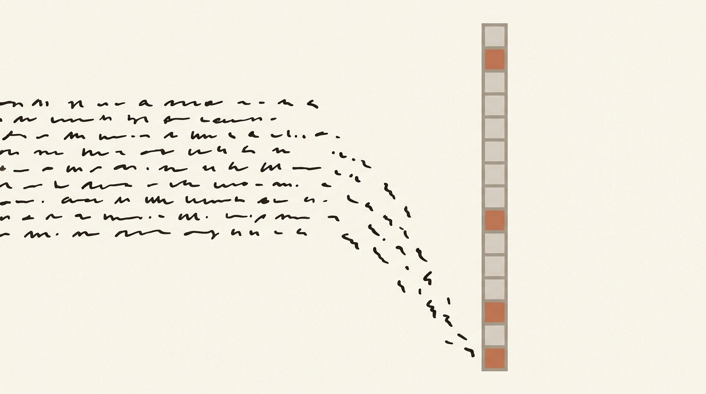
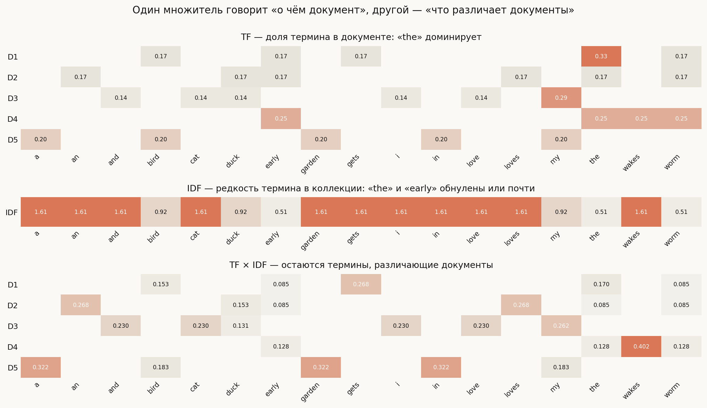
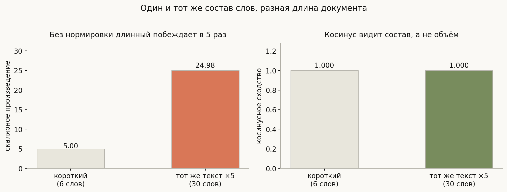
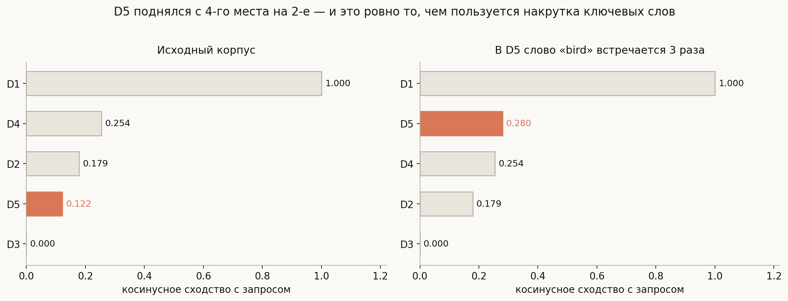
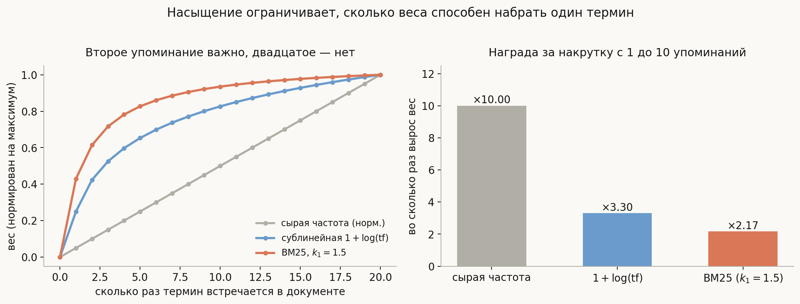
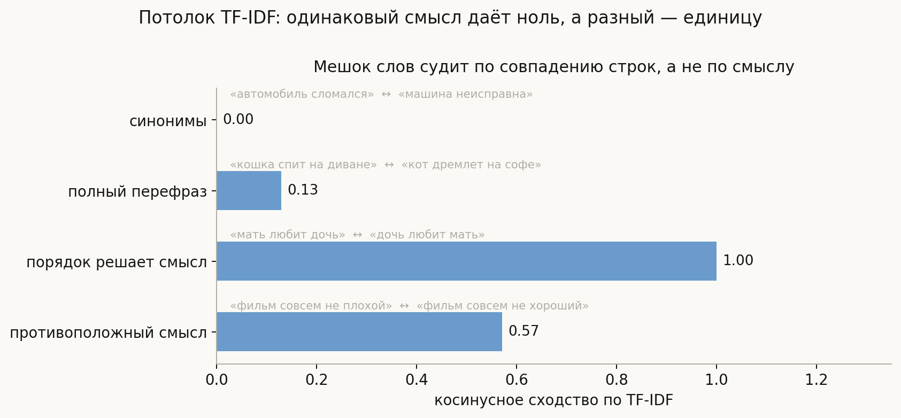
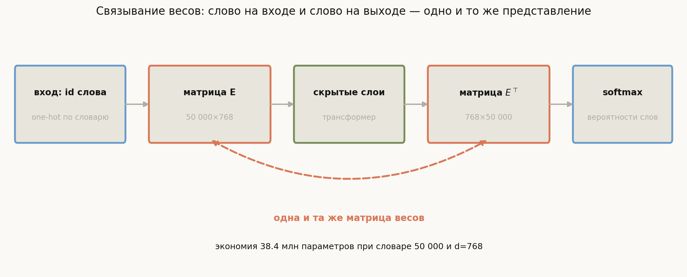

# TF-IDF и представление текста числами

**Вопрос (EN)**: Given 5 documents, rank them by TF-IDF + cosine similarity for query «The early bird gets the worm». What happens to D5 rank if «bird» is mentioned 3 times?
Also: why do some NLP models share weights between the embedding layer and the pre-softmax layer?

Любая модель принимает на вход числа фиксированной размерности. Текст — это последовательность дискретных символов переменной длины. Между этими двумя фактами лежит вся первая глава NLP, и TF-IDF — её классический ответ, который стоит понимать не как формулу, а как конструкцию из двух противоборствующих сигналов.

Сигнал первый: **насколько документ занят этим термином**. Чем чаще слово встречается в документе, тем вероятнее, что документ о нём. Сигнал второй: **насколько термин вообще способен различать документы**. Слово, встречающееся везде, не различает ничего — узнав, что в документе есть «the», вы не узнали о нём ничего.

Взятые по отдельности, оба сигнала бесполезны. Сортировка по частоте выведет наверх служебные слова. Сортировка по редкости выведет опечатки. TF-IDF — их произведение, и почти каждая практическая проблема — от накрутки ключевых слов до перекоса в сторону длинных документов — оказывается поломкой ровно одного из двух множителей. Это и есть удобная рамка для ответа на собеседовании.

## План

1. Мешок слов: что мы выбрасываем сразу
2. Почему сырые частоты не работают
3. IDF: вес как различающая сила
4. TF-IDF: произведение двух сигналов
5. Косинус вместо скалярного произведения
6. Ранжирование и вопрос про «bird» три раза
7. Насыщение и BM25
8. Какой именно TF-IDF: варианты формулы
9. Потолок мешка слов
10. Связывание весов embedding и pre-softmax
11. Что спрашивают на собеседовании
12. Типичные ошибки
13. Итог

---

## 1. Мешок слов: что мы выбрасываем сразу

Простейший способ получить вектор фиксированной длины — зафиксировать словарь из $|V|$ терминов и сопоставить документу вектор длины $|V|$, где на позиции термина стоит его счётчик. Это **мешок слов** (bag of words).

Слово «мешок» здесь честное: порядок теряется полностью. «Мать любит дочь» и «дочь любит мать» дают **побитово одинаковый вектор**, хотя в русском именно порядок определяет, кто кого любит, — падежные формы здесь совпадают и снять неоднозначность больше нечем.

Это не мелкий недостаток, а фундаментальное свойство представления, и его нужно называть вслух: мы меняем всю синтаксическую структуру на возможность работать с фиксированным вектором. Удивительно другое — для многих задач (классификация тем, поиск, фильтрация спама) этого хватает, потому что тема документа неплохо определяется тем, *какие* слова в нём есть, безотносительно порядка.

## 2. Почему сырые частоты не работают

Возьмём частоту термина в документе — **TF** (term frequency):

$$\mathrm{TF}(t, d) = \frac{\text{сколько раз } t \text{ встречается в } d}{\text{всего слов в } d}$$

Деление на длину документа нужно сразу, иначе длинные документы получат большие числа просто потому, что они длинные.

Проблема в другом. Самые частые слова любого языка — служебные: артикли, предлоги, союзы. В нашем корпусе из пяти документов «the» — абсолютный чемпион по TF, но именно оно не несёт никакой информации о содержании. Ранжирование по TF выдаст документ, где больше всего «the».

Нужен второй множитель, который погасит вездесущие слова.

## 3. IDF: вес как различающая сила

**IDF** (inverse document frequency) измеряет, в скольких документах коллекции термин вообще встречается:

$$\mathrm{IDF}(t) = \log \frac{N}{\mathrm{df}(t)}, \qquad \mathrm{df}(t) = |\{d : t \in d\}|$$

Логика прямая: если термин есть во всех $N$ документах, то $\mathrm{df} = N$ и $\mathrm{IDF} = \log 1 = 0$ — термин обнуляется, потому что не различает ничего. Если термин встретился в одном документе, IDF максимален.

Логарифм здесь не косметика. Без него вес рос бы обратно пропорционально $\mathrm{df}$, и термин из одного документа весил бы в сто раз больше термина из ста — слишком резко. Логарифм превращает «во сколько раз реже» в мягкую шкалу.

Полезная интерпретация для собеседования: **IDF — это количество информации в наблюдении термина**. Если считать $p(t) = \mathrm{df}(t)/N$ вероятностью встретить термин в случайном документе, то $\mathrm{IDF} = -\log p(t)$ — в точности собственная информация по Шеннону. Отсюда и логарифм, и то, что частые события несут мало информации.

## 4. TF-IDF: произведение двух сигналов

$$\mathrm{TF\text{-}IDF}(t, d) = \mathrm{TF}(t, d) \times \mathrm{IDF}(t)$$

На картинке — три этажа, посчитанные на корпусе из пяти документов. Наверху TF: «the» доминирует почти везде. В середине IDF: у «the» вес 0.51 против 1.61 у «gets», встретившегося ровно один раз. Внизу произведение — и в нём наверх выходят термины, которые действительно различают документы.

Вес высок тогда и только тогда, когда **оба** множителя высоки: термин часто встречается в этом документе и редко — в остальных. Это ровно определение «характерного для документа слова».

## 5. Косинус вместо скалярного произведения

Векторы получены, осталось измерить близость запроса и документа. Напрашивается скалярное произведение, но оно ломается о длину.

Эксперимент чистый: второй документ — это первый, повторённый пять раз. Состав слов идентичен, тема идентична, изменилась только длина. Скалярное произведение выросло ровно впятеро (4.996 → 24.978), а косинусное сходство осталось **точно единицей** в обоих случаях.

$$\cos(\vec q, \vec d) = \frac{\vec q \cdot \vec d}{\|\vec q\| \, \|\vec d\|}$$

Косинус смотрит на **направление** вектора, то есть на пропорции слов, и игнорирует его длину. Геометрически: документы одинакового состава лежат на одном луче из начала координат, и угол между ними нулевой независимо от того, как далеко они по этому лучу ушли.

Отдельно стоит помнить, что косинус не решает всех проблем длины. Документ, разбавленный посторонними словами, честно получит меньшее сходство — его вектор повернётся в сторону этих слов. Это обычно желаемое поведение, а точная настройка компромисса — как раз то, чем занимается нормировка длины в BM25.

## 6. Ранжирование и вопрос про «bird» три раза

Теперь исходный вопрос. Пять документов, запрос «the early bird gets the worm», ранжируем по косинусу.

Слева исходная картина: D1 совпадает с запросом дословно (1.000), дальше D4 (0.254), D2 (0.179), D5 (0.122), D3 не имеет общих значимых слов (0.000).

Справа — то же самое, но в D5 слово «bird» встречается три раза вместо одного. Сходство выросло с 0.122 до 0.280, и **D5 поднялся с четвёртого места на второе**, обойдя сразу два документа.

Почему так: рост TF(bird, D5) увеличивает координату вектора D5 вдоль оси «bird», а «bird» — редкий термин с высоким IDF, и он есть в запросе. Вектор D5 поворачивается в сторону запроса.

Правильный ответ на собеседовании двусоставный. **Да, ранг растёт, и это задумано:** документ, подробно разбирающий тему запроса, обычно релевантнее документа, упомянувшего её вскользь. **Но это же и дыра:** ничто не мешает автору просто повторить слово двадцать раз. Именно так работала накрутка ключевых слов в ранних поисковиках, и именно поэтому появился следующий раздел.

Стоит добавить и третью деталь, которая отличает поверхностный ответ от точного: рост сходства **не гарантирует** роста ранга. Ранг меняется, только если прирост перекрыл разрыв с соседом. В прогоне из `notebook.ipynb` есть и такой корпус: там то же утроение поднимает сходство с 0.020 до 0.058, а позиция остаётся пятой.

И четвёртая деталь, которая обычно становится сюрпризом: **у накрутки одного слова есть потолок, и ставит его косинус**. Документ, состоящий из одних «bird», имеет фиксированное направление, а у запроса терминов пять — сходство упирается в $\cos$ между запросом и осью «bird». На нашем корпусе это 0.410 при лидере 0.701: ни 50, ни 300 повторов не помогают, кривая выходит на плато уже к десятому.

## 7. Насыщение и BM25

Естественное требование к весу: второе упоминание термина должно добавлять много, а двадцатое — почти ничего. Сырая частота этому не удовлетворяет — она линейна.

Правая панель показывает награду за накрутку с одного упоминания до десяти:

| Схема веса | Во сколько раз вырос вес |
|---|---|
| Сырая частота | ×10.00 |
| Сублинейная $1 + \log(\mathrm{tf})$ | ×3.30 |
| BM25, $k_1 = 1.5$ | ×2.17 |

**Сублинейное TF** — простейшее лечение: заменить $\mathrm{tf}$ на $1 + \log(\mathrm{tf})$ для ненулевых значений. Рост замедляется, но не останавливается.

**BM25** идёт дальше и вводит явное насыщение:

$$\mathrm{BM25}\text{-}\mathrm{TF} = \frac{\mathrm{tf} \cdot (k_1 + 1)}{\mathrm{tf} + k_1 \cdot \left(1 - b + b \cdot \frac{|d|}{\mathrm{avgdl}}\right)}$$

Вес асимптотически упирается в потолок $k_1 + 1$: сколько бы раз слово ни повторили, больше этого он не станет. Параметр $k_1$ управляет скоростью насыщения, $b$ — силой нормировки на длину документа относительно средней ($\mathrm{avgdl}$).

Практический вывод: **BM25 — это TF-IDF с починенными обоими множителями**, и в поиске он давно вытеснил классический TF-IDF. Если на собеседовании спрашивают про TF-IDF, упоминание BM25 показывает, что вы знаете, чем эта тема продолжилась.

Но стоит понимать границы этой защиты, иначе ответ получится неточным. Насыщение ограничивает **величину** вектора — сколько веса наберёт один термин. Косинус эту величину и так нормирует, поэтому от повторения одного слова обе меры защищают совместно, и потолок из предыдущего раздела возникает независимо от схемы TF. А вот содержательная атака идёт по **направлению**: достаточно скопировать в документ весь текст запроса. В прогоне это выводит документ на первое место за два повтора, и схема взвешивания TF не меняет ничего — ни линейная, ни сублинейная, ни BM25. Направление вектора от неё не зависит.

Отсюда честная формулировка: насыщение — это про качество ранжирования среди добросовестных документов, а не про антиспам. Борьба с копированием запроса ведётся вне функции взвешивания.

## 8. Какой именно TF-IDF: варианты формулы

Ловушка, на которой легко потерять доверие к своим числам. «TF-IDF» — не одна формула, а семейство, и реализации расходятся.

Учебная формула даёт $\mathrm{IDF} = \log(N/\mathrm{df})$. **scikit-learn по умолчанию считает иначе:**

$$\mathrm{IDF}_{\text{sklearn}}(t) = \ln \frac{1 + N}{1 + \mathrm{df}(t)} + 1$$

На одном и том же корпусе из трёх документов термин с $\mathrm{df} = 2$ получает 0.41 по учебнику и 1.29 по sklearn — разница втрое. Дополнительно sklearn по умолчанию не нормирует TF на длину документа (использует сырые счётчики) и применяет L2-нормировку к итоговому вектору.

У добавленной единицы есть смысл: она не даёт обнулиться термину, встречающемуся во всех документах. По учебной формуле такой термин исчезает полностью, что при маленьком корпусе выбрасывает потенциально полезные слова.

Это та же история, что с AP в детекции: **число без указания протокола несравнимо**. Если вы приводите TF-IDF-числа, говорите, какой вариант считали. Реализация в `generate_visuals.py` сверена с `TfidfVectorizer` — расхождение по IDF равно нулю, по итоговым векторам $1.1 \cdot 10^{-16}$, то есть машинная точность.

## 9. Потолок мешка слов

Всё описанное упирается в один потолок: **TF-IDF сравнивает строки, а не смыслы**.

Четыре пары, посчитанные на реальных векторах:

| Пара | Сходство | Что это значит |
|---|---|---|
| «автомобиль сломался» ↔ «машина неисправна» | **0.00** | одинаковый смысл, ноль общих слов |
| «кошка спит на диване» ↔ «кот дремлет на софе» | 0.13 | совпал только предлог |
| «мать любит дочь» ↔ «дочь любит мать» | **1.00** | разный смысл, идентичный мешок |
| «фильм совсем не плохой» ↔ «фильм совсем не хороший» | 0.57 | противоположный смысл, высокое сходство |

Первая строка — **проблема рассогласования словаря** (vocabulary mismatch): пользователь ищет «машина», документ написан про «автомобиль», совпадение нулевое. Третья и четвёртая показывают обратную беду: тексты противоположного смысла оказываются похожими, потому что различающее слово («мать»/«дочь», «плохой»/«хороший») тонет среди совпадающих.

Отсюда же следуют остальные ограничения представления: разреженность (вектор длины словаря, почти весь нулевой), отсутствие обработки новых слов (OOV — слова вне словаря просто не существуют), полное игнорирование морфологии без отдельной лемматизации.

Именно это и породило [плотные векторные представления](../Word%20Embeddings.md): если сопоставить словам обучаемые векторы небольшой размерности, «машина» и «автомобиль» смогут оказаться рядом. TF-IDF при этом никуда не делся — он остаётся сильной базой, дешёвым и интерпретируемым решением, а гибрид «BM25 + плотный поиск» до сих пор работает лучше каждой части по отдельности.

## 10. Связывание весов embedding и pre-softmax

Вторая половина вопроса выглядит как про другое, но по сути это тот же разговор о представлениях — только теперь их два, и они про одно и то же слово.

В языковой модели матрица эмбеддингов $E \in \mathbb{R}^{|V| \times d}$ превращает id слова в вектор на входе. На выходе матрица $W \in \mathbb{R}^{d \times |V|}$ превращает скрытое состояние в логиты по словарю. **Связывание весов** (weight tying) — это положить $W = E^\top$ и обучать одну матрицу вместо двух.

Три причины, по которым это работает:

**Экономия параметров.** При словаре 50 000 и $d = 768$ каждая матрица — 38.4 млн параметров. Для модели среднего размера это огромная доля общего веса, причём доля, растущая с размером словаря, а не с глубиной сети.

**Семантическая согласованность.** Строка $E$ — представление слова как входа. Столбец $W$ — представление того же слова как варианта выхода, ведь логит есть скалярное произведение скрытого состояния на этот столбец. Разумно требовать, чтобы это было одно и то же представление: слова, близкие на входе, должны быть близки и как кандидаты на выходе.

**Регуляризация.** Одна матрица получает градиент из двух мест — от входа и от выхода. Редкие слова, у которых мало вхождений в роли входа, всё равно обучаются как варианты выхода. Эмпирически это улучшает перплексию (Inan et al., 2017; Press & Wolf, 2017).

Оговорка для точности: связывание требует, чтобы размерность эмбеддинга совпадала со скрытой размерностью. Когда это не так (например, в ALBERT эмбеддинг намеренно меньше), между ними ставят проекцию либо от связывания отказываются.

## 11. Что спрашивают на собеседовании

**Зачем IDF, если есть TF?** TF выводит наверх служебные слова. IDF гасит термины, встречающиеся везде, оставляя различающие.

**Почему в IDF логарифм?** Он превращает обратную частоту в мягкую шкалу и совпадает с собственной информацией $-\log p(t)$.

**Почему косинус, а не скалярное произведение?** Скалярное произведение растёт с длиной документа: тот же текст, повторённый пять раз, даёт впятеро больше. Косинус нормирует и смотрит на состав.

**Что будет с рангом D5, если «bird» встретится трижды?** Сходство вырастет и ранг, скорее всего, поднимется — в нашем прогоне с четвёртого места на второе. Это желаемое поведение, но и лазейка для накрутки; лечится сублинейным TF или BM25.

**Чем BM25 лучше TF-IDF?** Насыщением по частоте (вес упирается в потолок $k_1+1$) и явной нормировкой на длину документа с настраиваемой силой $b$. Оговорка: это улучшает ранжирование добросовестных документов, но не спасает от копирования запроса целиком — там решает не схема TF, а антиспам.

**Какие ограничения у мешка слов?** Потерян порядок, нет синонимии, разреженность, нет OOV. На измерениях: синонимичные фразы дают 0.00, а фразы с противоположным смыслом — до 1.00.

**Зачем связывать веса эмбеддинга и pre-softmax?** Экономия параметров (38 млн при словаре 50k и d=768), согласованность представления слова на входе и выходе, дополнительная регуляризация за счёт градиента из двух источников.

## 12. Типичные ошибки

- **Называть TF-IDF формулой, а не семейством формул.** Учебный вариант и вариант scikit-learn дают втрое различающиеся IDF на одних данных.
- **Забывать нормировать TF на длину документа.** Иначе длинные документы выигрывают просто за счёт объёма — впрочем, sklearn сознательно делает это иначе, компенсируя L2-нормировкой вектора.
- **Считать, что рост TF-IDF автоматически меняет ранг.** Меняет, только если прирост перекрыл разрыв с соседом по списку.
- **Использовать скалярное произведение вместо косинуса.** Это ранжирование по длине документа, а не по релевантности.
- **Думать, что стоп-слова надо удалять всегда.** IDF гасит их сам; агрессивное удаление ломает фразовый поиск, где «to be or not to be» состоит из одних стоп-слов.
- **Считать насыщение TF антиспамом.** Оно ограничивает вес одного термина, но не мешает скопировать в документ весь запрос: направление вектора от схемы TF не зависит.
- **Считать TF-IDF устаревшим.** BM25 — прямой его наследник и до сих пор сильная база; гибрид с плотным поиском обычно лучше чисто нейронного.
- **Путать причины связывания весов.** Главное — не только экономия памяти, но и согласованность представлений плюс регуляризация редких слов.

## 13. Итог

TF-IDF отвечает на вопрос, как превратить текст переменной длины в вектор фиксированной размерности, и делает это произведением двух противоположных сигналов: частота термина в документе говорит, о чём документ, а обратная документная частота — насколько термин вообще способен различать документы. Порознь оба бесполезны, вместе они дают вес, высокий только у характерных для документа слов. Близость меряют косинусом, потому что скалярное произведение растёт с длиной: тот же текст, повторённый пятикратно, даёт впятеро больший скаляр и ровно то же косинусное сходство. Увеличение частоты термина честно поднимает документ в выдаче — в разобранном примере с четвёртого места на второе, — и это одновременно желаемое поведение и лазейка для накрутки, которую сужают сублинейным TF и насыщением BM25; правда, измерение показывает, что повторение одного слова упирается в потолок само по себе, а по-настоящему опасно копирование всего запроса, против которого схема взвешивания бессильна. Потолок всего подхода в том, что сравниваются строки, а не смыслы: синонимичные фразы получают ноль, а фразы противоположного смысла — до единицы, и именно отсюда растут плотные векторные представления. Наконец, связывание весов эмбеддинга и предсофтмаксного слоя — это признание того, что представление слова на входе и на выходе должно быть одним и тем же: экономия десятков миллионов параметров идёт бонусом к семантической согласованности.

---

## Что рядом

- [`notebook.ipynb`](notebook.ipynb) — TF-IDF с нуля со сверкой против scikit-learn, эксперимент с накруткой, BM25 и связывание весов в числах
- [`generate_visuals.py`](generate_visuals.py) — код всех диаграмм; матрицы, ранжирования и кривые считаются на корпусе из вопроса
- [Word Embeddings](../Word%20Embeddings.md) — чем лечится потолок мешка слов
- [Метрики детекции](../../computer-vision/detection-metrics/lesson.md) — там та же история про «метрика без указания протокола несравнима»

---
*Источник вопроса: [MLIB](https://huyenchip.com/ml-interviews-book/)*
