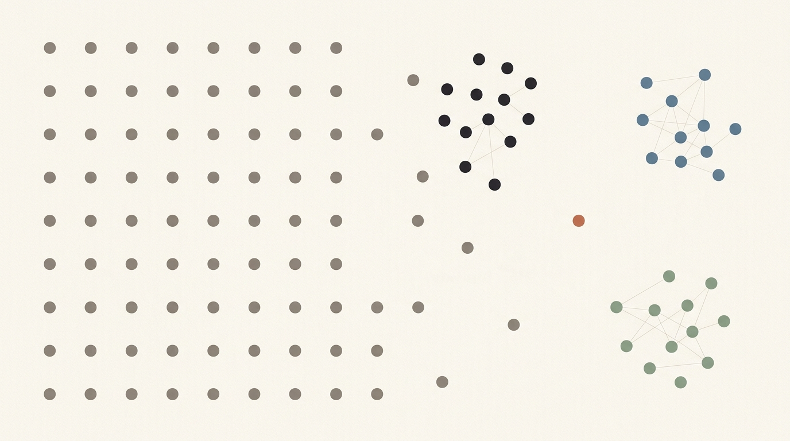
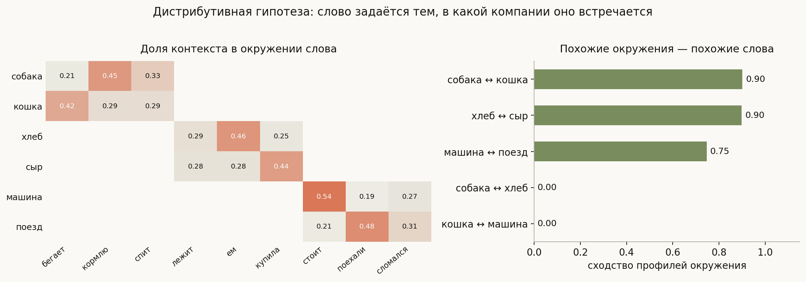
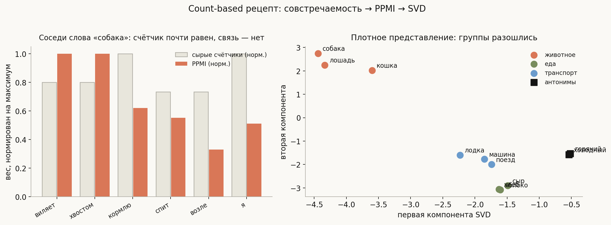
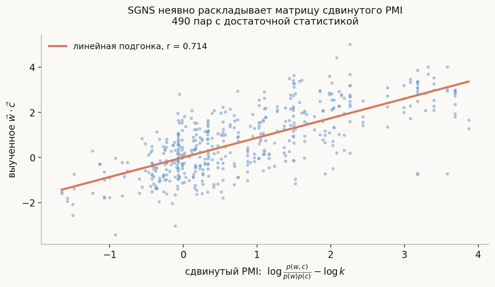
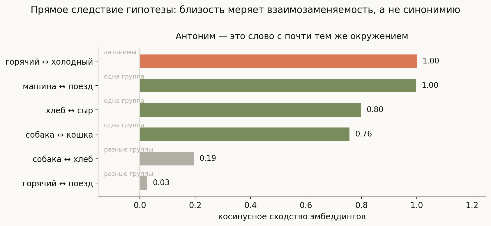
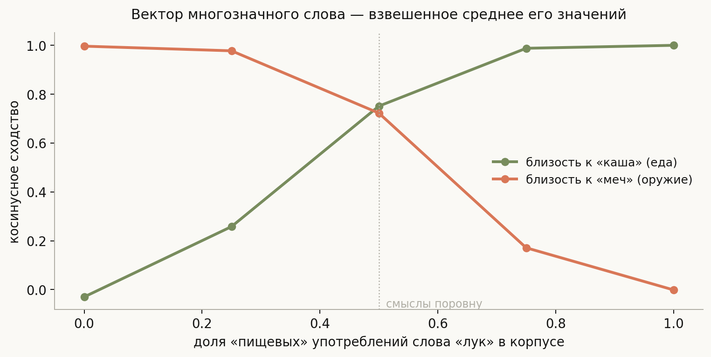

# Векторные представления слов

**Вопросы (EN)**: Why do we need word embeddings? Count-based vs prediction-based methods — what is the difference? What problems do context-based embeddings have?

Предыдущая тема закончилась потолком: [TF-IDF](../tf-idf-and-text-representation/lesson.md) сравнивает строки, а не смыслы, поэтому «автомобиль сломался» и «машина неисправна» получают ровно нулевое сходство. Причина в самом представлении — в мешке слов каждое слово это отдельная координата, и никакие две координаты не «ближе» друг к другу, чем любые другие. Геометрия пространства ничего не знает о значении.

Эмбеддинги решают это, опираясь на одну идею, сформулированную задолго до нейросетей:

> **You shall know a word by the company it keeps.** — Дж. Ферт, 1957

Это **дистрибутивная гипотеза**: значение слова определяется распределением контекстов, в которых оно встречается. Если принять её всерьёз, всё остальное выводится механически. Представить слово — значит сжать распределение его контекстов в компактный вектор. Отсюда сразу оба семейства методов: можно построить матрицу совстречаемости и разложить её явно, а можно обучить модель предсказывать контекст и взять её веса. Оказывается, это **одно и то же с точностью до деталей**, и ниже мы это измерим.

И, что важнее для собеседования, из той же гипотезы выводятся все ограничения. Если значение — это усреднённый контекст, то многозначное слово получит один вектор на все смыслы, а антонимы окажутся близкими, потому что встречаются в одинаковых окружениях. Это не баги реализации, а прямые следствия принятого определения смысла.

## План

1. Зачем плотные представления
2. Дистрибутивная гипотеза в матрице
3. Count-based: совстречаемость → PPMI → SVD
4. Prediction-based: word2vec
5. Оба семейства делают одно и то же
6. Аналогии: что они значат и чего не значат
7. Проблема первая: антонимы близки
8. Проблема вторая: полисемия
9. Проблема третья: смещения корпуса, редкие слова и OOV
10. Контекстные представления
11. Что спрашивают на собеседовании
12. Типичные ошибки
13. Итог

---

## 1. Зачем плотные представления

One-hot-кодирование слова — вектор длины словаря с единицей в одной позиции. У него три беды, и все существенные.

**Размерность.** При словаре 100 000 каждое слово — вектор из 100 000 чисел. Матрица весов первого слоя раздувается пропорционально.

**Нулевое сходство между любыми словами.** Скалярное произведение двух разных one-hot-векторов всегда ноль. «Кошка» ровно настолько же далека от «собаки», насколько от «экскаватора». Модель вынуждена выучивать все отношения между словами с нуля из задачи.

**Отсутствие обобщения.** Если модель видела «я кормлю кошку», она ничего не может сказать про «я кормлю собаку» — для неё это два не связанных события.

Плотный вектор размерности 100–300 чинит всё три сразу: он компактен, скалярное произведение осмысленно, и обученное на одном слове знание переносится на его соседей.

## 2. Дистрибутивная гипотеза в матрице

Как получить такие векторы? Начнём буквально: посчитаем, в каком окружении встречается каждое слово.

Все числа здесь и далее посчитаны на синтетическом корпусе из 660 предложений, порождённом шаблонами. Синтетический он намеренно: так заранее известно, какие слова обязаны оказаться рядом, и утверждения можно **проверять**, а не иллюстрировать. Механизм от этого не меняется — на реальном корпусе работает ровно то же самое, просто грязнее.

Слева — доля каждого контекста в окружении слова. Строка матрицы и есть «портрет окружения». Справа — сходство этих портретов: слова одной группы («собака» и «кошка») имеют похожие профили, слова разных групп («собака» и «хлеб») — непохожие.

Вот и весь фундамент: **строка матрицы совстречаемости уже является вектором слова**. Осталось починить две вещи — она слишком длинная и в ней стоят не те числа.

## 3. Count-based: совстречаемость → PPMI → SVD

**Проблема сырых счётчиков** в том, что они меряют частоту, а не связь. Служебные слова стоят рядом со всем подряд и получают большие счётчики, ничего при этом не сообщая.

Лечение — **PMI** (pointwise mutual information), мера того, насколько пара встречается чаще случайного:

$$\mathrm{PMI}(w, c) = \log \frac{p(w, c)}{p(w)\, p(c)}$$

Если слово и контекст независимы, $p(w,c) = p(w)p(c)$ и PMI равен нулю. Если встречаются вместе чаще ожидаемого — PMI положителен. На практике берут **PPMI**, обнуляя отрицательные значения: они оцениваются ненадёжно, ведь отсутствие пары в корпусе ещё не значит, что она невозможна.

Левая панель показывает разницу на живом примере. У слова «собака» соседи «возле» и «виляет» имеют почти равные счётчики (11 и 12), но «возле» встречается в корпусе 171 раз, а «виляет» — 24. PPMI разводит их втрое: 1.01 против 3.06. Счётчик не различил, мера связи различила.

Дальше матрицу нужно сжать. Классический инструмент — **SVD**: оставить несколько десятков главных компонент. Это даёт и компактность, и — что важнее — обобщение: близкие по смыслу слова, различавшиеся в исходной матрице случайным шумом, после проекции сливаются. Правая панель показывает результат: три группы разошлись по разным областям.

Такой рецепт (PPMI + SVD) — это, по сути, **LSA**, метод из 1990-х. **GloVe** (2014) — его современный родственник: он тоже работает с глобальной статистикой совстречаемости, но вместо SVD подбирает векторы так, чтобы их скалярное произведение приближало логарифм числа совстречаний.

## 4. Prediction-based: word2vec

Второй подход выглядит совсем иначе: не считать статистику, а обучить модель.

**Skip-gram**: по центральному слову предсказать слова из окна вокруг него. **CBOW** (continuous bag of words): наоборот, по окружению предсказать центральное слово. В обоих случаях сама задача предсказания никому не нужна — нужны веса, которые модель выучит по дороге.

Ключевая техническая деталь — **negative sampling** (SGNS, skip-gram with negative sampling). Честный softmax по словарю в 100 000 слов на каждом шаге неподъёмен. Вместо него задачу переформулируют как бинарную: отличить настоящую пару «слово — контекст» от $k$ подделок, где контекст взят случайно из шумового распределения. Обучение сводится к логистической регрессии на $k+1$ примерах вместо softmax на $|V|$.

Две детали, о которых любят спрашивать:

- **Шумовое распределение берут в степени 3/4**, а не пропорционально частоте. Это эмпирическая находка: возведение в степень 3/4 поднимает вероятность выбора редких слов и заметно улучшает результат.
- **У каждого слова две матрицы весов** — как у центрального слова и как у контекста. Обычно берут первую, но их сумма или конкатенация тоже работают.

## 5. Оба семейства делают одно и то же

Здесь тема перестаёт быть перечислением методов. В 2014 году Леви и Голдберг показали: **SGNS неявно факторизует матрицу сдвинутого PMI**. То есть обучение предсказанию контекста молча решает ту же задачу, что count-based методы решают явно:

$$\vec{w} \cdot \vec{c} \;\approx\; \mathrm{PMI}(w, c) - \log k$$

где $k$ — число отрицательных примеров.

Это можно не принимать на веру, а проверить. В `generate_visuals.py` обучается настоящий мини-SGNS градиентным спуском, после чего скалярные произведения его векторов сопоставляются со сдвинутым PMI, посчитанным по той же матрице совстречаемости.

Корреляция **r = 0.714** на 490 парах с достаточной статистикой. Не единица — модель крошечная, корпус маленький, обучение недолгое, — но связь очевидна и линейна, ровно как предсказывает теория.

Практический вывод, который стоит уметь произнести: **противопоставление count-based и prediction-based по существу ложное**. Оба семейства извлекают одну и ту же статистику совстречаемости, различаясь инженерно: SVD требует построить и разложить матрицу целиком (память, зато детерминированность), SGD-обучение идёт потоком по корпусу (масштабируется, легко дообучать, зато стохастично).

## 6. Аналогии: что они значат и чего не значат

Самая известная демонстрация эмбеддингов — арифметика аналогий:

$$\vec{\text{король}} - \vec{\text{мужчина}} + \vec{\text{женщина}} \approx \vec{\text{королева}}$$

Почему это вообще работает: если признак «королевскости» и признак «пола» кодируются приблизительно независимыми направлениями, то вычитание убирает одно, а сложение добавляет другое. Линейная структура возникает не по волшебству — она следствие того, что PMI-матрица приближается произведением низкоранговых матриц, и регулярные отношения проявляются как регулярные сдвиги.

Здесь же — деталь, о которой стоит знать. В стандартной методике оценки аналогий **из ответа исключаются все три входных слова**, и на реальных эмбеддингах это исключение существенно: без него ближайшим нередко оказывается один из входов, потому что вычитание и сложение сдвигают вектор недалеко (см. критику: Linzen, 2016).

Насколько именно существенно — зависит от чистоты данных, и это можно измерить. В прогоне из `notebook.ipynb` корпус построен так, что «возраст» и «вид животного» кодируются независимыми наборами контекстов, то есть линейная структура заложена по конструкции. На таких данных аналогия «щенок → собака, котёнок → ?» даёт «кошка» с огромным отрывом (0.996), а входные слова оказываются лишь на 10-м, 11-м и 21-м местах — списки с исключением и без него совпадают полностью.

Вывод получается двойной и оба его конца полезны: механизм аналогий реален и на чистой структуре работает без всяких костылей, но часть убедительности знаменитого примера на шумных реальных корпусах обеспечена именно постобработкой.

## 7. Проблема первая: антонимы близки

Теперь ограничения — и все они выводятся из дистрибутивной гипотезы, а не из недостатков конкретного алгоритма.

Если значение слова есть распределение его контекстов, то слова с одинаковыми контекстами обязаны получить одинаковые векторы. А у антонимов контексты как раз почти идентичны: «чай сегодня очень горячий» и «чай сегодня очень холодный» — одна и та же фраза.

Измерение подтверждает это в самой сильной форме:

| Пара | Сходство |
|---|---|
| горячий ↔ холодный (**антонимы**) | **1.00** |
| машина ↔ поезд (одна группа) | 1.00 |
| хлеб ↔ сыр (одна группа) | 0.80 |
| собака ↔ кошка (одна группа) | 0.76 |
| собака ↔ хлеб (разные группы) | 0.20 |
| горячий ↔ поезд (разные группы) | 0.03 |

Антонимы оказались на самом верху списка — вровень с самой взаимозаменяемой парой одной группы и заметно выше остальных. Метрика попросту **не отличает «противоположное» от «однотипного»**: и то и другое означает «стоит в тех же контекстах». В корпусе у «горячий» и «холодный» нет собственных контекстов вовсе, они делят все шаблоны признака, тогда как у «собаки» и «кошки» есть характерные окружения («виляет хвостом», «мурлычет») — потому их сходство и ниже.

Отсюда следует важное для практики: **косинусная близость эмбеддингов измеряет взаимозаменяемость, а не синонимию**. Для задач, где нужно отличать «хорошо» от «плохо» — анализа тональности, например, — сырые дистрибутивные векторы работают плохо, и их приходится либо дообучать под задачу, либо дополнять словарями антонимов.

## 8. Проблема вторая: полисемия

Слово «лук» — это и растение, и оружие. Но в словаре эмбеддингов у него одна строка, значит, один вектор на оба смысла. Что в нём окажется?

Прогон отвечает буквально: **взвешенное среднее**. Мы меняем долю «пищевых» употреблений «лука» в корпусе от 0 до 1 и смотрим, к чему ближе его вектор — к однозначно пищевому слову «каша» или к однозначно оружейному «меч»:

| Доля «еды» | Близость к «каша» | Близость к «меч» |
|---|---|---|
| 0.00 | −0.03 | 0.996 |
| 0.50 | 0.75 | 0.72 |
| 1.00 | 0.999 | −0.001 |

При равном соотношении смыслов вектор встаёт ровно посередине — почти равноудалённо от обоих. И это худший из возможных исходов: получившийся вектор не описывает **ни одного** из двух значений, он описывает несуществующее среднее. Ровно так же, как условное среднее бимодального распределения в [теме про классификацию и регрессию](../../../../ml/basics/classification-vs-regression/lesson.md) указывает туда, где данных нет.

Это фундаментальное ограничение статических эмбеддингов: **один вектор на тип слова, а не на его употребление**.

## 9. Проблема третья: смещения корпуса, редкие слова и OOV

**Смещения.** Если значение — это статистика корпуса, то и все стереотипы корпуса становятся частью значения. Классический результат Bolukbasi и др. (2016): на новостном корпусе аналогия «мужчина → программист» даёт «женщина → домохозяйка». Модель не «предвзята» сама по себе — она точно воспроизводит статистику текстов, на которых обучена. Отсюда и трудность: убрать смещение, не сломав полезную структуру, оказалось сложно, и предложенные методы «обезвреживания» позже критиковали за то, что они прячут смещение, а не устраняют.

**Редкие слова.** Вектор слова — это оценка по его контекстам. У слова, встретившегося пять раз, оценка построена по пяти наблюдениям и потому шумная. Работает обычное правило статистики: мало данных — большая дисперсия.

**OOV (out-of-vocabulary).** Слова, которого не было в обучающем корпусе, для модели просто не существует — у него нет строки в матрице. Для языков с богатой морфологией это болезненно вдвойне: «кормлю», «кормишь», «кормили» становятся тремя независимыми словами, каждое со своей статистикой.

**FastText** решает обе последние проблемы одним приёмом: вектор слова складывается из векторов его символьных $n$-грамм. Слово «кормлю» представлено как сумма кусочков «кор», «орм», «рмл» и так далее. Тогда незнакомое слово всё равно получает вектор — по своим частям, — а родственные формы автоматически оказываются рядом, потому что делят $n$-граммы.

## 10. Контекстные представления

Все перечисленные проблемы полисемии и взаимозаменяемости упираются в одно и то же: вектор приписан **типу** слова, а не его конкретному употреблению. Логичный следующий шаг — приписывать вектор употреблению.

**ELMo** (2018) считал представление слова функцией всего предложения с помощью двунаправленной LSTM. **BERT** (2018) сделал то же на трансформере с механизмом внимания. Теперь «лук» в «я ем лук» и «он натянул лук» получают **разные** векторы, потому что различаются окружения в конкретном предложении.

Стоит понимать, что дистрибутивная гипотеза при этом никуда не делась — наоборот, она доведена до логического конца. Значение по-прежнему определяется контекстом, только контекст теперь берётся не усреднённым по всему корпусу, а тем самым, в котором слово стоит прямо сейчас.

Статические эмбеддинги при этом не умерли: они на порядки дешевле, интерпретируемы, не требуют прогона модели на каждый запрос и остаются разумным выбором там, где важна скорость и не критична многозначность.

## 11. Что спрашивают на собеседовании

**Зачем эмбеддинги вместо one-hot?** Компактность, осмысленное скалярное произведение и перенос знания между похожими словами. У one-hot сходство любых двух слов равно нулю.

**Count-based против prediction-based — в чём разница?** По существу — почти ни в чём: SGNS неявно факторизует матрицу сдвинутого PMI. Различия инженерные: SVD детерминирован, но требует всю матрицу в памяти; SGD масштабируется и дообучается, но стохастичен.

**Что такое negative sampling и зачем?** Замена softmax по всему словарю на бинарную задачу «настоящая пара против $k$ подделок». Шумовое распределение берут в степени 3/4 — эмпирически лучше.

**Почему антонимы получаются близкими?** Потому что косинус меряет взаимозаменяемость контекстов, а у антонимов контексты почти одинаковые. В прогоне «горячий» и «холодный» дали сходство 1.00 — выше, чем у слов одной тематической группы.

**Что происходит с многозначным словом?** Оно получает один вектор — взвешенное среднее своих значений. При равном соотношении смыслов вектор равноудалён от обоих и не описывает ни одного.

**Как обрабатывать слова вне словаря?** Символьные $n$-граммы (FastText) или subword-токенизация (BPE, WordPiece), которая в трансформерах решает задачу на уровне токенизатора.

**Чем контекстные представления отличаются принципиально?** Вектор приписан употреблению, а не типу слова, поэтому полисемия перестаёт быть проблемой.

## 12. Типичные ошибки

- **Противопоставлять count-based и prediction-based как разные по природе.** Это две реализации одной идеи; измеримая связь через сдвинутый PMI.
- **Считать косинусную близость мерой синонимии.** Она измеряет взаимозаменяемость, поэтому антонимы попадают в топ ближайших соседей.
- **Приводить пример «король − мужчина + женщина» без оговорки.** В стандартной методике из ответа исключаются входные слова; без этого ответом часто оказывается сам «король».
- **Думать, что word2vec — нейросеть глубокого обучения.** Это модель с одним линейным слоем без нелинейности; вся «глубина» в масштабе данных.
- **Забывать про две матрицы весов.** У слова есть представление как центрального и как контекстного; обычно берут первое, но это выбор, а не данность.
- **Ожидать, что усреднение эмбеддингов слов даст хорошее представление предложения.** Порядок и синтаксис при усреднении теряются — получается тот же мешок слов, только плотный.
- **Считать смещения корпуса дефектом алгоритма.** Алгоритм точно воспроизводит статистику текстов; проблема в данных и в том, что мы называем результат «значением».

## 13. Итог

Эмбеддинги вырастают из одной идеи: значение слова есть распределение контекстов, в которых оно встречается. Приняв её, представление слова сводится к сжатию строки матрицы совстречаемости — и отсюда оба семейства методов. Count-based делает это явно (PPMI, чтобы мерить связь, а не частоту, и SVD, чтобы сжать), prediction-based обучает модель предсказывать контекст и забирает её веса; измерение показывает, что это одно и то же — скалярные произведения обученного SGNS коррелируют со сдвинутым PMI с r = 0.714. Из той же гипотезы механически следуют и все ограничения: антонимы близки, потому что взаимозаменяемы в контекстах (в прогоне сходство 1.00 — вровень с самой близкой парой одной тематической группы); многозначное слово получает взвешенное среднее своих смыслов и при равном соотношении не описывает ни одного; смещения корпуса становятся частью значения; редкие слова оцениваются шумно, а незнакомых не существует вовсе — последнее лечится символьными $n$-граммами. Общий же выход из всех этих проблем один: перестать приписывать вектор типу слова и приписать его конкретному употреблению, что и делают контекстные представления.

---

## Что рядом

- [`notebook.ipynb`](notebook.ipynb) — совстречаемость, PPMI, SVD и обучение SGNS с нуля; проверка связи с PMI, аналогии и полисемия
- [`generate_visuals.py`](generate_visuals.py) — код диаграмм; корпус порождается шаблонами, поэтому правильный ответ известен заранее
- [TF-IDF и представление текста числами](../tf-idf-and-text-representation/lesson.md) — разреженная альтернатива и её потолок
- [Self-Attention and Transformers](../../architectures/Self-Attention%20and%20Transformers.md) — на чём стоят контекстные представления

---
*Источник: [MLIB](https://huyenchip.com/ml-interviews-book/)*
