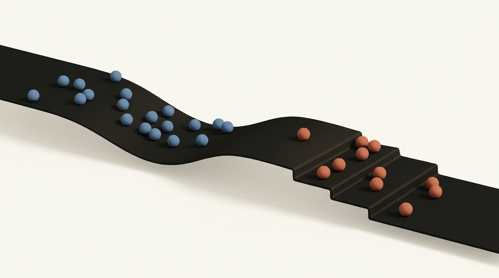
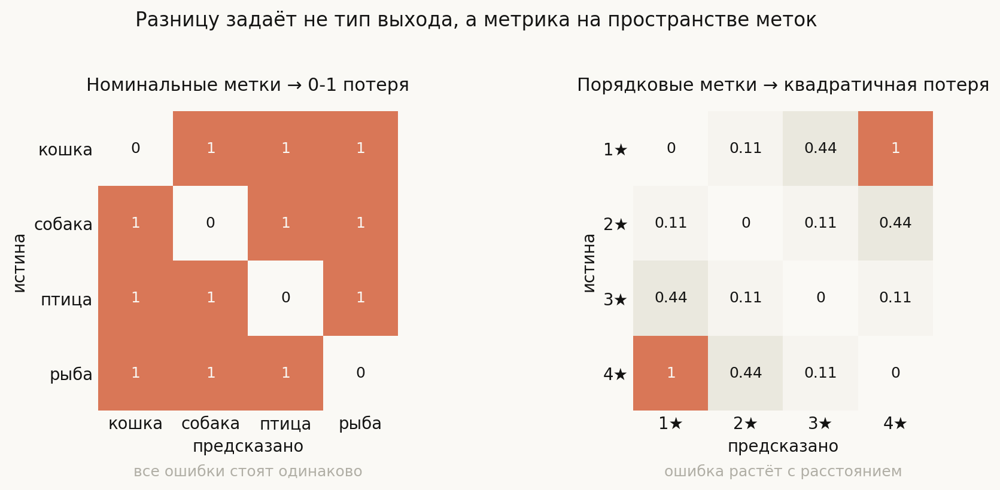
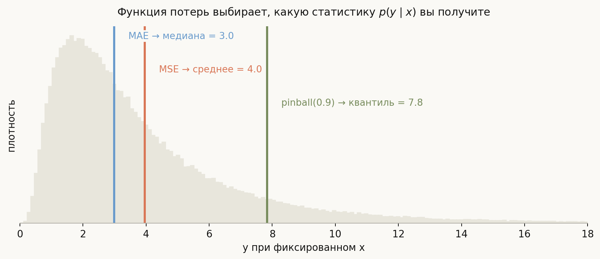
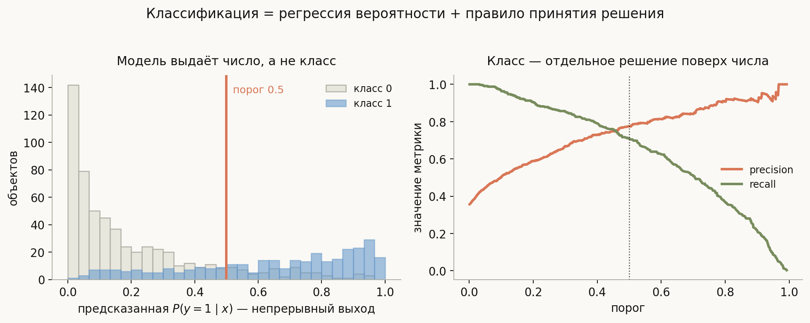
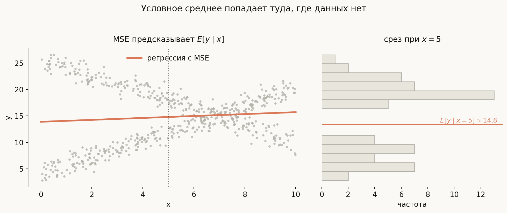
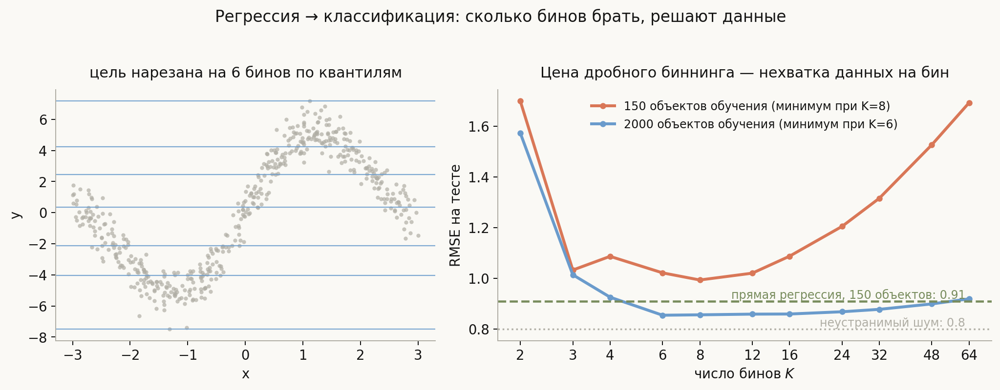

# Классификация и регрессия

**Вопрос (EN)**: What makes a classification problem different from a regression problem? Can a classification problem be turned into a regression problem and vice versa?



Почти все отвечают на этот вопрос одинаково: «классификация предсказывает дискретную метку, регрессия — непрерывное число». Это правда, но это самый поверхностный слой ответа, и на любом сильном собеседовании за ним последует уточняющий вопрос, на котором такой ответ рассыпается. Рейтинг товара от 1 до 5 звёзд — дискретен, но решать его как классификацию из пяти независимых классов почти всегда хуже, чем как регрессию. Угол поворота — непрерывен, но MSE на нём просто неверна, потому что 359° и 1° близки. Число покупок — дискретно и бесконечно.

Настоящая разница лежит глубже: **в структуре пространства меток и в том, какую метрику на нём признаёт функция потерь**. Дискретность выхода — следствие, а не причина. Из этого одного наблюдения выводится и вся вторая половина вопроса: переводы между задачами возможны ровно в той мере, в какой они сохраняют или добавляют структуру, которую вы считаете правильной.

## План

1. Что на самом деле различает две задачи
2. Что меняется на практике: потери, выход, метрики
3. Почему «дискретное против непрерывного» — плохое определение
4. Классификация → регрессия
5. Регрессия → классификация
6. Когда перевод действительно окупается
7. Типичные ошибки
8. Итог

---

## 1. Что на самом деле различает две задачи

Обе задачи — это обучение с учителем: по выборке $\{(x_i, y_i)\}_{i=1}^n$ найти $a: \mathcal{X} \to \mathcal{Y}$, минимизирующее ожидаемые потери

$$R(a) = \mathbb{E}_{(x,y)}\big[\mathcal{L}(a(x),\, y)\big].$$

Различие целиком спрятано в паре $(\mathcal{Y}, \mathcal{L})$ — в пространстве ответов и заданной на нём функции потерь.

**Классификация.** $\mathcal{Y} = \{1, \dots, K\}$ — конечное **неупорядоченное** множество. Между метками нет осмысленного расстояния: «кошка» не ближе к «собаке», чем к «рыбе». Единственная естественная потеря — индикатор ошибки $\mathcal{L}(\hat y, y) = \mathbf{1}[\hat y \ne y]$: все ошибки стоят одинаково.

**Регрессия.** $\mathcal{Y} = \mathbb{R}$ — упорядоченное множество **с метрикой**. Разность $\hat y - y$ имеет смысл, поэтому потеря может расти с расстоянием: $(\hat y - y)^2$ или $|\hat y - y|$.



Две матрицы на картинке — это и есть весь ответ в сжатом виде. Слева промах на одну позицию стоит ровно столько же, сколько промах на три: структуры нет, и потеря обязана быть плоской. Справа потеря растёт с расстоянием — она **знает**, что 2★ ближе к 3★, чем к 4★.

> **Формулировка для собеседования.** Разница не в том, что на выходе — число или метка, а в том, есть ли на пространстве ответов осмысленное расстояние и учитывает ли его функция потерь. Классификация — плоская геометрия меток, регрессия — метрическая.

## 2. Что меняется на практике

Из выбора $(\mathcal{Y}, \mathcal{L})$ механически следует всё остальное:

| | Классификация | Регрессия |
|---|---|---|
| Выход модели | распределение над $K$ классами | точка на $\mathbb{R}$ (или распределение на $\mathbb{R}$) |
| Типичная потеря | кросс-энтропия $-\sum_k y_k \log \hat p_k$ | MSE, MAE, Huber, pinball |
| Последний слой | softmax / sigmoid | линейный |
| Метрики качества | accuracy, precision/recall, F1, ROC-AUC | RMSE, MAE, MAPE, $R^2$ |
| Главная патология данных | дисбаланс классов | выбросы и тяжёлые хвосты |
| Есть ли порог | да, отдельное решение поверх вероятности | нет |

Последняя строка важнее, чем кажется, и к ней мы вернёмся в разделе 4.

Отдельно стоит выучить, **какую статистику условного распределения** $p(y \mid x)$ восстанавливает каждая потеря — это любимый уточняющий вопрос:

$$\arg\min_c \mathbb{E}\big[(y - c)^2\big] = \mathbb{E}[y], \qquad \arg\min_c \mathbb{E}\big[|y - c|\big] = \operatorname{med}(y).$$



На скошенном распределении среднее (4.0), медиана (3.0) и 90-й квантиль (7.8) — три разных числа. Модель не «предсказывает y»; она предсказывает **ту статистику $p(y \mid x)$, которую вы заказали функцией потерь**. Кросс-энтропия по бинам в этом ряду занимает особое место: она восстанавливает не одну статистику, а всё распределение целиком.

## 3. Почему «дискретное против непрерывного» — плохое определение

Определение через тип выхода ломается в обе стороны, и именно на этих примерах проверяют глубину понимания.

**Дискретное, но по сути регрессия.** Оценка 1–5 звёзд, уровень образования, размер одежды. Метки дискретны, но **упорядочены**: перепутать 1★ и 5★ хуже, чем 4★ и 5★. Обычная многоклассовая классификация этого не знает — для неё обе ошибки одинаковы, и она выбрасывает информацию, которая у вас есть. Это отдельный класс задач — **порядковая регрессия** (ordinal regression).

Насколько дорого обходится незнание порядка — вопрос количества данных, и это стоит сказать точно. В прогоне из `notebook.ipynb` (усреднение по 12 запускам) регрессия обыгрывает многоклассовую классификацию по MAE на 16% при 60 объектах обучения и на 8% при 150, но при 5 градациях и 800 объектах **проигрывает** ей 7%: данных на каждый класс достаточно, чтобы классификатор выучил порядок сам. Стоит поднять число градаций до 10 — и преимущество порядкового подхода возвращается даже на 800 объектах. Правило: чем меньше объектов приходится на одну градацию, тем ценнее закладывать порядок прямо в постановку задачи.

**Дискретное и бесконечное.** Число заказов за день, количество отказов оборудования. $\mathcal{Y} = \{0, 1, 2, \dots\}$ — счётно, классификацией не решается в принципе. Решается регрессией со специальной потерей (Пуассон, отрицательное биномиальное).

**Непрерывное, но MSE неверна.** Угол, время суток, долгота — топология окружности. При истине 359° предсказание 1° почти идеально, а MSE засчитает ошибку 358². Нужна либо круговая потеря, либо предсказание пары $(\sin\theta, \cos\theta)$.

Вывод: тип выхода — ненадёжный признак. Надёжный — **какая геометрия у пространства ответов и уважает ли её ваша потеря**.

## 4. Классификация → регрессия

### Она уже регрессия

Ключевой момент, который сильно поднимает ответ: **вероятностный классификатор — это уже регрессия**. Логистическая регрессия не предсказывает класс; она регрессирует лог-шансы

$$\log \frac{P(y=1 \mid x)}{1 - P(y=1 \mid x)} = w^\top x + b,$$

то есть решает задачу регрессии на $\mathbb{R}$, а затем сжимает результат сигмоидой в $[0,1]$. Дискретный класс появляется только на последнем шаге — когда вы прикладываете порог.



Порог — это **не часть модели, а отдельное решение**, зависящее от цены ошибок. Обучили один раз, а порог двигаете под задачу: при 0.5 precision и recall примерно равны (~0.75), при высоком пороге растёт precision, при низком — recall. Отсюда и практическое следствие: ROC-AUC оценивает качество ранжирования вероятностей независимо от порога, а accuracy — качество уже принятого решения.

### Когда перевод — ошибка

Обратный, наивный перевод — закодировать классы числами и обучить регрессию — почти всегда ошибка:

```python
# ПЛОХО: классы закодированы как числа и отданы регрессии
y = ["кошка", "собака", "птица"]  # → 0, 1, 2
model = LinearRegression().fit(X, [0, 1, 2, ...])
```

Модель немедленно решит, что «собака» лежит **между** «кошкой» и «птицей», а среднее кошки и птицы равно собаке. Вы навязали пространству меток порядок и метрику, которых там нет. Единственный случай, когда такое кодирование законно, — когда порядок действительно есть (те самые звёзды).

### Промежуточный случай: linear probability model

Обучить обычную MSE-регрессию прямо на бинарной цели $y \in \{0, 1\}$ — приём известный (linear probability model). Он даёт оценку $P(y=1 \mid x)$ и иногда работает, но у него два дефекта: предсказания выходят за $[0,1]$, а дисперсия ошибки зависит от $x$ (гетероскедастичность). Логистическая регрессия решает ту же задачу без обоих дефектов, поэтому в проде используют её.

## 5. Регрессия → классификация

Обратный перевод — **биннинг**: нарезать непрерывную цель на $K$ интервалов и решать многоклассовую задачу. Цена: внутри бина ошибки становятся бесплатными, а на границе — резкими. Выгода: модель предсказывает **всё распределение** $p(y \mid x)$, а не одну точку.

### Зачем это вообще нужно

Главная причина — та самая ловушка условного среднего. MSE-регрессия даёт $\mathbb{E}[y \mid x]$, а среднее бимодального распределения лежит **между модами**, то есть там, где данных нет вовсе:



При $x = 5$ реальные значения группируются около 12 и около 18; условное среднее равно 14.8 — значение, которого почти не встречается. В прогоне на 2000 объектах в полосе $\pm 1$ вокруг предсказания регрессии лежит лишь **6.7%** наблюдений: модель уверенно указывает в пустоту. Классификатор по бинам такой ошибки не делает — он честно возвращает две моды сопоставимой вероятности, и вы сами решаете, что с этим делать.

Именно поэтому WaveNet дискретизирует амплитуду звука на 256 классов вместо регрессии, а PixelCNN предсказывает 256 уровней яркости пикселя: распределение сильно мультимодально, и «средний пиксель» — это серая каша.

### Как вернуть непрерывное предсказание

Биннинг не обязывает вас отдавать бин. Из распределения по бинам восстанавливается число:

$$\hat y = \sum_{k=1}^{K} \hat p_k \cdot c_k, \qquad c_k = \text{центр (или среднее цели) } k\text{-го бина}.$$

Получается гибрид: обучаетесь как классификатор, предсказываете как регрессор, попутно имея на руках полное распределение и меру неопределённости.

### Сколько брать бинов



Правый график — реальный прогон (код в `notebook.ipynb`), и он показывает настоящий компромисс. При двух бинах разрешение слишком грубое: RMSE 1.70. При росте $K$ ошибка падает до минимума, а затем **снова растёт** — на каждый бин остаётся всё меньше объектов, оценки вероятностей становятся шумными. На 150 объектах минимум приходится на $K \approx 8$, на 2000 объектах кривая почти плоская справа: чем больше данных, тем дешевле дробный биннинг.

Обратите внимание и на зелёную линию. Прямая регрессия на тех же 150 объектах даёт RMSE 0.91 — **лучше**, чем лучший биннинг (0.99). На гладкой унимодальной задаче перевод в классификацию просто проигрывает: вы платите за квантование, ничего не получая взамен. Он окупается только там, где распределение мультимодально или где вам действительно нужна его форма.

### Более дешёвая альтернатива

Если нужна не вся форма распределения, а устойчивость к выбросам или интервал — часто достаточно сменить потерю, не трогая постановку задачи: MAE вместо MSE (медиана вместо среднего), Huber (компромисс), pinball-потеря для квантильной регрессии (даёт предсказательные интервалы). Это дешевле биннинга и не теряет разрешения.

## 6. Когда перевод действительно окупается

| Переводить стоит | Переводить не стоит |
|---|---|
| $p(y \mid x)$ мультимодально (аудио, пиксели, траектории) | цель гладкая и унимодальная |
| Нужна форма распределения, а не точка | достаточно среднего или медианы |
| Цель порядковая → регрессия вместо $K$ классов | метки номинальные (навяжете ложный порядок) |
| Цена ошибок резко нелинейна по интервалам | ошибки штрафуются пропорционально расстоянию |
| Данных много (штраф за дробный биннинг мал) | данных мало |

## 7. Типичные ошибки

- **Определять задачу по типу выхода.** «Дискретно → классификация» ломается на рейтингах, счётчиках и углах. Определять надо по геометрии пространства меток.
- **Кодировать номинальные классы числами и регрессировать их.** Модель выведет несуществующий порядок и будет считать один класс «средним» двух других.
- **Решать порядковую задачу как $K$ независимых классов, не считая цену.** Вы выбрасываете известную информацию о порядке и штрафуете промах на 1 позицию так же, как на 4. Но и обратное утверждение «на порядковых целях регрессия всегда лучше» неверно: при большом числе объектов на градацию классификатор выучивает порядок сам и выигрывает. Цена незнания порядка тем выше, чем меньше данных на градацию.
- **Путать вероятность и класс.** Классификатор выдаёт число; класс появляется на пороге. Порог — параметр решения, а не модели, и подбирается под цену ошибок, а не берётся 0.5 по умолчанию.
- **Забывать, что MSE предсказывает среднее.** На мультимодальной или сильно скошенной цели среднее может быть заведомо невозможным значением.
- **Биннить цель «на всякий случай».** Без мультимодальности это чистая потеря разрешения: как показывает прогон выше, прямая регрессия оказывается точнее.
- **Сравнивать модели разных типов по их «родным» метрикам.** Accuracy классификатора по бинам и RMSE регрессора несопоставимы. Приводите к общей шкале — например, декодируйте классификатор в число и считайте RMSE обоим.

## 8. Итог

Классификация и регрессия различаются не типом выхода, а структурой пространства меток: неупорядоченное конечное множество с плоской 0-1 потерей против упорядоченного метрического пространства, где потеря растёт с расстоянием. Всё остальное — softmax против линейного слоя, F1 против RMSE, дисбаланс против выбросов — следствия этого выбора. Переводы возможны в обе стороны и оба содержательны: вероятностный классификатор **уже** является регрессией, а дискретный класс появляется только на пороге; в обратную сторону непрерывную цель можно нарезать на бины, получив взамен полное распределение $p(y \mid x)$ вместо одной точки. Но оба перевода не бесплатны: кодирование номинальных классов числами навязывает несуществующий порядок, а биннинг гладкой унимодальной цели просто теряет разрешение и проигрывает прямой регрессии. Ключевой вопрос при выборе — не «какого типа мой выход», а «какую статистику условного распределения мне нужно получить и какая потеря её даёт».

---

## Что рядом

- [`notebook.ipynb`](notebook.ipynb) — все эксперименты из лекции, которые можно покрутить руками
- [`generate_visuals.py`](generate_visuals.py) — код всех диаграмм
- Смежные темы: [Bias-Variance Tradeoff](../../objectives-metrics-evaluation/Bias-Variance%20Tradeoff.md), [Log Loss vs MSE](../../objectives-metrics-evaluation/Log%20Loss%20vs%20MSE.md), [Confusion Matrix Precision Recall](../../objectives-metrics-evaluation/Confusion%20Matrix%20Precision%20Recall.md)

---
*Источник вопроса: [MLIB](https://huyenchip.com/ml-interviews-book/)*
